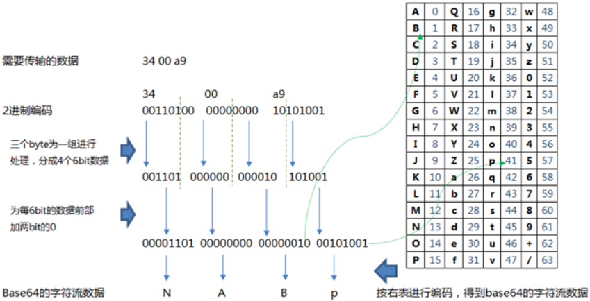

# JavaSE

> 学习方法：
>
> 1. 演绎式：提出问题1 → 解决问题1 → 提出问题2 → 解决问题2 → ......
> 2. 归纳式：总 → 分 → 总


## 1. 子父类关系

原则：由父及子，静态先行。

```java
public class Instance {
    static {
        System.out.println("Instance类静态代码块");
    }

    {
        System.out.println("Instance类代码块");
    }

    public Instance(String parameter) {
        System.out.println("Instance类无参构造器: Instance is created by " + parameter);
    }
}
```

```java
public class Parent {
    {
        //非静态代码块:随着对象的创建而执行,每创建一个对象就执行一次非静态代码块,且先于构造器执行.可以在创建对象时,对对象的属性等进行初始化.
        System.out.println("Parent类代码块");
    }

    Instance instance = new Instance("【Parent Filed】");

    static {
        //静态代码块:随着类的加载而执行,而且只执行一次.可以用来初始化类的信息.
        System.out.println("Parent类静态代码块");
    }

    static Instance staticInstance = new Instance("【Parent Static Filed】");

    Instance instanceInConstructor;

    public Parent() {
        System.out.println("Parent类无参构造器");
        instanceInConstructor = new Instance("【Parent Constructor】");
    }

    public void sayHello(){
        System.out.println("Parent sayHello method is executed.");
    }
}
```

```java
public class Child extends Parent {
    {
        System.out.println("Child类代码块");
    }

    Instance instance = new Instance("【Child Filed】");

    static {
        System.out.println("Child类静态代码块");
    }

    static Instance staticInstance = new Instance("【Child Static Filed】");

    Instance instanceInConstructor;

    public Child() {
        System.out.println("Child类无参构造器");
        instanceInConstructor = new Instance("【Child Constructor】");
        //可以在子类的构造器中显式的使用"super(形参列表)"的方式,调用父类中声明的指定的构造器.
        //在类的多个构造器中,至少有一个类的构造器中使用了"super(形参列表)"调用父类中的构造器.
        //在构造器的首行,没有显式的声明"this(形参列表)"或"super(形参列表)",则默认调用的是父类中空参的构造器 super();
        
        //子类中所有的构造器默认都会访问父类中空参数的构造器.
        //当父类中没有空参数的构造器时,子类的构造器必须通过this(参数列表)或者super(参数列表)语句指定调用本类或者父类中相应的构造器.同时,只能”二选一”,且必须放在构造器的首行.
        //如果子类构造器中既未显式调用父类或本类的构造器,且父类中又没有无参的构造器,则编译出错.
    }

    public void sayHello(){
        System.out.println("Child sayHello method is executed.");
    }
}
```

```java
public class Test {
    public static void main(String[] args) {
        System.out.println("******************************");
        Child child = new Child();
        child.sayHello();
        ((Parent) child).sayHello();
        //利用对象的多态性创建Children类的对象在控制台得到的结果和上面一样
        //Parent children = new Children(); //向上转型(upcasting)
        //一个引用类型变量如果声明为父类的类型,但实际引用的是子类对象,那么该变量就不能再访问子类中添加的属性和方法.有了对象的多态性以后,内存中实际上是加载了子类特有的属性和方法的,但是由于变量声明为父类类型,导致编译时只能调用父类中声明的属性和方法,子类特有的属性和方法不能调用.如何才能调用子类特有的属性和方法？向下转型,即使用强制类型转换符.
        //Java引用变量有两个类型:编译时类型和运行时类型.编译时类型由声明该变量时使用的类型决定,运行时类型由实际赋给该变量的对象决定.简称:编译时,看左边;运行时,看右边.
        //若编译时类型和运行时类型不一致,就出现了对象的多态性.
        //多态性的使用前提:类的继承关系或实现关系;方法的重写.
        //对象的多态性,只适用于方法,不适用于属性(针对属性编译和运行都看左边,即看父类).
        //多态是运行时行为!!!!!!
        //方法重载(Overload):不表现为多态性.同一个类中有多个同名方法,但是方法参数列表不同.与返回值类型无关,只看参数列表,且参数列表必须不同.编译期绑定/早绑定/静态绑定
        //方法重写(Override):表现为多态性.子类重写的方法必须和父类被重写的方法具有相同的方法名称和参数列表.运行期绑定/晚绑定/动态绑定
    }
}
```

```java
运行Test类的main方法在控制台的打印结果为:
	******************************
        
	Parent类静态代码块
        
    Instance类静态代码块
    Instance类代码块
    Instance类无参构造器: Instance is created by 【Parent Static Filed】
        
    Child类静态代码块
        
    Instance类代码块
    Instance类无参构造器: Instance is created by 【Child Static Filed】
        
    Parent类代码块
        
    Instance类代码块
    Instance类无参构造器: Instance is created by 【Parent Filed】
        
    Parent类无参构造器
    Instance类代码块
    Instance类无参构造器: Instance is created by 【Parent Constructor】
        
    Child类代码块
        
    Instance类代码块
    Instance类无参构造器: Instance is created by 【Child Filed】
        
    Child类无参构造器
    Instance类代码块
    Instance类无参构造器: Instance is created by 【Child Constructor】
        
    Child sayHello method is executed.
    Child sayHello method is executed.
```

- 成员变量(属性)赋值的先后顺序：① --> ② / ⑤ --> ③ --> ④
  - ①默认初始化
  - ②显式初始化 / ⑤在代码块中赋值（②和⑤谁先执行取决于二者声明的先后顺序）
  - ③构造器中初始化
  - ④有了对象以后通过"对象.属性"或"对象.方法"的方式进行赋值

| 区别点     | this（本类对象的引用）                                   | super（父类的内存空间的标识）              |
| ---------- | -------------------------------------------------------- | ------------------------------------------ |
| 说明       | 方法内部的一个隐含的变量`this`始终指向当前实例           | `super`关键字表示父类（超类）              |
| 访问属性   | 访问本类中的属性，如果本类没有此属性则从父类中继续查找。 | 直接访问父类中的属性。                     |
| 调用方法   | 访问本类中的方法，如果本类没有此方法则从父类中继续查找。 | 直接访问父类中的方法。                     |
| 调用构造器 | 调用本类构造器，必须放在构造器的首行。this(…)            | 调用父类构造器，必须放在子类构造器的首行。 |

一个引用类型变量如果声明为父类的类型，但实际引用的是子类对象，那么该变量就不能再访问子类中添加的属性和方法。例如：Parent children = new Children();

子类对象的实例化过程：
- 从结果上来看
  - 子类继承父类以后，就获取了直接父类和所有间接父类中声明的所有属性和方法。（继承性）
  - 创建子类的对象，在堆空间中就会加载所有父类中声明的属性（包括父类中声明为private的属性）。
- 从过程上来看
  - 当我们通过子类的构造器创建子类对象时，我们一定会直接或间接的调用其父类的构造器，进而调用父类的父类的构造器，直到调用了 java.lang.Object 类中空参的构造器为止。
  - 正因为加载过所有父类的结构，所以才能看到内存中有父类的结构，子类对象才可以考虑进行调用。
- 明确：虽然**创建子类对象时调用了父类的构造器**，但自始至终就创建过一个对象，即为new的子类对象。


```
static关键字主要用来修饰类的内部结构有：属性、方法、代码块、内部类。被修饰后的成员具备以下特点：
(1)随着类的加载而加载。
(2)优先于对象存在。
(3)修饰的成员，被所有对象所共享。
(4)访问权限允许时，可不创建对象，直接被类调用。

1.使用static修饰属性：
(1)属性，按是否使用static修饰，又分为：静态属性(静态变量、类变量、类属性)和非静态属性(实例变量)
(2)实例变量：我们创建了类的多个对象，每个对象都独立的拥有一套类中的非静态属性。当修改其中一个对象中的非静态属性时，不会导致其他对象中同样的属性值的修改。
(3)静态变量：我们创建了类的多个对象，多个对象共享同一个静态变量。当通过某一个对象修改静态变量时，会导致其他对象调用此静态变量时，是修改过了的。
(4)static修饰属性的其他说明：
	静态变量随着类的加载而加载。可以通过"类.静态变量"的方式进行调用。
	静态变量的加载要早于对象的创建。
	由于类只会加载一次，则静态变量在内存中也只会存在一份：存在方法区的静态域中。
2.使用static修饰方法：
(1)静态方法(类方法)随着类的加载而加载，可以通过"类.静态方法"的方式进行调用。
(2)静态方法类似其它编程语言的函数。
(3)静态方法中，只能调用静态的方法或属性。
(4)非静态方法中，既可以调用非静态的方法或属性，也可以调用静态的方法或属性。
3.static注意点：
(1)在静态的方法内，不能使用this关键字、super关键字。
(2)static修饰的方法不能被重写。
(3)开发中，如何确定一个属性是否要声明为static的?
	属性是可以被多个对象所共享的，不会随着对象的不同而不同的。
	类中的常量常常声明为static final的.
(4)开发中，如何确定一个方法是否要声明为static的?
	操作静态属性的方法，通常设置为static的，例如get、set方法。
	工具类中的方法，习惯上声明为static的。比如：Math类、Arrays类、Collections类
```

```java
public class Children extends Parent {
    {
        System.out.println("Children类代码块");
    }
    static {
        System.out.println("Children类静态代码块");
    }
    public Children() {
        System.out.println("Children类无参构造器");
    }

    public static void main(String[] args) {
        System.out.println("**********");
        Children children = new Children();
    }
}
```

```java
//如果将main()方法直接写在Children类中,运行main()方法在控制台输出的结果如下:
    Parent类静态代码块
    Children类静态代码块
    **********
    Parent类代码块
    Parent类无参构造器
    Children类代码块
    Children类无参构造器
//因为在运行main()方法之前要先加载其所在的Children类,而Children类继承Parent类,进而要提前加载Parent类,所以在main()方法的执行结果中,在打印“**********”之前会先执行两个静态代码块中的输出语句.
```

```java
public class ATest {
    public static void main(String[] args) {
        B b = new B();
        System.out.println(b.getStr2()); //A
    }
}
class A {
    String str = "A";

    private String getStr() {
        return this.str;
    }

    public String getStr2() {
        return this.getStr();
    }
}
class B extends A {
    public String getStr() {
        return "B";
    }
}
```

------

## 2. Object类

所有的数组类型都扩展了 Object 类。

Objects.equals(Object a,Object b)：如果两个参数都为 null，返回 true；如果只有其中一个参数为 null，返回 false；如果两个参数都不为 null，则调用 a.equals(b)。

Arrays.equals(xxx[] a,xxx[] b)： 如果两个数组长度相同，并且在对应的位置上数据元素也相同，将返回 true。数组的元素类型 xxx 可以是 Object、byte、short、int、long、float、double、char、boolean。

```java
package java.lang;

/**
 * Class {@code Object} is the root of the class hierarchy. 
 * Every class has {@code Object} as a superclass. 
 * All objects, including arrays, implement the methods of this class.
 *
 * @author  unascribed
 * @see     java.lang.Class
 * @since   JDK1.0
 */
public class Object {

    private static native void registerNatives();
    static {
        registerNatives();
    }

    //获取对象的运行时类
    public final native Class<?> getClass();

    //获取对象的hash值.每个对象都有一个默认的散列码,其值由对象的存储地址得出.
    public native int hashCode();//两个相等的对象要求返回相等的散列码.

    //比较两个对象是否相等
    public boolean equals(Object obj) {
        return (this == obj);
    }
    //如果x.equals(y)返回true,那么x.hashCode()和y.hashCode()就必须返回相同的值.
    //equals方法被覆盖过,则hashCode方法也必须被覆盖.
    //hashCode()的默认行为是对堆上的对象产生独特值,如果没有重写hashCode(),则该class的两个对象无论如何都不会相等,即使这两个对象指向相同的数据.

    //创建并返回一个对象的拷贝（clone()不会调用构造方法）
    protected native Object clone() throws CloneNotSupportedException;

    //当我们输出一个对象的引用时,实际上就是调用当前对象的toString方法.像String、Date、File、包装类等都重写了Object类中的toString()方法,使得在调用对象的toString()时,返回"实体内容"信息.
    //toString()方法在Object类中的定义,其返回值是String类型,返回类名和它的引用地址.
    public String toString() {
        return getClass().getName() + "@" + Integer.toHexString(hashCode());
    }
    
    //当GC(垃圾回收器)确定不存在对该对象的有更多引用时,由对象的垃圾回收器调用此方法.
    protected void finalize() throws Throwable { }

    //唤醒在该对象上等待的某个线程
    public final native void notify();

    //唤醒在该对象上等待的所有线程
    public final native void notifyAll();

    //让当前线程进入等待状态,直到其他线程调用此对象的notify()方法或notifyAll()方法.
    public final void wait() throws InterruptedException {
        wait(0);
    }
    
    //让当前线程处于等待状态,直到其他线程调用此对象的notify()方法或notifyAll()方法,或者超过参数设置的timeout超时时间.
    public final native void wait(long timeout) throws InterruptedException;

    //与wait(long timeout)方法类似,多了一个nanos参数,这个参数表示额外时间(以纳秒为单位,范围是 0-999999),所以超时的时间还需要加上nanos纳秒.
    public final void wait(long timeout, int nanos) throws InterruptedException {
        if (timeout < 0) {
            throw new IllegalArgumentException("timeout value is negative");
        }
        if (nanos < 0 || nanos > 999999) {
            throw new IllegalArgumentException("nanosecond timeout value out of range");
        }
        if (nanos > 0) {
            timeout++;
        }
        wait(timeout);
    }
}
```

------

## 3. ==运算符和equals()方法

在 Java 中，判断值类型的变量是否相等，可以使用`==`运算符。但是，判断引用类型的变量是否相等，`==`表示“引用是否相等”，或者说，是否指向同一个对象。要判断**引用类型的==变量内容==**是否相等，必须使用`equals()`方法。

- == 运算符
  - 可以使用在基本数据类型变量和引用数据类型变量中。
  - 如果比较的是基本数据类型变量：比较两个变量保存的数据是否相等。不一定类型要相同，如int和char
  - 如果比较的是引用数据类型变量：比较两个对象的地址值是否相同，即两个引用是否指向同一个对象实体
  - 用“==”进行比较时，符号两边的数据类型必须兼容（可自动转换的基本数据类型除外），否则编译出错。
  - 浮点数在计算机中常常无法精确表示，并且计算可能出现误差，因此判断浮点数相等用`==`不靠谱，正确的方法是利用两个浮点数的差值小于某个很小的临界值来判断二者是否相等。
- equals() 方法
  - equals 是一个方法，而非运算符，只能适用于引用数据类型。
  - Object 类中 equals() 的定义：public boolean equals(Object obj) { return (this == obj); }
  - 说明 Object 类中定义的 equals() 方法和 == 的作用是相同的，即比较两个对象的地址值是否相同。
  - 像 String、Date、File、包装类等都重写了 Object 类中的 equals() 方法。重写以后，比较的不是两个引用的地址值是否相同，而是比较两个对象的"实体内容"是否相同。
  - 通常情况下，我们自定义的类如果使用 equals() 的话，也通常是比较两个对象的"实体内容"是否相同。那么，我们就需要对 Object 类中的 equals() 进行重写。重写的原则：比较两个对象的实体内容是否相同。

```java
@Test //运算符优先级
public void test() {
    String s1 = "runoob";
    String s2 = "runoob";
    System.out.println(s1 == s2); //true

    System.out.println("s1 == s2 is: " + s1 == s2); //false
    System.out.println("s1 == s2 is: " + (s1 == s2)); //s1 == s2 is: true

    boolean flag = s1 == s2;
    System.out.println("s1 == s2 is: " + flag); //s1 == s2 is: true
}
```

---

## 4. 数组

==**数组**既是编程语言中的一种**数据类型**，也是一种基础的**数据结构**。==编程语⾔中的数组类型并不等同于数据结构中讲的数组。

```java
//数组的下标为什么从0开始？
1.从数组存储的内存模型来看,“下标”确切的定义应该是“偏移”(offset).
2.a[0]就是相对于首地址偏移为0的内存地址,a[k]就是相对于首地址偏移k个data_type_size的内存地址.
3.从0开始编号: a[k]_address=base_address+k×data_type_size
4.从1开始编号: a[k]_address=base_address+(k-1)×data_type_size
5.数组下标从0开始编号,每次按照下标访问数组元素,会少一次减法运算.
6.还有一个原因是历史继承问题,最初C语言设计者用0作为数组的起始下标,之后的Java语言效仿了C语言.
```

数组是多个相同类型数据按一定顺序排列的集合，并使用一个名字命名，通过编号的方式对这些数据进行统一管理。数组作为线性表的实现方式之一，数组中的元素在内存中是连续存储的，且每个元素占用相同大小的内存。**数组本身是引用数据类型**，而数组中的元素可以是基本数据类型或引用数据类型。创建数组对象会在内存中开辟一整块连续的空间，而数组名中引用的是这块连续空间的首地址。数组支持随机访问，根据下标访问元素的时间复杂度位 O(1)。事实上，这里的索引其实就是内存地址。每个数组都有一个属性 length 指明它的长度，例如：a.length 指明数组 a 的长度（不是元素个数）。无法直接获取数组中存储元素的个数。数组一旦初始化，其长度是不可变的。数组存储的数据是有序的、可以重复的。数组中的每一个元素都是一个具体的数据，所有数据都紧密排布，不能有间隔。若想在数组中插入或者删除一个元素，为了保证数组中存储数据的连续性，需要做大量的数据搬移工作。**数组中的数据连续存储，对 CPU 缓存友好**。

数组的声明：`int[] array;`；数组的初始化：`array = new int[3]`。

动态初始化：`int[] array = new int[3];`，数组声明且为数组元素分配空间与赋值的操作分开进行。

静态初始化：`int[] array = new int[]{1, 2, 3};`，在定义数组的同时就为数组元素分配空间并赋值。

二维数组：Java 语言里提供了支持多维数组的语法。可以看成是一维数组 array1 又作为另一个一维数组 array2 的元素而存在。**从数组底层的运行机制来看，其实没有多维数组。** 

二维数组动态初始化：`int[][] arr = new int[3][2];`，定义了名称为 arr 的二维数组，二维数组中有3个一维数组，每个一维数组中有2个元素，一维数组的名称分别为 arr[0]、arr[1]、arr[2]，给第一个一维数组脚标1位赋值为78写法是：`arr[0][1] = 78;`。`int[][] arr = new int[3][];` 是二维数组的另一种动态初始化方式。

二维数组静态初始化：`int[][] arr = new int[][]{{3,8,2},{2,7},{9,0,1}};`，定义一个名称为 arr 的二维数组，二维数组中有三个一维数组，每个一维数组中具体元素也都已初始化，第一个一维数组 arr[0] = {3,8,2}; 第二个一维数组 arr[1] = {2,7}; 第三个一维数组 arr[2] = {9,0,1,6}; 第三个一维数组的长度表示方式：arr[2].length; `int[][] arr = {{3,8,2},{2,7},{9,0,1}};` 是二维数组的另一种动态初始化方式（类型推断）。

当一个二维数组中大部分元素为0或者为同一个值时，可以使用**稀疏数组**来保存该二维数组。

- 创建稀疏数组：int[][] sparseArray = new int[sum + 1] [3];	//sum是原二维数组中有效数据的个数
- 稀疏数组的第一行记录原二维数组行数、列数、不同的值的个数。
- 把具有不同值的元素的行号、列号及值记录在一个小规模的二维数组中，从而缩小程序的规模。

| 数组元素类型 / 成员变量类型 | 数组元素的默认初始化值 / 成员变量的默认初始化值 | 在内存中占用字节数 |
| --------------------------- | ----------------------------------------------- | ------------------ |
| byte                        | 0                                               | 1                  |
| short                       | 0                                               | 2                  |
| int                         | 0                                               | 4                  |
| long                        | 0L                                              | 8                  |
| float                       | 0.0F                                            | 4                  |
| double                      | 0.0                                             | 8                  |
| char                        | 0 或 '\u0000'（表现为空）                       | 2                  |
| boolean                     | false                                           | 1                  |
| 引用数据类型                | null（数组+类+接口+枚举+注解+记录(JDk14)）      |                    |

| java.util.Arrays 工具类中的方法                     | 描述                                                         |
| --------------------------------------------------- | ------------------------------------------------------------ |
| boolean equals(int[] a, int[] b)                    | 判断两个数组是否相等                                         |
| String toString(int[] a)                            | 输出数组信息                                                 |
| void fill(int[] a, int val)                         | 将指定值填充到数组之中（数组中所有元素都被替换）             |
| void sort(int[] a)                                  | 对数组进行排序（插入排序、快速排序、归并排序）               |
| int binarySearch(int[] a, int key)                  | 对排序后的数组进行二分法检索指定值的索引                     |
| Arrays.deepToString(二维数组)                       | 打印一个二维数组                                             |
| List<Integer> list = Arrays.asList(11, 12, 13, 14); | 生成一个不可变的 List（list.add(100);报错java.lang.UnsupportedOperationException） |
| int[] copyOf(int[] original, int newLength)         | 复制数组                                                     |

注意：`Arrays.sort()`对数组排序实际上修改了数组本身。

```java
public class Test {
    public static void main(String[] args) {
        //数组声明并静态初始化
        int[] array = new int[]{1, 2, 3}; //等价于 int[] array = {1,2,3};
        System.out.println(array); //[I@5b2133b1
        System.out.println(Arrays.toString(array)); //[1, 2, 3]

        //当我们输出一个对象的引用时,实际上就是调用当前对象的toString()方法.
        //println()方法只有在输出char型数组引用时可以输出具体内容信息
        //println()方法在输出其他数组引用时只能输出地址值
        char[] array2 = new char[]{'a', 'b', 'c'};
        System.out.println(array2); //abc

        String[] s = new String[]{"abc", "cba"};
        System.out.println(s.toString()); //[Ljava.lang.String;@72ea2f77
    }
}
```

```java
//数组:可以存储基本数据类型和引用数据类型的数据;初始化后大小固定.
//ArrayList:只能存储引用数据类型的数据(基本数据类型会转为包装类);初始化后大小自动扩展.
public class Test {
    public static void main(String[] args) {
        //数组 → List
        List<Integer> list = Arrays.asList(11, 12, 13);
        System.out.println(list); //[11, 12, 13]
        
        ArrayList<Integer> arrayList = new ArrayList<>();
        arrayList.add(11);
        arrayList.add(21);
        arrayList.add(31);
        //List → 数组
        Object[] array = arrayList.toArray();
        System.out.println(Arrays.toString(array)); //[11, 21, 31]
    }
}
```

```java
//Arrays.asList(T...a)方法传入的参数不能是基本类型的数组,必须包装成包装类型再使用,否则对应生成的列表的大小永远是1.
public class MyTest {
    public static void main(String[] args) {
        int[] arr1 = {1, 2, 3};
        Integer[] arr2 = {1, 2, 3};
        List lists1 = Arrays.asList(arr1);
        List lists2 = Arrays.asList(arr2);
        System.out.println(lists1.size()); // 1
        System.out.println(lists2.size()); // 3
    }
}
```

---

## 6. final关键字

final 标记的类不能被继承。提高安全性，提高程序的可读性。String类、System类、StringBuffer类。

final 标记的方法不能被子类重写。比如：Object类中的getClass()。

final 标记的变量（成员变量或局部变量）即称为常量。名称大写，且只能被赋值一次。static final：全局常量

- 常量在定义时进行初始化后就不可再次赋值，再次赋值会导致编译错误。

阻止继承：正常情况下，只要某个class没有`final`修饰符，那么任何类都可以从该class继承。但是从Java15开始，允许使用`sealed`修饰class，并通过`permits`明确写出能够从该class继承的子类名称。这种`sealed`类主要用于一些框架，防止继承被滥用。`public sealed class Shape permits Rect, Circle, Triangle {...}`，`Shape`类就是一个`sealed`类，它只允许指定的3个类继承它。

---

## 7. 抽象类与抽象方法

```java
public interface A {
    void run();
    void say();
}
public abstract class B implements A {
    public void run() {
        System.out.println("抽象类B实现接口A中的run方法（基础实现）");
    }
    public void say() {
        System.out.println("抽象类B实现接口A中的say方法（基础实现）");
    }
}
//类C可以选择性的对接口A中的方法进行重写，而无需全部重写，因为其父类B已经提供的所有基础实现。
public class C extends B implements A {
    public void run() {
        System.out.println("类C实现接口A中的run方法（高级实现）");
    }
}
```

抽象类：用 abstract 关键字修饰的类。
- 含有抽象方法的类必须被声明为抽象类，但是抽象类中可以没有抽象方法。
- 抽象类不能被实例化，抽象类是用来被继承的。
- **抽象类中一定有构造器**，便于子类实例化时调用。（涉及：子类对象的实例化过程）
- 因为抽象类本身被设计成只能用于被继承，因此，抽象类可以强迫子类实现其定义的抽象方法，否则编译会报错。因此，抽象方法实际上相当于定义了“规范”。

抽象方法：用 abstract 修饰的方法。
- 抽象方法只有方法的声明，没有方法的实现，以分号结束。
- 若子类重写了父类中的所有的抽象方法后，此子类方可实例化。
- 若子类没有重写父类中的所有的抽象方法，则此子类也是一个抽象类，需要使用 abstract 修饰。
- 如果父类的方法本身不需要实现任何功能，仅仅是为了定义方法签名，目的是让子类去覆写它，那么可以把父类的方法声明为抽象方法。

不能用 abstract 修饰【属性、代码块、构造器、私有方法、静态方法、final 方法、final 类】。

应用：在编码时常常使用【抽象类的匿名子类的对象】来进行参数传递。

抽象类的应用：**模板方法设计模式**（TemplateMethod），抽象类作为多个子类的通用模板，子类在抽象类的基础上进行扩展、改造，但子类总体上会保留抽象类的行为方式。比如 JavaWeb 的 Servlet 中关于 doGet/doPost 方法的调用就利用了模板方法设计模式。

```java
public class TemplateMethodTest {
    public static void main(String[] args) {
        BankTemplateMethod bankTemplateMethod1 = new DrawMoney();
        bankTemplateMethod1.process();
        System.out.println("====================");
        BankTemplateMethod bankTemplateMethod2 = new ManageMoney();
        bankTemplateMethod2.process();
    }
}
```

```java
abstract class BankTemplateMethod {
    public void takeNumber() {  //具体方法
        System.out.println("取号排队...");
    }
    public abstract void transact(); //办理具体的业务(钩子方法)
    public void evaluate() {
        System.out.println("反馈评分...");
    }
    //模板方法,把基本操作组合到一起,子类一般不重写该方法.
    public final void process() {
        this.takeNumber();
        this.transact(); //像个钩子，具体执行时，挂哪个子类，就执行哪个子类的实现代码。
        this.evaluate();
    }
}
```

```java
class DrawMoney extends BankTemplateMethod {
    @Override
    public void transact() {
        System.out.println("我要取款...");
    }
}
```

```java
class ManageMoney extends BankTemplateMethod {
    @Override
    public void transact() {
        System.out.println("我要理财...");
    }
}
```

---

## 8. 接口

在抽象类中，抽象方法本质上是定义接口规范，即规定高层类的接口，从而保证所有子类都有相同的接口实现，这样，多态就能发挥出威力。

接口的本质是契约，标准，**规范**。继承是一个"是不是"的关系，而接口实现则是"能不能"的关系。

- 接口中不能定义构造器！意味着接口不可以实例化！
- 接口与接口之间可以继承，而且可以多继承。一个类可以实现多个接口。
- 实现接口的类中必须提供接口中所有方法的具体实现内容，方可实例化。否则，仍为抽象类。

- 【==全局常量==】：接口中的所有成员变量都默认是由 `public static final`（可省略）修饰的。JDK7及以前
  - 调用格式：`接口名.全局常量名`
- 【==抽象方法==】：接口中的所有抽象方法都默认是由 `public abstract`（可省略）修饰的。JDK7及以前
- 【==静态方法==】：使用 `public static ` 修饰，可以通过接口直接调用静态方法，并执行其方法体。JDK8
  - 接口中定义的静态方法，只能通过接口来调用，不能通过接口的实现类来调用。
  - 调用格式：`接口名.静态方法名`
- 【==默认方法==】：使用 `public default` 修饰，可以通过实现类对象来调用。JDK8
  - 调用格式：`接口实现类的对象.默认方法名`
  - 如果实现类重写了接口中的默认方法，重写时不写`default`，调用时，调用的是重写以后的方法。
  - 如果实现类实现了多个接口，而这多个接口中定义了同名同参数的默认方法，那么在实现类没有重写此方法的情况下，会出现**接口冲突**，进而报错，这就需要我们必须在实现类中重写此方法，来解决冲突。
  - 如果一个类实现的接口中定义了一个默认方法，该类的父类中也定义了一个同名同参数的非抽象方法，那么子类在没有重写此方法的情况下，默认调用的是父类中的同名同参数的方法，接口中具有的相同名称和参数的默认方法会被忽略。此时遵守**类优先原则**，不会出现冲突问题。
  - 实现类可以不必覆写`default`方法。`default`方法的目的是，当我们需要给接口新增一个方法时，会涉及到修改全部子类。如果新增的是`default`方法，那么子类就不必全部修改，只需要在需要覆写的地方去覆写新增方法。这使得接口的扩展性得到了大大的增强。
- 【私有方法】：在 Java 9 中，接口更加的灵活和强大，连方法的访问权限修饰符都可以声明为private的了，此时方法将不会成为你对外暴露的API的一部分。
- 如何在子类（实现类）的方法中调用父类、接口中被重写的方法？
  - method();  //调用自己定义的重写的方法
  - super.method();  //调用的是父类中声明的方法
  - 接口名.super.method();  //调用接口中的默认方法

应用：在编码时常常使用【接口的匿名实现类的对象】来进行参数传递。

接口的应用：**代理模式**（Proxy），代理设计是为其他对象提供一种代理以控制对这个对象的访问。**工厂模式**。

接口和抽象类之间的对比：

| 区别点   | 抽象类                                   | 接口                                   |
| -------- | ---------------------------------------- | -------------------------------------- |
| 定义     | 包含抽象方法的类                         | 主要是抽象方法和全局常量的集合         |
| 组成     | 构造方法、抽象方法、普通方法、常量、变量 | 全局常量、抽象方法、默认方法、静态方法 |
| 使用     | 子类继承抽象类（extends）                | 子类实现接口（implements）             |
| 关系     | 抽象类可以实现多个接口                   | 接口不能继承抽象类，但允许继承多个接口 |
| 设计模式 | 模板方法                                 | 代理模式、简单工厂、工厂方法           |
| 对象     | 通过对象的多态性产生实例化对象           | 通过对象的多态性产生实例化对象         |
| 局限     | 抽象类有单继承的局限                     | 接口没有单继承的局限                   |
| 实际     | 作为一个模板                             | 作为一个标准或是表示一种能力           |
| 选择     | 二者都可用时，优先选择接口，避免单继承   | 二者都可用时，优先选择接口，避免单继承 |

```java
interface A {
    int x = 0; //x为全局常量,可以直接使用【接口名.x】的方式进行调用
}
class B {
    int x = 1;
}
class C extends B implements A {
    public void pX() {
        System.out.println(x);
        //修改为System.out.println(super.x);调用父类B里的x
        //修改为System.out.println(A.x);调用接口A里的x
    }
    public static void main(String[] args) {
        new C().pX(); //编译期就报错
    }
}
```

```java
interface Playable {
    void play();
}
interface Bounceable {
    void play();
}
interface Rollable extends Playable, Bounceable {
    Ball ball = new Ball("PingPang"); //省略了public static final
}
class Ball implements Rollable {
    private String name;
    public String getName() {
        return name;
    }
    public Ball(String name) {
        this.name = name;
    }
    public void play() {
        ball = new Ball("Football"); //ball被声明为final的,不可以再重新复制
        System.out.println(ball.getName());
    }
}
```

---

## 9. 内部类

成员内部类（静态、非静态）
- 作为外部类的成员，可以调用外部类的结构，调用格式：【外部类类名.this.方法名/属性名】；可以被 static 修饰；可以被4种不同的权限修饰。
- 作为一个类，类内可以定义属性、方法、构造器等；可以被 final 修饰，表示此类不能被继承，言外之意，不使用 final，就可以被继承；可以被 abstract 修饰。
- 非 static 的成员内部类中的成员不能声明为 static 的，只有在外部类或 static 的成员内部类中才可声明 static 成员。
- 外部类访问成员内部类的成员，需要“内部类.成员”或“内部类对象.成员”的方式。
- 成员内部类可以直接使用外部类的所有成员，包括私有的数据。
- 当想要在外部类的静态成员部分使用内部类时，可以考虑内部类声明为静态的。
- 创建静态成员内部类的对象：
  - Person.Hand hand = new Person.Hand();
- 用`static`修饰的内部类和 Inner Class 有很大的不同，它不再依附于`Outer`的实例，而是一个完全独立的类，因此无法引用`Outer.this`，但它可以访问`Outer`的`private`静态字段和静态方法。
- 创建非静态成员内部类的对象：
  - Person person = new Person();
  - Person.Leg leg = person.new Leg();
- 非 static 成员内部类与普通类的最大的不同点是 Inner Class 的实例不能单独存在，必须依附于一个 Outer Class 的实例。这是因为 Inner Class 除了有一个`this`指向它自己，还隐含地持有一个 Outer Class 实例，可以用`Outer.this`访问这个实例。所以，实例化一个 Inner Class 不能脱离 Outer 实例。

局部内部类（方法内、代码块内、构造器内）
- 只能在声明它的方法或代码块中使用，而且是先声明后使用，除此之外的任何地方都不能使用该类。
- 但是它的对象可以通过外部方法的返回值返回使用，返回值类型只能是局部内部类的父类或父接口类型。
- 局部内部类可以使用外部类的成员，包括私有的。
- 局部内部类可以使用外部方法的局部变量，但是必须是 final 的。

匿名内部类：主要用于接口的实现类，即【匿名实现类】。定义在方法内部。

- Runnable r = new Runnable() { 实现必要的抽象方法 }; //在定义匿名类的时候就必须实例化它
- HashMap<String, String> map2 = new HashMap<>() {};  //匿名类(该匿名类继承自`HashMap`)

> 成员内部类和局部内部类，在编译以后，都会生成字节码文件。
>
> - 成员内部类：外部类名$内部类名.class
> - 局部内部类：外部类名$数字+内部类名.class
> - 匿名内部类：外部类名$数字.class
> - 外部类：外部类名.class

## 类的成员

成员变量、方法、构造器、代码块、内部类

static 可以修饰除了构造器之外的其它四种。

方法内部遇到 return 时返回，void 表示不返回任何值（注意和返回 null 不同）。

创建实例时，实际上是通过构造方法来初始化实例的。构造方法的名称就是类名。构造方法的参数没有限制，在方法内部，也可以编写任意语句。但是和普通方法相比，构造方法没有返回值（也没有`void`），调用构造方法，必须用`new`操作符。是不是任何`class`都有构造方法？是的。如果一个类没有定义构造方法，编译器会自动为我们生成一个默认构造方法，它没有参数，也没有执行语句，比如：`class Person { public Person() {} }`。如果我们自定义了一个构造方法，那么编译器就不再自动创建默认构造方法。

在方法内部定义的变量称为局部变量，局部变量作用域从变量声明处开始到对应的块结束。方法参数也是局部变量。使用局部变量时，应该尽可能把局部变量的作用域缩小，尽可能延后声明局部变量。

构造器的作用：创建类的

---

## 15. 序列化

对象的序列化机制允许**把内存中的 Java 对象转换成平台无关的二进制流（byte[]数组）**，从而允许把这种二进制流持久地保存在磁盘上，或通过网络将这种二进制流传输到另一个网络节点。当其它程序获取了这种二进制流，就可以恢复成原来的 Java 对象。

- **序列化**：把Java对象转换为字节序列。
- **反序列化**：把字节序列恢复为原先的Java对象。

对象如何序列化？Java 目前并没有一个关键字可以直接去定义一个所谓的“可持久化”对象。对象的持久化和反持久化需要靠程序员在代码里手动**显式地**进行序列化和反序列化还原的动作。假如我们要对`Person`类对象序列化到一个名为`person.txt`的文本文件中，然后再通过文本文件反序列化成`Person`类对象，需要借助 `ObjectOutputStream` 和 `ObjectInputStream`，详见 IO 流中的对象流。

要想一个 Java 对象是可序列化的，其所属类需要满足相应的要求。
- 该类需要实现 `java.io.Serializable` 接口（标识接口），Serializable 接口是一个空接口。如果该类没有实现 Serializable 接口，会抛出 NotSerializableException 异常。
- 该类定义一个序列化版本号 `private static final long serialVersionUID = 1234567890L;`。
- 除了当前类需要实现 Serializable 接口之外，还必须保证其内部所有属性也必须是可序列化的。
- 默认情况下，【基本数据类型及其包装类、String类型、数组类型、枚举类型 Enum】可序列化。
- ObjectOutputStream 和 ObjectInputStream 不能序列化 **static** 和 **transient** 修饰的成员变量。
  - 一个 static 静态变量不管是否被 transient 修饰均不能序列化，因为序列化保存的是对象的状态，静态变量保存的是类的状态。
  - 被 transient 修饰的成员变量（密码、银行卡号）在类的实例对象的序列化处理过程中会被忽略。比如在序列化`Person`类对象时，被 transient 修饰的`password`字段会设置为默认值`null`，这一点可以从反序列化所得到的结果来看出。

由源码一直跟到`ObjectOutputStream`的`writeObject0()`方法底层一看，如果一个对象既不是**字符串**、**数组**、**枚举**，而且也没有实现`Serializable`接口的话，在序列化时就会抛出`NotSerializableException`异常！其实`Serializable`接口也仅仅只是做一个标记用，它告诉代码只要是实现了`Serializable`接口的类都是可以被序列化的，然而真正的序列化动作不需要靠它完成。序列化的好处在于可将任何实现了 Serializable 接口的对象转化为字节数据，使其在保存和传输时可被还原。

**serialVersionUID 是序列化前后的唯一标识符**。简单来说，Java 的序列化机制是通过在运行时判断类的 serialVersionUID 来验证版本一致性的。在进行反序列化时，JVM 会把传来的字节流中的 serialVersionUID 与本地相应实体类的 serialVersionUID 进行比较，如果相同就认为是一致的，可以进行反序列化，否则就会出现序列化版本不一致的异常 InvalidCastException。如果类没有显示定义 serialVersionUID 这个静态常量，它的值是 Java 运行时环境根据类的内部细节自动生成的，若类的实例变量做了修改，serialVersionUID 可能发生变化，故建议显式声明 serialVersionUID。

谈谈你对 java.io.Serializable 接口的理解，我们知道它用于序列化，是空方法接口，还有其它认识吗？

- 实现了 Serializable 接口的对象，可将它们转换成一系列字节，并可在以后完全恢复回原来的样子。这一过程亦可通过网络进行。这意味着序列化机制能自动补偿操作系统间的差异。换句话说，可以先在 Windows 机器上创建一个对象，对其序列化，然后通过网络发给一台 Unix 机器，然后在那里准确无误地重新“装配”。不必关心数据在不同机器上如何表示，也不必关心字节的顺序或者其他任何细节。由于大部分作为参数的类如 String、Integer 等都实现了 java.io.Serializable 的接口，也可以利用多态的性质，作为参数使接口更灵活。

序列化的好处在于可将任何实现了 Serializable 接口的对象转化为字节数据，使其在保存和传输时可被还原。
序列化是 RMI（Remote Method Invoke – 远程方法调用）过程的参数和返回值都必须实现的机制，而 RMI 是 JavaEE 的基础，因此序列化机制是 JavaEE 平台的基础。

==反序列化时由JVM直接构造出Java对象，不调用构造方法，构造方法内部的代码，在反序列化时根本不可能执行。==因为Java的序列化机制可以导致一个实例能直接从`byte[]`数组创建，而不经过构造方法，因此，它存在一定的安全隐患。一个精心构造的`byte[]`数组被反序列化后可以执行特定的Java代码，从而导致严重的安全漏洞。实际上**Java本身提供的==基于对象==的序列化和反序列化机制**==既存在安全性问题，也存在兼容性问题==。更好的序列化方法是通过JSON这样的通用数据结构来实现，只输出基本类型（包括String）的内容，而不存储任何与代码相关的信息。Java的序列化机制仅适用于Java，如果需要与其它语言交换数据，必须使用通用的序列化方法，例如JSON。

序列化和反序列化的过程其实是**有漏洞的**，因为从序列化到反序列化是有中间过程的，如果被别人拿到了中间字节流，然后加以伪造或者篡改，那反序列化出来的对象就会有一定风险了，毕竟反序列化也相当于一种 **“隐式的”对象构造** ，因此我们希望在反序列化时，进行**受控的**对象反序列化动作。那怎么个受控法呢？答案就是：自行编写`readObject()`函数（加入各种判断工作），用于对象的反序列化构造，从而提供约束性。

一个容易被忽略的问题是：**可序列化的单例类有可能并不单例**！即**反序列化后的单例对象和原单例对象可能并不相等**。解决办法是：在单例类中手写`readResolve()`函数，直接返回单例对象，来规避之。这样一来，当反序列化从流中读取对象时，`readResolve()`会被调用，用其中返回的对象替代反序列化新建的对象。

```java
private Object readResolve() {
    return SingletonHolder.singleton;
}
```

---

## 16. 网络请求处理过程

> 1.在 Web **浏览器**中输入 URL 网址，浏览器会按照一定的规则去分析这个网址的含义，进而生成请求消息。
>
> 2.首先从 hosts（C:\Windows\System32\drivers\etc\hosts）文件中寻找对应的 IP 地址，如果没有找到，则系统会再将网址提交给 DNS 域名解析服务器进行 IP 地址的解析。
>
> ​	【hosts文件是一个没有扩展名的系统文件，其作用是将一些常用的网址域名与其对应的IP地址建立映射】
>
> 3.浏览器委托网络控制软件（协议栈）将数据发送出去。
>
> 4.**协议栈**会将从浏览器接收到的消息打包，然后加上目的地址等控制信息。
>
> ​	【当发生通信错误时协议栈会重新发送包；协议栈还可以调节数据发送的速率。】
>
> 5.协议栈将包交给**网卡**，网卡会将包转换为电信号并通过网线发送出去。
>
> 6.网卡发送的包会经过**集线器**、**交换机**等设备，到达用来接入互联网的**路由器**。
>
> 7.数据从用来接入互联网的路由器出发，进入了互联网的内部。互联网的入口线路称为**接入网**。
>
> ​	【我们可以用电话线、有线电视、光纤等多种通信线路来接入互联网，这些通信线路统称为接入网。】
>
> 8.接入网连接到签约的**网络运营商**，并接入被称为接入点（Point of Presence，PoP）的设备。
>
> ​	【接入点的实体是一台专为运营商设计的路由器。】
>
> 9.网络包首先通过接入网被发送到接入点，接入点的后面是互联网的骨干网。
>
> 10.在骨干网中存在很多运营商和大量的路由器，这些路由器相互连接，组成一张巨大的网，而我们的网络包就在其中经过若干路由器的接力，最终被发送到目标 Web 服务器上。
>
> 11.通过骨干网之后，网络包最终到达了 Web 服务器所在的局域网中。
>
> 12.接着，它会遇到**防火墙**，防火墙会对进入的包进行检查。
>
> 13.检查完之后，网络包接下来可能还会遇到**缓存服务器**。网页数据中有一部分是可以重复利用的，这些可以重复利用的数据就被保存在缓存服务器中。如果要访问的网页数据正好在缓存服务器中能够找到，那么就可以不用劳烦 Web 服务器，直接从缓存服务器读出数据。
>
> 14.当网络包到达 Web 服务器后，数据会被解包并还原为原始的请求消息，然后交给 Web 服务器程序。和客户端一样，这个操作也是由操作系统中的协议栈（网络控制软件）来完成的。接下来，Web 服务器程序分析请求消息的含义，并按照其中的指示将数据装入响应消息中，然后发回给客户端。响应消息回到客户端的过程和之前我们介绍的过程正好相反。当响应到达客户端之后，浏览器会从中读取出网页的数据并在屏幕上显示出来。到这里，访问 Web 服务器的一系列操作就全部完成了，我们的探索之旅也到达了终点。

---

## 关键字+保留字+标识符+变量

[关键字（keyword）](https://docs.oracle.com/javase/tutorial/java/nutsandbolts/_keywords.html)是指被 Java 语言赋予了特殊含义，用做专门用途的字符串。关键字中所有字母都为小写。

保留字（reserved word）是指现有 Java 版本尚未使用，但以后版本可能会作为关键字使用。goto、const

标识符（identifier）是指在 Java 中对各种变量、方法和类等要素命名时使用的字符序列。标识符由26个英文字母大小写，0-9，_ 或 $ 组成。严格区分大小写，长度无限制，不能包含空格，数字不可以开头，不可以使用关键字和保留字，但能包含关键字和保留字。

变量（variable）是指内存中的一个存储区域，该区域的数据可以在同一类型范围内不断变化。变量是程序中最基本的存储单元，包含【变量类型、变量名、存储的值】，使用变量名来访问这块区域的数据。成员变量+局部变量

var：JDK10中新增的局部变量类型推断。**var 不是一个关键字**。


使用 `native` 关键字说明这个方法是原生函数，也就是这个方法是用 C/C++ 等非 Java 语言实现的，并且被编译成了 DLL，由 Java 去调用，JVM 将控制调用本地方法的所有细节。`native` 声明的方法，对于调用者，可以当做和其他 Java 方法一样使用。一个 `native` 方法可以返回任何 Java 类型，包括非基本类型，同样可以进行异常控制。

## 数据类型

对于每一种数据都定义了明确的具体的数据类型（强类型语言），在内存中分配了不同大小的内存空间。

基本数据类型是CPU可以直接进行运算的类型。

- 对于整型类型，Java只定义了带符号的整型，因此，最高位的bit表示符号位（0表示正数，1表示负数）。

- 浮点类型的数就是小数，因为小数用科学计数法表示的时候，小数点是可以“浮动”的，如1234.5可以表示成12.345x10^2^，也可以表示成1.2345x10^3^，所以称为浮点数。
- 字符类型`char`表示一个字符。Java的`char`类型除了可表示标准的ASCII外，还可以表示一个Unicode字符。注意`char`类型使用单引号`'`，且仅有一个字符，要和双引号`"`的字符串类型区分开。因为Java在内存中总是使用Unicode表示字符，所以，一个英文字符和一个中文字符都用一个`char`类型表示，它们都占用两个字节。要显示一个字符的Unicode编码，只需将`char`类型直接赋值给`int`类型即可。
- Java语言对布尔类型的存储并没有做规定，因为理论上存储布尔类型只需要1bit，但是通常JVM内部会把`boolean`表示为4字节整数。boolean 类型不可以转换为其它的数据类型。

> 在《Java虚拟机规范》一书中的描述：“虽然定义了boolean这种数据类型，但是只对它提供了非常有限的支持。在Java虚拟机中没有任何供boolean值专用的字节码指令，Java语言表达式所操作的boolean值，在编译之后都使用Java虚拟机中的int数据类型来代替，而boolean数组将会被编码成Java虚拟机的byte数组，每个boolean元素占8位”。JVM规范指出boolean当做int处理，也就是4个字节；boolean数组当做byte数组处理，也就是1个字节。
>
> 如果认同boolean类型占用4个字节，那虚拟机为什么要用int来代替boolean呢？为什么不用byte或short，这样不是更节省内存空间吗？经过查阅资料发现，使用int的原因是，对于当下32位的处理器（CPU）来说，一次处理数据是32位（这里不是指的是32/64位系统，而是指CPU硬件层面），32 位 CPU 使用 4 个字节是最为节省的，哪怕你是 1 个 bit 他也是占用 4 个字节。因为 CPU 寻址系统只能 32 位 32 位地寻址，具有高效存取的特点。
>
> Java规范中，没有明确指出boolean的大小。在《Java虚拟机规范》给出了4个字节，和boolean数组1个字节的定义，具体还要看虚拟机实现是否按照规范来，所以1个字节、4个字节都是有可能的。
>
> boolean 值只有 true 和 false 两种，这个数据类型只代表 1 bit 的信息，但是它的“大小”没有严格的定义。也就是说，不管它占多大的空间，只有一个bit的信息是有意义的。

除了上述基本类型的变量，剩下的都是引用类型。引用类型最常用的就是`String`字符串。引用类型的变量类似于C语言的指针，它内部存储一个“地址”，指向某个对象在内存的位置。引用类型的变量可以指向一个空值`null`，它表示不存在，即该变量不指向任何对象。

Java的字符类型`char`是基本类型，字符串类型`String`是引用类型。基本类型的变量是“持有”某个数值，引用类型的变量是“指向”某个对象。

字符串类型`String`是引用类型，我们用双引号`"..."`表示字符串。一个字符串可以存储0个到任意个字符。因为`\`是转义字符，常见的转义字符包括：`\"` 表示字符`"`，`\'` 表示字符`'`，`\\` 表示字符`\`，`\n` 表示换行符，`\r` 表示回车符，`\t` 表示Tab，`\u####` 表示一个Unicode编码的字符（####为十六进制数）。

`String s = "ABC\n\u4e2d\u6587"; // 包含6个字符: A, B, C, 换行符, 中, 文` 

字符串连接：Java的编译器对字符串做了特殊照顾，可以使用`+`连接任意字符串和其他数据类型，这样极大地方便了字符串的处理。如果用`+`连接字符串和其他数据类型，会将其他数据类型先自动转型为字符串，再连接。

多行字符串：从Java13开始，字符串可以用`"""..."""`表示多行字符串（Text Blocks）了。

不可变特性：Java的字符串除了是一个引用类型外，还有个重要特点，就是字符串不可变。

`String s = "hello";	s = "world";` 难道字符串`s`变了吗？其实变的不是字符串，而是变量`s`的“指向”。执行`String s = "hello";`时，JVM虚拟机先创建字符串`"hello"`，然后，把字符串变量`s`指向它。紧接着，执行`s = "world";`时，JVM虚拟机先创建字符串`"world"`，然后，把字符串变量`s`指向它。原来的字符串`"hello"`还在，只是我们无法通过变量`s`访问它而已。因此，**字符串的不可变是指字符串内容不可变**。

## 流程控制

在 Java 程序中，JVM 默认总是顺序执行以分号`;`结束的语句。

### if else

```java
public class Main {
    public static void main(String[] args) {
        int n = 70;
        if (n >= 90) {
            System.out.println("优秀");
        } else if (n >= 60) {
            System.out.println("及格了");
        } else {
            System.out.println("挂科了");
        }
        System.out.println("END");
    }
}
```

### switch case default

```java
public class Main {
    public static void main(String[] args) {
        String fruit = "apple"; //switch的计算结果必须是整型、char、字符串、枚举类型
        switch (fruit) { //switch语句匹配字符串是比较“内容相等”
            case "apple": //case语句具有“穿透性”，漏写break将导致意想不到的结果。
                System.out.println("Selected apple");
                break;
            case "pear":  //case子句中的值必须是常量，不能是变量名或不确定的表达式值。
                System.out.println("Selected pear");
                break;
            default: //当没有匹配到任何case时执行default
                System.out.println("No fruit selected");
                break;
        }
    }
}
```

### while

```java
public class Main {
    public static void main(String[] args) {
        int sum = 0;
        int n = 1;
        while (n <= 100) { //while循环是先判断循环条件，再执行循环。注意避免死循环。
            sum = sum + n;
            n++;
        }
        System.out.println(sum); //5050
    }
}
```

### do while

```java
public class Main {
    public static void main(String[] args) {
        int sum = 0;
        int n = 1;
        do { //do while循环先执行循环，再判断条件，条件满足时继续循环，条件不满足时退出。
            sum = sum + n;
            n++;
        } while (n <= 100);
        System.out.println(sum);
    }
}
```

### for

```java
public class Main {
    public static void main(String[] args) {
        int sum = 0;
        //for循环的功能非常强大，它使用计数器实现循环。for循环会先初始化计数器，然后在每次循环前检测循环条件，在每次循环后更新计数器。计数器变量通常命名为i。
        for (int i = 1; i <= 100; i++) {
            sum = sum + i;
        }
        System.out.println(sum);
    }
}
```

### for each

```java
public class Main {
    public static void main(String[] args) {
        int[] ns = { 1, 4, 9, 16, 25 };
        //和for循环相比，for each循环的变量n不再是计数器，而是直接对应到数组的每个元素。
        for (int n : ns) { //直接迭代数组的每个元素（无法获取索引）
            System.out.println(n);
        }
    }
}
```

### break 和 continue

在循环过程中，可以使用`break`语句跳出当前循环，也就是整个循环都不会执行了。`break`语句总是跳出自己所在的那一层循环。`break`只能用于 switch语句和循环语句中。

在循环过程中，可以使用`continue`提前结束本次循环，直接继续执行下次循环。在多层嵌套循环中，`continue`语句同样是结束本次自己所在的循环。`continue`只能用于循环语句中。

### 三元运算

(条件表达式) ? 表达式1 : 表达式2

条件表达式为 true，运算后的结果是表达式1；条件表达式为 false，运算后的结果是表达式2。

表达式1和表达式2为同种类型。

## String

使用`String`、`Integer`等类型的时候，这些类型都是不变类，一个不变类具有以下特点：

1. 定义class时使用`final`，无法派生子类；
2. 每个字段使用`final`，保证创建实例后无法修改任何字段。

### 字符集

```
位(bit)：计算机内部数据存储的最小单位。1B = 1byte = 8bit = 8b
字节(byte)：计算机中数据处理的基本单位(内存寻址的最小单元)。B、KB、MB、GB、TB、PB、EB、ZB、...
字(word)代表计算机处理指令或数据的二进制数位数(字长)，是计算机进行数据存储、数据处理和运算的单位。
    32位计算机：1字 = 32位 = 4字节
    64位计算机：1字 = 64位 = 8字节
字符：各种文字和符号的总称，包括各个国家的文字，标点符号，图形符号，数字等。
字符集：字符集是多个符号的集合，每个字符集包含的字符个数不同。
字符编码：字符集只是规定了有哪些字符，最终决定采用哪些字符，每一个字符用多少字节表示等问题，是由编码来决定的。计算机要准确的处理各种字符集文字，需要进行字符编码，以便计算机能够识别和存储各种文字。字符编码就是为了告诉计算机哪个数字来代表哪个特定字符。

Unicode只是定义了一个庞大的、全球通用的字符集，并为每个字符规定了唯一确定的编号，具体存储成什么样的字节流，取决于字符编码方案。推荐的Unicode字符集的编码方法是UTF-16和UTF-8。在Unicode出现之前，所有的字符集都是和具体编码方案绑定在一起的（字符集≈编码方式）。
UTF-8编码方式是在互联网上使用最广的一种Unicode字符集的实现方式，UTF-8每次8个位传输数据，UTF-16每次16个位传输数据。UTF-8最大的特点就是它是一种变长的编码方式，它可以使用1~4个字节表示一个符号。通过UTF-8编码，英文字符'A'的UTF-8编码为1字节的0x41，正好和ASCII码一致，而中文'中'的UTF-8编码为3字节的0xe4b8ad。从Unicode到UTF-8并不是直接的对应，而是要过一些算法和规则来转换（Uncidoe字符集≠UTF-8编码方式）。Unicode字符集只是定义了字符的集合和唯一编号，Unicode编码，则是对UTF-8、UCS-2/UTF-16等具体编码方案的统称而已，并不是具体的编码方案。

常见的编码表（字符集）：
ASCII：美国标准信息交换码。用一个字节的7位表示。a→97，A→65，0→48，空格→32。
ISO-8859-1：拉丁码表。欧洲码表。用一个字节的8位表示。
GB2312：中国的中文编码表。最多两个字节编码所有字符。
GBK：中国的中文编码表升级，融合了更多的中文文字符号。最多两个字节编码。GBK等双字节编码方式，用最高位是1(0)表示两个字节(一个字节)。
Unicode：国际标准码，融合了目前人类使用的所有字符。为每个字符分配唯一的字符码。所有的文字都用两个字节来表示。
UTF-8：变长的编码方式，可用1-4个字节来表示一个字符。英文在UTF-8中是以1个字节存储的，中文在UTF-8中是以3个字节存储的。
ANSI：通常指的是平台的默认编码，英文操作系统是ISO-8859-1，中文操作系统是GBK。

解码：字节、字节数组--->字符数组、字符串
编码：字符数组、字符串--->字节、字节数组
造成乱码的原因就是因为使用了错误的字符编码去解码字节流。
```

### String

JDK9中String存储结构的变更：String 不再用 char[] 来存储啦，改成了 byte[] 加上编码标记，节约了一些空间。

只有字符串字面量是共享的，而 `+` 或 `substring()` 等操作得到的字符串是不共享的。

```java
public final class String implements java.io.Serializable, Comparable<String>, CharSequence {  //JDK1.8中String类的源码
    //String的一个重要特点是字符串不可变，这种不可变性是通过内部的private final char[]字段，以及没有任何修改char[]的方法实现的。
    /** The value is used for character storage. */
    private final char value[];  //JDK9中存储结构 private final byte[] value;

    /** Cache the hash code for the string */
    private int hash; // Default to 0

    public String() {
        this.value = "".value;
    }

    public String(String original) {
        this.value = original.value;
        this.hash = original.hash;
    }
    
    //如果修改了char[]数组的内容，String并不会改变。这是因为通过new String(char[])创建新的String实例时，它并不会直接引用传入的char[]数组，而是会复制一份，所以，修改外部的char[]数组不会影响String实例内部的char[]数组，因为这是两个不同的数组。从String的不变性设计可以看出，如果传入的对象有可能改变，我们需要复制而不是直接引用。
    public String(char value[]) {
        this.value = Arrays.copyOf(value, value.length);
    }

    public String(StringBuffer buffer) {
        synchronized(buffer) {
            this.value = Arrays.copyOf(buffer.getValue(), buffer.length());
        }
    }

    public String(StringBuilder builder) {
        this.value = Arrays.copyOf(builder.getValue(), builder.length());
    }
}
```

```java
String类：代表字符串,Java程序中的所有字符串字面值（如 "abc" ）都作为此类的实例。
空串""：是一个Java对象，串长度为0、内容为空。
检查一个字符串是否为空串： if(str.length()==0)或if(str.equals(""))
null串：检查一个字符串是否为null使用 if(str==null)
检查一个字符串既不是null也不是空串使用：if(str!=null && str.length()!=0)
什么情况下，indexOf(str)和lastIndexOf(str)返回值相同？
情况1：存在唯一的一个str。情况2：不存在str。

//字符串 → 基本数据类型、包装类
(1)Integer包装类的 public static int parseInt(String s) 可以将由“数字”字符组成的字符串转换为整型。
(2)类似地,使用java.lang包中的Byte、Short、Long、Float、Double类调相应的类方法可以将由“数字”字符组成的字符串，转化为相应的基本数据类型。
(3)Integer.getInteger("java.version"); //把该字符串对应的系统变量转换为Integer(版本号:8)
//基本数据类型、包装类 → 字符串
(1)调用String类的 public String valueOf(int n) 可将int型转换为字符串.
(2)相应的valueOf(byte b)、valueOf(long l)、valueOf(float f)、valueOf(double d)、valueOf(boolean b)可由参数的相应类型到字符串的转换.
//字符数组 → 字符串
(1)String 类的构造器 String(char[]) 和 String(char[]，int offset，int length) 分别用字符数组中的全部字符和部分字符创建字符串对象。
//字符串 → 字符数组
(1)public char[] toCharArray() 将字符串中的全部字符存放在一个字符数组中的方法。
(2)public void getChars(int srcBegin, int srcEnd, char[] dst, int dstBegin) 提供了将指定索引范围内的字符串存放到数组中的方法。
//字节数组 → 字符串
(1)String(byte[]) 通过使用平台的默认字符集解码指定的 byte 数组，构造一个新的 String。
(2)String(byte[]，int offset，int length) ：用指定的字节数组的一部分，即从数组起始位置offset开始取length个字节构造一个字符串对象。
(3)String(byte bytes[], String charsetName)
//字符串 → 字节数组
(1)public byte[] getBytes() 使用平台的默认字符集将此 String 编码为 byte 序列，并将结果存储到一个新的 byte 数组中。
(2)public byte[] getBytes(String charsetName) 使用指定的字符集将此 String 编码到 byte 序列，并将结果存储到新的 byte 数组。
    
    
String类与字节数组byte[]之间的转换：
编码：String --> byte[] : 调用String的getBytes()
解码：byte[] --> String : 调用String的构造器
编码：字符串 --> 字节 (看得懂--->看不懂的二进制数据)
解码：字节 --> 字符串 (看不懂的二进制数据--->看得懂)
解码时，要求解码使用的字符集(charset)必须与编码时使用的字符集一致，否则会出现乱码。
常见字符集：ASCII、ISO-8859-1、GB2312、GBK、UTF-8（Unicode的实现方式之一）
```

```java
String str = "篮球公园";
byte[] bytes = str.getBytes(); //使用平台的默认字符集(一般为UTF-8)将此String编码为byte序列
System.out.println(str.length()); //4
System.out.println(bytes.length); //12
System.out.println(Arrays.toString(bytes));
//[-25, -81, -82, -25, -112, -125, -27, -123, -84, -27, -101, -83]
String newStr = new String(bytes,"UTF-8");
System.out.println(newStr); //篮球公园
```

### StringTest

```java
import org.junit.Test;
public class StringTest {
//1.常量与常量的拼接结果在常量池。常量池中不会存在相同内容的常量。
//2.只要其中有一个是变量，结果就在堆中。
//3.如果拼接的结果调用intern()方法，返回值就在常量池中。
    @Test
    public void test4(){
        String s1 = "javaEEhadoop";
        String s2 = "javaEE";
        String s3 = s2 + "hadoop";
        System.out.println(s1 == s3);//false
        final String s4 = "javaEE";//s4:常量
        String s5 = s4 + "hadoop";
        System.out.println(s1 == s5);//true
    }

    @Test
    public void test3(){
        String s1 = "javaEE";
        String s2 = "hadoop";
        String s3 = "javaEEhadoop";
        String s4 = "javaEE" + "hadoop";
        String s5 = s1 + "hadoop";
        String s6 = "javaEE" + s2;
        String s7 = s1 + s2;
        System.out.println(s3 == s4);//true
        System.out.println(s3 == s5);//false
        System.out.println(s3 == s6);//false
        System.out.println(s3 == s7);//false
        System.out.println(s5 == s6);//false
        System.out.println(s5 == s7);//false
        System.out.println(s6 == s7);//false
        String s8 = s6.intern();
        //返回值得到的s8使用的常量池中已经存在的“javaEEhadoop”
        System.out.println(s3 == s8);//true
    }

//String的实例化方式：
//方式一：通过字面量定义的方式
//方式二：通过new+构造器的方式
//面试题：String s = new String("abc");方式创建对象，在内存中创建了几个对象？
//2个:一个是堆空间中new结构，另一个是char[]对应的常量池中的数据："abc"
    @Test
    public void test2(){
        //通过字面量定义的方式：
        //此时的s1和s2的数据javaEE声明在字符串常量池中。
        String s1 = "javaEE";
        String s2 = "javaEE";
        //通过new+构造器的方式:
        //此时的s3和s4保存的地址值，是数据在堆空间中开辟空间以后对应的地址值。
        String s3 = new String("javaEE");
        String s4 = new String("javaEE");
        System.out.println(s1 == s2);//true
        System.out.println(s1 == s3);//false
        System.out.println(s1 == s4);//false
        System.out.println(s3 == s4);//false
        Person p1 = new Person("Tom",12);
        Person p2 = new Person("Tom",12);
        System.out.println(p1.name.equals(p2.name));//true
        System.out.println(p1.name == p2.name);//true
        p1.name = "Jerry";
        System.out.println(p2.name);//Tom
    }

/*
String:字符串，每个用双引号括起来的字符串都是String类的一个实例。
1.String声明为final的，不可被继承，代表不可变的字符序列。
2.String实现了Serializable接口：表示字符串是支持序列化的。
        实现了Comparable接口：表示String可以比较大小。
3.String内部定义了private final char value[];用于存储字符串数据
4.String:代表不可变的字符序列。简称：不可变性。
体现：
1.当对字符串重新赋值时，需要重新指定内存区域赋值，不能使用原有的value进行赋值。
2.当对现有的字符串进行连接操作时，也需要重新指定内存区域赋值，不能使用原有的value进行赋值。
3.当调用String的replace()方法修改指定字符或字符串时，也需要重新指定内存区域赋值，不能使用原有的value进行赋值。
5.通过字面量的方式（区别于new）给一个字符串赋值，此时的字符串值声明在字符串常量池中。
6.字符串常量池中是不会存储相同内容的字符串的。
*/
    @Test
    public void test1(){
        String s1 = "abc";//字面量的定义方式
        String s2 = "abc";//Java编译器在编译期会自动把所有相同的字符串当作一个对象放入常量池
        s1 = "hello";
        System.out.println(s1 == s2);//比较s1和s2的地址值
        System.out.println(s1);//hello
        System.out.println(s2);//abc
        String s3 = "abc";
        s3 += "def";
        System.out.println(s3);//abcdef
        System.out.println(s2);
        String s4 = "abc";
        String s5 = s4.replace('a', 'm');
        System.out.println(s4);//abc
        System.out.println(s5);//mbc
    }
}
```

### String类的常用方法

```java
public final class String implements java.io.Serializable, Comparable<String>, CharSequence {  //JDK1.8
    private final char value[]; /** The value is used for character storage. */
    private int hash; /** Cache the hash code for the string */  // Default to 0
}

int length() //返回字符串的长度 return value.length
char charAt(int index) //返回某索引处的字符 return value[index]  (注意索引号是从0开始的)
boolean isEmpty() //判断是否是空字符串 return value.length == 0
String toLowerCase() //使用默认语言环境将String中的所有字符转换为小写
String toUpperCase() //使用默认语言环境将String中的所有字符转换为大写
    
public native String intern(); //
char[] toCharArray() //
byte[] getBytes()
byte[] getBytes(Charset charset)
byte[] getBytes(String charsetName)
    
String trim() //移除字符串首尾空白字符(空白字符包括:空格、制表符\t、回车\r、换行\n)
String strip() //移除字符串首尾空白字符(类似中文的空格字符\u3000也会被移除)
String stripLeading() //移除字符串首部空白字符(类似中文的空格字符\u3000也会被移除)
String stripTrailing() //移除字符串尾部空白字符(类似中文的空格字符\u3000也会被移除)
    
boolean equals(Object obj)：比较字符串的内容是否相同。
boolean equalsIgnoreCase(String anotherString)：与equals方法类似，忽略大小写。

    
int compareTo(String anotherString)：比较两个字符串的大小。
String substring(int beginIndex)：返回从beginIndex开始截取到最后的一个子字符串
String substring(int beginIndex, int endIndex) ：返回从beginIndex开始截取到endIndex(不包含)的一个子字符串。
boolean endsWith(String suffix)：测试此字符串是否以指定的后缀结束。
boolean startsWith(String prefix)：测试此字符串是否以指定的前缀开始。
boolean startsWith(String prefix, int toffset)：测试此字符串从指定索引开始的子字符串是否以指定前缀开始。
boolean contains(CharSequence s)：当且仅当此字符串包含指定的 char 值序列时，返回 true。
    
//注:indexOf和lastIndexOf方法如果未找到都是返回-1
int indexOf(String str) //返回指定子字符串在此字符串中第一次出现处的索引
int indexOf(String str, int fromIndex) //返回指定子串[从指定的索引开始]第一次出现处的索引
int lastIndexOf(String str) //返回指定子字符串在此字符串中最右边出现处的索引
int lastIndexOf(String str, int fromIndex) //返回指定子串在此字符串中最后一次出现处的索引(从指定的索引开始反向搜索)
    
String concat(String str) //将指定字符串连接到此字符串的结尾(等价于用“+”)
//String[] arr = {"A", "B", "C"};  String s = String.join("***", arr); //"A***B***C" 
static String join(CharSequence delimiter, CharSequence... elements) //用指定的字符串连接字符串数组  

String replace(char oldChar, char newChar) //用newChar替换此字符串中出现的所有oldChar返回一个新的字符串
String replace(CharSequence target, CharSequence replacement) //使用指定的字面值替换序列替换此字符串所有匹配字面值目标序列的子字符串
String replaceAll(String regex, String replacement) //使用给定的replacement替换此字符串所有匹配给定的正则表达式的子字符串
String replaceFirst(String regex, String replacement) //使用给定的replacement替换此字符串匹配给定的正则表达式的第一个子字符串
    
boolean matches(String regex) //告知此字符串是否匹配给定的正则表达式
    
String[] split(String regex) //根据给定正则表达式的匹配拆分此字符串
String[] split(String regex, int limit) //根据匹配给定的正则表达式来拆分此字符串，最多不超过limit个，如果超过了，剩下的全部都放到最后一个元素中。
    
//格式化字符串:formatted()方法和format()静态方法,可以传入其他参数,替换占位符,生成新的字符串.
String s = "Hi %s, your score is %d!";
System.out.println(s.formatted("Alice", 80)); //参数类型要和占位符一致
System.out.println(String.format("Hi %s, your score is %.2f!", "Bob", 59.5));
//%s：显示字符串；%d：显示整数；%x：显示十六进制整数；%f：显示浮点数。%.2f表示显示两位小数。
```

### StringBuffer类 / StringBuilder类

```java
//国内Java面试总是问StringBuffer和StringBuilder的区别是啥？
    我知道这道题的“标准答案”是“前者线程安全，后者线程不安全”。
    但我偏不这么答。这道题的正确答案其实非常简单，历史遗留问题而已。
    随着当时CPU主频和核心数的增长，为了充分利用CPU的算力，“并发”的概念应运而生。而支持多进程的类UNIX系统当时还是高端计算机的专利，大多数家用电脑使用的DOS和Windows系统使用多进程开销太大。所以，多线程在当时几乎是最佳的并发解决方案。然而，无论是C还是C++，都原生不支持多线程。
    Java语言设计之初，就是为了替代（当时）极其复杂原始的C/C++，其中的一个大改进就是，把并发（多线程）的理念贯彻到了语言的各个角落。例如，当初Java设计者将Java语言设计成所有对象都支持作为synchronized代码块的互斥锁使用，还把wait、notify等final方法放到万物之源Object类。
    为什么最初几乎所有可变对象如StringBuffer、Vector、Hashtable、ByteArray{Input,Output}Stream等都要设计成线程安全的？
    因为当初的语言设计者认为多线程是万金油，这些可变对象几乎都会被多个线程同时修改，所以为了避免Race Condition，也为了避免程序员频繁使用synchronized代码块造成可读性和易用性降低，就把它们统统设计成“线程安全”的，让保持同步的脏活累活都留给标准库干，反正也不影响单线程下的准确性，无非损失亿点性能而已。
    但事实证明，多个线程同时修改一个对象的场景才是少数，绝大多数可变对象只会被一个线程修改，然而因为频繁不必要的上锁、释放锁的操作，使得性能损失很大，所以你会看到，后来的ArrayList、HashMap等可变类都不再默认线程安全，以此换取单线程下的性能提升，然后用Collections.synchronizedXxx等方法提供少数情况需要多线程安全的可变对象。
    这个问题的主角StringBuffer和StringBuilder也是一样的，后者就是为纠正历史遗留问题，提高单线程下的性能而生的，而为了向下兼容性和需要线程安全的场景，才保留StringBuffer类。
    随着内存越来越大，函数式编程的“万物皆immutable”的思想流行，Java也出现越来越多的不可变类，例如java.time包中的类、Optional类、List.of、Set.of返回的不可变集合等。这才是多进程、多线程下保证准确性、提升性能的新的解决方案。
```

注意：对于普通的字符串`+`操作，并不需要我们将其改写为`StringBuilder`，因为Java编译器在编译时就自动把多个连续的`+`操作编码为`StringConcatFactory`的操作。在运行期，`StringConcatFactory`会自动把字符串连接操作优化为数组复制或者`StringBuilder`操作。

```java
public final class StringBuilder extends AbstractStringBuilder implements java.io.Serializable, CharSequence {
    public StringBuilder() {
        super(16);
    }
    public StringBuilder(int capacity) {
        super(capacity);
    }
    public StringBuilder(String str) {
        super(str.length() + 16);
        append(str);
    }
}
```

```java
abstract class AbstractStringBuilder implements Appendable, CharSequence {
    
    char[] value; /** The value is used for character storage. */
    int count; /** The count is the number of characters used. */
    
    AbstractStringBuilder(int capacity) {
        value = new char[capacity];
    }
}
```


```java
public class StringBufferBuilderTest {
    //对比String、StringBuffer、StringBuilder三者的效率
    //从高到低排列：StringBuilder > StringBuffer > String
    @Test
    public void test3(){
        //初始设置
        long startTime = 0L;
        long endTime = 0L;
        String text = "";
        StringBuffer buffer = new StringBuffer("");
        StringBuilder builder = new StringBuilder("");
        //开始对比
        startTime = System.currentTimeMillis();
        for (int i = 0; i < 20000; i++) {
            buffer.append(String.valueOf(i));
        }
        endTime = System.currentTimeMillis();
        System.out.println("StringBuffer的执行时间：" + (endTime - startTime));//4
        
        startTime = System.currentTimeMillis();
        for (int i = 0; i < 20000; i++) {
            builder.append(String.valueOf(i));
        }
        endTime = System.currentTimeMillis();
        System.out.println("StringBuilder的执行时间：" + (endTime - startTime));//2
        
        startTime = System.currentTimeMillis();
        for (int i = 0; i < 20000; i++) {
            text = text + i;
        }
        endTime = System.currentTimeMillis();
        System.out.println("String的执行时间：" + (endTime - startTime));//178
    }

/*
StringBuffer的常用方法总结：
增：append(xxx)
删：delete(int start,int end)
改：setCharAt(int n ,char ch) / replace(int start, int end, String str) //[start,end)
查：charAt(int n )
插：insert(int offset, xxx)
长度：length();
遍历：for() + charAt() / toString()
逆转：reverse() //把当前字符序列逆转
*/
    @Test
    public void test2(){
        StringBuffer s1 = new StringBuffer("abc");
        s1.append(1);
        s1.append('1');
        System.out.println(s1);//abc11
        s1.delete(2,3);
        System.out.println(s1);//ab11
        s1.replace(2,4,"hello");
        System.out.println(s1);//abhello
        s1.insert(2,false);
        System.out.println(s1);//abfalsehello
        System.out.println(s1.length());//12
        s1.reverse();
        System.out.println(s1);//olleheslafba
        String s2 = s1.substring(3, 6);
        System.out.println(s1);//olleheslafba
        System.out.println(s1.length());//12
        System.out.println(s2);//ehe
    }

/*
String、StringBuffer、StringBuilder三者的异同？
String:JDK1.0,不可变的字符序列；底层使用char[]存储
StringBuffer:可变的字符序列；线程安全的，效率低；底层使用char[]存储。JDK1.0中声明，可以对字符
串内容进行增删，此时不会产生新的对象。StringBuffer类不同于String，其对象必须使用构造器生成。
StringBuilder:value没有final声明,value可以不断扩容。可变的字符序列；jdk5.0新增的，线程不安全的，效率高；底层使用char[]存储.
注意：作为参数传递的话，方法内部String不会改变其值，StringBuffer和StringBuilder会改变其值。

源码分析：
String str = new String(); //char[] value = new char[0];
String str1 = new String("abc"); //char[] value = new char[]{'a','b','c'};
StringBuffer sb1 = new StringBuffer(); //char[] value = new char[16];底层创建了一个长度是16的数组,即初始容量为16的字符串缓冲区.
System.out.println(sb1.length()); //0 //length方法返回的是有效字符的个数return count;
sb1.append('a'); //value[0] = 'a';
sb1.append('b'); //value[1] = 'b';
StringBuffer sb2 = new StringBuffer("abc"); //char[] value = new char["abc".length() + 16];
System.out.println(sb2.length()); //3
//问题2. 扩容问题:如果要添加的数据底层数组盛不下了，那就需要扩容底层的数组。
//默认情况下，扩容为原来容量的2倍 + 2，同时将原有数组中的元素复制到新的数组中。
//指导意义：开发中建议大家使用指定容量的构造器：StringBuffer(int capacity) 或 StringBuilder(int capacity)。尽量不扩容，以提高效率。
*/
    @Test
    public void test1(){
        StringBuffer sb1 = new StringBuffer("abc");
        sb1.setCharAt(0,'m');
        System.out.println(sb1);//mbc
        StringBuffer sb2 = new StringBuffer();
        System.out.println(sb2.length());//0
    }
}
```

### StringJoiner

要高效拼接字符串，应该使用`StringBuilder`。类似用分隔符拼接数组的需求很常见，所以Java标准库还提供了一个`StringJoiner`来干这个事。

```java
import java.util.StringJoiner;
public class Main {
    public static void main(String[] args) {
        String[] names = {"Bob", "Alice", "Grace"};
        //给StringJoiner指定“分隔符”、“开头”、“结尾”
        StringJoiner sj = new StringJoiner(", ", "Hello ", "!");
        for (String name : names) {
            sj.add(name);
        }
        System.out.println(sj.toString()); // Hello Bob, Alice, Grace!
    }
}
```

`String`还提供了一个静态方法`join()`，这个方法在内部使用了`StringJoiner`来拼接字符串，在不需要指定“开头”和“结尾”的时候，用`String.join()`更方便。

```java
String[] names = {"Bob", "Alice", "Grace"};
var s = String.join(", ", names);
```

## 面向对象编程

面向对象是相对于面向过程而言的。面向过程，强调的是功能行为，以函数为最小单位，考虑怎么做。面向对象，将功能封装进对象，强调具备了功能的对象，以类/对象为最小单位，考虑谁来做。

面向对象编程，是一种通过对象的方式，把现实世界映射到计算机模型的一种编程方法。`class` 和 `instance` 

| 现实世界 | 计算机模型  | Java代码                   |
| :------- | :---------- | :------------------------- |
| 人       | 类 / class  | class Person { }           |
| 小明     | 实例 / ming | Person ming = new Person() |
| 小红     | 实例 / hong | Person hong = new Person() |
| 小军     | 实例 / jun  | Person jun = new Person()  |

面向对象的特征：封装性、继承性、多态性、抽象性

类的成员：属性、方法、构造器、代码块、内部类

### class

class 是一种对象模版，它定义了如何创建实例，因此 class 本身就是一种数据类型。在 Java 中，创建一个类，例如，给这个类命名为 `Person`，就是定义一个 class。

instance 是对象实例，instance 是根据 class 创建的实例，可以创建多个 instance，每个 instance 类型相同，但各自属性可能不相同。定义了 class，只是定义了对象模版，而要根据对象模版创建出真正的对象实例，必须用 `new` 操作符。`new` 操作符可以创建一个实例，然后，我们需要定义一个引用类型的变量来指向这个实例。有了指向这个实例的变量，我们就可以通过这个变量来操作实例。

注意：一个 Java 源文件可以包含多个类的定义，但只能定义一个 public 类，且 public 类名必须与文件名一致。

### 封装性

封装性：将数据和操作封装为一个有机的整体，由于类中私有成员都是隐藏的，只向外部提供有限的接口，所以能够保证内部的高内聚性和与外部的低耦合性。用者不必了解具体的实现细节，而只是要通过外部接口，以特定的访问权限来使用类的成员，能够增强安全性和简化编程。

一个 class 可以包含多个字段（field），字段用来描述一个类的特征。class 定义的 field，在每个 instance 都会拥有各自的 field，且互不干扰。例如 `Person` 类，我们定义两个字段，一个是 `String` 类型的字段 `name`，一个是 `int` 类型的字段 `age`，通过 class 可以把一组数据汇集到一个对象上，实现了数据封装。

一个`class`可以包含多个`field`，但是，直接把`field`用`public`暴露给外部可能会破坏封装性，直接操作`field`，容易造成逻辑混乱。为了避免外部代码直接去访问`field`，我们可以用`private`修饰`field`，拒绝外部访问。此时我们需要使用方法（`method`）让外部代码可以间接修改或访问`field`。在方法内部，我们就有机会检查参数对不对，这样外部代码就没有任何机会把`filed`设置成不合理的值。所以，一个类通过定义方法，就可以给外部代码暴露一些操作的接口，同时，内部自己保证逻辑一致性。

### 继承性

继承是面向对象编程中非常强大的一种机制，它首先可以复用代码。当我们让`Student`从`Person`继承时，`Student`就获得了`Person`的所有功能（方法和属性），我们只需要为`Student`编写新增的功能。

在OOP的术语中，把`Person`称为超类 / 父类 / 基类，把`Student`称为子类 / 扩展类。

我们在定义`Person`的时候，没有写`extends`。在Java中，没有明确写`extends`的类，编译器会自动加上`extends Object`。所以，任何类，除了`Object`，都会继承自某个类。

Java只允许单继承，一个类有且仅有一个父类，所有类最终的根类是`Object`。只有`Object`特殊，它没有父类。

注意：子类自动获得了父类的所有字段，严禁定义与父类重名的字段！**但是子类无法访问父类的`private`字段或者`private`方法**。例如，`Student`类就无法访问`Person`类的`name`和`age`字段。这使得继承的作用被削弱了。为了让子类可以访问父类的字段，我们需要把`private`改为`protected`。用`protected`修饰的字段可以被子类访问。因此，`protected`关键字可以把字段和方法的访问权限控制在继承树内部，一个`protected`字段和方法可以被其子类，以及子类的子类所访问。

在Java中，任何`class`的构造方法，第一行语句必须是调用父类的构造方法，如果没有明确地调用父类的构造方法，编译器会帮我们自动加一句`super();`。如果父类没有默认的构造方法，子类就必须显式调用`super()`并给出参数以便让编译器定位到父类的一个合适的构造方法。子类不会继承任何父类的构造方法，子类默认的构造方法是编译器自动生成的，不是继承的。

向上转型（upcasting）：把一个子类型安全地变为更加抽象的父类型。

向下转型（downcasting）：把一个父类类型强制转型为子类类型。向下转型很可能会失败，失败时JVM会报`ClassCastException`。为了避免向下转型出错，Java提供了`instanceof`操作符，`instanceof`实际上判断一个变量所指向的实例是否是指定类型，或者这个类型的子类。如果一个引用变量为`null`，那么对任何`instanceof`的判断都为`false`。

```java
public class Person {
    private Integer id;  //protected Integer id;
    private String name;

    public Person() {
    }

    public Person(Integer id, String name) {
        this.id = id;
        this.name = name;
    }
    //get/set方法
}
```

```java
public class Student extends Person {
    private Integer score;

    public Student() {
    }

    public Student(Integer id, String name, Integer score) {
        super(id, name);
        this.score = score;
    }
    //get/set方法
}
```

```java
public class Main {
    public static void main(String[] args) {
        Student student = new Student(11, "干就完了", 100);
        System.out.println(student.getId() + student.getName() + student.getScore());
    }
}
```

### 多态性

对象的多态性：父类的引用指向子类的对象。可以直接应用在抽象类和接口上，没有多态就不存在抽象类和接口。

Java 引用变量有两个类型：编译时类型和运行时类型。编译时类型由声明该变量时使用的类型决定，运行时类型由实际赋给该变量的对象决定。简称：编译时，看左边；运行时，看右边。若编译时类型和运行时类型不一致，就出现了对象的多态性。

一个引用类型变量如果声明为父类的类型，但实际引用的是子类对象，那么该变量就不能再访问子类中添加的属性和方法。

Java 的实例方法调用是基于运行时的实际类型的动态调用，而非变量的声明类型。

多态：针对某个类型的方法调用，其真正执行的方法取决于运行时期实际类型的方法。

多态的特性：运行期才能动态决定调用的子类方法。对某个类型调用某个方法，执行的实际方法可能是某个子类的覆写方法。由于多态的存在，每个子类都可以覆写父类的方法。

多态具有一个非常强大的功能，就是允许添加更多类型的子类实现功能扩展，却不需要修改基于父类的代码。

多态的使用前提：类的继承关系，方法的重写。

### 抽象性

当我们定义了抽象类`Person`，以及具体的`Student`、`Teacher`子类的时候，我们可以通过抽象类`Person`类型去引用具体的子类的实例。这种引用抽象类的好处在于，我们对其进行方法调用，并不关心`Person`类型变量的具体子类型。这种尽量引用高层类型，避免引用实际子类型的方式，称之为面向抽象编程。面向抽象编程使得调用者只关心抽象方法的定义，不关心子类的具体实现。

### package

Java 内建的`package`机制是为了避免`class`命名冲突。推荐的做法是使用倒置的域名来确保唯一性。

Java 定义了一种名称空间，称之为包：`package`。一个类总是属于某个包，类名只是一个简写，真正的完整类名是`包名.类名`。在 JVM 执行时，JVM 只看完整类名，因此，只要包名不同，类就不同。

在定义`class`的时候，我们需要在第一行声明这个`class`属于哪个包。包可以是多层结构，用`.`隔开。

注意：包没有父子关系。java.util 和 java.util.zip 是不同的包，两者没有任何继承关系。

位于同一个包的类，可以访问包作用域的字段和方法。不用`public`、`protected`、`private`修饰的字段和方法就是包作用域。

### import

在一个`class`中，我们总会引用其他的`class`。此时可以使用`import`语句，导入其他`class`。在写`import`时，可以使用`*`，表示把这个包下面的所有`class`都导入进来（但不包括子包的`class`）。

如果有两个`class`名称相同，例如，`mr.jun.Arrays`和`java.util.Arrays`，那么只能`import`其中一个，另一个必须写完整类名。

编写 class 的时候，编译器会自动帮我们做两个 import 动作：

- 默认自动`import`当前`package`的其他`class`；
- 默认自动`import java.lang.*`。

注意：自动导入的是 java.lang 包，但类似 java.lang.reflect 这些包仍需要手动导入。

Java 编译器最终编译出的`.class`文件只使用完整类名，因此在代码中，当编译器遇到一个`class`名称时：

- 如果是完整类名，就直接根据完整类名查找这个`class`；
- 如果是简单类名，按下面的顺序依次查找：
  - 查找当前`package`是否存在这个`class`；
  - 查找`import`的包是否包含这个`class`；
  - 查找`java.lang`包是否包含这个`class`。

如果按照上面的规则还无法确定类名，则编译报错。

### 模块

从Java 9开始，JDK又引入了模块（Module）。什么是模块？这要从Java 9之前的版本说起。

我们知道，`.class`文件是JVM看到的最小可执行文件，而一个大型程序需要编写很多Class，并生成一堆`.class`文件，很不便于管理，所以，`jar`文件就是`class`文件的容器。

在Java 9之前，一个大型Java程序会生成自己的jar文件，同时引用依赖的第三方jar文件，而JVM自带的Java标准库，实际上也是以jar文件形式存放的，这个文件叫`rt.jar`，一共有60多M。

如果是自己开发的程序，除了一个自己的`app.jar`以外，还需要一堆第三方的jar包，运行一个Java程序，一般来说，命令行写这样：`java -cp app.jar:a.jar:b.jar:c.jar com.xiaoqiang.sample.Main`。如果漏写了某个运行时需要用到的jar，那么在运行期极有可能抛出`ClassNotFoundException`。所以，jar只是用于存放class的容器，它并不关心class之间的依赖。

注意：JVM自带的标准库rt.jar不要写到classpath中，写了反而会干扰JVM的正常运行。

从Java 9开始引入的模块，主要是为了解决“依赖”这个问题。如果`a.jar`必须依赖另一个`b.jar`才能运行，那我们应该给`a.jar`加点说明啥的，让程序在编译和运行的时候能自动定位到`b.jar`，这种自带“依赖关系”的class容器就是模块。为了表明Java模块化的决心，从Java 9开始，原有的Java标准库已经由一个单一巨大的`rt.jar`分拆成了几十个模块，这些模块以`.jmod`扩展名标识，可以在`$JAVA_HOME/jmods`目录下找到它们：

- java.base.jmod
- java.compiler.jmod
- java.datatransfer.jmod
- java.desktop.jmod
- ...

这些`.jmod`文件每一个都是一个模块，模块名就是文件名。例如：模块`java.base`对应的文件就是`java.base.jmod`。模块之间的依赖关系已经被写入到模块内的`module-info.class`文件了。所有的模块都直接或间接地依赖`java.base`模块，只有`java.base`模块不依赖任何模块，它可以被看作是“根模块”，好比所有的类都是从`Object`直接或间接继承而来。

把一堆class封装为jar仅仅是一个打包的过程，而把一堆class封装为模块则不但需要打包，还需要写入依赖关系，并且还可以包含二进制代码（通常是JNI扩展）。此外，模块支持多版本，即在同一个模块中可以为不同的JVM提供不同的版本。

Java 9引入的模块目的是为了管理依赖；使用模块可以按需打包JRE；使用模块对类的访问权限有了进一步限制。

## 四种访问权限修饰符

Java 权限修饰符 public、protected、(缺省)、private 置于类的成员定义前，用来限定对象对该类成员的访问权限。对于 class 的权限修饰只可以用 public 和 default (缺省)，public 类可以在任意地方被访问，default (缺省) 类只可以被同一个包内部的类访问。

由于 Java 支持嵌套类，如果一个类内部还定义了嵌套类，那么，嵌套类拥有访问`private`的权限。

四种访问权限修饰符可以修饰的成员有：属性、方法、构造器、内部类

| 修饰符    | 类内部 | 同一个包 | 不同包的子类 | 同一个工程 |
| --------- | ------ | -------- | ------------ | ---------- |
| private   | Yes    |          |              |            |
| (缺省)    | Yes    | Yes      |              |            |
| protected | Yes    | Yes      | Yes          |            |
| public    | Yes    | Yes      | Yes          | Yes        |

---

## Java比较器

在 Java 中经常会涉及到对象数组的排序问题，即涉及到对象之间的比较问题，Java 实现对象排序的方式有两种。

> 方式一：自然排序（java.lang.Comparable）
>
> - Comparable 接口强行对实现它的每个类的对象进行整体排序。这种排序被称为类的自然排序。
> - 实现 Comparable 接口的类必须实现 compareTo(Object obj) 方法，两个对象即通过 compareTo 方法的返回值来比较大小。如果当前对象 this 大于形参对象 obj，则返回正整数，如果当前对象 this 小于形参对象 obj，则返回负整数，如果当前对象 this 等于形参对象 obj，则返回零。
> - 实现 Comparable 接口的对象列表（和数组）可以通过 Collections.sort 或 Arrays.sort 进行自动排序。实现此接口的对象可以用作有序映射中的键或有序集合中的元素，无需指定比较器。
> - 对于类 C 的每一个 e1 和 e2 来说，当且仅当 e1.compareTo(e2) == 0 与 e1.equals(e2) 具有相同的 boolean 值时，类 C 的自然排序才叫做与 equals  一致。建议（虽然不是必需的）最好使自然排序与 equals 一致。
> - Comparable 的典型实现（String，包装类，BigInteger、BigDecimal，Date，Time）默认都是从小到大排列的。
>   - String、Character：按照字符的 Unicode 值进行比较。
>   - 数值类型对应的包装类以及 BigInteger、BigDecimal：按照它们对应的数值大小进行比较。
>   - Boolean：true 对应的包装类实例大于 false 对应的包装类实例。
>   - Date、Time：后面的日期时间比前面的日期时间大。
>
> 方式二：定制排序（java.util.Comparator）
>
> - 当元素的类型没有实现 java.lang.Comparable 接口而又不方便修改代码，或者实现了java.lang.Comparable 接口的排序规则不适合当前的操作，那么可以考虑使用 Comparator 的对象来排序，强行对多个对象进行整体排序的比较。
> - 重写 compare(Object o1, Object o2) 方法，比较 o1 和 o2 的大小，如果方法返回正整数，则表示 o1 大于 o2；如果返回0，表示相等；返回负整数，表示 o1 小于 o2。
> - 可以将 Comparator 传递给 sort 方法（如 Collections.sort 或 Arrays.sort），从而允许在排序顺序上实现精确控制。
> - 还可以使用 Comparator 来控制某些数据结构（如有序set或有序映射）的顺序，或者为那些没有自然顺序的对象 collection 提供排序。

```java
public interface Comparable<T> {
    public int compareTo(T o); //Comparable接口中有1个方法
}
```

```java
@FunctionalInterface
public interface Comparator<T> {
    int compare(T o1, T o2); //省略Comparator接口中其他方法的描述
}
```

```java
import org.junit.Test;
import java.util.Arrays;
import java.util.Comparator;
//一、说明：Java中的对象，正常情况下，只能进行比较：== 或 != ，不能使用 > 或 < 的。但是在开发场景中，我们需要对多个对象进行排序，言外之意，就需要比较对象的大小。如何实现呢？使用两个接口中的任何一个：Comparable 或 Comparator
//二、Comparable接口与Comparator接口的使用的对比：Comparable接口的实现一旦确定，保证Comparable接口实现类的对象在任何位置都可以比较大小。Comparator接口属于临时性的比较。
public class CompareTest {
    //Comparable接口的使用：自然排序
    @Test
    public void test1() {
        String[] arr = new String[]{"YY", "MM", "GG", "DD", "KK"};
        Arrays.sort(arr);
        System.out.println(Arrays.toString(arr));//[DD, GG, KK, MM, YY]
    }
    @Test
    public void test2() {
        Goods[] arr = new Goods[5];
        arr[0] = new Goods("联想", 6799);
        arr[1] = new Goods("戴尔", 7299);
        arr[2] = new Goods("华为", 6999);
        arr[3] = new Goods("苹果", 9999);
        arr[4] = new Goods("小米", 6999);
        Arrays.sort(arr);
        System.out.println(Arrays.toString(arr));
//[Goods{name='联想', price=6799.0}, Goods{name='华为', price=6999.0}, Goods{name='小米', price=6999.0}, Goods{name='戴尔', price=7299.0}, Goods{name='苹果', price=9999.0}]
    }

    //Comparator接口的使用：定制排序
    @Test
    public void test3() {
        String[] arr = new String[]{"YY", "MM", "GG", "DD", "KK"};
        Arrays.sort(arr, new Comparator() {
            //按照字符串从大到小的顺序排列
            @Override
            public int compare(Object o1, Object o2) {
                if (o1 instanceof String && o2 instanceof String) {
                    String str1 = (String) o1;
                    String str2 = (String) o2;
                    return -str1.compareTo(str2);
                }
                throw new RuntimeException("输入的数据类型不一致！");
            }
        });
        System.out.println(Arrays.toString(arr));//[YY, MM, KK, GG, DD]
    }
    @Test
    public void test4() {
        Goods[] arr = new Goods[5];
        arr[0] = new Goods("lenovo", 6799);
        arr[1] = new Goods("xiaomi", 7299);
        arr[2] = new Goods("huawei", 6999);
        arr[3] = new Goods("mac", 9999);
        arr[4] = new Goods("xiaomi", 6999);
        Arrays.sort(arr, new Comparator<Goods>() {
            //指明商品比较大小的方式:按照产品名称从低到高排序,再按照价格从高到低排序
            @Override
            public int compare(Goods o1, Goods o2) {
                if (o1.getName().equals(o2.getName())) {
                    if (o1.getPrice() > o2.getPrice()) {
                        return -1;
                    } else if (o1.getPrice() < o2.getPrice()) {
                        return 1;
                    }else{
                        return 0;
                    }
                } else if(!o1.getName().equals(o2.getName())){
                    return o1.getName().compareTo(o2.getName());
                }
                throw new RuntimeException("输入的数据类型不一致！");
            }
        });
        System.out.println(Arrays.toString(arr));
//[Goods{name='huawei', price=6999.0}, Goods{name='lenovo', price=6799.0}, Goods{name='mac', price=9999.0}, Goods{name='xiaomi', price=7299.0}, Goods{name='xiaomi', price=6999.0}]
    }
}
```

```java
//商品类
@Data
@AllArgsConstructor
@NoArgsConstructor
public class Goods implements Comparable {
    private String name;
    private double price;
    //指明商品比较大小的方式:按照价格从低到高排序,再按照产品名称从低到高排序.
    @Override
    public int compareTo(Object o) {
        if (o instanceof Goods) {
            Goods goods = (Goods) o;
            if (this.price > goods.price) {
                return 1;
            } else if (this.price < goods.price) {
                return -1;
            } else {
                return this.name.compareTo(goods.name);
            }
        }
        throw new RuntimeException("传入的数据类型不一致！");
    }
}
```

## 日期时间API

本地时间：当我们说当前时刻是2019年11月20日早上08:15的时候，我们说的实际上是本地时间，在国内就是北京时间。在这个时刻，如果地球上不同地方的人们同时看一眼手表，他们各自的本地时间是不同的。不同的时区，在同一时刻，本地时间是不同的。全球一共分为24个时区，**伦敦所在的时区称为标准时区**，其他时区按东/西偏移的小时区分，北京所在的时区是东八区。

光靠本地时间无法**唯一确定一个准确的==时刻==**，我们需要给**本地时间加上一个时区**。时区有好几种表示方式。第一种是以`GMT`或者`UTC`加时区偏移表示，例如`GMT+08:00`或者`UTC+08:00`表示东八区。`GMT`和`UTC`可以认为基本是等价的，只是`UTC`使用更精确的原子钟计时，每隔几年会有一个闰秒，我们在开发程序的时候可以忽略两者的误差，因为计算机的时钟在联网的时候会自动与时间服务器同步时间。第二种是缩写，例如，`CST`表示`China Standard Time`，也就是中国标准时间。但是`CST`也可以表示美国中部时间`Central Standard Time USA`，因此，缩写容易产生混淆，尽量不要使用缩写。第三种是以洲/城市表示，例如，`Asia/Shanghai`，表示上海所在地的时区。特别注意城市名称不是任意的城市，而是由国际标准组织规定的城市。

> 计算世界时间的主要标准有：
>
> - UTC = Universal Time Coordinated = 协调世界时
> - GMT = Greenwich Mean Time = 格林威治标准时间
> - CST = China Standard Time = 中国标准时间 | CST = Central Standard Time = (美)中部地区标准时间

```java
2019-11-20 08:15 GMT+08:00  ==  2019-11-19 19:15 GMT-05:00  //纽约（西五区）
2019-11-20 08:15 GMT+08:00  ==  2019-11-20 00:15 GMT+00:00  //伦敦（标准时区）
2019-11-20 08:15 GMT+08:00  ==  2019-11-20 09:15 GMT+09:00  //东京（东九区）
```

夏令时：所谓夏令时，就是夏天开始的时候，把时间往后拨1小时，夏天结束的时候，再把时间往前拨1小时。我们国家实行过一段时间夏令时，1992年就废除了，但是矫情的美国人到现在还在使用，所以时间换算更加复杂。因为涉及到夏令时，相同的时区，如果表示的方式不同，同一时刻的`GMT`时间和`America/NewYork`时间可能是不一样的。实行夏令时的不同地区，进入和退出夏令时的时间很可能是不同的。同一个地区，根据历史上是否实行过夏令时，标准时间在不同年份换算成当地时间也是不同的。因此，计算夏令时，没有统一的公式，必须按照一组给定的规则来算，并且，该规则要定期更新。 计算夏令时请使用标准库提供的相关类，不要试图自己计算夏令时！

```java
2019-06-20 08:15 GMT+08:00  ==  2019-06-19 19:15 GMT-05:00         //纽约（夏天开始后）
2019-06-20 08:15 GMT+08:00  ==  2019-06-19 20:15 America/New_York  //纽约（夏天开始后）

2019-11-20 08:15 GMT+08:00  ==  2019-11-19 19:15 GMT-05:00         //纽约（夏天结束后）
2019-11-20 08:15 GMT+08:00  ==  2019-11-19 19:15 America/New_York  //纽约（夏天结束后）
```

本地化：在计算机中，通常使用`Locale`表示一个国家或地区的日期、时间、数字、货币等格式。`Locale`由`语言_国家`的字母缩写构成，例如，`zh_CN`表示中文+中国，`en_US`表示英文+美国。语言使用小写，国家使用大写。计算机通过`Locale`来针对当地用户习惯格式化日期、时间、数字、货币等。对于日期来说，不同的Locale，表示方式如下：`zh_CN` → `2016-11-30`，`en_US` → `11/30/2016`。

### 时间的存储和展示

```java
//数据的存储格式
int n = 1234; //整数1234是数据的存储格式
//数据的展示格式
System.out.println(n); //1234
System.out.println(Integer.toHexString(n)); //4D2
System.out.println(NumberFormat.getCurrencyInstance(Locale.US).format(n)); //$123,4.00
```

```
2019-11-20 0:15:01 GMT+00:00
2019年11月20日8:15:01
11/19/2019 19:15:01 America/New_York
```

以上几种日期和时间实际上是数据的**展示格式**，分别按英国时区、中国时区、纽约时区对同一个时刻进行展示。而这个“同一个时刻”在计算机中存储的本质上只是一个整数（**存储格式**），我们称它为`Epoch Time`（时间戳）。`Epoch Time`是计算从1970年1月1日零点（格林威治时区／GMT+00:00）到现在所经历的秒数，例如：`1574208900`表示从1970年1月1日零点GMT时区到该时刻一共经历了1574208900秒，换算成伦敦、北京和纽约时间分别是：

```
1574208900 = 北京时间2019-11-20 8:15:00
           = 伦敦时间2019-11-20 0:15:00
           = 纽约时间2019-11-19 19:15:00
```

在计算机中，只需要存储一个整数`1574208900`表示某一时刻。当需要显示为某一地区的当地时间时，我们就把它格式化为一个字符串。

Java标准库有两套处理日期和时间的API：

- 一套定义在`java.util`包下（旧），主要包括`Date`、`Calendar`、`TimeZone`等。
- 一套定义在`java.time`包下（新），主要包括`LocalDateTime`、`ZonedDateTime`、`ZoneId`等。

### java.lang.System.currentTimeMillis()

```java
public void testSystem(){
    //返回当前时间与1970年1月1日0时0分0秒之间以毫秒为单位的时间差(时间戳Timestamp)
    long time = System.currentTimeMillis(); //适用于计算时间差
    System.out.println(time); //1656746970505
    Date date = new Date(time);
    System.out.println(date.toString()); //Sat Jul 02 15:29:30 CST 2022
    System.out.println(date.getTime()); //1656746970505
}
```

时间戳（Timestamp）是指格林威治时间1970年01月01日00时00分00秒（北京时间1970年01月01日08时00分00秒）起至现在的总秒数。

### JDK1.8之前

#### java.util.Date及其子类java.sql.Date

```java
public class java.util.Date implements java.io.Serializable, Cloneable, Comparable<Date> {
    private transient long fastTime; //以毫秒表示的时间戳
}
public class java.sql.Date extends java.util.Date     //对应数据库中的DATE类型的变量
public class java.sql.Time extends java.util.Date     //对应数据库中的TIME类型的变量
public class java.sql.Timestamp extends java.util.Date//对应数据库中的TIMESTAMP类型的变量
```


java.util.Date 类表示特定的瞬间，精确到毫秒。

```java
public void testJavaUtilDate(){
    //构造器一：创建一个对应本地当前时间的Date对象
    Date date1 = new Date();
    //toString()：显示当前的年、月、日、时、分、秒
    System.out.println(date1.toString()); //Sat Jul 02 22:03:03 CST 2022
    System.out.println(date1.toGMTString()); //2 Jul 2022 14:03:03 GMT
    System.out.println(date1.toLocaleString()); //2022-7-2 22:03:03
    //getTime()：获取当前Date对象对应的毫秒数(时间戳)
    System.out.println(date1.getTime());//1589767289098
    //构造器二：创建指定毫秒数的Date对象
    Date date2 = new Date(155030620410L);
    System.out.println(date2.toString());//Mon May 18 10:01:29 CST 2020
}
public void testJavaSqlDate(){
    long timing = System.currentTimeMillis();
    System.out.println(timing); //1656748362740
    
    java.sql.Date date = new java.sql.Date(timing);
    System.out.println(date.toString()); //2022-07-02
    System.out.println(date.getTime()); //1656748362740
    
    java.sql.Time time = new java.sql.Time(timing);
    System.out.println(time.toString()); //15:52:42
    System.out.println(time.getTime()); //1656748362740

    java.sql.Timestamp timestamp = new java.sql.Timestamp(timing);
    System.out.println(timestamp.toString()); //2022-07-02 15:52:42.174
    System.out.println(timestamp.getTime()); //1656748362740
}
```

#### java.text.SimpleDateFormat

java.util.Date 类的API不易于国际化，大部分都被废弃了，java.text.SimpleDateFormat 类是以一个不与语言环境有关的方式来格式化和解析日期的具体类。Java 的格式化预定义了许多不同的格式，一般来说，字母越长，输出越长。以`M`为例，假设当前月份是9月：`M`输出`9`，`MM`输出`09`，`MMM`输出`Sep`，`MMMM`输出`September`。

```java
public void testSimpleDateFormat() throws ParseException {
    Date date = new Date();
    System.out.println(date);//Fri Jul 01 19:01:03 CST 2022

    //使用默认的空参构造器实例化SimpleDateFormat，对日期Date类进行格式化和解析。
    SimpleDateFormat sdf1 = new SimpleDateFormat();
    //格式化：日期--->字符串
    String format1 = sdf1.format(date);
    System.out.println(format1); //22-7-1 下午7:01
    //解析：字符串--->日期
    Date date1 = sdf1.parse("2020-5-19 上午8:52");
    System.out.println(date1);//Tue May 19 08:52:00 CST 2020

    //调用带参的构造器实例化SimpleDateFormat，按照指定的方式格式化和解析。
  SimpleDateFormat sdf2 = new SimpleDateFormat("yyyy年MM月dd日 EEE HH:mm:ss.SSS Z a");
    //格式化
    String format2 = sdf2.format(date);
    System.out.println(format2); //2022年07月01日 星期五 19:01:03.615 +0800 下午
    //解析：要求字符串必须是符合SimpleDateFormat识别的格式(通过构造器参数体现)，否则，抛异常。
    Date date2 = sdf2.parse("2008年08月08日 星期五 08:08:08.799 +0800 上午");
    System.out.println(date2.toString()); //Fri Aug 08 08:08:08 CST 2008
}
```

#### java.util.Calendar

java.util.Calendar 是一个抽象基类，主用用于完成日期字段之间相互操作的功能。一个 Calendar 的实例是系统时间的抽象表示，通过 `get(int field)` 方法来取得想要的时间信息。`Calendar`可以用于获取并设置年、月、日、时、分、秒，它和`Date`比，主要多了一个可以做简单的日期和时间运算的功能。

```java
public void testCalendar(){ //Calendar日历类(抽象类)的使用
    //1.实例化Calendar
    //方式一：创建其子类(GregorianCalendar)的对象
    //方式二：调用其静态方法getInstance()
    Calendar calendar = Calendar.getInstance(); //获取当前时间
    System.out.println(calendar.getClass());//class java.util.GregorianCalendar
    //2.常用方法
    //get()
    int days = calendar.get(Calendar.DAY_OF_MONTH);
    System.out.println(days);//19
    System.out.println(calendar.get(Calendar.DAY_OF_YEAR));//140
    //set()【Calendar可变性】
    calendar.set(Calendar.DAY_OF_MONTH,22);
    days = calendar.get(Calendar.DAY_OF_MONTH);
    System.out.println(days);//22
    //add()
    calendar.add(Calendar.DAY_OF_MONTH,-3);
    days = calendar.get(Calendar.DAY_OF_MONTH);
    System.out.println(days);//19
    //getTime():日历类--->Date
    Date date = calendar.getTime(); //从一个Calendar对象中获取Date对象
    System.out.println(date);//Fri May 19 10:04:30 CST 2020
    //setTime():Date--->日历类
    Date date1 = new Date();
    calendar.setTime(date1); //使用给定的Date设置此Calendar的时间
    days = calendar.get(Calendar.DAY_OF_MONTH);
    System.out.println(days);//19
}
```

#### java.util.TimeZone

`Calendar`和`Date`相比，提供了时区转换的功能。时区用`TimeZone`对象表示，有了时区，我们就可以对指定时间进行转换。

时区的唯一标识是以字符串表示的ID，我们获取指定`TimeZone`对象也是以这个ID为参数获取，`GMT+09:00`、`Asia/Shanghai`都是有效的时区ID。要列出系统支持的所有ID，请使用`TimeZone.getAvailableIDs()`。

```java
public static void test1() {
    TimeZone tzDefault = TimeZone.getDefault(); //当前时区
    TimeZone tzGMT9 = TimeZone.getTimeZone("GMT+08:00"); //GMT+8:00时区
    TimeZone tzNY = TimeZone.getTimeZone("America/New_York"); //纽约时区
    System.out.println(tzDefault.getID()); //Asia/Shanghai
    System.out.println(tzGMT9.getID()); //GMT+08:00
    System.out.println(tzNY.getID()); //America/New_York
}
public static void test2() { //将北京时间 2019-11-20 8:15:00 转换为纽约时间
    Calendar c = Calendar.getInstance(); //当前时间
    c.clear(); //设置成一个特定的日期和时间之前必须先清除所有字段
    c.setTimeZone(TimeZone.getTimeZone("Asia/Shanghai")); //设置为北京时区
    c.set(2019, 10 /* 11月 */, 20, 8, 15, 0);//设置年月日时分秒
    SimpleDateFormat sdf = new SimpleDateFormat("yyyy-MM-dd HH:mm:ss"); //显示时间格式
    sdf.setTimeZone(TimeZone.getTimeZone("America/New_York")); //设定目标时区
    //格式化获取的Date对象，注意Date对象无时区信息，时区信息存储在SimpleDateFormat中。
    //本质上时区转换只能通过SimpleDateFormat在显示的时候完成。
    System.out.println(sdf.format(c.getTime())); //2019-11-19 19:15:00
}
```

### JDK1.8之后

从Java8开始，`java.time`包提供了新的日期和时间API，主要涉及的类型有：

- 本地日期和时间：`LocalDateTime`，`LocalDate`，`LocalTime`；
- 带时区的日期和时间：`ZonedDateTime`；
- 时刻：`Instant`；
- 时区：`ZoneId`，`ZoneOffset`；
- 时间间隔：`Duration`。

以及一套新的用于取代`SimpleDateFormat`的格式化类型`DateTimeFormatter`。

#### java.time.Instant

```java
public final class Instant implements Temporal, TemporalAdjuster, Comparable<Instant>, Serializable {}
```

Instant：时间线上的一个瞬时点。这可能被用来记录应用程序中的事件时间戳。

```java
public void testInstant(){  //Instant类似于java.util.Date
    //now():获取本初子午线对应的标准时间
    Instant instant = Instant.now();
    System.out.println(instant);//2020-05-19T02:39:29.440039Z
    //添加时间的偏移量
    OffsetDateTime offsetDateTime = instant.atOffset(ZoneOffset.ofHours(8));
    System.out.println(offsetDateTime);//2020-05-19T10:39:29.440039+08:00
    //toEpochMilli():获取自1970年1月1日0时0分0秒(UTC)开始的毫秒数,类似于Date类的getTime()
    long milli = instant.toEpochMilli();
    System.out.println(milli);//1589855969440
    //ofEpochMilli():通过给定的毫秒数,获取Instant实例,类似Date(long millis)
    Instant instant1 = Instant.ofEpochMilli(1550475314878L);
    System.out.println(instant1);//2019-02-18T07:35:14.878Z
}
```

#### java.time.format.DateTimeFormatter

```java
public final class DateTimeFormatter {}
```


```java
public void testDateTimeFormatter(){  //DateTimeFormatter类似于SimpleDateFormat
    //实例化方式一：预定义的标准格式
    //如：ISO_LOCAL_DATE_TIME;ISO_LOCAL_DATE;ISO_LOCAL_TIME
    DateTimeFormatter formatter = DateTimeFormatter.ISO_LOCAL_DATE_TIME;
    //格式化:日期-->字符串
    LocalDateTime localDateTime = LocalDateTime.now();
    String str1 = formatter.format(localDateTime);
    System.out.println(localDateTime);//2020-05-19T10:50:00.570288600
    System.out.println(str1);//2020-05-19T10:50:00.570288600
    //解析：字符串 -->日期
    TemporalAccessor parse = formatter.parse("2020-05-19T10:50:00.570");
    System.out.println(parse);//{},ISO resolved to 2020-05-19T10:50:00.570

    //实例化方式二：
    //本地化相关的格式。如：ofLocalizedDateTime()
    //FormatStyle.LONG / FormatStyle.MEDIUM / FormatStyle.SHORT
    //上面3个参数适用于LocalDateTime
    DateTimeFormatter formatter1 = DateTimeFormatter.ofLocalizedDateTime(FormatStyle.LONG);
    //格式化
    String str2 = formatter1.format(localDateTime);
    System.out.println(str2);//2019年2月18日 下午03时47分16秒
    //本地化相关的格式。如：ofLocalizedDate()
    //FormatStyle.FULL / FormatStyle.LONG / FormatStyle.MEDIUM / 
    //FormatStyle.SHORT : 适用于LocalDate
    DateTimeFormatter formatter2 = DateTimeFormatter.ofLocalizedDate(FormatStyle.MEDIUM);
    //格式化
    String str3 = formatter2.format(LocalDate.now());
    System.out.println(str3);//2019-2-18

    //实例化方式三：自定义的格式。如：ofPattern(“yyyy-MM-dd hh:mm:ss”)
    DateTimeFormatter formatter3 = DateTimeFormatter.ofPattern("yyyy-MM-dd hh:mm:ss");
    //格式化
    String str4 = formatter3.format(LocalDateTime.now());
    System.out.println(str4);//2019-02-18 03:52:09
    //解析
    TemporalAccessor accessor = formatter3.parse("2019-02-18 03:52:09");
    System.out.println(accessor);//
}
```

#### java.time.LocalDateTime

LocalDate、LocalTime、LocalDateTime 类的实例是**不可变的对象**，分别表示使用 ISO-8601日历系统的日期、时间、日期和时间。它们提供了简单的本地日期或时间，并不包含当前的时间信息，也不包含与时区相关的信息。

- LocalDate 代表IOS格式（yyyy-MM-dd）的日期，可以存储生日、纪念日等日期。
- LocalTime 表示一个时间，而不是日期。
- LocalDateTime 是用来表示日期和时间的，这是一个最常用的类之一。

 注：ISO-8601日历系统是国际标准化组织制定的现代公民的日期和时间的表示法，也就是公历。

```java
public final class LocalDateTime implements Temporal, TemporalAdjuster, ChronoLocalDateTime<LocalDate>, Serializable {}

public final class LocalDate implements Temporal, TemporalAdjuster, ChronoLocalDate, Serializable {}

public final class LocalTime implements Temporal, TemporalAdjuster, Comparable<LocalTime>, Serializable {}
```

```java
public void testDate(){
        //偏移量
        Date date1 = new Date(2020 - 1900,9 - 1,8);
        System.out.println(date1);//Tue Sep 08 00:00:00 GMT+08:00 2020
    }
    //LocalDateTime相较于LocalDate、LocalTime，使用频率要高【类似于Calendar】
    @Test
    public void test1(){
        //now():获取当前的日期、时间、日期+时间
        LocalDate localDate = LocalDate.now();
        LocalTime localTime = LocalTime.now();
        LocalDateTime localDateTime = LocalDateTime.now();
        System.out.println(localDate);//2020-05-19
        System.out.println(localTime);//10:20:44.360637500
        System.out.println(localDateTime);//2020-05-19T10:20:44.360637500
        //of():设置指定的年、月、日、时、分、秒。没有偏移量
        LocalDateTime localDateTime1 = LocalDateTime.of(2020, 10, 6, 13, 23, 43);
        System.out.println(localDateTime1);//2020-10-06T13:23:43
        //getXxx()：获取相关的属性
        System.out.println(localDateTime.getDayOfMonth());//19
        System.out.println(localDateTime.getDayOfWeek());//TUESDAY
        System.out.println(localDateTime.getMonth());//MAY
        System.out.println(localDateTime.getMonthValue());//5
        System.out.println(localDateTime.getMinute());//25
        //withXxx():设置相关的属性【体现不可变性】
        LocalDate localDate1 = localDate.withDayOfMonth(22);
        System.out.println(localDate);//2020-05-19
        System.out.println(localDate1);//2020-05-22
        LocalDateTime localDateTime2 = localDateTime.withHour(4);
        System.out.println(localDateTime);//2020-05-19T10:27:57.808865900
        System.out.println(localDateTime2);//2020-05-19T04:27:57.808865900
        //plusXxx() / minusXxx()【不可变性】
        LocalDateTime localDateTime3 = localDateTime.plusMonths(3);
        System.out.println(localDateTime);//2020-05-19T10:31:14.973167800
        System.out.println(localDateTime3);//2020-08-19T10:31:14.973167800
        LocalDateTime localDateTime4 = localDateTime.minusDays(6);
        System.out.println(localDateTime);//2020-05-19T10:31:14.973167800
        System.out.println(localDateTime4);//2020-05-13T10:31:14.973167800
    }
```

#### java.time.ZonedDateTime

```java
public final class ZonedDateTime implements Temporal, ChronoZonedDateTime<LocalDate>, Serializable {}
```


#### java.time.ZoneId

```java
public abstract class ZoneId implements Serializable {}
```


## System类

`java.lang.System`类代表系统，系统级的很多属性和控制方法都放置在该类的内部。由于该类的构造器是 private 的，所以无法创建该类的对象，也就是无法实例化该类。其内部的成员变量和成员方法都是 static 的，所以也可以很方便的进行调用。

System 类内部包含 in、out、err 三个成员变量，分别代表标准输入流（键盘输入），标准输出流（显示器）和标准错误输出流（显示器）。

`native long currentTimeMillis()`：该方法的作用是返回当前的计算机时间，时间的表达格式为当前计算机时间和GMT时间(格林威治时间)1970年1月1号0时0分0秒所差的毫秒数。

`void exit(int status)`：该方法的作用是退出程序。其中 status 的值为0代表正常退出，非零代表异常退出。使用该方法可以在图形界面编程中实现程序的退出功能等。

`void gc()`：该方法的作用是请求系统进行垃圾回收。至于系统是否立刻回收，则取决于系统中垃圾回收算法的实现以及系统执行时的情况。

`String getProperty(String key)`：该方法的作用是获得系统中属性名为 key 的属性对应的值。

```java
System.out.println(System.getProperty("java.version"));//1.8.0_241
System.out.println(System.getProperty("java.home"));//D:\Java_devtools\JDK_8u241\jre
System.out.println(System.getProperty("os.version"));//10.0
System.out.println(System.getProperty("os.name"));//Windows 10
System.out.println(System.getProperty("user.home"));//C:\Users\Mr.R
System.out.println(System.getProperty("user.name"));//Mr.R
System.out.println(System.getProperty("user.dir"));//D:\workspace_idea\SpringBoot
```

## 十进制转二进制

```java
public class DecimalToBinary {
    public static void main(String[] args) {
        Scanner scanner = new Scanner(System.in);
        int input = scanner.nextInt(); //17
        int temp = 0;
        StringBuffer binary = new StringBuffer();
        while (input > 1) {
            temp = input % 2;
            input = input / 2;
            binary.append(temp);
        }
        binary.append(input);
        binary = binary.reverse();
        System.out.println(binary.toString()); //10001
    }
}
```

## 方法参数之可变形参

可变参数用`类型...`定义，可变参数相当于数组类型。但是数组类型的方法参数在调用时需要自己先构造数组参数，比较麻烦，另一个问题是调用时可以传入`null`。而可变参数可以保证无法传入`null`，因为传入0个参数时，接收到的实际值是一个空数组而不是`null`。

```java
class Group {
    private String[] names;
    //调用setNames方法时可以传入0个或多个String类型的参数，多个参数用逗号,隔开。
    public void setNames(String... names) {  // String... names 等价于 String[] names
        this.names = names;
    }
}
```

## 方法参数的值传递机制

方法，必须由其所在类或对象调用才有意义。若方法含有参数：

- 形参：方法声明时的参数
- 实参：方法调用时实际传给形参的参数值

Java 的实参值如何传入方法呢？Java 里方法的参数传递方式只有一种：值传递。即将实际参数值的副本（复制品）传入方法内，而参数本身不受影响。

- 形参是基本数据类型：将实参基本数据类型变量的“数据值”传递给形参
- 形参是引用数据类型：将实参引用数据类型变量的“地址值”传递给形参

>值传递（pass by value）是指在调用函数时将实际参数`复制`一份传递到函数中，这样在函数中如果对`参数`进行修改，将不会影响到实际参数。
>
>引用传递（pass by reference）是指在调用函数时将实际参数的地址`直接`传递到函数中，那么在函数中对`参数`所进行的修改，将影响到实际参数。

## 对象的构建流程

```java
/*
1.加载A类结构(A.class)进方法区,加载一次.
2.JVM在堆中分配空间,有对应的地址.
3.完成初始化
(1)默认初始化: name=null  age=0
(2)显示初始化: name="Tom"  age=1
(3)构造器初始化: name="Smith"  age=18
4.将对象在堆中的地址赋值给栈中的a.
*/
public class Test {
    public static void main(String[] args) {
        A a = new A("Smith", 18);
    }
}

class A {
    private String name = "Tom";
    private int age = 1;

    public A(String name, int age) {
        this.name = name;
        this.age = age;
    }
}
```

成员变量（属性）赋值的先后顺序：① --> ② / ⑤ --> ③ --> ④

- ①默认初始化
- ②显式初始化 / ⑤在代码块中赋值（②和⑤谁先执行取决于二者声明的先后顺序）
- ③构造器中初始化
- ④有了对象以后通过"对象.属性"或"对象.方法"的方式进行赋值

## main()方法

由于 JVM 需要调用类的 `public static void main(String[] args) {}` 方法，所以 main 方法的访问权限必须是 public，又因为 JVM 在执行 main 方法时不必创建对象，所以该方法必须是 static 的，该方法接收一个 String 类型的数组参数，该数组中保存执行 Java 命令时传递给所运行的类的参数。又因为 main 方法是静态的，我们不能直接访问该类中的非静态成员，必须创建该类的一个实例对象后，才能通过这个对象去访问类中的非静态成员。

Java 应用程序的执行入口是`main`方法，而`main`方法可以接受一个命令行参数（`String[]`数组）。这个命令行参数由 JVM 接收用户输入并传给`main`方法。我们可以利用接收到的命令行参数，根据不同的参数执行不同的代码。

```java
public class Main {
    public static void main(String[] args) {
        for (String arg : args) {
            System.out.println(arg);
        }
    }
}
```

## 前++后++

```java
public class ClassTest {
    public static void main(String[] args) {
        int i = 10;
        i = i++;
        System.out.println(i); //10

        int j = 10;
        j = ++j;
        System.out.println(j); //11
    }
}
```

```class
 0 bipush 10
 2 istore_1
 3 iload_1
 4 iinc 1 by 1
 7 istore_1
 8 getstatic #2 <java/lang/System.out>
11 iload_1
12 invokevirtual #3 <java/io/PrintStream.println>
15 bipush 10
17 istore_2
18 iinc 2 by 1
21 iload_2
22 istore_2
23 getstatic #2 <java/lang/System.out>
26 iload_2
27 invokevirtual #3 <java/io/PrintStream.println>
30 return
```

```
自增指令：iinc（int型的局部变量自增会使用该指令）
iinc是对局部变量表中的值进行自增，操作的是局部变量
（因为类的成员变量都放在堆中，所以对成员变量自增会使用xadd指令，x为i，l，f，d）
比如：iinc 1 by 1表示局部变量表中索引为1的变量的值自增1 
iinc是对局部变量表中的值进行自增，操作数栈中的值没有变化
 
 
练习（i=i++虽然是个脑瘫操作）
public void method8(){
    int i = 10;
    i = i++;
    System.out.println(i);//10
}
 
对应字节码：
 0 bipush 10      //把10压栈
 2 istore_1         //存进局部变量表中索引为1的位置，变量名为i，弹出栈顶10
 3 iload_1           //先把局部变量表中索引为1的变量i加载到操作数栈中
 4 iinc 1 by 1     //局部变量表中索引为1的变量i自增1
 7 istore_1         //弹出栈顶的值10,存进局部变量表索引为1的位置
 8 getstatic #2 <java/lang/System.out>
11 iload_1
12 invokevirtual #5 <java/io/PrintStream.println>
15 return
建议不要在表达式中使用++，因为这样的代码很容易让人迷惑，而且会带来烦人的bug。
由于变量存放的位置不同，局部变量++和成员变量++效果虽然都是自增，但是使用的指令不同。
有关++的面试题，可以看这篇帖子https://blog.csdn.net/qq_41740883/article/details/112340596
 

```

## 创建对象的方式

1. new：new对象时根据类型确定分配内存空间的大小，clone()是根据原对象分配内存。
2. 反射：Class.newInstance()、Constructor.newInstance()
3. 反序列化：由JVM直接构造出Java对象，不调用构造器，构造器内部的代码，在反序列化时根本不可能执行。
4. clone()：clone()不会调用构造方法；new会调用构造方法。

## 深拷贝 vs 浅拷贝

【引用拷贝 vs 对象拷贝】：[深拷贝和浅拷贝都是**对象拷贝**](https://blog.csdn.net/riemann_/article/details/87217229) 

浅拷贝：被复制对象的所有变量都含有与原来的对象相同的值，而所有的对其他对象的引用仍然指向原来的对象。即对象的浅拷贝会对“主”对象进行拷贝，但不会复制主对象里面引用的对象。”里面的对象“会在原来的对象和它的副本之间共享。

深拷贝：深拷贝是一个整个独立的对象拷贝，深拷贝会拷贝所有的属性，并拷贝属性指向的动态分配的内存。当对象和它所引用的对象一起拷贝时即发生深拷贝。深拷贝相比于浅拷贝速度较慢并且花销较大。

`Object`中的`clone()`方法是浅拷贝。如果想要实现深拷贝，可以通过覆写`Object`中的`clone()`方法的方式。要在clone对象时进行深拷贝，就要`implements Clonable`接口，覆写`Object`中的`clone()`方法，除了调用父类中的方法`super.clone();`得到新的对象，还要将该类中的引用变量也clone出来。`Object`中的`clone()`方法最终将调用JVM中的原生方法完成复制（调用底层C++代码）。

```java
public class Test { //深拷贝
    public static void main(String[] args) throws CloneNotSupportedException {
        Body body = new Body(new Head(new Face()));
        Body body1 = (Body) body.clone();
        System.out.println(body == body1); //false
        System.out.println(body.head == body1.head); //false
        System.out.println(body.head.face == body1.head.face); //false
    }

    static class Body implements Cloneable {
        public Head head;
        public Body() {}
        public Body(Head head) {
            this.head = head;
        }
        @Override
        protected Object clone() throws CloneNotSupportedException {
            Body newBody = (Body) super.clone();
            newBody.head = (Head) head.clone();
            return newBody;
        }
    }

    static class Head implements Cloneable {
        public Face face;
        public Head() {}
        public Head(Face face) {
            this.face = face;
        }
        @Override
        protected Object clone() throws CloneNotSupportedException {
            Head newHead = (Head) super.clone();
            newHead.face = (Face) face.clone();
            return newHead;
        }
    }
    
    static class Face implements Cloneable {
        @Override
        protected Object clone() throws CloneNotSupportedException {
            return super.clone();
        }
    }
}
```

## 包装类


注意：自动装箱和自动拆箱只发生在编译阶段（JDK>=1.5），目的是为了少写代码。

```java
package java.lang;
import java.lang.annotation.Native; //所有的包装类型都是不变类
public final class Integer extends Number implements Comparable<Integer> {

    @Native public static final int MIN_VALUE = 0x80000000; //-2^31

    @Native public static final int MAX_VALUE = 0x7fffffff; //2^31-1

    private final int value; //The value of the {@code Integer}.

    public Integer(int value) {
        this.value = value;
    }

    public static Integer valueOf(int i) {
        if (i >= IntegerCache.low && i <= IntegerCache.high)
            return IntegerCache.cache[i + (-IntegerCache.low)];
        return new Integer(i);
    }

    private static class IntegerCache {
        static final int low = -128;
        static final int high;
        static final Integer cache[];
        static {
            // high value may be configured by property
            int h = 127;
            //......
            high = h;
            //......
        }
    }

    public int intValue() {
        return value;
    }

    public boolean equals(Object obj) {
        if (obj instanceof Integer) {
            return value == ((Integer)obj).intValue();
        }
        return false;
    }
    
    public int compareTo(Integer anotherInteger) {
        return compare(this.value, anotherInteger.value);
    }
    
    public static int compare(int x, int y) {
        return (x < y) ? -1 : ((x == y) ? 0 : 1);
    }
}
```

```java
public void test() {
    //i和j都是引用数据类型,二者的地址值不同.
    Integer i = new Integer(1);
    Integer j = new Integer(1);
    System.out.println(i == j);   //false
    
    //Integer内部定义了IntegerCache结构，IntegerCache中定义了Integer[]，保存了从-128~127范围的整数。如果我们使用自动装箱的方式，给Integer赋值的范围在-128~127范围内时，可以直接使用数组中的元素，不用再去new了。目的：提高效率。
    Integer m = 1; //等价于Integer m = Integer.valueOf(1);
    Integer n = 1;
    System.out.println(m == n);   //true
    
    Integer x = 128;  //相当于new了一个Integer对象
    Integer y = 128;  //相当于new了一个Integer对象
    System.out.println(x == y);   //false
}
// Byte、Short、Integer、Long 默认创建[-128,127]的缓存数据
// Character 默认创建[0,127]的缓存数据
// Boolean 直接返回True或False
// Float和Doubel没有实现包装类型的常量池技术
```

```java
public void test() {
    //自动装箱
    Integer x = 1; //等价于：Integer x = Integer.valueOf(1); 直接使用缓存的值1
    //自动拆箱
    int y = x; //等价于：int y = x.intValue();
    
    Integer z = new Integer(1); //创建新的对象
    
    //建议：所有整型包装类对象之间值的比较全部使用equals方法进行比较。
    System.out.println(x == z);   //false
}
```

```java
public void test() {
    //三元运算符使用格式    条件表达式 ? 表达式1 : 表达式2
    //三元运算符中的表达式1和表达式2需为同种类型,条件表达式的结果是boolean类型.
    //new Integer(1)的结果会进行自动类型提升,提升为Double类型.
    Object object = true ? new Integer(1) : new Double(2.0);
    System.out.println(object); //1.0

    Object obj;
    if (true) {
        obj = new Integer(1);
    } else {
        obj = new Double(2.0);
    }
    System.out.println(obj); //1
}
```

## BigInteger

在Java中，由CPU原生提供的整型最大范围是64位`long`型整数。使用`long`型整数可以直接通过CPU指令进行计算，速度非常快。如果我们使用的整数范围超过了`long`型怎么办？此时就只能用软件来模拟一个大整数。`java.math.BigInteger`表示**不可变的任意精度的整数**，其内部用一个`int[]`数组来模拟一个非常大的整数。和`long`型整数运算比，`BigInteger`不会有范围限制，但缺点是速度比较慢。

```java
public class BigInteger extends Number implements Comparable<BigInteger> {
 /** The signum of this BigInteger: -1 for negative, 0 for zero, or 1 for positive. */
    final int signum;
    /** The magnitude of this BigInteger */
    final int[] mag;
}
```

`BigInteger`和`Integer`、`Long`一样，也是不可变类，并且也继承自`Number`类。通过 xxxValue() 方法，可以把`BigInteger`转换成基本类型，如果`BigInteger`表示的范围超过了基本类型的范围，转换时将丢失高位信息，即结果不一定是准确的。如果需要准确地转换成基本类型，可以使用`intValueExact()`、`longValueExact()`等方法，在转换时如果超出范围，将直接抛出`ArithmeticException`异常。

```java
//对BigInteger做运算的时候，只能使用实例方法。
BigInteger bi = new BigInteger("1234567890");
System.out.println(bi.pow(5)); // 2867971860299718107233761438093672048294900000
BigInteger i1 = new BigInteger("1234567890");
BigInteger i2 = new BigInteger("12345678901234567890");
BigInteger sum = i1.add(i2); // 12345678902469135780

//可以把BigInteger转换成long型。
BigInteger i = new BigInteger("123456789000");
System.out.println(i.longValue()); // 123456789000
System.out.println(i.multiply(i).longValueExact()); // java.lang.ArithmeticException: BigInteger out of long range

//如果BigInteger的值甚至超过了float的最大范围
BigInteger n = new BigInteger("999999").pow(99);
float f = n.floatValue();
System.out.println(f); //Infinity(无穷大)
```

## BigDecimal

和`java.math.BigInteger`类似，`java.math.BigDecimal`可以表示一个任意大小且精度完全准确的浮点数。BigDecimal 类支持不可变的、任意精度的有符号十进制定点数。

```java
//实际上一个BigDecimal是通过一个BigInteger和一个scale来表示的
public class BigDecimal extends Number implements Comparable<BigDecimal> {
    private final BigInteger intVal; //BigInteger表示一个完整的整数
    private final int scale;  //scale表示小数位数
} //BigDecimal也是从Number继承的，也是不可变对象。
```

```java
//BigDecimal用scale()方法返回值表示小数位数
BigDecimal d1 = new BigDecimal("123.45");
BigDecimal d3 = new BigDecimal("1234500");
System.out.println(d1.scale()); // 2(两位小数)
System.out.println(d3.scale()); // 0

//stripTrailingZeros()方法可以将一个BigDecimal格式化为一个相等的但去掉了末尾0的BigDecimal
BigDecimal d1 = new BigDecimal("123.4500");
BigDecimal d2 = d1.stripTrailingZeros();
System.out.println(d1.scale()); // 4
System.out.println(d2.scale()); // 2(因为去掉了00)
//如果一个BigDecimal的scale()返回负数，例如-2，表示这个数是个整数，并且末尾有2个0。
BigDecimal d3 = new BigDecimal("1234500");
BigDecimal d4 = d3.stripTrailingZeros();
System.out.println(d3.scale()); // 0
System.out.println(d4.scale()); // -2

//可以对一个BigDecimal设置它的scale，如果精度比原始值低，按照指定的方法进行四舍五入或者直接截断
BigDecimal d1 = new BigDecimal("123.456789");
BigDecimal d2 = d1.setScale(4, RoundingMode.HALF_UP); // 四舍五入，123.4568
BigDecimal d3 = d1.setScale(4, RoundingMode.DOWN); // 直接截断，123.4567

//对BigDecimal做加减乘时精度不会丢失，但是做除法无法除尽时，就必须指定精度以及如何进行截断。
BigDecimal d1 = new BigDecimal("123.456");
BigDecimal d2 = new BigDecimal("23.456789");
BigDecimal d3 = d1.divide(d2, 10, RoundingMode.HALF_UP); // 保留10位小数并四舍五入
BigDecimal d4 = d1.divide(d2); // 报错：ArithmeticException，因为除不尽

//可以对BigDecimal做除法的同时求余数：调用divideAndRemainder()方法时，返回的数组包含两个BigDecimal，分别是商和余数，其中商总是整数，余数不会大于除数。
BigDecimal n = new BigDecimal("12.345");
BigDecimal m = new BigDecimal("0.12");
BigDecimal[] dr = n.divideAndRemainder(m);
System.out.println(dr[0]); // 102
System.out.println(dr[1]); // 0.105

//在比较两个BigDecimal的值是否相等时，使用equals()方法不但要求两个BigDecimal的值相等，还要求它们的scale()相等。
BigDecimal d1 = new BigDecimal("123.456");
BigDecimal d2 = new BigDecimal("123.45600");
System.out.println(d1.equals(d2)); // false(因为scale不同)
System.out.println(d1.equals(d2.stripTrailingZeros())); // true
//比较BigDecimal时必须使用compareTo()方法来比较，它根据两个值的大小分别返回负数、正数和0，分别表示小于、大于和等于。总是使用compareTo()比较两个BigDecimal的值，不要使用equals()！
System.out.println(d1.compareTo(d2)); // 0
```

## 记录类 record

```java
public final class Point { //不变类(类似String和Integer)
    private final int x;
    private final int y;

    public Point(int x, int y) {
        this.x = x;
        this.y = y;
    }

    public int x() {
        return this.x;
    }

    public int y() {
        return this.y;
    }
    //toString()、equals()、hashCode()
}
```

从 Java 14 开始，引入了新的`Record`类。我们定义`Record`类时，使用关键字`record`。

```java
//把上述Point类改写为Record类
public record Point(int x, int y) {
    //假设Point类的x、y不允许负数，我们就得给Point的构造方法加上检查逻辑。
    public Point { //Compact Constructor
        if (x < 0 || y < 0) {
            throw new IllegalArgumentException();
        }
    }
}
//换句话说，使用record关键字，可以一行写出一个不变类。
//和enum类似，我们自己不能直接从Record派生，只能通过record关键字由编译器实现继承。
```

```java
//把上述定义改写为class相当于以下代码
public final class Point extends Record {
    private final int x;
    private final int y;
    //编译器默认按照record声明的变量顺序自动创建一个构造方法，并在方法内给字段赋值。
    public Point(int x, int y) {
        // 这是我们编写的Compact Constructor:
        if (x < 0 || y < 0) {
            throw new IllegalArgumentException();
        }
        // 这是编译器继续生成的赋值代码:
        this.x = x;
        this.y = y;
    }

    public int x() {
        return this.x;
    }

    public int y() {
        return this.y;
    }

    public String toString() {
        return String.format("Point[x=%s, y=%s]", x, y);
    }

    public boolean equals(Object o) {
        ...
    }
    public int hashCode() {
        ...
    }
}
```

作为`record`的`Point`仍然可以添加静态方法。一种常用的静态方法是`of()`方法，用来创建`Point`。

```java
public record Point(int x, int y) {
    public static Point of() {
        return new Point(0, 0);
    }
    public static Point of(int x, int y) {
        return new Point(x, y);
    }
}
//使用
var z = Point.of();
var p = Point.of(123, 456);
```

## 常用工具类

`java.lang.Math`类是用来进行数学计算的，它提供了大量的静态方法来便于我们实现数学计算。

`java.lang.StrictMath`提供了和`Math`几乎一模一样的方法。这两个类的区别在于，由于浮点数计算存在误差，不同的平台（例如x86和ARM）计算的结果可能不一致（指误差不同），`StrictMath`保证所有平台计算结果都是完全相同的，而`Math`会尽量针对平台优化计算速度，所以绝大多数情况下使用`Math`就足够了。

`java.util.Random`用来创建伪随机数（只要给定一个初始的种子，产生的随机数序列是完全一样的）。

`java.security.SecureRandom`用来创建安全的随机数，继承自`java.util.Random`。有伪随机数，就有真随机数。实际上真正的真随机数只能通过量子力学原理来获取，而我们想要的是一个不可预测的安全的随机数。`SecureRandom`无法指定种子，它使用RNG（random number generator）算法。JDK的`SecureRandom`实际上有多种不同的底层实现，有的使用安全随机种子加上伪随机数算法来产生安全的随机数，有的使用真正的随机数生成器。实际使用的时候，可以优先获取高强度的安全随机数生成器，如果没有提供，再使用普通等级的安全随机数生成器。`SecureRandom`的安全性是通过操作系统提供的安全的随机种子来生成随机数。这个种子是通过CPU的热噪声、读写磁盘的字节、网络流量等各种随机事件产生的“熵”。在密码学中，安全的随机数非常重要。如果使用不安全的伪随机数，所有加密体系都将被攻破。因此，时刻牢记必须使用`SecureRandom`来产生安全的随机数。

```java
//生成一个随机数x(x的范围是0.0<=x<1.0)
Math.random(); // 0.53907...(每次都不一样)
//Math.random()实际上内部调用了Random类，所以它也是伪随机数，只是我们无法指定种子。

//创建Random实例时，如果不给定种子，就使用系统当前时间戳作为种子，因此每次运行时，种子不同，得到的伪随机数序列就不同。
Random r = new Random();
r.nextInt(); // 2071575453(每次都不一样)
//创建Random实例时指定一个种子，就会得到完全确定的随机数序列。
Random r = new Random(12345);
System.out.println(r.nextInt(100));

//需要使用安全随机数的时候，必须使用SecureRandom，绝不能使用Random！
SecureRandom sr = null;
try {
    sr = SecureRandom.getInstanceStrong(); // 获取高强度安全随机数生成器
} catch (NoSuchAlgorithmException e) {
    sr = new SecureRandom(); // 获取普通的安全随机数生成器
}
byte[] buffer = new byte[16];
sr.nextBytes(buffer); // 用安全随机数填充buffer
System.out.println(Arrays.toString(buffer));
```

---

# 设计模式


## 对象与对象之间的关系

### 关联关系

关联关系是对象之间的一种引用关系，用于表示一类对象与另一类对象之间的联系，如老师和学生（一个老师可以教多个学生）、师傅和徒弟（一个师傅可以教多个徒弟）、丈夫和妻子（当然，这种必须是一对一的关系哟😊）等。关联关系是类和类之间最常用的一种关系，可分为一般关联关系、聚合关系和组合关系。如何去理解以上这句话中的引用关系呢？我们可以这样理解，所谓的引用就是可以在一个类中声明另外一个类型的变量，即这种关系通常使用类的属性表达。

关联关系实际上就是类与类之间的联系，他是依赖关系的特例。

### 聚合关系

聚合关系和组合关系都是属于关联关系里面的，也即关联关系的一种，而且它是强关联关系，表示 has-a 的关系，是整体和部分之间的关系。比如：大学属于整体，老师就属于部分。聚合关系也是通过成员对象来实现的，其中成员对象是整体对象的一部分，但是成员对象可以脱离整体对象而独立存在。

聚合关系是关联关系的特例，所以他具有关联的导航性与多重性。

### 组合关系

组合表示类之间的整体与部分的关系，但它是一种更强烈的聚合关系，表示 contains-a 的关系。在组合关系中，整体对象可以控制部分对象的生命周期，一旦整体对象不存在，部分对象也将不存在，部分对象不能脱离整体对象而存在。例如，头和嘴的关系，头属于整体，嘴属于部分，没有了头，嘴也就不存在了，因为嘴是依赖于头而存在的。

### 依赖关系

依赖关系是一种使用关系（在我们平时定义类的时候特别常用），它是对象之间耦合度最弱的一种关联关系，是临时性的关联。在代码中，某个类的方法通过局部变量、方法的参数、方法返回值、对静态方法的调用来访问另外一个类（被依赖类）中的某些方法来完成一些职责。例如，我们在一个类的方法里面去创建了另外一个类的对象，那么这就是属于依赖关系了，也可说成是临时性的关联。依赖关系在真正的开发中用的是最多的，而且它的耦合性也是最弱的。

只要是在类中用到了对方，那么他们之间就存在依赖关系。如果没有对方，连编绎都通过不了。

### 继承关系

继承关系是对象之间耦合度最大的一种关系，表示一般与特殊的关系，是父类与子类之间的关系，又称为**泛化**，is-a 的关系。比如：`Student`是`Person`的一种，它们是is关系，而`Student`并不是`Book`。实际上`Student`和`Book`的关系是has关系，具有has关系不应该使用继承，而是使用组合，即`Student`可以持有一个`Book`实例。

泛化关系实际上就是继承关系，他是依赖关系的特例。

### 实现关系

实现关系是接口与实现类之间的关系。在这种关系中，类实现了接口，类中的操作实现了接口中所声明的所有的抽象操作。

实现关系实际上就是A类实现B接口，他是依赖关系的特例。

## 设计模式的设计原则

对接口编程而不是对实现编程。优先使用对象组合而不是继承。

### 单一职责原则

单一职责原则：一个类只负责一项职责。高内聚、低耦合。

- 一个类应该有且仅有一个引起它变化的原因，否则类应该被拆分
- **每个类只负责自己的事情，而不是变成万能**

### 开放封闭原则

开放封闭原则：软件实体应当对扩展开放，对修改关闭。使用接口和抽象类。

1. **扩展新类而不是修改旧类**
2. 合成复用原则、里氏替换原则相辅相成，都是开闭原则的具体实现规范

### 里氏代换原则

里氏代换原则：任何基类可以出现的地方，子类一定可以出现。 是继承复用的基石。

- 继承必须确保超类所拥有的性质在子类中仍然成立
- **继承父类而不去改变父类**
- 通过里氏代换原则，可以实现开闭原则，通过增加子类实现新的功能，而不是不断地修改父类。在需要的地方用子类代替父类。
- 如何实现里氏代换原则呢？首先子类不能重写父类的非抽象方法，一旦重写了非抽象方法，就会改变父类的行为。但是子类可以增加自己的方法和属性，以此达到扩展的目的。

### 依赖倒转原则

依赖倒转原则：面向接口编程，依赖于抽象而不依赖于具体。是开闭原则的基础。

- 高层模块不应该依赖低层模块，两者都应该依赖其抽象；抽象不应该依赖细节，细节应该依赖抽象
- **面向接口编程，而不是面向实现类**

### 接口隔离原则

接口隔离原则：使用多个隔离的小接口，比使用单个大接口要好。降低类之间的耦合度。

- 一个类对另一个类的依赖应该建立在最小的接口上
- **各个类建立自己的专用接口，而不是建立万能接口**

### 迪米特法则 / 最少知道原则

迪米特法则 / 最少知道原则：一个实体应尽量少的与其他实体之间发生相互作用，使系统功能模块相对独立。

- 只与你的直接朋友交谈，不跟“陌生人”说话
- **无需直接交互的两个类，如果需要交互，使用中间者**
- **过度使用迪米特法则会使系统产生大量的中介类，从而增加系统的复杂性，使模块之间的通信效率降低**

- 如果两个类没有必要直接通信，那么两个类就没有必要相互作用。可以通过第三方来间接调用。
- 类之间的耦合度越弱，越容易被复用。在弱耦合的关系中，一个类的修改，造成的影响会很小。

### 合成复用原则

合成复用原则 / 组合/聚合复用原则：尽量使用合成/聚合的方式，而不是使用继承。

- u软件复用时，要尽量先使用组合或者聚合等关联关系来实现，其次才考虑使用继承关系来实现
- **优先组合，其次继承**

---

## 23种设计模式

组件的生命周期：组件的定义（结构型模式）→ 组件的创建（创建型模式）→ 组件的服役（行为型模式）→ 组件的销毁

### 创建型模式

创建型模式的关注点是“怎样创建出对象”，将对象的创建与使用分离。降低系统的耦合度，使用者无需关注对象的创建细节。

- 单例模式：保证一个类仅有一个实例，并提供一个访问它的全局访问点。 单例模式是最简单的设计模式之一，但是对于Java的开发者来说，它却有很多缺陷。在九月的专栏中，David Geary探讨了单例模式以及在面对多线程（multi-threading）、类装载器（class loaders）和序列化（serialization）时如何处理这些缺陷。 
- 抽象工厂模式：提供一个创建一系列相关或相互依赖对象的接口，而无需指定它们具体的类。
- 建造者模式：将一个复杂对象的构建与它的表示分离，使得同样的构建过程可以创建不同的表示。
- 工厂方法模式：定义一个用于创建对象的接口，让子类决定将哪一个类实例化。Factory Method使一个类的实例化延迟到其子类。
- 原型模式：用原型实例指定创建对象的种类，并且通过拷贝这个原型来创建新的对象。

### 结构型模式

结构型模式的关注点是“怎样组合对象/类”，所以我们关注下类的组合关系。类结构型模式关心类的组合，由多个类可以组合成一个更大的（继承）；对象结构型模式**关心类与对象的组合，通过**关联关系**在一个类中定义另一个类的实例对象（组合）。根据“**合成复用原则**”，在系统中尽量**使用关联关系来替代继承关系，**因此大部分结构型模式都是对象结构型模式**。

- 适配器模式：两个不兼容接口之间适配的桥梁。将一个类的接口转换成客户希望的另外一个接口，适配器模式使得原本由于接口不兼容而不能一起工作的那些类可以一起工作。
- 桥接模式：相同功能抽象化与实现化解耦，抽象与实现可以独立升级。将抽象部分与它的实现部分分离，使它们都可以独立地变化。
- 装饰器模式：向一个现有的对象添加新的功能，同时又不改变其结构。动态地给一个对象添加一些额外的职责。就扩展功能而言， 它比生成子类方式更为灵活。
- 组合模式：相似对象进行组合，形成树形结构。将对象组合成树形结构以表示“部分-整体”的层次结构。它使得客户对单个对象和复合对象的使用具有一致性。
- 外观模式：向现有的系统添加一个接口，客户端访问此接口来隐藏系统的复杂性。为子系统中的一组接口提供一个一致的界面，Facade模式定义了一个高层接口，这个接口使得这一子系统更加容易使用。
- 享元模式：尝试重用现有的同类对象，如果未找到匹配的对象，则创建新对象。运用共享技术有效地支持大量细粒度的对象。
- 代理模式：一个类代表另一个类的功能。为其他对象提供一个代理以控制对这个对象的访问。
- 过滤器模式：使用不同的标准来过滤一组对象。

### 行为型模式

行为型模式关注点“怎样运行对象/类？”所以我们关注下类/对象的运行时流程控制。行为型模式用于描述程序在运行时复杂的流程控制，描述多个类或对象之间怎样相互协作共同完成单个对象都无法单独完成的任务，它涉及算法与对象间职责的分配。行为型模式分为**类行为模式**和**对象行为模式**，前者采用继承机制来在类间分派行为，后者采用组合或聚合在对象间分配行为。由于组合关系或聚合关系比继承关系耦合度低，满足“**合成复用原则**”，所以对象行为模式比类行为模式具有更大的灵活性。除了**模板方法模式**和**解释器模式**是**类行为型模式**，**其他**的全部属于**对象行为型模式**。

- 模版方法模式：父类定义算法骨架，某些实现放在子类。定义一个操作中的算法的骨架，而将一些步骤延迟到子类中。Template Method使得子类可以不改变一个算法的结构即可重定义该算法的某些特定步骤。
- 命令模式：将一个请求封装为一个对象，使发出请求的责任和执行请求的责任分割开。将一个请求封装为一个对象，从而使你可用不同的请求对客户进行参数化；对请求排队或记录请求日志，以及支持可取消的操作。
- 迭代器模式：定义集合数据的遍历规则。提供一种方法顺序访问一个聚合对象中各个元素，而又不需暴露该对象的内部表示。
- 观察者模式：维护多个观察者依赖，状态变化通知所有观察者。定义对象间的一种一对多的依赖关系,以便当一个对象的状态发生改变时,所有依赖于它的对象都得到通知并自动刷新。
- 中介者模式：取消类/对象的直接调用关系，使用中介者维护。用一个中介对象来封装一系列的对象交互。中介者使各对象不需要显式地相互引用，从而使其耦合松散，而且可以独立地改变它们之间的交互。
- 备忘录模式：把核心信息抽取出来，可以进行保存。在不破坏封装性的前提下，捕获一个对象的内部状态，并在该对象之外保存这个状态。这样以后就可将该对象恢复到保存的状态。
- 解释器模式：定义语法解析规则。给定一个语言, 定义它的文法的一种表示，并定义一个解释器, 该解释器使用该表示来解释语言中的句子。
- 状态模式：每种状态独立封装，不同状态内部封装了不同行为。允许一个对象在其内部状态改变时改变它的行为。对象看起来似乎修改了它所属的类。
- 策略模式：每种算法独立封装，根据不同情况使用不同算法策略。定义一系列的算法,把它们一个个封装起来, 并且使它们可相互替换。本模式使得算法的变化可独立于使用它的客户。
- 职责链模式/责任链模式：：所有处理者封装为链式结构，依次调用。为解除请求的发送者和接收者之间耦合，而使多个对象都有机会处理这个请求。将这些对象连成一条链，并沿着这条链传递该请求，直到有一个对象处理它。
- 访问者模式：分离对象结构，与元素的执行算法。表示一个作用于某对象结构中的各元素的操作。它使你可以在不改变各元素的类的前提下定义作用于这些元素的新操作。

---

## 单例模式

所谓类的单例设计模式，就是采取一定的方法保证在整个软件系统中，某个类只能存在一个对象实例，并且该类只提供一个取得其对象实例的静态方法。单例模式保证了系统内存中该类只存在一个对象，节省了系统资源，对于一些需要频繁创建销毁的对象，使用单例模式可以提高系统性能。

单例模式的使用场景：需要频繁的进行创建和销毁的对象、创建对象耗时过多或耗费资源过多但又经常用到的对象、工具类对象、频繁访问数据库或文件的对象（比如：数据源、session工厂等）。

单例模式有八种实现方式：
- 饿汉式（静态常量）
- 饿汉式（静态代码块）
- 懒汉式（线程不安全）
- 懒汉式（线程安全，同步方法）
- 懒汉式（线程安全，同步代码块）
- 双重检查
- 静态内部类
- 枚举

### Singleton01

```java
/**
 * @Description 设计一个类，只能生成该类的一个实例。即单例模式 Singleton Pattern。
 * <p>
 * 单例模式：单例模式是指在内存中只会创建且仅创建一次对象的设计模式。
 * 在程序中多次使用同一个对象且作用相同时，为了防止频繁地创建对象使得内存飙升，
 * 单例模式可以让程序仅在内存中创建一个对象，让所有需要调用的地方都共享这一单例对象。
 * <p>
 * 单例模式的饿汉式实现：
 * - 饿汉式在类加载时已经创建好该对象，在程序调用时直接返回该单例对象即可，
 * - 即我们在编码时就已经指明了要马上创建这个对象，不需要等到被调用时再去创建。
 * - 面试中优先选择单例模式的饿汉式实现。
 * - 饿汉式的优势：饿汉式的单例模式线程安全的。没有加锁，执行效率会提高。
 * - 饿汉式的不足：对象加载时间过长。类加载时就初始化，浪费内存。
 * - 注意：java.lang.Runtime类是一个典型的饿汉式单例模式。
 */
public class Singleton01 implements java.io.Serializable {
    //1.私有化当前类的构造器
    private Singleton01() {
        //反射攻击解决方案
        if (INSTANCE != null) {
            throw new RuntimeException("单例构造器禁止反射调用");
        }
    }

    //2.内部创建当前类的私有化的、静态的对象
    private static final Singleton01 INSTANCE = new Singleton01();

    //3.提供公共的静态的方法，返回当前类的对象
    public static Singleton01 getInstance() {
        return INSTANCE;
    }
}

//java.lang.Runtime部分源码
public class Runtime {
    private static java.lang.Runtime currentRuntime = new java.lang.Runtime();

    public static java.lang.Runtime getRuntime() { return currentRuntime; }

    private Runtime() { }
}
```

### Singleton02

```java
/**
 * 单例模式的懒汉式实现：
 * - 懒汉式指在真正需要使用对象时才去创建该单例类对象。懒汉式创建对象的方法是在程序使用对象前，
 * - 先判断该对象是否已经实例化（判空），若已实例化直接返回该类对象。否则先执行实例化操作。
 * - 单例模式的懒汉式实现使用同步机制，解决线程安全问题。
 * - 懒汉式的优势：延迟对象的创建；线程安全。第一次调用才初始化，避免内存浪费。
 * - 懒汉式的不足：必须加锁 synchronized 才能保证单例，但加锁会影响效率。
 */
public class Singleton02 {
    private static boolean flag = true;

    private Singleton02() {
        //反射攻击解决方案：设置标志位
        if (flag) {
            flag = false;
        } else {
            throw new RuntimeException("单例构造器禁止反射调用");
        }
        if (instance != null) {
            throw new RuntimeException("单例构造器禁止反射调用");
        }
    }

    /**
     * 双检锁/双重校验锁(DCL，即 double-checked locking)，这种方式采用双锁机制，安全且在多线程情况下能保持高性能。
     * volatile关键字修饰变量，可以防止指令重排序。
     * volatile关键字修饰变量，可以保证其内存可见性，即每一时刻线程读取到该变量的值都是内存中最新的那个值。
     * volatile关键字相较于synchronized是一种较为轻量级的同步策略。
     */
    private volatile static Singleton02 instance = null;

    public static Singleton02 getInstance() {
        if (instance == null) {
            synchronized (Singleton02.class) {  //加类锁，原因：静态方法在方法区只有一份
                if (instance == null) {
                    instance = new Singleton02(); 
                    //instance = new Singleton02(); 可分解为3行伪代码，(2)和(3)可能重排序。在多线程下，线程A最先执行到instance = new Singleton02();这行代码时，(2)和(3)进行了重排序，此时线程B在第一重判空处判断出instance不等于null，随即便将还未被初始化的对象返回，这是线程不安全的延迟初始化，为了纠正这样的错误，可以将instance声明为volatile的，禁止指令重排。
                    //synchronized不能禁止指令重排序。
                    //(1)分配对象的内存空间；
                    //(2)初始化对象；
                    //(3)设置instance指向刚分配的内存地址。
                }
            }
        }
        return instance;
    }
}
```

### Singleton03

```java
/**
 * 单例模式的登记式/静态内部类实现：
 * - 优势：多线程安全。
 * - 这种方式能达到双检锁方式一样的功效，但实现更简单。对静态域使用延迟初始化，应使用这种方式而不是双检锁方式。
 * - 这种方式只适用于静态域的情况，双检锁方式可在实例域需要延迟初始化时使用。
 * - 这种方式同样利用了 ClassLoader 机制来保证初始化 instance 时只有一个线程。
 * - 字段延迟初始化，降低了初始化类或创建实例的开销，但增加了访问被延迟初始化的字段的开销。
 * - 在大多数时候，正常的初始化要优于延迟的初始化。
 */
public class Singleton03 {
    private Singleton03() {
        //反射攻击解决方案与饿汉式处理方式基本一致
    }

    /**
     * 外部类初次加载，会初始化静态变量、静态代码块、静态方法，但不会加载内部类和静态内部类。
     * 静态内部类只有被调用时才会被加载，从而实现了延迟加载。
     * 由静态内部类的属性就可以知道，只要不使用这个静态内部类，那就不会创建对象实例，从而实现了延迟加载和线程安全。
     */
    private static class SingletonInstance {
        private static final Singleton03 INSTANCE = new Singleton03();
    }

    /**
     * 首次执行getInstance方法的线程将导致SingletonInstance类被初始化。
     * 类的主动使用将导致类的初始化。
     * 类的主动使用之一：使用某个类的静态字段，且该字段不是一个常量字段。
     */
    public static Singleton03 getInstance() {
        //在这里SingletonInstance会被初始化
        return SingletonInstance.INSTANCE;
    }
    /*
     * JVM在类的初始化阶段（即在Class被加载后，且被线程使用之前），会执行类的初始化。
     * 在执行类的初始化期间，JVM会去获取一个初始化锁。这个锁可以同步多个线程对同一个类的初始化。
     */
}
```

### Singleton04

```java
/**
 * 单例模式的枚举实现：
 * - 单例模式的枚举实现是实现单例模式的最佳方法。它更简洁，自动支持序列化机制，绝对防止多次实例化。
 * - 单例模式的枚举实现是 Effective Java 作者 Josh Bloch 提倡的方式，它不仅能避免多线程同步问题，
 * - 而且还自动支持序列化机制，防止反序列化重新创建新的对象，绝对防止多次实例化。
 * - 不过，由于 JDK1.5 之后才加入 enum 特性，用这种方式写不免让人感觉生疏，在实际工作中，也很少用。
 * - 使用枚举可以防止调用者使用反射、序列化与反序列化机制强制生成多个单例对象，破坏单例模式。
 * - 防反射：枚举类默认继承了 Enum 类，在利用反射调用 newInstance() 时，会判断该类是否是一个枚举类，如果是，则抛出异常。
 * - 防止反序列化创建多个枚举对象：在读入 Singleton04 对象时，每个枚举类型和枚举名字都是唯一的，
 * - 所以在序列化时，仅仅只是对枚举的类型和变量名输出到文件中，在读入文件反序列化成对象时，
 * - valueOf(String name)：根据变量的名字查找对应的枚举对象。
 * - values()：返回枚举类型的对象数组。该方法可以很方便地遍历所有的枚举值。
 * - toString()：返回当前枚举类对象常量的名称。
 * - 所以，在序列化和反序列化的过程中，只是写出和读入了枚举类型和名字，没有任何关于对象的操作。
 * 在序列化的时候Java仅仅是将枚举对象的name属性输出到结果中，
 * 反序列化的时候则是通过java.lang.Enum的valueOf方法来根据名字查找枚举对象。
 * 同时，编译器是不允许任何对这种序列化机制的定制的，因此禁用了writeObject、readObject等方法。
 */
public enum Singleton04 {
    /**
     * 枚举类的所有实例必须在枚举类的第一行显式列出（,分隔   ;结尾）
     * 列出的实例系统会自动添加public static final
     */
    INSTANCE;

    /**
     * 枚举类的构造器只能使用private修饰
     */
    private Singleton04() {

    }
    /*
     * 由反编译结果可知：自己定义的枚举属性INSTANCE会在前面自动加上 public static final，同时会在静态代码块中进行初始化。
     * 而静态代码块在类加载的时候就会被初始化，所以是线程安全的。
     */
}
```

### Singleton05

```java
public class Singleton05 {
    private Singleton05() {

    }

    //通过 Singleton05.INSTANCE 获取单例
    public static final Singleton05 INSTANCE;

    /*
     * 非静态代码块：随着对象的创建而执行，每创建一次对象就执行一次非静态代码块
     * 静态代码块：随着类的加载而执行，且只执行一次
     * 静态方法/类方法：随着类的加载而加载
     * 静态属性/类属性：随着类的加载而加载
     */
    static {
        INSTANCE = new Singleton05();
    }

    /*
     * 成员变量的赋值顺序：
     * ① 默认初始化
     * ② 显式初始化 / 代码块初始化
     * ③ 构造器初始化
     * ④ 对象.属性 = xxx
     */
}
```

### SingletonTest

```java
package com.offer.java02;

import org.junit.Test;
import java.io.*;
import java.lang.reflect.Constructor;
import java.util.concurrent.TimeUnit;

public class SingletonTest {
    public static void main(String[] args) {
        Singleton01 s11 = Singleton01.getInstance();
        Singleton01 s12 = Singleton01.getInstance();
        System.out.println(s11 == s12);//true

        Singleton02 s21 = Singleton02.getInstance();
        Singleton02 s22 = Singleton02.getInstance();
        System.out.println(s21 == s22);//true

        Singleton03 s31 = Singleton03.getInstance();
        Singleton03 s32 = Singleton03.getInstance();
        System.out.println(s31 == s32);//true

        Singleton04 s41 = Singleton04.INSTANCE;
        Singleton04 s42 = Singleton04.INSTANCE;
        System.out.println(s41 == s42);//true

        Singleton05 s51 = Singleton05.INSTANCE;
        Singleton05 s52 = Singleton05.INSTANCE;
        System.out.println(s51 == s52);//true

        System.out.println(s11.hashCode());
        System.out.println(s12.hashCode());

        try {
            TimeUnit.SECONDS.sleep(5);
        } catch (InterruptedException e) {
            e.printStackTrace();
        }
    }

    /**
     * 利用反射破坏单例模式
     */
    @Test
    public void test1() throws Exception {
        // 获取类的显式构造器
        Constructor<Singleton01> construct = Singleton01.class.getDeclaredConstructor();

        // 利用反射强制访问类的私有构造器
        construct.setAccessible(true);

        // 利用反射构造新对象
        Singleton01 obj1 = construct.newInstance();

        // 通过正常方式获取单例对象
        Singleton01 obj2 = Singleton01.getInstance();

        //两种方式创建对象的比较
        System.out.println(obj1 == obj2); // false
    }

    /**
     * 利用序列化与反序列化破坏单例模式
     */
    @Test
    public void test2() throws Exception {
        // 创建输出流
        ObjectOutputStream oos = new ObjectOutputStream(new FileOutputStream("Singleton01.txt"));

        // 将单例对象写到文件中（其中Singleton01类要实现Serializable接口）
        oos.writeObject(Singleton01.getInstance());

        // 从文件中读取单例对象
        File file = new File("Singleton01.txt");
        ObjectInputStream ois = new ObjectInputStream(new FileInputStream(file));
        Singleton01 newInstance = (Singleton01) ois.readObject();

        // 判断是否是同一个对象
        System.out.println(newInstance == Singleton01.getInstance()); // false
        //两个对象地址不相等的原因是：readObject() 方法读入对象时它必定会返回一个新的对象实例，必然指向新的内存地址。
        /*
         * 当我们想将单例类变成可序列化的，仅仅在声明上加上implements Serializable是不够的。
         * 为了维护并保证单例，必须声明所有实例域都是瞬时(transient)的，并提供一个readResolve方法。
         */
    }
}
```

---

## 代理模式

代理设计模式的原理:  使用一个代理将对象包装起来，然后用该代理对象取代原始对象。任何对原始对象的调用都要通过代理。代理对象决定是否以及何时将方法调用转到原始对象上。

### 静态代理

```java
package com.atguigu.java;

/**
 * 静态代理：代理类和被代理类在编译期间，就确定下来了。
 */
public class StaticProxyTest {
    public static void main(String[] args) {
        //创建被代理类的对象
        NikeClothFactory nike = new NikeClothFactory();
        //创建代理类的对象
        ProxyClothFactory proxy = new ProxyClothFactory(nike);
        proxy.produceCloth();
        /*
            代理工厂做一些前期准备工作
            Nike工厂生产一批运动服
            代理工厂做一些后续收尾工作
         */
    }
}

/**
 * 代理类和被代理类实现的接口
 */
interface ClothFactory {
    void produceCloth();
}

/**
 * 代理类
 */
class ProxyClothFactory implements ClothFactory {
    private ClothFactory factory; //用被代理类对象进行实例化
    public ProxyClothFactory(ClothFactory factory) {
        this.factory = factory;
    }
    @Override
    public void produceCloth() {
        System.out.println("代理工厂做一些前期准备工作");
        factory.produceCloth();
        System.out.println("代理工厂做一些后续收尾工作");
    }
}

/**
 * 被代理类
 */
class NikeClothFactory implements ClothFactory {
    @Override
    public void produceCloth() {
        System.out.println("Nike工厂生产一批运动服");
    }
}
```

### 动态代理

反射的应用：动态代理（动态代理实际上是JVM在运行期动态创建class字节码并加载的过程）

动态代理是指客户通过代理类来调用其它对象的方法，并且是在程序运行时根据需要动态创建目标类的代理对象。 

Java 动态代理相关 API：

- Proxy：专门完成代理的操作类，是所有动态代理类的父类。通过此类为一个或多个接口动态地生成实现类。
- 提供用于创建动态代理类和动态代理对象的静态方法。
  - `static Class getProxyClass(ClassLoader loader, Class... interfaces)` 创建一个动态代理类所对应的 Class 对象
  - `static Object newProxyInstance(ClassLoader loader, Class[] interfaces,  InvocationHandler h)` 直接创建一个动态代理对象

动态代理步骤：

- 创建一个实现接口 InvocationHandler 的类，它必须实现 invoke 方法，以完成代理的具体操作。
- 创建被代理的类以及接口。
- 通过 Proxy 的静态方法 `newProxyInstance(ClassLoader loader, Class[] interfaces, InvocationHandler h)` 创建某个接口的代理。
- 通过代理调用实现类的方法。

```java
package com.atguigu.java;

import java.lang.reflect.InvocationHandler;
import java.lang.reflect.Method;
import java.lang.reflect.Proxy;

/**
 * JDK动态代理技术使用的前提条件：目标对象（被代理类）必须要有实现的接口.
 * JDK动态代理优点：可以解决插入日记的需要，非常的灵活，而且可以方便的在后期进行维护和升级。
 * JDK动态代理缺点：使用JDK动态代理，必需要有接口，如果没有接口，就无法使用JDK动态代理技术。
 */
public class DynamicProxyTest {
    public static void main(String[] args) {
        Human superMan = new SuperMan();
        //proxyInstance:代理类的对象
        Human proxyInstance = (Human) ProxyFactory.getProxyInstance(superMan);
        //当通过代理类对象调用方法时，会自动的调用被代理类中同名的方法
        proxyInstance.eat("四川麻辣烫");
        System.out.println(proxyInstance.getBelief());
        /*
            ======通用方法1======
            SuperMan喜欢吃：四川麻辣烫
            ======通用方法2======
            ======通用方法1======
            ======通用方法2======
            I believe I can fly!
         */
    }
}

/**
 * 代理类和被代理类实现的接口
 */
interface Human {
    public abstract String getBelief();
    public abstract void eat(String food);
}

/**
 * 被代理类
 */
class SuperMan implements Human {
    @Override
    public String getBelief() {
        return "I believe I can fly!";
    }
    @Override
    public void eat(String food) {
        System.out.println("SuperMan喜欢吃：" + food);
    }
}

/**
 * 要想实现动态代理，需要解决的问题？
 * 问题1：如何根据加载到内存中的被代理类，动态的创建一个代理类及其对象。
 * 问题2：当通过代理类的对象调用方法a时，如何动态的去调用被代理类中的同名方法a。
 * 定义一个生产代理类的工厂
 */
class ProxyFactory {
    /**
     * 调用getProxyInstance方法，返回一个代理类的对象，其中参数obj表示被代理类的对象。
     */
    public static Object getProxyInstance(Object obj) {
        return Proxy.newProxyInstance(obj.getClass().getClassLoader(), obj.getClass().getInterfaces(), new InvocationHandler() {
            /**
             * invoke()方法是InvocationHandler接口中唯一的方法.
             * 在代理对象每次调用方法时,都会执行invoke()方法,我们所有的增强操作都需要在invoke()方法中完成.
             * @param proxy 代理对象实例
             * @param method 代理调用的方法的反射 Method 对象实例 (此方法也就作为了被代理类对象要调用的方法)
             * @param args 调用代理方法时传递进来的参数 (即为被代理类中同名方法的参数信息)
             * @return 代理类对象调用的方法的返回值 = invoke()方法的返回值
             * @throws Throwable
             */
            @Override
            public Object invoke(Object proxy, Method method, Object[] args) throws Throwable {
                HumanUtil.method1();
				
                Object returnValue = method.invoke(obj, args);
				
                HumanUtil.method2();
				
                return returnValue;
            }
        });
    }
}

class HumanUtil {
    public static void method1() {
        System.out.println("======通用方法1======");
    }
    public static void method2() {
        System.out.println("======通用方法2======");
    }
}
```

---

## ==工厂模式==

通过工厂类创建对象，可以解耦合。耦合：`UserService userService = new UserServiceImpl();` 

```java
//对象的创建方式：
//1.直接调用构造方法
UserService userService = new UserServiceImpl();
//2.反射(解耦合)
CLass clazz = Class.forName("com.xiaoqiang.service.UserServiceImpl");
UserService userService = (UserService) clazz.newInstance();
```


---

## ==模板方法==

```java
//举例:去银行的营业厅办理业务需要以下步骤:1.取号、2.办业务、3.评价.三个步骤中取号和评价都是固定的流程,每个人要做的事儿都是一样的.但是办业务这个步骤根据每个人要办的事情不同所以需要有不同的实现.我们可以将整个办业务这件事儿封装成一个抽象类.
//该类中定义了四个方法,其中takeNumber、evaluate这两个方法是私有的非抽象方法,他们实现了取号和评价的业务逻辑,因为这两部分内容是通用的.还有一个抽象的transact方法,这个方法需要子类去重写,根据办理业务的具体内容重写该方法.还有一个模板方法就是final修饰的process方法,他定义好了需要做的事儿和做这些事儿的顺序.
//有了这个抽象类和方法,如果有人想要办理业务,那么只需要继承该BankTemplateMethod抽象类并且重写transact方法,然后再使用该实现类的对象调用process方法,即可完成整个办理业务的流程.
abstract class BankTemplateMethod {
    private void takeNumber() {
        System.out.println("取号排队...");
    }

    public abstract void transact(); //抽象的办理业务方法,由子类实现.

    private void evaluate() {
        System.out.println("反馈评分...");
    }

    //场景:当要做一件事儿的时候,这件事儿的步骤是固定好的,但是每一个步骤的具体实现方式是不一定的.
    //通常,遇到这种情况,我们会把所有要做的事儿抽象到一个抽象类中,并在该类中定义一个模板方法.
    //在一个方法中定义了一个算法的骨架或者步骤,而将一些步骤延迟到子类中去实现.
    //模板方法使得子类可以在不改变算法结构的情况下,重新定义算法中的某一些步骤.
    //模板方法:把基本操作组合到一起,子类一般不重写该方法.
    public final void process() {
        this.takeNumber();
        this.transact();
        this.evaluate();
    }
}

//钩子方法:当在模板方法中某一些步骤是可选的时候,也就是该步骤不一定要执行,可以由子类来决定是否要执行,则此时就需要用上钩子.钩子是一种被声明在抽象类中的方法,但一般来说它只是空的或者具有默认值,子类可以实现覆盖该钩子,来设置算法步骤的某一步骤是否要执行.钩子可以让子类实现算法中可选的部分,让子类能够有机会对模板方法中某些即将发生的步骤做出反应.
//还是办理业务的例子,如果来的客户是vip客户,那么他就可以不必取号,可以直接办理业务.修改抽象类如下:
abstract class BankTemplateMethod {
    private void takeNumber() {
        System.out.println("取号排队...");
    }

    public abstract void transact(); //抽象的办理业务方法,由子类实现.

    private void evaluate() {
        System.out.println("反馈评分...");
    }

    public abstract boolean isVip(); //抽象的钩子方法,由子类实现.

    //模板方法:把基本操作组合到一起,子类一般不重写该方法.
    public final void process() {
        //如果顾客是vip,则不用排队.
        if(!isVip()){
            this.takeNumber();
        }
        this.transact();
        this.evaluate();
    }
}
```

```java
class DrawMoney extends BankTemplateMethod {
    @Override
    public void transact() {
        System.out.println("我要取款...");
    }
}
```

```java
class ManageMoney extends BankTemplateMethod {
    @Override
    public void transact() {
        System.out.println("我要理财...");
    }
}
```

```java
class SaveMoney extends BankTemplateMethod {
    @Override
    public void transact() {
        System.out.println("我要存钱...");
    }
}
```

```java
public class TemplateMethodTest {
    public static void main(String[] args) {
        BankTemplateMethod bankTemplateMethod1 = new DrawMoney();
        bankTemplateMethod1.process();
        System.out.println("=====================");
        BankTemplateMethod bankTemplateMethod2 = new ManageMoney();
        bankTemplateMethod2.process();
    }
}
```

小结：模板方法模式是结构最简单的**行为型**设计模式，在其结构中只存在父类与子类之间的继承关系，没有对象关联关系。通过使用模板方法模式，可以将一些复杂流程的实现步骤封装在一系列基本方法中，在抽象父类中提供一个称之为模板方法的方法来定义这些基本方法的执行次序，而通过其子类来覆盖某些步骤，从而使得相同的算法框架可以有不同的执行结果。模板方法模式提供了一个模板方法来定义算法框架，而某些具体步骤的实现可以在其子类中完成。模板方法模式是基于继承的**代码复用**基本技术，模板方法模式的结构和用法也是面向对象设计的核心之一。在模板方法模式中，可以将相同的代码放在父类中，而将不同的方法实现放在不同的子类中。不同的子类可以以不同的方式实现这些抽象方法，从而对剩余的逻辑有不同的实现，这就是模板方法模式的用意。钩子是一种方法，它在抽象类中不做事，或者是做默认的事情，子类可以选择覆盖它。为了防止子类改变模板方法中的算法骨架，一般将模板方法声明为 final。策略模式和模板方法都是用于封装算法，前者是利用组合和委托模型，而后者则是继承。

一直以来，开发者们在使用模板方法的时候基本都是像上面这个例子一样：需要准备一个抽象类，将部分逻辑以具体方法以及具体构造函数的形式实现，然后声明一些抽象方法来让子类实现剩余的逻辑。不同的子类可以以不同的方式实现这些抽象方法，从而对剩余的逻辑有不同的实现。但是，有了 **Java8** 以后，模板方法有了另外一种实现方式，不需要定义特别多的实现类了。2014 年，Oracle 发布了 Java8，在 Java8 中最大的新特性就是提供了对**函数式编程**的支持。Java8 在 java.util.function 包下面增加了一系列的函数式接口，其中主要有 Consumer、Supplier、Predicate、Function 等。Java8 以后的模板方法如下：

```java
public class BankBusinessHandler {
    private void execute(Consumer<BigDecimal> consumer) {
        getNumber(); //取号
        consumer.accept(null); //具体的业务逻辑,可能是 存钱 取钱 理财 ...
        judge(); //评价
    }

    private void getNumber() {
        System.out.println("number-00" + RandomUtils.nextInt());
    }

    private void judge() {
        System.out.println("give a praised");
    }

    //在save方法中,调用execute方法,并且在入参处传入一个实现了"存钱"的业务逻辑的Comsumer.
    //这样,我们在执行存钱的业务逻辑的时候,只需要调用BankBusinessHandler的save方法即可.
    public void save(BigDecimal amount) {
        execute(a -> System.out.println("save " + amount));
    }
    
    //取钱逻辑
    public void draw(BigDecimal amount) {
        execute(a -> System.out.println("draw " + amount));
    }

    //理财逻辑
    public void moneyManage(BigDecimal amount) {
        execute(a -> System.out.println("draw " + amount));
    }
}
```

```java
public static void main(String[] args) throws {
    BankBusinessHandler businessHandler = new BankBusinessHandler();
    businessHandler.save(new BigDecimal("1000"));
    /*
     number-001736151440
	 save1000
	 give a praised
     */
}
```

可以看到，通过使用Java 8中的Comsumer，我们把模板方法改造了，**改造之后不再需要抽象类、抽象方法，也不再需要为每一个业务都创建一个实现类了**。我们可以把所有的业务逻辑内聚在同一个业务类中。这样非常方便这段代码的后期运维。

## ==策略模式==


## 适配器模式

比如某程序员在编写 Servlet 程序时，为了满足 Tomcat 调用的要求，需要实现 Servlet 接口，进而需要实现其内部的所有方法，但是对于程序员来说，核心关系点在 Servlet 中的 service 方法，其他的方法我不想实现，此时为了解决这一矛盾（满足接口契约性），适配器模式出现了，它提供了一个 HttpServlet，程序员只需要实现 HttpServlet 即可，无需实现 Servlet。

```java
public interface Hello {
    void hello();
    void eat();
    //下面还有很多方法
}

public class HelloAdapter implements Hello { //适配器
    @Override
    public void hello() { 
        //空实现 
    }
    @Override
    public void eat() {
        //空实现
    }
    //下面还有很多方法的空实现
}

//MyHello类只想实现Hello接口中的hello()方法,不想实现Hello接口中的其他方法,此时需要一个适配器作为中间层,适配器对Hello接口中的所有方法进行空实现,MyHello类只需要继承HelloAdapter适配器,并重写内部的hello()方法即可。
public class MyHello extends HelloAdapter {
    @Override
    public void hello() {
        System.out.println("Hello Java ......");
    }
}
```

> JDK8：接口中的方法可以有默认实现，此时可以使用接口的默认方法替换适配器模式。

## 观察者模式

---

# 反射

| Source 源码阶段                     | Class 类对象阶段                | Runtime 运行时阶段 |
| ----------------------------------- | ------------------------------- | ------------------ |
| Person.java→javac编译→Person.class→ | 类加载器→虚拟机→Class类对象(堆) | →new→Person对象    |
| 成员变量                            | Field[] fields                  |                    |
| 构造器                              | Constructor[] constructors      | new Person()       |
| 成员方法                            | Method[] methods                |                    |

```properties
classFullPath=com.xiaoqiang.Cat
methodName=hello
```

> 反射的引入：根据配置文件 re.properties 指定的信息创建对象并调用方法。
>
> 反射的应用：动态代理（实际上是JVM在运行期动态创建class字节码并加载的过程）、Spring IoC 容器
>
> 反射的特点：动态的创建和使用对象，增加程序的灵活性；破坏类的封装性；使用反射基本是解释执行。

==框架 = 反射 + 注解 + 设计模式== 

反射是将类的各个组成部分封装为其他对象的一种机制。反射被视为动态语言（在运行时可以改变其结构的语言）的关键，反射机制允许程序在**运行期**借助于 Reflection API 取得任何类的内部信息（成员变量、成员方法、构造器），并能直接操作任意对象的内部属性和方法。

```java
//Java反射机制提供的功能:
- 在运行时判断任意一个对象所属的类
- 在运行时构造任意一个类的对象
- 在运行时判断任意一个类所具有的成员变量和成员方法
- 在运行时调用任意一个对象的成员变量和成员方法
- 在运行时获取泛型信息
- 在运行时处理注解
- 生成动态代理
```

| 反射相关的类                  | 说明                                                         |
| ----------------------------- | ------------------------------------------------------------ |
| java.lang.Class               | 描述类的类 (反射的源头)，Class 对象表示某个类被加载后在堆中的对象。 |
| java.lang.reflect.Method      | 代表类的方法，Method 对象表示某个类的方法。                  |
| java.lang.reflect.Field       | 代表类的成员变量，Field 对象表示某个类的成员变量。           |
| java.lang.reflect.Constructor | 代表类的构造器，Constructor 对象表示某个类的构造器。         |

## 引言

```java
//Java的反射是指程序在运行期可以拿到一个对象的所有信息。
import com.xiaoqiang.bean.Person;
public class Main {
    //正常情况下，如果我们要调用一个对象的方法，或者访问一个对象的字段，通常会传入对象实例。
    String getFullName(Person p) {
        return p.getFirstName() + " " + p.getLastName();
    }
    //但是，如果不能获得Person类，只有一个Object实例，怎么办？强制转型？
    //强制转型时，编译下面的代码，仍然需要引用Person类。不然去掉import语句，你看能不能编译通过？
    String getFullName(Object obj) {
        Person p = (Person) obj;
        return p.getFirstName() + " " + p.getLastName();
    }
}
//所以，反射是为了解决在运行期，对某个实例一无所知的情况下，如何调用其方法。
```

## Class类

```java
public final class Class<T> implements java.io.Serializable, GenericDeclaration, Type, AnnotatedElement { }
//java.lang.Class也是类，因此也继承Object类。
//Class类对象不是new出来的，而是系统创建的，通过ClassLoader的loadClass(String name)方法。
//对于某个类的Class类对象，在堆内存中只有一份，因为类只加载一次。
//类的字节码二进制数据（类的元数据）是存放在方法区的，其对应的Class对象是存放在堆中的。
```

`String.class` 实际上是一个 `Class<String>` 类的实例（事实上是唯一的对象）。

加载到内存中的某个类称为运行时类，此运行时类就作为 Class 类的一个实例。

每个类的实例都会记得自己是由哪个 Class 实例所生成，通过 Class 对象可以完整地得到一个类中的所有被加载的结构。

**将`class`文件字节码内容加载到内存中，并将这些静态数据转换成方法区的运行时数据结构，然后在堆中生成一个代表这个类的`java.lang.Class`对象，作为方法区中类数据的访问入口。所有需要访问和使用类数据只能通过这个Class对象。这个加载的过程需要类加载器参与。** 

除了`int`等基本类型外，Java的其他类型全部都是`class`（包括`interface`）。`class`（包括`interface`）的本质是数据类型（`Type`）。而`class`是由JVM在执行过程中动态加载的。JVM在第一次读取到一种`class`类型时，将其加载进内存。每加载一种`class`，JVM就为其创建一个`Class`类型的实例，并关联起来。这里的`Class`类型是一个名叫`Class`的`class`。以`String`类为例，当JVM加载`String`类时，它首先读取`String.class`文件到内存，然后，为`String`类创建一个`Class`实例并关联起来，这个`Class`实例是JVM内部创建的，如果我们查看JDK源码，可以发现`Class`类的构造方法是`private`，只有JVM能创建`Class`实例，我们自己的Java程序是无法创建`Class`实例的。**JVM 持有的每个`Class`实例都指向一个数据类型（`class`或`interface`）**。**一个`Class`实例包含了该`class`的所有完整信息**。由于JVM为每个加载的`class`创建了对应的`Class`实例，并在实例中保存了该`class`的所有信息，包括类名、包名、父类、实现的接口、所有方法、字段等，因此，如果获取了某个`Class`实例，我们就可以通过这个`Class`实例获取到该实例对应的`class`的所有信息。**通过`Class`实例获取`class`信息的方法称为反射（Reflection）**。JVM总是动态加载`class`，可以在运行期根据条件来控制加载`class`。

## 获取一个`class`的`Class`实例

```java
public void test() throws ClassNotFoundException {
    //方式1(Source源码阶段): Class.forName("全类名")将字节码文件加载进内存,返回Class对象
    //方式1多用于配置文件,将类的全类名定义在配置文件中,通过读取配置文件加载类.
    Class clazz1 = Class.forName("com.atguigu.java.Person");
    System.out.println(clazz1); //class com.atguigu.java.Person

    //方式2(Class类对象阶段): 调用运行时类的 .class 属性(静态变量)
    //方式2多用于参数传递
    Class<Person> clazz2 = Person.class; //可使用泛型
    System.out.println(clazz2); //class com.atguigu.java.Person

    //方式3(Runtime运行时阶段): 通过运行时类的对象 调用getClass()方法
    Person p = new Person();
    Class clazz3 = p.getClass();
    System.out.println(clazz3); //class com.atguigu.java.Person

    //方式4: 使用类的加载器 ClassLoader
    ClassLoader classLoader = ReflectionTest.class.getClassLoader();
    Class clazz4 = classLoader.loadClass("com.atguigu.java.Person");
    System.out.println(clazz4); //class com.atguigu.java.Person

    //因为Class实例在JVM中是唯一的，所以，上述方法获取的Class实例是同一个实例。
    System.out.println(clazz1 == clazz2);//true
    System.out.println(clazz1 == clazz3);//true
    System.out.println(clazz1 == clazz4);//true
}
```

## 哪些类型可以有Class对象？

| 类型           | 说明                                                         |
| -------------- | ------------------------------------------------------------ |
| class          | 外部类，成员内部类，静态内部类，局部内部类，匿名内部类       |
| interface      | 接口                                                         |
| []             | 数组                                                         |
| enum           | 枚举                                                         |
| annotation     | 注解@interface                                               |
| primitive type | 基本数据类型                                                 |
| void           | JVM为每一种基本类型如`int`也创建了`Class`实例，通过`int.class`访问。 |

```java
Class c1 = Object.class; //外部类 class java.lang.Object
Class c2 = Comparable.class; //接口 interface java.lang.Comparable
Class c3 = String[].class; //一维数组 class [Ljava.lang.String;
Class c4 = int[][].class; //二维数组 class [[I
Class c5 = ElementType.class; //枚举 class java.lang.annotation.ElementType
Class c6 = Override.class; //注解 interface java.lang.Override
Class c7 = int.class; //基本数据类型 int
Class c8 = void.class; //void
Class c0 = Integer.TYPE; //基本数据类型对应的包装类 int
Class c9 = Class.class; //class java.lang.Class
//只要数组的元素类型与维度一样，就是同一个Class
int[] a = new int[10];
int[] b = new int[100];
Class c10 = a.getClass();
Class c11 = b.getClass();
System.out.println(c10 == c11);//true
```

## 类加载器ClassLoader

[老大难的 Java ClassLoader 再不理解就老了](https://juejin.cn/post/6844903729435508750#heading-6)

```java
public class Main {
    public static void main(String[] args) {
        if (args.length > 0) {
            create(args[0]);
        }
    }
    static void create(String name) {
        Person p = new Person(name);
    }
}
//当执行Main.java时，由于用到了Main，因此，JVM首先会把Main.class加载到内存。然而，并不会加载Person.class，除非程序执行到create()方法，JVM发现需要加载Person类时，才会首次加载Person.class。如果没有执行create()方法，那么Person.class根本就不会被加载。这就是JVM动态加载class的特性。
//动态加载：JVM在执行Java程序时，并不是一次性把所有用到的class全部加载到内存，而是第一次需要用到class时才加载。利用JVM动态加载class的特性，我们才能在运行期根据条件加载不同的实现类。例如，Commons Logging总是优先使用Log4j，只有当Log4j不存在时，才使用JDK的logging。
```

反射机制是 Java 实现动态语言的关键，即 Java 通过反射实现类的动态加载。

静态加载：编译时加载相关的类，如果没有则报错，依赖性太强。

动态加载：运行时加载需要的类，如果运行时不用该类，即使不存在该类也不报错，降低了依赖性。

类的加载时机：创建对象时（new）、子类被加载时、调用类中静态成员时、反射 Class.forName(String name)

```java
public class ClassLoaderTest {
    @Test
    public void test1() throws ClassNotFoundException {
        //对于自定义类，使用系统类加载器进行加载
        ClassLoader classLoader = ClassLoaderTest.class.getClassLoader();
        System.out.println(classLoader);//sun.misc.Launcher$AppClassLoader
        //调用系统类加载器的getParent()：获取扩展类加载器(ExtensionClassLoader)
        ClassLoader classLoader1 = classLoader.getParent();
        System.out.println(classLoader1);//sun.misc.Launcher$ExtClassLoader
        //调用扩展类加载器的getParent()：无法获取引导类加载器(BootstrapClassLoader)
        //引导类加载器主要负责加载java的核心类库，无法加载自定义类的。
        ClassLoader classLoader2 = classLoader1.getParent();
        System.out.println(classLoader2);//null
        ClassLoader classLoader3 = String.class.getClassLoader();
        System.out.println(classLoader3);//null
        //获取一个系统类加载器(AppClassLoader)
        ClassLoader classLoader4 = ClassLoader.getSystemClassLoader();
        System.out.println(classLoader4);//sun.misc.Launcher$AppClassLoader
    }
    
    @Test
    public void test2() throws Exception { //Properties：用来读取配置文件
        Properties pros = new Properties();
        //读取配置文件的方式一：
        //此时的文件默认在当前的module下。
//        FileInputStream fis = new FileInputStream("jdbc.properties");
//        FileInputStream fis = new FileInputStream("src\\jdbc1.properties");
//        pros.load(fis);

        //读取配置文件的方式二：使用ClassLoader
        //配置文件默认识别为：当前module的src下
        ClassLoader classLoader = ClassLoaderTest.class.getClassLoader();
        //getResourceAsStream(String str):获取类路径下的指定文件的输入流
        InputStream is = classLoader.getResourceAsStream("jdbc1.properties");
        pros.load(is);

        String user = pros.getProperty("user");
        String password = pros.getProperty("password");
        System.out.println("user = " + user + ", password = " + password);
        //user = 强强, password = xyz456
    }
}
```

## 调用运行时类的指定结构：属性、方法、构造器

通过反射可以调用某个类的私有结构，如：私有的构造器、方法、属性。通过反射可以获取运行时类的完整结构。

Method、Field、Constructor 对象都有 setAccessible() 方法。setAccessible() 方法的作用是启动和禁用访问权限修饰符的安全检查开关，参数值为 true 则指示反射的对象在使用时取消 Java 语言访问权限修饰符的安全检查，提高反射的效率；参数值为 false 则指示反射的对象应该实施 Java 语言访问权限修饰符的安全检查。如果代码中必须用反射，而该句代码需要频繁的被调用，那么请设置为 true，使得原本无法访问的私有成员也可以访问。

`setAccessible(true)`可能会失败。如果JVM运行期存在`SecurityManager`，那么它会根据规则进行检查，有可能阻止`setAccessible(true)`。例如，某个`SecurityManager`可能不允许对`java`和`javax`开头的`package`的类调用`setAccessible(true)`，这样可以保证JVM核心库的安全。

> 如果使用反射可以获取`private`字段的值，那么类的封装还有什么意义？
>
> 正常情况下，我们总是通过`person.name`来访问`Person`的`name`字段，编译器会根据`public`、`protected`和`private`决定是否允许访问字段，这样就达到了数据封装的目的。
>
> 而反射是一种非常规的用法，使用反射，首先代码非常繁琐，其次，它更多地是给工具或者底层框架来使用，**目的是在不知道目标实例任何信息的情况下获取特定字段的值**。

### 字段

| Class类中的Field相关方法            | 说明                                          |
| ----------------------------------- | --------------------------------------------- |
| Field getField(String name)         | 根据字段名获取某个public的field（包括父类）   |
| Field getDeclaredField(String name) | 根据字段名获取当前类的某个field（不包括父类） |
| Field[] getFields()                 | 获取所有public的field（包括父类）             |
| Field[] getDeclaredFields()         | 获取当前类的所有field（不包括父类）           |

| Field类中的常用方法                | 一个`Field`对象包含一个字段的所有信息                     |
| ---------------------------------- | --------------------------------------------------------- |
| String getName()                   | 返回字段名称，例如：`"name"`。                            |
| Class<?> getType()                 | 返回字段类型，也是一个`Class`实例，例如：`String.class`。 |
| int getModifiers()                 | 返回字段的修饰符，是一个`int`，不同的bit表示不同的含义。  |
| void setAccessible(boolean flag)   | 别管这个字段是不是`public`，一律允许访问。                |
| Object get(Object obj)             | 获取某个对象的字段值                                      |
| void set(Object obj, Object value) | 设置某个对象的字段值                                      |

```java
public static void testFiled() throws Exception {
    Class clazz = Class.forName("com.atguigu.bean.Person");
    Field birth = clazz.getDeclaredField("birth");
    System.out.println(birth);//private java.util.Date com.atguigu.bean.Person.birth
    //0-默认修饰符 | 1-public | 2-private | 4-protected | 8-static | 16-final
    System.out.println(Modifier.toString(birth.getModifiers()));//private
    System.out.println(birth.getType());//class java.util.Date
    System.out.println(birth.getName());//birth
    //获取运行时类的对象
    Person person = (Person) clazz.newInstance(); //newInstance()调用类中无参构造器
    //获取指定的属性：要求运行时类中属性声明为public
    Field id = clazz.getField("id");
    //保证当前属性是可访问的
    id.setAccessible(true); //暴力反射
    //设置当前属性的值(不经过setter)
    //set()：参数1-指明设置哪个对象的属性 / 参数2-设置的属性值
    id.set(person,1001); //如果是静态属性,set()和get()中的参数1可以设置成null
    //获取当前属性的值(不经过getter)
    //get()：参数1-获取哪个对象的当前属性值
    int personId = (int)id.get(person);
    System.out.println(personId);//1001
}
```

### 方法

| Class类中的Method相关方法                                    | 说明                                   |
| ------------------------------------------------------------ | -------------------------------------- |
| Method getMethod(String name, Class<?>... parameterTypes)    | 获取某个`public`的`Method`（包括父类） |
| Method getDeclaredMethod(String name, Class<?>... parameterTypes) | 获取当前类的某个`Method`（不包括父类） |
| Method[] getMethods()                                        | 获取所有`public`的`Method`（包括父类） |
| Method[] getDeclaredMethods()                                | 获取当前类的所有`Method`（不包括父类） |

| Method类中的常用方法                      | 一个`Method`对象包含一个方法的所有信息                       |
| ----------------------------------------- | ------------------------------------------------------------ |
| int getModifiers()                        | 返回方法的修饰符，它是一个`int`，不同的bit表示不同的含义。   |
| Class<?> getReturnType()                  | 返回方法返回值类型，也是一个Class实例，例如：`String.class`。 |
| String getName()                          | 返回方法名称，例如：`"getScore"`。                           |
| Class<?>[] getParameterTypes()            | 返回方法的参数类型，是一个Class数组，例如：`{String.class, int.class}`。 |
| Object invoke(Object obj, Object... args) | 调用方法（通过反射调用方法时，仍然遵循多态原则。）           |
| Object invoke(null, Object... args)       | 调用静态方法                                                 |

```java
public void testMethod() throws Exception {
    Class<Person> clazz = Person.class;
    //获取运行时类的对象
    Person person = clazz.newInstance();
    //获取指定的某个方法
    //getDeclaredMethod()：参数1-指明获取的方法的名称 / 参数2-指明获取的方法的形参列表
    Method show = clazz.getDeclaredMethod("show", String.class);
    System.out.println(show);//public java.lang.String com.atguigu.bean.Person.show(java.lang.String)
    System.out.println(Modifier.toString(show.getModifiers()));//public
    System.out.println(show.getReturnType());//class java.lang.String
    System.out.println(show.getName());//show
    System.out.println(Arrays.toString(show.getParameterTypes()));//[class java.lang.String]

    //保证当前方法是可访问的
    show.setAccessible(true); //忽略权限修饰符的安全检查
    //调用方法的invoke():参数1-方法的调用者 / 参数2-给方法形参赋值的实参
    //invoke()的返回值即为对应类中调用的方法的返回值
    Object returnValue = show.invoke(person, "CHN");
    //传统方式：对象.方法()		反射机制：方法.invoke(对象)
    System.out.println(returnValue);//CHN
    System.out.println("**以下为调用静态方法**");
    //private static void showDesc(){System.out.println("我是一个可爱的人");}
    Method showDesc = clazz.getDeclaredMethod("showDesc");
    showDesc.setAccessible(true);
    //如果调用的运行时类中的方法没有返回值，则此invoke()返回null
    Object returnValue1 = showDesc.invoke(Person.class);
    System.out.println(returnValue1);//null
}
```

### 构造器

我们通常使用`new`操作符创建新的实例 `Person p = new Person();`。如果通过反射来创建新的实例，可以调用Class提供的newInstance()方法 `Person p = Person.class.newInstance();`。如果获取到了一个`Class`实例，我们就可以通过该`Class`实例来创建对应类型的实例。通过`Class.newInstance()`可以创建类实例，它的局限是只能调用`public`的无参数构造方法，带参数的构造方法或者非`public`的构造方法都无法通过`Class.newInstance()`被调用。为了调用任意的构造方法，Java的反射API提供了Constructor对象，它包含一个构造方法的所有信息，可以创建一个实例。Constructor对象和Method非常类似，不同之处仅在于它是一个构造方法，并且，调用结果总是返回实例。

注意`Constructor`总是当前类定义的构造方法，和父类无关，因此不存在多态的问题。

调用非`public`的`Constructor`时，必须首先通过`setAccessible(true)`设置允许访问。`setAccessible(true)`可能会失败。

| Class类中的Constructor相关方法                               | 说明                            |
| ------------------------------------------------------------ | ------------------------------- |
| Constructor<T> getConstructor(Class<?>... parameterTypes)    | 获取某个`public`的`Constructor` |
| Constructor<T> getDeclaredConstructor(Class<?>... parameterTypes) | 获取某个`Constructor`           |
| Constructor<?>[] getConstructors()                           | 获取所有`public`的`Constructor` |
| Constructor<?>[] getDeclaredConstructors()                   | 获取所有`Constructor`           |

| Constructor类中的常用方法          | `Constructor`对象封装了构造方法的所有信息 |
| ---------------------------------- | ----------------------------------------- |
| T newInstance(Object ... initargs) | 创建一个实例对象                          |

```java
public void testConstructor() throws Exception { //通过反射创建对应的运行时类的对象
    Class<Person> clazz = Person.class;
    Person person = clazz.newInstance();
    System.out.println(person); //Person{name='null', age=0}
    //调用Class类的newInstance()方法,创建对应运行时类的对象,内部调用了运行时类的空参构造器.
    //要想此方法正常的创建运行时类的对象，要求：
    //1.运行时类必须提供空参的构造器
    //2.空参的构造器的访问权限要足够。通常，设置为public。
    //在javabean中要求提供一个public的空参构造器。原因：
    //1.便于通过反射，创建运行时类的对象
    //2.便于子类继承此运行时类时，默认调用super()时，保证父类有此构造器
    //难道没有无参的构造器就不能创建对象了吗？
    //不是！只要在操作的时候明确的调用类中的构造器，并将参数传递进去之后，才可以实例化操作。
    //步骤如下：
    //1.通过Class类的getDeclaredConstructor(Class...parameterTypes)取得本类的指定参数的构造器
    //2.向构造器的形参中传递一个对象数组进去，里面包含了构造器中所需的各个参数。
    //3.通过Constructor实例化对象。

    //1.根据全类名获取对应的Class对象
    String name = "com.atguigu.java.Person";
    Class clazz1 = null;
    clazz1 = Class.forName(name);
    //2.调用指定参数结构的构造器，生成Constructor的实例
    Constructor con = clazz1.getConstructor(String.class,int.class);
    //3.保证此构造器是可访问的
    con.setAccessible(true);
    //4.通过Constructor的实例创建对应类的对象，并初始化类属性
    Person p = (Person) con.newInstance("Peter",20);
    System.out.println(p);//Person{name='Peter', age=20}
}
```

### 注解

| 判断某个注解是否存在于`Class`、`Field`、`Method` 或 `Constructor` | 使用反射API读取Annotation          |
| ------------------------------------------------------------ | ---------------------------------- |
| `Class.isAnnotationPresent(Class)`                           | `Class.getAnnotation(Class)`       |
| `Field.isAnnotationPresent(Class)`                           | `Field.getAnnotation(Class)`       |
| `Method.isAnnotationPresent(Class)`                          | `Method.getAnnotation(Class)`      |
| `Constructor.isAnnotationPresent(Class)`                     | `Constructor.getAnnotation(Class)` |
|                                                              | `Method.getParameterAnnotations()` |

```java
Person.class.isAnnotationPresent(Report.class); //判断@Report是否存在于Person类
Report report = Person.class.getAnnotation(Report.class); //获取Person定义的@Report注解
//读取方法参数的Annotation就比较麻烦一点，因为方法参数本身可以看成一个数组，而每个参数又可以定义多个注解，所以，一次获取方法参数的所有注解就必须用一个二维数组来表示。
public void hello(@NotNull @Range(max=5) String name, @NotNull String prefix) {}
//1.获取Method实例
Method m = ...
//2.获取所有参数的Annotation
Annotation[][] annos = m.getParameterAnnotations();
//3.第一个参数（索引为0）的所有Annotation
Annotation[] annosOfName = annos[0];
for (Annotation anno : annosOfName) {
    if (anno instanceof Range) { // @Range注解
        Range r = (Range) anno;
    }
    if (anno instanceof NotNull) { // @NotNull注解
        NotNull n = (NotNull) anno;
    }
}
```

### 泛型

| Class类中的Generic相关方法  | 说明                       |
| --------------------------- | -------------------------- |
| Type getGenericSuperclass() | 获取运行时类的带泛型的父类 |

```java
public interface ParameterizedType extends Type { //泛型类型
    Type[] getActualTypeArguments(); //获取实际的泛型类型参数数组
    Type getRawType();
    Type getOwnerType();
}
public interface Type {
    default String getTypeName() { return toString(); }
}
```

### Class类中的其他方法

| Class 类的常用方法                            | 说明                                                         |
| --------------------------------------------- | ------------------------------------------------------------ |
| static Class<?> forName(String className)     | 返回指定类名 name 的 Class 对象                              |
| T newInstance()                               | 调用`public`的无参构造方法，返回该 Class 对象的一个实例      |
| String getName()                              | 返回此 Class 对象所表示的实体（类、接口、数组类、基本类型、void）名称 |
| Package getPackage()                          | 返回此 Class 对象所表示的实体所在的包                        |
| native Class<? super T> getSuperclass()       | 返回当前 Class 对象所表示的实体的父类的 Class 对象           |
| Class<?>[] getInterfaces()                    | 获取当前 Class 对象直接实现的接口，不包括其父类实现的接口    |
| ClassLoader getClassLoader()                  | 返回加载该类的类加载器                                       |
| native boolean isAssignableFrom(Class<?> cls) | Object.class.isAssignableFrom(Person.class)                  |

```java
public void testClass() {
    Class<Person> c = Person.class;
    System.out.println(c);//class com.atguigu.bean.Person
    System.out.println(c.getName());//com.atguigu.bean.Person
    System.out.println(c.getPackage());//package com.atguigu.bean
    System.out.println(c.getClassLoader());//sun.misc.Launcher$AppClassLoader@18b4aac2
    //除Object外，其他任何非interface的Class都必定存在一个父类类型。
    System.out.println(c.getSuperclass());//class java.lang.Object
    //对所有interface的Class调用getSuperclass()返回null，获取接口的父接口用getInterfaces()
    System.out.println(Arrays.toString(c.getInterfaces()));//[]
    //如果是两个Class实例，要判断一个向上转型是否成立，可以调用isAssignableFrom()方法。
    System.out.println(Object.class.isAssignableFrom(Person.class));//true

    System.out.println(new int[1].getClass().getSuperclass());//class java.lang.Object
    System.out.println(int.class.getSuperclass());//null
    System.out.println(void.class.getSuperclass());//null
}
```

---

# 泛型

**泛型是一种“代码模板”，可以用一套代码套用各种类型。**在JDK5.0之前，Java集合会丢失容器中所有对象的数据类型，把所有对象都当成Object类型处理；JDK5.0增加了泛型以后，Java集合可以记住容器中对象的数据类型。

**为什么要有泛型 (Generic)**：集合容器类在设计阶段/声明阶段不能确定这个容器到底实际存的是什么类型的对象，所以在JDK1.5之前只能把元素类型设计为Object，JDK1.5之后使用泛型来解决。因为这个时候除了元素的类型不确定，其他的部分是确定的，例如关于这个元素如何保存，如何管理等是确定的，因此此时把元素的类型设计成一个参数，这个**类型参数**叫做泛型。`Collection<E>`和`ArrayList<E>`中的这个`<E>`就是类型参数，即泛型。

泛型就是允许在定义类、接口时通过一个标识表示类中某个属性的类型或者是某个方法的返回值类型及参数类型。这个类型参数将在使用时（继承或实现这个接口，用这个类型声明变量、创建对象时）确定（即传入实际的类型参数，也称为类型实参）。

从JDK1.5以后，Java引入了“参数化类型（Parameterized type）”的概念，允许我们在创建集合时指定集合元素的类型，比如`List<String>`，这表明该List只能保存字符串类型的对象。JDK1.5改写了集合框架中的全部接口和类，为这些接口、类增加了泛型支持，从而可以在声明集合变量、创建集合对象时传入类型实参。**把一个集合中的内容限制为一个特定的数据类型，这就是 generics 背后的核心思想。** 

那么为什么要有泛型呢？直接使用 Object 不是也可以存储数据吗？

1. 直接使用 Object 类型的集合存放数据时类型不安全，在取出数据时需要强制类型转换。
2. 使用泛型时不必对类型进行强制转换，它通过编译器在编译时对类型进行检查，而不是在运行时检测错误。
3. **Java泛型可以保证如果程序在编译时没有发出警告，运行时就不会产生ClassCastException异常**。

## 在集合中使用泛型

使用`ArrayList`时，如果不指明泛型类型，编译器会给出警告，泛型类型实际上就是`Object`。

```java
List<String> list = new ArrayList<String>(); //类型ArrayList<T>可以向上转型为List<T>，不能把ArrayList<Integer>向上转型为ArrayList<Number>或List<Number>。如果把一个ArrayList<Integer>转型为ArrayList<Number>类型后，这个ArrayList<Number>就可以接受Float类型，因为Float是Number的子类。但是ArrayList<Number>实际上和ArrayList<Integer>是同一个对象，也就是ArrayList<Integer>类型，它不可能接受Float类型，所以在获取Integer的时候将产生ClassCastException。实际上，编译器为了避免这种错误，根本就不允许把ArrayList<Integer>转型为ArrayList<Number>。ArrayList<Integer>和ArrayList<Number>两者完全没有继承关系。
```

## 自定义泛型类|泛型接口|泛型方法

编写泛型类比普通类要复杂。通常来说泛型类一般用在集合类中，例如`ArrayList`，我们很少需要编写泛型类。编写泛型类时，我们无法在静态方法的方法参数和返回类型上使用泛型类型`T`，否则会导致编译错误。可以在`static`修饰符后面加一个`<T>`，编译就能通过，但实际上，这个`<T>`和`Pair<T>`类型的`<T>`已经没有任何关系了。对于静态方法，我们可以单独改写为“泛型”方法，只需要使用另一个类型即可。这样才能清楚地将静态方法的泛型类型和实例类型的泛型类型区分开。

在类/接口上声明的泛型，在本类或本接口中即代表某种类型，可以作为非静态属性的类型、非静态方法的参数类型、非静态方法的返回值类型。但在静态方法中不能使用类的泛型。

> 不能使用`new E[]`，但是可以`E[] elements = (E[])new Object[capacity];`。
>
> 异常类不能是泛型的。不能在try-catch中使用泛型定义。

```java
public class Pair<T> { //泛型类可能有多个参数 <E1,E2,E3>
    private T first; //使用T类型定义变量
    private T last;
    public Pair(T first, T last) { //使用T类型定义构造器
        this.first = first;
        this.last = last;
    }
    public T getFirst() { //使用T类型定义一般方法
        return first;
    }
    public T getLast() {
        return last;
    }
    //静态方法不能引用泛型类的泛型<T>，必须定义其他类型（例如<K>）来实现静态泛型方法。
    public static <K> Pair<K> create(K first, K last) {
        return new Pair<K>(first, last);
    }
}
```

```java
//父类有泛型，子类可以选择保留泛型，也可以选择指定泛型类型。子类必须是“富二代”，子类除了指定或保留父类的泛型，还可以增加自己的泛型。
class Father<T1, T2> {}

//1.子类不保留父类的泛型
//1.1 没有类型 擦除
class Son1 extends Father {} //等价于 class Son extends Father<Object,Object>{}
//1.2 具体类型
class Son2 extends Father<Integer, String> {}
//1.3 没有类型 擦除
class Son3<A, B> extends Father{} //等价于 class Son extends Father<Object,Object>{}
//1.4 具体类型
class Son4<A, B> extends Father<Integer, String> {}

//2.子类保留父类的泛型
//2.1 全部保留
class Son5<T1, T2> extends Father<T1, T2> {}
//2.2 部分保留
class Son6<T2> extends Father<Integer, T2> {}
//2.3 全部保留
class Son7<T1, T2, A, B> extends Father<T1, T2> {}
//2.4 部分保留
class Son8<T2, A, B> extends Father<Integer, T2> {}
```

方法，也可以被泛型化，不管此时定义在其中的类是不是泛型类。在泛型方法中可以定义泛型参数，此时，参数的类型就是传入数据的类型。格式：`[访问权限] <泛型> 返回类型 方法名([泛型标识 参数名称]) 抛出的异常`

```java
public class DAO {
    public <E> E get(int id, E e) {
        E result = null;
        return result;
    }

    public static <T> void fromArrayToCollection(T[] a, Collection<T> c) {
        for (T o : a) {
            c.add(o);
        }
    }
}
```

## 擦拭法

泛型是一种类似”模板代码“的技术，不同语言的泛型实现方式不一定相同。Java语言的泛型实现方式是擦拭法（Type Erasure）。所谓擦拭法是指**虚拟机对泛型其实一无所知，所有的工作都是编译器做的**。

上面编写的泛型类`Pair<T>`，是编译器看到的代码。而虚拟机根本不知道泛型。下面是虚拟机执行的代码：

```java
public class Pair {
    private Object first;
    private Object last;
    public Pair(Object first, Object last) {
        this.first = first;
        this.last = last;
    }
    public Object getFirst() {
        return first;
    }
    public Object getLast() {
        return last;
    }
}
```

因此，Java使用擦拭法实现泛型，导致了：**编译器把类型`<T>`视为`Object`**；**编译器根据`<T>`实现安全的强制转型**。Java的泛型是由编译器在编译时实行的，编译器内部永远把所有类型`T`视为`Object`处理，但是，在需要转型的时候，编译器会根据`T`的类型自动为我们实行安全地强制转型。

```java
//使用泛型的时候，我们编写的代码也是编译器看到的代码。
Pair<String> p = new Pair<>("Hello", "world");
String first = p.getFirst();
String last = p.getLast();
//而虚拟机执行的代码并没有泛型
Pair p = new Pair("Hello", "world");
String first = (String) p.getFirst();
String last = (String) p.getLast();
```

Java泛型的局限：

1. `<T>`不能是基本类型，例如`int`，因为实际类型是`Object`，`Object`类型无法持有基本类型。
2. 无法取得带泛型的`Class`。因为`T`是`Object`，我们对`Pair<String>`和`Pair<Integer>`类型获取`Class`时，获取到的是同一个`Class`，也就是`Pair`类的`Class`。换句话说，所有泛型实例，无论`T`的类型是什么，`getClass()`返回同一个`Class`实例，因为编译后它们全部都是`Pair<Object>`。
3. 无法判断带泛型的类型，`if ((new Pair<Integer>(123)) instanceof Pair<String>) { }` 编译错误。并不存在`Pair<String>.class`，而是只有唯一的`Pair.class`。
4. 不能实例化`T`类型，`private T first = new T();` 编译错误。

## 泛型继承

一个类可以继承自一个泛型类，`public class IntPair extends Pair<Integer> { }`，使用的时候，因为子类`IntPair`并没有泛型类型，所以，正常使用即可。我们无法获取`Pair<T>`的`T`类型，即给定一个变量`Pair<Integer> p`，无法从`p`中获取到`Integer`类型。但是，在父类是泛型类型的情况下，编译器就必须把类型`T`（对`IntPair`来说，也就是`Integer`类型）保存到子类的class文件中，不然编译器就不知道`IntPair`只能存取`Integer`这种类型。**在继承了泛型类型的情况下，子类可以获取父类的泛型类型。** 

```java
public class Main {
    public static void main(String[] args) {
        Class<IntPair> clazz = IntPair.class;
        Type t = clazz.getGenericSuperclass(); //获取运行时类的带泛型的父类
        if (t instanceof ParameterizedType) { //ParameterizedType 泛型类型
            ParameterizedType pt = (ParameterizedType) t;
            Type[] types = pt.getActualTypeArguments(); //获取实际的泛型类型参数数组
            Type firstType = types[0]; //可能有多个泛型类型，取第一个泛型类型。
            Class<?> typeClass = (Class<?>) firstType;
            System.out.println(typeClass); //class java.lang.Integer
        }
    }
}
class IntPair extends Pair<Integer> {
    public IntPair(Integer first, Integer last) {
        super(first, last);
    }
}
```

因为Java引入了泛型，所以，只用`Class`来标识类型已经不够了。实际上，Java的类型系统结构如下：


## 通配符

类型通配符`?`：`List<?> `是`List<String>`、`List<Object>`等各种泛型List的父类。

- 读取List<?>的对象list中的元素时，永远是安全的，因为不管list的真实类型是什么，它包含的都是Object。
- 写入list中的元素时，不行。因为我们不知道list的元素类型，我们不能向其中添加对象。唯一的例外是null，它是所有类型的成员。

```java
//注意点1：编译错误：不能用在泛型方法声明上，返回值类型前面<>不能使用?
public static <?> void test(ArrayList<?> list){}
//注意点2：编译错误：不能用在泛型类的声明上
class GenericTypeClass<?>{}
//注意点3：编译错误：不能用在创建对象上，右边属于创建集合对象
ArrayList<?> list = new ArrayList<?>();
```

`<? extends Number>`：只允许泛型为Number及Number子类的引用调用。`<? extends T>`允许调用读方法`T get()`获取`T`的引用，但不允许调用写方法`set(T)`传入`T`的引用（传入null除外）。

`<? super Number>`：只允许泛型为Number及Number父类的引用调用。`<? super T>`允许调用写方法`set(T)`传入`T`的引用，但不允许调用读方法`T get()`获取`T`的引用（获取Object除外）。

`<? extends Comparable>`：只允许泛型为实现Comparable接口的实现类的引用调用。

何时使用`extends`？何时使用`super`？我们可以用PECS原则：Producer Extends Consumer Super。如果需要返回`T`，它是生产者（Producer），要使用`extends`通配符；如果需要写入`T`，它是消费者（Consumer），要使用`super`通配符。

------

# 注解

从 JDK5.0 开始，Java 增加了对元数据 (MetaData) 的支持，也就是注解。【注解】与【类、接口、枚举】在同一个层次。注解本质上就是一个接口，默认继承了 java.lang.annotation.Annotation 接口，其具体实现类是Java运行时生成的动态代理类。我们通过反射获取注解时，返回的是Java运行时生成的动态代理对象$Proxy1。通过代理对象调用自定义注解（接口）中的方法，会最终调用 AnnotationInvocationHandler 的 invoke 方法，该方法会从 memberValues 这个 Map 中索引出对应的值，而 memberValues 的来源是Java常量池。

注解其实就是代码里的特殊标记，这些标记可以在编译、类加载、运行时被读取，并执行相应的处理。通过使用注解，程序员可以在不改变原有逻辑的情况下，在源文件中嵌入一些补充信息。代码分析工具、开发工具和部署工具可以通过这些补充信息进行验证或者进行部署。从JVM的角度看，**注解本身对代码逻辑没有任何影响**，如何使用注解完全由工具决定。

注解可以像修饰符一样被使用，可用于修饰包、类、构造器、方法、成员变量、方法参数、局部变量的声明，这些信息被保存在注解的 "name=value" 对中。

在 JavaSE 中，注解的使用目的比较简单，例如标记过时的功能，忽略编译器警告。在 JavaEE/Android 中注解占据了更重要的角色，例如用来配置应用程序的任何切面，代替 JavaEE 旧版中所遗留的繁冗代码和 XML 配置等。

未来的开发模式都是基于注解的，一定程度上可以说：**框架 = 注解 + 反射 + 设计模式**。

注解给谁用？①编译器 ②给解析程序用

## JDK内置的基本注解

```java
@Override //限定重写父类方法,该注解只能用于方法,让编译器检查该方法是否正确地实现了覆写.
@Deprecated //用于表示所修饰的元素(类/方法等)已过时,通常是因为所修饰的结构危险或存在更好的选择.
@SuppressWarnings //通知Java编译器忽略特定的编译警告.
@SafeVarargs //用在static或final方法上通知Java编译器忽略某些unchecked警告.
@FunctionalInterface //JDK1.8中的函数式接口
```

```java
@Target(ElementType.METHOD)
@Retention(RetentionPolicy.SOURCE)
public @interface Override {}
```

```java
@Documented
@Retention(RetentionPolicy.RUNTIME)
@Target(value={CONSTRUCTOR, FIELD, LOCAL_VARIABLE, METHOD, PACKAGE, PARAMETER, TYPE})
public @interface Deprecated {}
```

```java
@Target({TYPE, FIELD, METHOD, PARAMETER, CONSTRUCTOR, LOCAL_VARIABLE})
@Retention(RetentionPolicy.SOURCE)
public @interface SuppressWarnings {
    String[] value();
}
```

```java
@Documented
@Retention(RetentionPolicy.RUNTIME)
@Target({ElementType.CONSTRUCTOR, ElementType.METHOD})
public @interface SafeVarargs {}
```

```java
@Documented
@Retention(RetentionPolicy.RUNTIME)
@Target(ElementType.TYPE)
public @interface FunctionalInterface {}
```

```java
//告诉编译器忽略unchecked警告信息,如使用List,ArrayList等未进行参数化产生的警告信息.
@SuppressWarnings("unchecked")
//如果编译器出现这样的警告信息:The serializable class WmailCalendar does notdeclare a static final serialVersionUID field of type long,使用这个注解将警告信息去掉.
@SuppressWarnings("serial")
//如果使用了使用@Deprecated注释的方法,编译器将出现警告信息,使用这个注解将警告信息去掉.
@SuppressWarnings("deprecation")
//去除变量未被使用的警告.
@SuppressWarnings("unused")
//抑制所有类型的警告.
@SuppressWarnings("all")
```

## JDK内置的元注解

```java
//JDK中的元注解是用于对现有的注解进行解释说明的注解,JDK5.0提供了4个标准的meta-annotation类型,分别是:Retention、Target、Documented、Inherited
@Inherited //被@Inherited修饰的注解将具有继承性.如果某个类使用了被@Inherited修饰的注解,则其子类将自动具有该注解.@Inherited仅针对@Target(ElementType.TYPE)类型的annotation有效,并且仅针对class的继承,对interface的继承无效.
@Documented //表示所修饰的注解在被javadoc解析时将保留到api文档中.
@Retention(RetentionPolicy.RUNTIME) //只能用于修饰一个注解的定义,指定所修饰的注解的生命周期,取值有 SOURCE / CLASS(默认行为) / RUNTIME, 只有声明为RUNTIME生命周期的注解才能通过反射获取.
@Target(ElementType.TYPE) //用于修饰一个注解的定义,指定被修饰的注解能用于修饰哪些程序元素.取值有 TYPE(类/接口/enum) / FIELD(字段) / METHOD(方法) / PARAMETER(方法参数) / CONSTRUCTOR(构造器) / LOCAL_VARIABLE(局部变量) / TYPE_PARAMETER(泛型声明处) / TYPE_USE(类型处使用注解)
@Repeatable(MyAnnotations.class)//使用@Repeatable这个元注解可以定义注解是否可重复。这个注解应用不是特别广泛。经过@Repeatable修饰后，在某个类型声明处，就可以添加多个@MyAnnotation注解。
public @interface MyAnnotation {
    String value() default "xiaoqiang";
}

@Retention(RetentionPolicy.RUNTIME)
@Target(ElementType.TYPE)
public @interface MyAnnotations {
    MyAnnotation[] value();
}
```

```java
//Java的注解本身对代码逻辑没有任何影响。如何使用注解完全由工具决定。SOURCE类型的注解主要由编译器使用，因此我们一般只使用，不编写。CLASS类型的注解主要由底层工具库使用，涉及到class的加载，一般我们很少用到。只有RUNTIME类型的注解不但要使用，还经常需要编写。
public enum RetentionPolicy {
    SOURCE, //源代码级别,在源文件中有效,由编译器处理,处理之后就不再保留.
    CLASS,  //注解信息被保留到类对应的.class文件中,不会被加载进JVM,运行时忽略.
    RUNTIME //注解信息被保留到类对应的.class文件中,运行时由JVM读取,运行时有效.
}
```

```java
public enum ElementType {
    TYPE, //Class, interface (including annotation type), or enum declaration
    FIELD, //Field declaration (includes enum constants)
    METHOD, //Method declaration
    PARAMETER, //Formal parameter declaration
    CONSTRUCTOR, //Constructor declaration
    LOCAL_VARIABLE, //Local variable declaration
    ANNOTATION_TYPE, //Annotation type declaration
    PACKAGE, //Package declaration
    TYPE_PARAMETER, //Type parameter declaration  @since 1.8
    TYPE_USE //Use of a type  @since 1.8
}
```

## 自定义注解

自定义注解：定义新的注解类型使用 @interface 关键字。自定义注解自动继承了`java.lang.annotation.Annotation` 接口。**注解的成员变量在注解定义中以无参数方法的形式来声明**，其方法名和返回值定义了该成员的名字和类型，我们称为配置参数。类型只能是 8种基本数据类型、String 类型、Class 类型、enum 类型、Annotation 类型、以上所有类型的数组。可以在定义注解的成员变量时为其指定初始值，指定成员变量的初始值可使用 default 关键字。如果只有一个参数成员，建议使用参数名为 value。如果定义的注解含有配置参数，那么使用时必须指定参数值（除非它有默认值），格式是“参数名 = 参数值”。如果只有一个参数成员，且名称为 value， 可以省略 “value=”。没有成员定义的注解称为标记；包含成员变量的注解称为元数据注解。**自定义注解必须配上注解的信息处理流程(使用反射)才有意义**。

注解反射的原理：注解是结合反射来使用的，注解只是一个标识，不做具体的操作，具体的操作通过反射来完成。

```java
//自定义注解的创建(自定义注解通常都会指明两个元注解@Retention和@Target)
@Documented
@Inherited
@Retention(RetentionPolicy.RUNTIME)
@Target({ElementType.METHOD, ElementType.TYPE})
public @interface InitAnnotation {
    //注解属性支持的数据类型:8种基本数据类型、String、Class、enum、Annotation、以上类型的数组
    //注解属性只能用public或default修饰
    String name() default "默认值";
}
```

```java
//自定义注解的使用
public class InitDemo {
    //标识init方法为初始化方法,在InitDemo类加载时执行.
    @InitAnnotation(name = "InitDemo初始化类的init()方法")
    public void init() {
        System.out.println("InitDemo.init...");
    }

    public void destroy() {
        System.out.println("InitDemo.destroy...");
    }
}
```

```java
//自定义注解的解析(获取注解中定义的属性值)
public class TestTest {
    public static void main(String[] args) throws Exception {
        Class clazz = InitDemo.class;
        Method[] methods = clazz.getMethods();
        if (methods != null) {
            for (Method method : methods) {
                //判断InitDemo类中的哪个方法添加了@InitMethod注解.
              boolean isInitMethod = method.isAnnotationPresent(InitAnnotation.class);
                System.out.println(method.getName() + ":" + isInitMethod);
                //通过反射执行InitDemo类中被@InitMethod注解标注的的初始化方法.
                if (isInitMethod) {
                    method.invoke(clazz.getConstructor(null).newInstance(null), null);
                    //获取方法上的注解对象,其实就是在内存中生成了一个该注解接口的实现类的对象.
           InitAnnotation initAnnotation = method.getAnnotation(InitAnnotation.class);
                    //调用注解中的方法获取配置的属性值
                    System.out.println(initAnnotation.name());
                    /*
                        public class InitAnnotationImpl implements InitAnnotation {
                            public String name() {
                            	//返回值就是使用该注解时配置的name属性的值
                                return "InitDemo初始化类的init()方法";
                            }
                        }
                    */
                }
            }
        }
    }
}
/*
init:true
InitDemo.init...
InitDemo初始化类的init()方法
destroy:false
wait:false
wait:false
wait:false
equals:false
toString:false
hashCode:false
getClass:false
notify:false
notifyAll:false
*/
```

------

# 枚举类

枚举类：类的对象只有有限个，确定的。当需要定义一组常量时，强烈建议使用枚举类。如果枚举类中只有一个对象，则可以作为单例模式的实现方式。

枚举类的实现：JDK1.5 之前，自定义枚举类；JDK1.5 新增的 enum 关键字用于定义枚举类。

枚举类的属性：枚举类对象的属性不应允许被改动，所以应该使用 private final 修饰；枚举类的使用 private final 修饰的属性应该在构造器中为其赋值；若枚举类显式的定义了带参数的构造器，则在列出枚举值时也必须对应的传入参数。

自定义枚举类：

- 私有化类的构造器，保证不能在类的外部创建其对象。
- 在类的内部创建枚举类的实例。声明为 public static final。（线程安全）
- 对象如果有实例变量，声明为 private final，并在构造器中初始化。
- 获取枚举类对象的属性：get() 方法。
- 提供 toString() 方法。

```java
class Season{
    private final String SEASONNAME; //季节的名称
    private final String SEASONDESC; //季节的描述
    private Season(String seasonName,String seasonDesc){
        this.SEASONNAME = seasonName;
        this.SEASONDESC = seasonDesc;
    }
    public static final Season SPRING = new Season("春天", "春暖花开");
    public static final Season SUMMER = new Season("夏天", "夏日炎炎");
    public static final Season AUTUMN = new Season("秋天", "秋高气爽");
    public static final Season WINTER = new Season("冬天", "白雪皑皑");
}
```

为了让编译器能自动检查某个值在枚举的集合内，并且不同用途的枚举需要不同的类型来标记，不能混用，我们可以使用`enum`来定义枚举类。

enum 的比较：使用`enum`定义的枚举类是一种引用类型，引用类型比较，要使用`equals()`方法，如果使用`==`比较，它比较的是两个引用类型的变量是否是同一个对象。但`enum`类型可以例外，这是因为`enum`类型的每个常量在 JVM 中只有一个唯一实例，所以可以直接用`==`比较。

使用enum关键字定义枚举类：

- 使用 enum 定义的枚举类默认继承 java.lang.Enum 类，因此不能再继承其他类。
- 枚举类的构造器只能使用 private 权限修饰符。
- 枚举类的所有实例必须在枚举类中显式列出( , 分隔  ; 结尾)，列出的实例系统会自动添加 public static final。
- 必须在枚举类的第一行声明枚举类对象。
- JDK1.5 中可以在 switch 表达式中使用 Enum 定义的枚举类的对象作为表达式，case 子句可以直接使用枚举值的名字，无需添加枚举类作为限定。

```java
public enum SeasonEnum {
    SPRING("春天","春风又绿江南岸"),
    SUMMER("夏天","映日荷花别样红"),
    AUTUMN("秋天","秋水共长天一色"),
    WINTER("冬天","窗含西岭千秋雪");
    
    private final String seasonName;
    private final String seasonDesc;
    
    private SeasonEnum(String seasonName, String seasonDesc) {
        this.seasonName = seasonName;
        this.seasonDesc = seasonDesc;
    }
    public String getSeasonName() {
        return seasonName;
    }
    public String getSeasonDesc() {
        return seasonDesc;
    }
}
```

在 main() 方法中运行 `System.out.println(SeasonEnum.class.getSuperclass());` 输出为 `class java.lang.Enum`【获取枚举类SeasonEnum的父类】

在 main() 方法中运行 `System.out.println(SeasonEnum.AUTUMN);` 输出为 `AUTUMN`【使用其父类Enum的toString()方法】

Enum 类的主要方法：

- values()：静态方法，返回枚举类型的对象数组。该方法可以很方便地遍历所有的枚举值。

- valueOf(String str)：静态方法，可以把一个字符串转为对应的枚举类对象。要求字符串必须是枚举类对象的"名字"。如不是，会有运行时异常IllegalArgumentException。

因为`enum`是一个`class`，每个枚举的值都是`class`实例，因此，这些实例有一些方法：

- name()：返回枚举常量名。判断枚举常量的名字时使用。
- ordinal()：返回定义的常量的顺序，从0开始计数。
- toString()：返回当前枚举类对象常量的名称。输出时为了提高可读性使用。

```java
//我们定义的Color枚举类
public enum Color {
    RED, GREEN, BLUE;
}
//编译器编译出的class大概就像这样
public final class Color extends Enum { // 继承自Enum，标记为final class
    // 每个实例均为全局唯一
    public static final Color RED = new Color();
    public static final Color GREEN = new Color();
    public static final Color BLUE = new Color();
    // private构造方法，确保外部无法调用new操作符。
    private Color() {}
}
//编译后的enum类和普通class并没有任何区别。但是我们自己无法按定义普通class那样来定义enum，必须使用enum关键字，这是Java语法规定的。
```

---

# 异常

```
在Java语言中，将【程序执行中】发生的不正常情况称为“异常”。
java.lang.Throwable Java语言中所有错误和异常的超类。
	java.lang.Error JVM无法解决的严重问题(如JVM系统内部错误)，一般不编写针对性的代码进行处理。
		java.lang.StackOverflowError 栈溢出
		java.lang.OutOfMemoryError   堆溢出(OOM)
	java.lang.Exception 可以进行异常的处理。
        编译时异常(checked)，编译器要求Java程序必须捕获或声明所有编译时异常。
        运行时异常(unchecked)，java.lang.RuntimeException类及其子类都是运行时异常。
注意：编译器对RuntimeException及其子类不做强制捕获要求，不是指应用程序本身不应该捕获并处理RuntimeException。是否需要捕获，具体问题具体分析。
RuntimeException类及其子类的异常的特点是：即使没有使用try和catch捕获，Java自己也能捕获，并且编译通过，但运行时会发生异常使得程序运行终止。
```

异常处理机制一：try-catch-finally

异常处理机制二：throws+异常类型

```java
1. "throws+异常类型" 写在方法的声明处。指明此方法执行时，可能会抛出的异常类型。一旦方法体执行时，出现异常，仍会在异常代码处生成一个异常类的对象，此对象满足throws后异常类型时，就会被抛出。异常代码后续的代码，就不再执行！
2. try-catch-finally 真正的将异常给处理掉了。"throws+异常类型" 只是将异常抛给了方法的调用者，并没有真正将异常处理掉。
3. 在方法声明中用throws语句可以声明抛出异常的列表，throws后面的异常类型可以是方法中产生的异常类型，也可以是它的父类。
4. 方法重写的规则之一：子类重写的方法抛出的异常类型不大于父类被重写的方法抛出的异常类型。在多态的情况下，对methodA()方法的调用-异常的捕获按父类声明的异常处理。
5. 例如：父类被重写方法抛出IOException异常，子类重写方法抛出FileNotFoundException异常。
6. 开发中如何选择使用 try-catch-finally 还是使用 "throws+异常类型"？
6.1 如果父类中被重写的方法没有throws方式处理异常，则子类重写的方法也不能使用throws，意味着如果子类重写的方法中有异常，必须使用 try-catch-finally 方式处理。
6.2 执行的方法a中，先后又调用了另外的几个方法，这几个方法是递进关系执行的。我们建议这几个方法使用 "throws+异常类型"的方式进行处理。而执行的方法a可以考虑使用 try-catch-finally 方式进行处理。
7. 只要是方法声明的Checked Exception，不在调用层捕获，也必须在更高的调用层捕获。所有未捕获的异常，最终也必须在 main()方法中捕获，不会出现漏写try的情况，这是由编译器保证的。main()方法也是最后捕获Exception的机会。如果是测试代码，如果不想写任何try代码，可以直接把main()方法定义为throws Exception，因为 main()方法声明了可能抛出Exception，也就声明了可能抛出所有的Exception，因此在内部就无需捕获了，代价就是一旦发生异常，程序会立刻退出。
8. 异常的传播：当某个方法抛出了异常时，如果当前方法没有捕获异常，异常就会被抛到上层调用方法，直到遇到某个try ... catch被捕获为止。
```

```
关于异常对象的产生：
	① JVM自动生成的异常对象，自动抛出(如NullPointerException空指针异常)。
	② 手动的生成一个异常对象，并抛出(throw)。
Java异常类对象除在程序执行过程中出现异常时由JVM自动生成并抛出，交给Java运行时系统，也可根据需要使用人工创建并抛出。首先要生成异常类对象，然后通过throw语句实现抛出操作(提交给Java运行环境)。可以抛出的异常必须是Throwable或其子类的实例。
    方式1：IOException e = new IOException();	throw e;
	方式2：throw new RuntimeException("您输入的数据非法！");
当我们在代码中需要抛出异常时，尽量使用JDK已定义的异常类型。
用户自定义异常类：一般的用户自定义异常类都是RuntimeException的子类。自定义异常类通常需要编写几个重载的构造器。自定义异常需要提供serialVersionUID。自定义的异常通过throw抛出。自定义异常最重要的是异常类的名字，当异常出现时，可以根据名字判断异常类型。自定义异常体系时，推荐从RuntimeException派生“根异常”BaseException，再派生出各种业务类型的异常。
```

```java
public class Test {
    public static void main(String[] args) {
        System.out.println("睡眠开始...");
        try {
            TimeUnit.SECONDS.sleep(3);
        } catch (InterruptedException | IOException e) {
            //常用的异常对象处理的方式
            System.out.println(e.getMessage()); //方式1(获取异常信息)
            System.out.println(e.getCause()); 
            e.printStackTrace(); //方式2(调试错误时使用)

            //如果一个方法捕获了某个异常后，又在catch子句中抛出新的异常，就相当于把抛出的异常类型“转换”了。为了能追踪到完整的异常栈，在构造异常的时候，把原始的Exception实例传进去，新的Exception就可以持有原始Exception信息。有了完整的异常栈的信息，我们才能快速定位并修复代码的问题。在这里要注意打印的异常栈中的 Caused by: Xxx 才是造成问题的根源。
            throw new IllegalArgumentException(e);
        } finally { //finally语句块保证有无错误都会执行(总是最后执行)
            //清理资源
            //在catch中抛出异常，不会影响finally的执行。JVM会先执行finally，然后抛出异常。
            //异常屏蔽：如果在执行finally语句时抛出异常，原来在catch中准备抛出的异常就“消失”了，因为只能抛出一个异常。没有被抛出的异常称为“被屏蔽”的异常（Suppressed Exception）。
        }
        System.out.println("睡眠结束...");
    }
}
//在代码中获取原始异常可以使用Throwable.getCause()方法。如果返回null，说明已经是“根异常”了。
```

```java
//在极少数的情况下，我们需要获知所有的异常。如何保存所有的异常信息？方法是先用origin变量保存原始异常，然后调用Throwable.addSuppressed()，把原始异常添加进来，最后在finally抛出。当catch和finally都抛出了异常时，虽然catch的异常被屏蔽了，但是，finally抛出的异常仍然包含了它。
//通过Throwable.getSuppressed()可以获取所有的Suppressed Exception。
//绝大多数情况下，在finally中不要抛出异常。因此，我们通常不需要关心Suppressed Exception。
public class Main {
    public static void main(String[] args) throws Exception {
        Exception origin = null;
        try {
            System.out.println(Integer.parseInt("abc"));
        } catch (Exception e) {
            origin = e;
            throw e;
        } finally {
            Exception e = new IllegalArgumentException();
            if (origin != null) {
                e.addSuppressed(origin);
            }
            throw e;
        }
    }
}
```

## 使用断言

断言是一种调试程序的方式。在Java中，使用`assert`关键字来实现断言。`assert condition : message;`

- JVM默认关闭断言指令，即遇到`assert`语句就自动忽略了，不执行。
- 要执行`assert`语句，必须给Java虚拟机传递`-enableassertions`（可简写为`-ea`）参数启用断言。
- 对特定类启用断言：`-ea:com.xiaoqiang.sample.Main`
- 对特定包启用断言：`-ea:com.xiaoqiang.sample...`（注意结尾有3个`.`）
- 实际开发中，很少使用断言，更好的方法是编写单元测试`JUnit`。

```java
public static void main(String[] args) {
    double x = Math.abs(-123.45);
    assert x >= 0;                  //方式1
    assert x >= 0 : "x must >= 0";  //方式2
    System.out.println(x);
}
```

语句`assert x >= 0;`即为断言，断言条件`x >= 0`预期为`true`。如果计算结果为`false`，则断言失败，抛出`AssertionError`，程序结束退出。使用`assert`语句时，还可以添加一个可选的断言消息，断言失败时`AssertionError`会带上消息`x must >= 0`，更加便于调试。

Java断言的特点是断言失败时会抛出`AssertionError`，导致程序结束退出。因此，**断言不能用于可恢复的程序错误**（例如断言某个数组是否为null `assert array != null;`），只应该用于开发和测试阶段。对于可恢复的程序错误，不应该使用断言，应该抛出异常并在上层捕获。

## 日志

在编写程序的过程中，发现程序运行结果与预期不符，可以使用日志打印出执行过程中的某些变量，观察每一步的结果与代码逻辑是否符合，然后有针对性地修改代码。

日志就是Logging，它的目的是为了取代`System.out.println()`。

输出日志，而不是用`System.out.println()`，有以下几个好处：

1. 可以设置输出样式，避免自己每次都写`"ERROR: " + var`；
2. 可以设置输出级别，禁止某些级别输出，例如：只输出错误日志；
3. 可以被重定向到文件，这样可以在程序运行结束后查看日志，利于存档，便于追踪问题；
4. 可以按包名控制日志级别，只输出某些包打的日志；
5. 可以根据配置文件调整日志，无需修改代码。

### JDK Logging

Java标准库内置了日志包`java.util.logging`（JUL），我们可以直接用。使用日志最大的好处是它自动打印了时间、调用类、调用方法等很多有用的信息。

仔细观察发现，4条日志，只打印了3条。因为日志的输出可以设定级别，JDK的 Logging 定义了7个日志级别，从严重到普通：`SEVERE > WARNING > INFO > CONFIG > FINE > FINER > FINEST`。因为默认级别是INFO，因此INFO级别以下的日志，不会被打印出来。通过调整日志级别可以屏蔽掉很多调试相关的日志输出。

使用Java标准库内置的Logging有以下局限，因此Java标准库内置的Logging使用并不是非常广泛。

- Logging系统在JVM启动时读取配置文件并完成初始化，一旦开始运行`main()`方法，就无法修改配置；

- 配置不太方便，需要在JVM启动时传递参数`-Djava.util.logging.config.file=<config-file-name>`。

```java
package com.atguigu;
import java.util.logging.Logger;
public class TestTest {
    public static void main(String[] args) {
        //Logger logger = Logger.getLogger(TestTest.class.getName());
        Logger logger = Logger.getGlobal();
        logger.info("start process...");
        logger.warning("memory is running out...");
        logger.fine("ignored.");
        logger.severe("process will be terminated...");
    }
}
//五月 27, 2022 10:59:40 上午 com.atguigu.TestTest main
//信息: start process...
//五月 27, 2022 10:59:40 上午 com.atguigu.TestTest main
//警告: memory is running out...
//五月 27, 2022 10:59:40 上午 com.atguigu.TestTest main
//严重: process will be terminated...
```

### Commons Logging

和Java标准库提供的日志不同，[Commons Logging](https://commons.apache.org/proper/commons-logging/download_logging.cgi) 是一个第三方日志库，它是由 Apache 创建的日志模块。

Commons Logging 的特色是它可以挂接不同的日志系统，并通过配置文件指定挂接的日志系统。默认情况下，Commons Loggin 自动搜索并使用 Log4j，如果没有找到 Log4j，再使用 JDK Logging。

使用 Commons Logging 只需要和两个类打交道，并且只有两步：第一步，通过`LogFactory`获取`Log`类的实例； 第二步，使用`Log`实例的方法打日志。

Commons Logging 定义了6个日志级别：`FATAL > ERROR > WARNING > INFO > DEBUG > TRACE`，默认级别是`INFO`。

注意到实例变量log的获取方式是`LogFactory.getLog(getClass())`，虽然也可以用`LogFactory.getLog(TestTest.class)`，但是前一种方式有个非常大的好处，就是TestTest的子类可以直接使用该`log`实例。由于Java类的动态特性，子类获取的`log`字段实际上相当于`LogFactory.getLog(TestTest的子类.class)`，但却是从父类继承而来，并且无需改动代码。

Commons Logging的日志方法，例如`info()`，除了标准的`info(String)`外，还提供了一个非常有用的重载方法 `info(String, Throwable)`，这使得记录异常更加简单。

```xml
<dependency>
    <groupId>commons-logging</groupId>
    <artifactId>commons-logging</artifactId>
    <version>1.2</version>
</dependency>
```

```java
package com.atguigu;
import org.apache.commons.logging.Log;
import org.apache.commons.logging.LogFactory;
public class TestTest {
    //在实例方法中引用Log，通常定义一个实例变量。
    //protected final Log log = LogFactory.getLog(getClass());
    //在静态方法中引用Log，通常直接定义一个静态类型变量。
    static final Log log = LogFactory.getLog(TestTest.class);
    public static void main(String[] args) {
        log.info("start...");
        log.warn("end.");
        log.debug("debug..."); //默认INFO级别，DEBUG级别日志不会打印。
    }
}
//五月 27, 2022 5:44:54 下午 com.atguigu.test.Test main
//信息: start...
//五月 27, 2022 5:44:54 下午 com.atguigu.test.Test main
//警告: end.
```

### Log4j

Commons Logging 可以作为“日志接口”来使用，而真正的“日志实现”可以使用 [Log4j](https://logging.apache.org/log4j/2.x/download.html)。

Log4j 是一种非常流行的日志框架，最新版本是 2.x。Log4j 是一个组件化设计的日志系统，它的架构大致如下：


当我们使用Log4j输出一条日志时，Log4j自动通过不同的Appender把同一条日志输出到不同的目的地。在输出日志的过程中，通过Filter来过滤哪些log需要被输出，哪些log不需要被输出，例如仅输出`ERROR`级别的日志。最后通过Layout来格式化日志信息，例如，自动添加日期、时间、方法名称等信息。

上述结构虽然复杂，但我们在实际使用的时候，并不需要关心Log4j的API，而是通过配置文件来配置它。以XML配置为例，使用Log4j的时候，我们把一个`log4j2.xml`的文件放到`classpath`下就可以让Log4j读取配置文件并按照我们的配置来输出日志。

虽然配置Log4j比较繁琐，但一旦配置完成，使用起来就非常方便。对下面的配置文件，凡是`INFO`级别的日志，会自动输出到屏幕，而`ERROR`级别的日志，不但会输出到屏幕，还会同时输出到文件。并且，一旦日志文件达到指定大小（1MB），Log4j就会自动切割新的日志文件，并最多保留10份。

因为Commons Logging会自动发现并使用Log4j，所以要打印日志，只需要按Commons Logging的写法写，不需要改动任何代码，就可以得到Log4j的日志输出。

最佳实践：在开发阶段，始终使用Commons Logging接口来写入日志，并且开发阶段无需引入Log4j。如果需要把日志写入文件， 只需要把正确的配置文件和Log4j相关的jar包放入`classpath`，就可以自动把日志切换成使用Log4j写入，无需修改任何代码。

```xml
<dependency>
    <groupId>commons-logging</groupId>
    <artifactId>commons-logging</artifactId>
    <version>1.2</version>
</dependency>
<dependency>
    <groupId>org.apache.logging.log4j</groupId>
    <artifactId>log4j-api</artifactId>
    <version>2.17.2</version>
</dependency>
<dependency>
    <groupId>org.apache.logging.log4j</groupId>
    <artifactId>log4j-core</artifactId>
    <version>2.17.2</version>
</dependency>
<dependency>
    <groupId>org.apache.logging.log4j</groupId>
    <artifactId>log4j-jcl</artifactId>
    <version>2.17.2</version>
</dependency>
```

```xml
<?xml version="1.0" encoding="UTF-8"?>
<Configuration>
    <Properties>
        <!-- 定义日志格式 -->
        <Property name="log.pattern">%d{MM-dd HH:mm:ss.SSS} [%t] %-5level %logger{36}%n%msg%n%n</Property>
        <!-- 定义文件名变量 -->
        <Property name="file.err.filename">log/err.log</Property>
        <Property name="file.err.pattern">log/err.%i.log.gz</Property>
    </Properties>
    <!-- 定义Appender，即目的地 -->
    <Appenders>
        <!-- 定义输出到屏幕 -->
        <Console name="console" target="SYSTEM_OUT">
            <!-- 日志格式引用上面定义的log.pattern -->
            <PatternLayout pattern="${log.pattern}" />
        </Console>
        <!-- 定义输出到文件,文件名引用上面定义的file.err.filename -->
        <RollingFile name="err" bufferedIO="true" fileName="${file.err.filename}" filePattern="${file.err.pattern}">
            <PatternLayout pattern="${log.pattern}" />
            <Policies>
                <!-- 根据文件大小自动切割日志 -->
                <SizeBasedTriggeringPolicy size="1 MB" />
            </Policies>
            <!-- 保留最近10份 -->
            <DefaultRolloverStrategy max="10" />
        </RollingFile>
    </Appenders>
    <Loggers>
        <Root level="info">
            <!-- 对info级别的日志，输出到console -->
            <AppenderRef ref="console" level="info" />
            <!-- 对error级别的日志，输出到err，即上面定义的RollingFile -->
            <AppenderRef ref="err" level="error" />
        </Root>
    </Loggers>
</Configuration>
```

### SLF4J 和 Logback

Commons Logging 和 Log4j 这一对好基友，它们一个负责充当日志API，一个负责实现日志底层，搭配使用非常便于开发。[SLF4J](https://www.slf4j.org/download.html) 类似于 Commons Logging，是一个日志接口，[Logback](https://logback.qos.ch/download.html) 类似于 Log4j，是一个日志实现。

| Commons Logging（JCL）                | SLF4J（Simple Logging Facade for Java） |
| :------------------------------------ | :-------------------------------------- |
| org.apache.commons.logging.Log        | org.slf4j.Logger                        |
| org.apache.commons.logging.LogFactory | org.slf4j.LoggerFactory                 |

```java
int score = 99;
p.setScore(score);
//在Commons Logging中，我们要打印日志，拼字符串是一个非常麻烦的事情。
log.info("Set score " + score + " for Person " + p.getName() + " ok.");
//SLF4J的日志接口传入的是一个带占位符的字符串，用后面的变量自动替换占位符，所以看起来更加自然。
logger.info("Set score {} for Person {} ok.", score, p.getName());
```

如何使用 SLF4J？它的接口实际上和 Commons Logging 几乎一模一样。不同之处就是 Log 变成了 Logger，LogFactory变成了LoggerFactory。始终使用SLF4J的接口写入日志，使用Logback只需要配置，不需要修改代码。

```java
import org.slf4j.Logger;
import org.slf4j.LoggerFactory;
public class Test {
    static final Logger logger = LoggerFactory.getLogger(Test.class);
    public static void main(String[] args) {
        logger.info("start...");
        logger.warn("end.");
        logger.debug("debug...");
    }
}
//22:07:00.740 [main] INFO  com.atguigu.test.Test - start...
//22:07:00.742 [main] WARN  com.atguigu.test.Test - end.
```

```xml
<!-- slf4j日志规范 -->
<dependency>
    <groupId>org.slf4j</groupId>
    <artifactId>slf4j-api</artifactId>
    <version>1.7.30</version>
</dependency>
<!-- logback基础模块 -->
<dependency>
    <groupId>ch.qos.logback</groupId>
    <artifactId>logback-classic</artifactId>
    <version>1.2.10</version>
</dependency>
<!-- slf4j API的完整实现 -->
<dependency>
    <groupId>ch.qos.logback</groupId>
    <artifactId>logback-core</artifactId>
    <version>1.2.10</version>
</dependency>
```

和 Log4j 类似，我们仍然需要一个 Logback 的配置文件，把`logback.xml`放到 classpath 下。

```xml
<?xml version="1.0" encoding="UTF-8"?>
<configuration>
    <appender name="CONSOLE" class="ch.qos.logback.core.ConsoleAppender">
        <encoder>
            <pattern>%d{HH:mm:ss.SSS} [%thread] %-5level %logger{36} - %msg%n</pattern>
        </encoder>
    </appender>

    <appender name="FILE" class="ch.qos.logback.core.rolling.RollingFileAppender">
        <encoder>
            <pattern>%d{HH:mm:ss.SSS} [%thread] %-5level %logger{36} - %msg%n</pattern>
            <charset>utf-8</charset>
        </encoder>
        <file>log/output.log</file>
        <rollingPolicy class="ch.qos.logback.core.rolling.FixedWindowRollingPolicy">
            <fileNamePattern>log/output.log.%i</fileNamePattern>
        </rollingPolicy>
        <triggeringPolicy class="ch.qos.logback.core.rolling.SizeBasedTriggeringPolicy">
            <MaxFileSize>1MB</MaxFileSize>
        </triggeringPolicy>
    </appender>

    <root level="INFO">
        <appender-ref ref="CONSOLE" />
        <appender-ref ref="FILE" />
    </root>
</configuration>
```

### org.slf4j.MDC

链路追踪

---

# IO流

```
IO是指Input/Output，即输入和输出(以内存为中心)，I/O技术是非常实用的技术，用于处理设备之间的数据传输，如读/写文件、网络通讯等。Java程序中，对于数据的输入/输出操作以“流(stream)”的方式进行。java.io包下提供了各种“流”类和接口，用以获取不同种类的数据，并通过【标准的方法】输入或输出数据。IO流是一种流式的数据输入/输出模型，流是用来处理数据的，处理数据时一定要先明确数据源和数据目的地。流只是在帮助数据进行传输，并对传输的数据进行处理，比如过滤处理、转换处理等。
(1)按操作数据单位不同分为:
	字节流(8bit):图片|音频|视频|.doc|.excel|.ppt
		二进制数据以byte为最小单位在InputStream/OutputStream中单向流动
	字符流(16bit):文本文件|.txt|.java|.c|.cpp
		字符数据以char为最小单位在Reader/Writer中单向流动
(2)按数据流的流向不同分为:
	输入流:读取外部数据(磁盘、光盘等存储设备或网络设备/网络程序中的数据)到程序(内存)中. 
	输出流:将程序(内存)数据输出到磁盘、光盘等存储设备或网络设备中.
(3)按流的角色的不同分为:
	节点流/文件流:直接从数据源或目的地读写数据.
	处理流:不直接连接到数据源或目的地,而是"连接"在已存在的流(节点流或处理流)之上,通过对数据的处理为程序提供更为强大的读写功能.

为什么要把数据读到内存才能处理这些数据？因为代码是在内存中运行的，数据也必须读到内存，最终的表示方式无非是byte数组，字符串等，都必须存放在内存里。从Java代码来看，输入实际上就是从外部把内容读到内存，并且以Java提供的某种数据类型表示，例如：byte[]或String，这样后续代码才能处理这些数据。因为内存有“易失性”的特点，所以必须把处理后的数据以某种方式输出，例如：写入到文件，Output实际上就是把Java表示的数据格式，例如：byte[]或String等输出到某个地方。
```

> 同步IO：读写IO时代码必须等待数据返回后才继续执行后续代码。代码编写简单，CPU执行效率低。
>
> 异步IO：读写IO时仅发出请求，然后立刻执行后续代码。代码编写复杂，CPU执行效率高。
>
> Java标准库的包`java.io`提供了同步IO，而`java.nio`包支持异步IO。

Java的IO流共涉及40多个类，实际上非常规则，都是从如下4个抽象基类派生而来，由这四个类派生出来的子类名称都是以其父类名作为子类名后缀。


> - `FileInputStream`：从文件读取数据，是最终数据源。
> - `ServletInputStream`：从HTTP请求读取数据，是最终数据源。
> - `Socket.getInputStream()`：从TCP连接读取数据，是最终数据源。


IO流是一种顺序读写数据的模式，它的特点是单向流动。InputStream/OutputStream 以`byte`（字节）为最小单位，因此也称为字节流。例如，我们要从磁盘读入一个文件，包含6个字节，就相当于读入了6个字节的数据。这6个字节是按顺序读入的，所以是输入字节流。反过来，我们把6个字节从内存写入磁盘文件，就是输出字节流。在Java中，`InputStream`代表输入字节流，`OuputStream`代表输出字节流，这是最基本的两种IO流。

如果我们需要读写的是字符，并且字符不全是单字节表示的ASCII字符，那么，按照`char`来读写显然更方便，这种流称为字符流。Java提供了`Reader`和`Writer`表示字符流，字符流传输的最小数据单位是`char`。例如，我们把`char[]`数组`Hi你好`这4个字符用`Writer`字符流写入文件，并且使用UTF-8编码，得到的最终文件内容是8个字节，英文字符`H`和`i`各占1个字节，中文字符`你好`各占3个字节：`0x48`、`0x69`、`0xe4bda0`、`0xe5a5bd`。反过来，我们用`Reader`读取以UTF-8编码的这8个字节，会从`Reader`中得到`Hi你好`这4个字符。因此，`Reader`和`Writer`本质上是能**自动编解码**的`InputStream`和`OutputStream`。

使用`Reader`，数据源虽然是字节，但我们读入的数据都是`char`类型的字符，原因是`Reader`内部把读入的`byte`做了解码，转换成了`char`。使用`InputStream`，我们读入的数据和原始二进制数据一模一样，是`byte[]`数组，但是我们可以自己把二进制`byte[]`数组按照某种编码转换为字符串。究竟使用`Reader`还是`InputStream`，要取决于具体的使用场景。如果数据源不是文本，就只能使用`InputStream`，如果数据源是文本，使用`Reader`更方便一些。`Writer`和`OutputStream`是类似的。

## File

```java
public class File implements Serializable, Comparable<File> { }
//java.io.File类的一个对象，代表一个【文件】或【文件目录】(文件夹)。
//File类中涉及到关于文件或文件目录的创建、删除、重命名、修改时间、文件大小等方法，并未涉及到写入或读取文件内容的操作。如果需要读取或写入文件内容，必须使用IO流来完成。
//想要在Java程序中表示一个真实存在的文件或目录，那么必须有一个File对象与之对应。但是Java程序中的一个File对象，可能没有一个真实存在的文件或目录与之对应，因为构造一个File对象并不会导致任何磁盘IO操作，只有当我们调用File对象的某些方法时，才真正进行磁盘IO操作，例如：调用isFile()方法判断该File对象是否是一个已存在的文件，调用isDirectory()方法判断该File对象是否是一个已存在的目录。
//File类的对象常会作为参数传递给【流的构造器】，指明读取或写入的"终点"。
```

## 节点流|文件流

FileInputStream 从文件系统中的某个文件中获得输入字节。FileInputStream  用于读取非文本数据之类的原始字节流。要读取字符流，需要使用 FileReader。

FileOutputStream 向文件系统中的某个文件中输出字节。FileOutputStream  用于写出非文本数据之类的原始字节流。要写出字符流，需要使用 FileWriter。

```java
public class FileInputStream extends InputStream {
    public void close() throws IOException { ... } //具体实现
    //read()方法是阻塞(Blocking)方法，必须等待read()方法返回才能执行后续代码。
    public int read() throws IOException {
        return read0();
    }
    private native int read0() throws IOException;
}
public abstract class InputStream implements Closeable {
	//Closes this input stream and releases any system resources associated with the stream.
    public void close() throws IOException {} //空实现
}
public interface Closeable extends AutoCloseable {
    public void close() throws IOException;
}
public interface AutoCloseable {
    void close() throws Exception;
}
```

**程序中打开的文件IO资源不属于内存里的资源，垃圾回收机制无法回收该资源，所以应该显式关闭文件IO资源。**在计算机中，类似文件、网络端口这些资源，都是由操作系统统一管理的。应用程序在运行的过程中，如果打开了一个文件进行读写，完成后要及时地关闭，以便让操作系统把资源释放掉，否则，应用程序占用的资源会越来越多，不但白白占用内存，还会影响其他应用程序的运行。

我们还要注意在读取或写入IO流的过程中，可能会发生错误，例如，文件不存在导致无法读取，没有写权限导致写入失败，等等，这些底层错误由JVM自动封装成`IOException`异常并抛出。因此，所有与IO操作相关的代码都必须正确处理`IOException`。

如果读取过程中发生了IO错误，`InputStream`就没法正确地关闭，资源也就没法及时释放，通常需要用`try ... finally`来保证`InputStream`无论是否发生IO错误都能够正确地关闭，也可以利用Java7引入的`try(resource)`语法，只需要编写`try`语句，让编译器自动为我们关闭资源。实际上，编译器并不会特别地为`InputStream`加上自动关闭。编译器只看`try(resource)`中的对象是否实现了`java.lang.AutoCloseable`接口，如果实现了，就自动加上`finally`语句并调用`close()`方法。`InputStream`和`OutputStream`都实现了这个接口，因此，都可以用在`try(resource)`中。

### 常用方法

`write()`方法和`read()`方法是阻塞(Blocking)方法，在调用`read()`方法读取数据时，必须等待`read()`方法返回才能执行后续代码。因为读取IO流相比执行普通代码，速度会慢很多，因此，无法确定`read()`方法调用到底要花费多长时间。

`flush()`方法的目的是将缓冲区的内容真正输出到目的地。为什么要有`flush()`？因为向磁盘、网络写入数据的时候，出于效率的考虑，操作系统并不是输出一个字节就立刻写入到文件或者发送到网络，而是把输出的字节先放到内存的一个缓冲区里（本质上就是一个`byte[]`数组），等到缓冲区写满了，再一次性写入文件或者网络。对于很多IO设备来说，一次写一个字节和一次写1000个字节，花费的时间几乎是完全一样的，所以`OutputStream`有个`flush()`方法，能强制把缓冲区内容输出。通常情况下，我们不需要调用这个`flush()`方法，因为缓冲区写满了`OutputStream`会自动调用它，并且在调用`close()`方法关闭`OutputStream`之前，也会自动调用`flush()`方法。但是，在某些情况下，我们必须手动调用`flush()`方法。

举个栗子：小明正在开发一款在线聊天软件，当用户输入一句话后，就通过`OutputStream`的`write()`方法写入网络流。小明测试的时候发现，发送方输入后，接收方根本收不到任何信息，怎么肥四？原因就在于写入网络流是先写入内存缓冲区，等缓冲区满了才会一次性发送到网络。如果缓冲区大小是4K，则发送方要敲几千个字符后，操作系统才会把缓冲区的内容发送出去，这个时候，接收方会一次性收到大量消息。解决办法就是每输入一句话后，立刻调用`flush()`，不管当前缓冲区是否已满，强迫操作系统把缓冲区的内容立刻发送出去。

实际上，`InputStream`也有缓冲区。例如，从`FileInputStream`读取一个字节时，操作系统往往会一次性读取若干字节到缓冲区，并维护一个指针指向未读的缓冲区。然后，每次我们调用`int read()`读取下一个字节时，可以直接返回缓冲区的下一个字节，避免每次读一个字节都导致IO操作。当缓冲区全部读完后继续调用`read()`，则会触发操作系统的下一次读取并再次填满缓冲区。

```java
//字节输入流InputStream抽象类的典型实现类FileInputStream
int read()//从输入流中读取数据的下一个字节,返回0到255范围内的int字节值,如果因为已经到达流末尾而没有可用的字节,则返回值-1.
int read(byte[] buffer)//从输入流中将最多b.length个字节的数据读入一个byte数组中.如果因为已经到达流末尾而没有可用的字节,则返回值-1,否则以整数形式返回实际读取的字节数.
int read(byte[] buffer, int off, int len)//将输入流中最多len个数据字节读入byte数组,尝试读取len个字节,但读取的字节也可能小于该值,以整数形式返回实际读取的字节数,如果因为流位于文件末尾而没有可用的字节,则返回值-1.
public void close() throws IOException//关闭此输入流并释放与该流关联的所有系统资源.
    
//字符输入流Reader抽象类的典型实现类FileReader
int read()//读取单个字符,作为整数读取的字符,范围在0到65535之间(0x0000-0xffff,2个字节的Unicode码),如果已到达流的末尾,则返回-1.
int read(char[] cbuf)//将字符读入数组,如果已到达流的末尾,则返回-1,否则返回本次读取的字符数.
int read(char[] cbuf,int off,int len)//将字符读入数组的某一部分,存到数组cbuf中,从off处开始存储,最多读len个字符,如果已到达流的末尾,则返回-1,否则返回本次读取的字符数.
public void close() throws IOException//关闭此输入流并释放与该流关联的所有系统资源.

//字节输出流OutputStream抽象类的典型实现类FileOutputStream
void write(int b)//将指定的字节写入此输出流。write的常规协定是：向输出流写入一个字节。要写入的字节是参数b的八个低位。b的24个高位将被忽略。即写入0~255范围的。
void write(byte[] b)//将b.length个字节从指定的byte数组写入此输出流。write(b)的常规协定是：应该与调用write(b,0,b.length)的效果完全相同。
void write(byte[] b,int off,int len)//将指定byte数组中从偏移量off开始的len个字节写入此输出流。
public void flush() throws IOException//刷新此输出流并强制写出所有缓冲的输出字节，调用此方法指示应将这些字节立即写入它们预期的目标。
public void close() throws IOException//关闭此输出流并释放与该流关联的所有系统资源。
    
//字符输出流Writer抽象类的典型实现类FileWriter
void write(int c)//写入单个字符。要写入的字符包含在给定整数值的16个低位中，16个高位被忽略。即写入0到65535之间的Unicode码。
void write(char[] cbuf)//写入字符数组。
void write(char[] cbuf,int off,int len)//写入字符数组的某一部分。从off开始，写入len个字符。
//因为字符流直接以字符作为操作单位,所以Writer可以用字符串来替换字符数组,即以String对象作为参数.
void write(String str)//写入字符串。
void write(String str,int off,int len)//写入字符串的某一部分。
void flush()//刷新该流的缓冲，立即将它们写入预期目标。
public void close() throws IOException//关闭此输出流并释放与该流关联的所有系统资源。
```

### FileReader和FileWriter

```java
public void testFileReader() {
    FileReader fr = null;
    try {
        //1.实例化File类的对象，指明要操作的文件，定义文件路径时可以用“/”或者“\\”。
        File file = new File("hello.txt"); //相较于当前Module
        //2.建立一个流对象，将已存在的一个文件加载进流。
        fr = new FileReader(file);
        //3.数据的读入方式1
        int data; //data范围在0到65535之间，表示读入字符对应的int值。
        //read()：返回读入的一个字符。如果达到文件末尾，返回-1。
        while ((data = fr.read()) != -1) {
            System.out.print((char) data);
        }
        //3.数据的读入方式2
        char[] cbuf = new char[5]; //创建一个临时存放数据的缓冲数组
        int len; //记录每次读入到cbuf数组中的字符的个数
        //read(char[] cbuf)：返回每次读入到cbuf数组中的字符的个数。如果达到文件末尾，返回-1。
        while ((len = fr.read(cbuf)) != -1) {
            //输出方式1
            for (int i = 0; i < len; i++) {
                System.out.print(cbuf[i]);
            }
            //输出方式2：在char型数组cbuf中每次从第1个数据开始取，取len个数据。
            String str = new String(cbuf, 0, len);
            System.out.print(str);
        }

    } catch (IOException e) {
        e.printStackTrace();
    } finally {
        try {
            //4.流的关闭操作：关闭流就会释放对应的底层资源。
            if (fr != null) {
                fr.close();
            }
        } catch (IOException e) {
            e.printStackTrace();
        }
    }
}
```

```java
public void testFileWriter() {
    FileWriter fw = null;
    try {
        //1.提供File类的对象，指明写出到的文件，对应的File可以不存在的，并不会报异常。File对应的硬盘中的文件如果不存在，在输出的过程中，会自动创建此文件。File对应的硬盘中的文件如果存在：
        //如果流使用的构造器是：FileWriter(file,false)/FileWriter(file) 对原有文件的覆盖。
        //如果流使用的构造器是：FileWriter(file,true) 不会对原有文件覆盖，而是在原有文件基础上追加内容。
        File file = new File("hi.txt");
        //2.提供FileWriter的对象，用于数据的写出。
        fw = new FileWriter(file, false); //对原有文件的覆盖
        //3.写出的操作
        fw.write("I have a dream!\n");
        fw.write("You need to have a dream!");
    } catch (IOException e) {
        e.printStackTrace();
    } finally {
        try {
            //4.流的关闭操作：关闭流就会释放对应的底层资源。
            if (fr != null) {
                fr.close();
            }
        } catch (IOException e) {
            e.printStackTrace();
        }
    }
}
```

### FileInputStream和FileOutputStream

```java
package com.test.io;
import java.io.File;
import java.io.FileInputStream;
import java.io.FileOutputStream;
import java.io.IOException;
public class CopyFileUtil {
    //指定路径下文件的复制操作方法设计
    public void copyFile(String srcPath, String destPath) {
        FileInputStream fis = null;
        FileOutputStream fos = null;
        try {
            File srcFile = new File(srcPath);
            File destFile = new File(destPath);
            fis = new FileInputStream(srcFile);
            fos = new FileOutputStream(destFile);
            //复制的过程
            byte[] buffer = new byte[1024];
            int len;
            while ((len = fis.read(buffer)) != -1) {
                fos.write(buffer, 0, len);
                fos.flush(); //将缓冲区的内容真正输出到目的地
            }
        } catch (IOException e) {
            e.printStackTrace();
        } finally {
            try {
                if (fos != null) {
                    fos.close();
                }
                if (fis != null) {
                    fis.close();
                }
            } catch (IOException e) {
                e.printStackTrace();
            }
        }
    }
}
```

## 缓冲流

```java
public class BufferedInputStream extends FilterInputStream {
    private static int DEFAULT_BUFFER_SIZE = 8192;
    //The internal buffer array where the data is stored. When necessary, it may be replaced by another array of a different size.
    protected volatile byte buf[];
    
    public BufferedInputStream(InputStream in) {
        this(in, DEFAULT_BUFFER_SIZE);
    }
    
    public BufferedInputStream(InputStream in, int size) {
        super(in);
        if (size <= 0) {
            throw new IllegalArgumentException("Buffer size <= 0");
        }
        buf = new byte[size];
    }
}
//Filter模式：装饰器模式。通过一个“基础”组件再叠加各种“附加”功能组件的模式。
public class FilterInputStream extends InputStream {}
```

```
为了提高数据读写的速度，Java API提供了带缓冲功能的流类，在使用这些流类时，会创建一个内部缓冲区数组，缺省使用8192个字节(8Kb)的缓冲区。缓冲流要“套接”在相应的节点流之上，根据数据操作单位可以把缓冲流分为：
(1) BufferedInputStream | BufferedOutputStream
(2) BufferedReader | BufferedWriter

当读取数据时，数据按块读入缓冲区，其后的读操作则直接访问缓冲区。当使用BufferedInputStream读取字节文件时，BufferedInputStream会一次性从文件(硬盘)中读取8192个字节(8Kb)存在缓冲区(内存)中，直到缓冲区空了，才重新从文件中读取下一个8192个字节数组。
向流中写入字节时，不会直接写到文件，先写到缓冲区中，直到缓冲区写满，BufferedOutputStream才会把缓冲区中的数据一次性写到文件里。使用方法flush()可以强制将缓冲区的内容全部写入输出流。
关闭流的顺序和打开流的顺序相反，只要关闭最外层流即可，关闭最外层流也会相应关闭内层节点流。如果是带缓冲区的流对象的close()方法，不但会关闭流，还会在关闭流之前刷新缓冲区，关闭后不能再写出。
```

```java
public class BufferedTest {
    //实现非文本文件复制的方法设计
    public void copyFileWithBuffered(String srcPath, String destPath) {
        BufferedInputStream bis = null;
        BufferedOutputStream bos = null;
        try {
            //1.造文件
            File srcFile = new File(srcPath);
            File destFile = new File(destPath);
            //2.1 造节点流
            FileInputStream fis = new FileInputStream(srcFile);
            FileOutputStream fos = new FileOutputStream(destFile);
            //2.2 造缓冲流
            bis = new BufferedInputStream(fis);
            bos = new BufferedOutputStream(fos);
            //3.复制的细节：读取、写入
            byte[] buffer = new byte[1024];
            int len;
            while ((len = bis.read(buffer)) != -1) {
                bos.write(buffer, 0, len);
//                bos.flush();//刷新缓冲区
            }
        } catch (IOException e) {
            e.printStackTrace();
        } finally {
            //4.资源关闭：先关闭外层的流，再关闭内层的流。
            //说明：关闭外层流的同时，内层流也会自动的进行关闭。关于内层流的关闭，我们可以省略。
            try {
                if (bos != null) {
                    bos.close();
                }
            } catch (IOException e) {
                e.printStackTrace();
            }
            try {
                if (bis != null) {
                    bis.close();
                }
            } catch (IOException e) {
                e.printStackTrace();
            }
        }
    }

    //实现文本文件复制的方法设计
    public void testBufferedReaderBufferedWriter() {
        BufferedReader br = null;
        BufferedWriter bw = null;
        try {
            //创建文件和相应的流
            br = new BufferedReader(new FileReader(new File("dbcp.txt")));
            bw = new BufferedWriter(new FileWriter(new File("dbcp1.txt")));
            //读写操作
            //方式一：使用char[]数组
//            char[] cbuf = new char[1024];
//            int len;
//            while((len = br.read(cbuf)) != -1){
//                bw.write(cbuf,0,len);
//            }
            //方式二：使用String
            String data;
            while ((data = br.readLine()) != null) {
                //方法一：
//                bw.write(data + "\n");//data中不包含换行符
                //方法二：
                bw.write(data);//data中不包含换行符
                bw.newLine();//提供换行的操作
            }
        } catch (IOException e) {
            e.printStackTrace();
        } finally {
            if (bw != null) {
                try {
                    bw.close();
                } catch (IOException e) {
                    e.printStackTrace();
                }
            }
            if (br != null) {
                try {
                    br.close();
                } catch (IOException e) {
                    e.printStackTrace();
                }
            }
        }
    }
}
```

## 转换流

```
转换流提供了在字节流和字符流之间的转换。转换流属于字符流。Java API提供了两个转换流：
(1)InputStreamReader:将字节的输入流按指定字符集转换为字符的输入流,需要和InputStream“套接”.
	InputStreamReader将InputStream转换为Reader
	public InputStreamReader(InputStream in)
	public InputSreamReader(InputStream in, String charsetName) //charsetName指定字符集
	Reader isr = new InputStreamReader(System.in, "gbk"); //指定字符集gbk
(2)OutputStreamWriter:将字符的输出流按指定字符集转换为字节的输出流,需要和OutputStream“套接”.
	OutputStreamWriter将Writer转换为OutputStream
	public OutputStreamWriter(OutputStream out)
	public OutputSreamWriter(OutputStream out, String charsetName)

字节流中的数据都是字符时,转成字符流操作更高效.很多时候我们使用转换流来处理文件乱码问题,实现编码和解码的功能.
解码：字节、字节数组--->字符数组、字符串
编码：字符数组、字符串--->字节、字节数组
常见的编码表（字符集）：
ASCII：美国标准信息交换码。用一个字节的7位表示。
ISO8859-1：拉丁码表。欧洲码表。用一个字节的8位表示。
GB2312：中国的中文编码表。最多两个字节编码所有字符。
GBK：中国的中文编码表升级，融合了更多的中文文字符号。最多两个字节编码。
Unicode：国际标准码，融合了目前人类使用的所有字符。为每个字符分配唯一的字符码。所有的文字都用两个字节来表示。
UTF-8：变长的编码方式，可用1-4个字节来表示一个字符。英文在UTF-8中是以1个字节存储的，中文在UTF-8中是以3个字节存储的。
ANSI：通常指的是平台的默认编码，英文操作系统是ISO-8859-1，中文操作系统是GBK。

GBK等双字节编码方式，用最高位是1(0)表示两个字节(一个字节)。
UTF8就是每次8个位传输数据，而UTF-16就是每次16个位。
Unicode只是定义了一个庞大的、全球通用的字符集，并为每个字符规定了唯一确定的编号，具体存储成什么样的字节流，取决于字符编码方案。推荐的Unicode编码是UTF-8和UTF-16。
```

普通的`Reader`实际上是基于`InputStream`构造的，因为`Reader`需要从`InputStream`中读入字节流（`byte`），然后，根据编码设置，再转换为`char`就可以实现字符流。如果我们查看`FileReader`的源码，它在内部实际上持有一个`FileInputStream`。既然`Reader`本质上是一个基于`InputStream`的`byte`到`char`的转换器，那么，如果我们已经有一个`InputStream`，想把它转换为`Reader`，是完全可行的。`InputStreamReader`就是这样一个转换器，它可以把任何`InputStream`转换为`Reader`。

```java
public class InputStreamReaderAndOutputStreamWriterTest {
    @Test
    public void test() {
        InputStreamReader isr = null;
        OutputStreamWriter osw = null;
        try {
            FileInputStream fis = new FileInputStream(new File("dbcp.txt"));
            FileOutputStream fos = new FileOutputStream(new File("dbcp_gbk.txt"));
            //参数2指明了字符集，具体使用哪个字符集，取决于文件dbcp.txt保存时使用的字符集
            isr = new InputStreamReader(fis, "UTF-8");
            osw = new OutputStreamWriter(fos, "GBK");
            char[] cbuf = new char[1024];
            int len;
            while ((len = isr.read(cbuf)) != -1) {
                String str = new String(cbuf, 0, len);
                System.out.println(str);
                osw.write(cbuf,0,len);
            }
        } catch (IOException e) {
            e.printStackTrace();
        } finally {
            isr.close();
            osw.close();
        }
    }
}
```

## 标准输入输出流

```java
//System.in：标准的输入流，代表了系统标准的输入设备，默认是：键盘。in作为System类的静态属性，类型为InputStream。
//System.out：标准的输出流，代表了系统标准的输出设备，默认是：显示器。out作为System类的静态属性，类型为PrintStream，其是FilterOutputStream的子类，也是OutputStream的子类。
public class PrintStream extends FilterOutputStream implements Appendable, Closeable{}
public class FilterOutputStream extends OutputStream{ }
//重定向：通过System类的静态方法setIn、setOut对默认设备进行改变。
public static void setIn(InputStream in)
public static void setOut(PrintStream out)
```

```java
public class OtherStreamTest {
    //从键盘输入字符串，要求将读取到的整行字符串转成大写输出。
    //然后继续进行输入操作，直至当输入“e”或者“exit”时，退出程序。
    //方法一：使用Scanner实现，调用next()返回一个字符串
    //方法二：使用System.in实现。System.in--->转换流--->BufferedReader的readLine()
    public static void main(String[] args) {
        BufferedReader br = null;
        try {
            //把标准输入流(键盘输入)这个字节流包装成字符流，再包装成缓冲流
            br = new BufferedReader(new InputStreamReader(System.in));
            while (true) {
                System.out.println("请输入字符串：");
                String str = br.readLine();//读取用户输入的一行数据
                if ("e".equals(str) || "exit".equals(str)) {
                    System.out.println("程序已结束！");
                    break;
                }
                //将读取到的整行字符串转成大写输出
                String upperCase = str.toUpperCase();
                System.out.println(upperCase);
            }
        } catch (IOException e) {
            e.printStackTrace();
        } finally {
            br.close();
        }
    }
}
```

## 打印流

```
打印流：PrintStream和PrintWriter，实现将基本数据类型的数据格式转化为字符串输出。提供了一系列重载的print()和println()方法，用于多种数据类型的输出。
PrintStream和PrintWriter的输出不会抛出IOException异常。
PrintStream和PrintWriter有自动flush功能。
PrintStream打印的所有字符都使用平台的默认字符编码转换为字节。在需要写入字符而不是写入字节的情况下，应该使用PrintWriter类。System.out返回的是PrintStream的实例。
```

```java
PrintStream ps = null;
try {
    FileOutputStream fos = new FileOutputStream(new File("D:\\IO\\text.txt"));
    // 创建打印输出流,设置为自动刷新模式(写入换行符或字节 '\n' 时都会刷新输出缓冲区)
    ps = new PrintStream(fos, true);
    if (ps != null) { // 把标准输出流(控制台输出)改成文件
        System.setOut(ps);
    }
    for (int i = 0; i <= 255; i++) { // 输出ASCII字符
        System.out.print((char) i);
        if (i % 50 == 0) { // 每50个数据一行
            System.out.println(); // 换行
        }
    }
} catch (FileNotFoundException e) {
    e.printStackTrace();
} finally {
    if (ps != null) {
        ps.close();
    }
}
```

## 数据流

```java
//为了方便地操作Java语言的基本数据类型和String的数据，可以使用数据流。数据流有两个类：用于读取和写出基本数据类型、String类的数据。
(1) DataInputStream “套接”在 InputStream 子类的流上.
public class DataInputStream extends FilterInputStream implements DataInput { }
public class FilterInputStream extends InputStream { }
    boolean readBoolean()
    byte readByte()
    char readChar()
    float readFloat()
    double readDouble()
    short readShort()
    long readLong()
    int readInt()
    String readUTF()
    void readFully(byte[] b)
(2) DataOutputStream “套接”在 OutputStream 子类的流上.
public class DataOutputStream extends FilterOutputStream implements DataOutput { }
public class FilterOutputStream extends OutputStream { }
//将上述的方法的read改为相应的write即可.
```

```java
//将内存中的字符串、基本数据类型的变量写出到文件中
@Test
public void test2() {
    DataOutputStream dos = null;
    try {
        //创建连接到指定文件的数据输出流对象
        dos = new DataOutputStream(new FileOutputStream("destData.txt"));
        dos.writeUTF("我爱北京天安门"); //写UTF字符串
        dos.flush(); //刷新操作，将内存中的数据写入文件
        dos.writeBoolean(false); //写入布尔值
        dos.writeLong(1234567890L); //写入长整数
        System.out.println("写文件成功!");
    } catch (IOException e) {
        e.printStackTrace();
    } finally {
        try {
            if (dos != null) {
                dos.close();
            }
        } catch (IOException e) {
            e.printStackTrace();
        }
    }
}
//将文件中存储的基本数据类型变量和字符串读取到内存中，保存在变量中
//注意：读取不同类型的数据的顺序要与当初写入文件时，保存的数据的顺序一致！
@Test
public void test3() {
    DataInputStream dis = null;
    try {
        dis = new DataInputStream(new FileInputStream("destData.txt"));
        String info = dis.readUTF();
        boolean flag = dis.readBoolean();
        long time = dis.readLong();
        System.out.println(info);
        System.out.println(flag);
        System.out.println(time);
    } catch (Exception e) {
        e.printStackTrace();
    } finally {
        if (dis != null) {
            try {
                dis.close();
            } catch (IOException e) {
                e.printStackTrace();
            }
        }
    }
}
```

## 对象流

```
对象流：ObjectInputStream和OjbectOutputSteam，用于存储和读取基本数据类型数据或对象的处理流。它的强大之处就是可以把Java中的对象写入到数据源中，也能把对象从数据源中还原回来。
序列化：用ObjectOutputStream类保存基本类型数据或对象的机制。
反序列化：用ObjectInputStream类读取基本类型数据或对象的机制。
```

`ObjectInputStream`的`readObject()`方法可能抛出的异常有：

- `ClassNotFoundException`：没有找到对应的Class。对于`ClassNotFoundException`，这种情况常见于一台电脑上的Java程序把一个Java对象，例如，`Person`对象序列化以后，通过网络传给另一台电脑上的另一个Java程序，但是这台电脑的Java程序并没有定义`Person`类，所以无法反序列化。
- `InvalidClassException`：Class不匹配。对于`InvalidClassException`，这种情况常见于序列化的`Person`对象定义了一个`int`类型的`age`字段，但是反序列化时，`Person`类定义的`age`字段被改成了`long`类型，所以导致class不兼容。

为了避免这种class定义变动导致的不兼容，Java的序列化允许class定义一个特殊的`serialVersionUID`静态变量，用于标识Java类的序列化“版本”，通常可以由IDE自动生成。如果增加或修改了字段，可以改变`serialVersionUID`的值，这样就能自动阻止不匹配的class版本。

==反序列化时由JVM直接构造出Java对象，不调用构造方法，构造方法内部的代码，在反序列化时根本不可能执行。==

```java
public class ObjectOutputStreamObjectInputStreamTeat {
    //序列化过程：将内存中的java对象保存到磁盘中或通过网络传输出去
    //使用ObjectOutputStream实现
    @Test
    public void testObjectOutputStream() {
        ObjectOutputStream oos = null;
        try {
            oos = new ObjectOutputStream(new FileOutputStream(new File("object.txt")));
            oos.writeObject(new String("我爱北京天安门！")); //输出可序列化对象
            oos.flush(); //刷新操作，注意写出一次，操作flush()一次。
            oos.writeObject(new Person("宁宁",18,new Account(15000)));
            oos.flush();
        } catch (IOException e) {
            e.printStackTrace();
        } finally {
            try {
                if (oos != null) {
                    oos.close();
                }
            } catch (IOException e) {
                e.printStackTrace();
            }
        }
    }
    //反序列化：将磁盘文件中的对象还原为内存中的一个java对象
    //使用ObjectInputStream来实现
    @Test
    public void testObjectInputStream() {
        ObjectInputStream ois = null;
        try {
            ois = new ObjectInputStream(new FileInputStream("object.txt"));
            Object obj = ois.readObject(); //读取流中的对象
            String str = (String) obj;
            Person p = (Person)ois.readObject();
            System.out.println(str);//我爱北京天安门！
            System.out.println(p.toString());
            //Person{name=宁宁, age=18, acct=Account{balance=15000.0}}
        } catch (IOException e) {
            e.printStackTrace();
        } catch (ClassNotFoundException e) {
            e.printStackTrace();
        } finally {
            if (ois != null) {
                try {
                    ois.close();
                } catch (IOException e) {
                    e.printStackTrace();
                }
            }
        }
    }
}
```

```java
package com.atguigu.java;
import java.io.Serializable;
/**
要想一个java对象是可序列化的，其所属类需要满足相应的要求。
1.需要实现接口：implements Serializable
2.当前类提供一个全局常量：private static final long serialVersionUID = xxxxL;
3.除了当前类需要实现Serializable接口之外，还必须保证其内部所有属性也必须是可序列化的。
4.默认情况下，基本数据类型可序列化。String类实现了Serializable接口，可序列化。
5.ObjectOutputStream和ObjectInputStream不能序列化static和transient修饰的成员变量。
*/
public class Person implements Serializable{
    private static final long serialVersionUID = 475463534532L;
    private String name;
    private int age;
    private Account acct;
    public Person() {
    }
    public Person(String name, int age, Account acct) {
        this.name = name;
        this.age = age;
        this.acct = acct;
    }
    @Override
    public String toString() {
        return "Person{" + "name=" + name  + ", age=" + age + ", acct="+ acct +"}";
    }
}
class Account implements Serializable {
    public static final long serialVersionUID = 4754534532L;
    private double balance;
    public Account(double balance) {
        this.balance = balance;
    }
    @Override
    public String toString() {
        return "Account{" + "balance=" + balance + "}";
    }
}
```

## 随机存取文件流

```java
public class RandomAccessFile extends Object implements DataOutput, DataInput, Closeable {  }
//RandomAccessFile声明在java.io包下,但直接继承于java.lang.Object类,并且它实现了DataInput和DataOutput这两个接口,也就意味着这个类既可以读也可以写.
//RandomAccessFile类支持"随机访问"的方式,程序可以直接跳到文件的任意地方来读写文件.支持只访问文件的部分内容,也可以向已存在的文件后追加内容.
//RandomAccessFile对象包含一个记录指针,用以标示当前读写处的位置,RandomAccessFile类对象可以自由移动记录指针: 
long getFilePointer() 获取文件记录指针的当前位置
void seek(long pos) 将文件记录指针定位到pos位置
//构造器: 
public RandomAccessFile(File file, String mode) 
public RandomAccessFile(String name, String mode)
//创建RandomAccessFile类实例需要指定一个mode参数,该参数指定RandomAccessFile的访问模式.
r：以只读方式打开
rw：打开以便读取和写入
rwd：打开以便读取和写入；同步文件内容的更新
rws：打开以便读取和写入；同步文件内容和元数据的更新
//如果模式为r只读，则不会创建文件，而是会去读取一个已经存在的文件，如果读取的文件不存在则会出现异常。如果模式为rw读写，文件不存在则会去创建文件，如果存在则不会创建。
//我们可以用RandomAccessFile这个类，来实现一个多线程断点下载的功能，下载前建立两个临时文件，一个是与被下载文件大小相同的空文件，另一个是记录文件指针的位置文件，每次暂停的时候，都会保存上一次的指针，然后断点下载的时候，会继续从上一次的地方下载，从而实现断点下载或上传的功能。
```

```java
public class RandomAccessFileTest {
    //RandomAccessFile类既可以作为一个输入流，又可以作为一个输出流。
    @Test
    public void test1() {
        RandomAccessFile raf1 = null;//raf1作为输入流
        RandomAccessFile raf2 = null;//raf2作为输出流
        try {
            raf1 = new RandomAccessFile(new File("beauty.jpg"), "r");
            raf2 = new RandomAccessFile("beauty1.jpg", "rw");
            byte[] buffer = new byte[1024];
            int len;
            while ((len = raf1.read(buffer)) != -1) {
                raf2.write(buffer, 0, len);
            }
        } catch (IOException e) {
            e.printStackTrace();
        } finally {
            if (raf1 != null) {
                try {
                    raf1.close();
                } catch (IOException e) {
                    e.printStackTrace();
                }
            }
            if (raf2 != null) {
                try {
                    raf2.close();
                } catch (IOException e) {
                    e.printStackTrace();
                }
            }
        }
    }
    //如果RandomAccessFile作为输出流时，写出到的文件如果不存在，则在执行过程中自动创建。
    //如果写出到的文件存在，则会对原有文件内容进行覆盖。(默认情况下，从头覆盖)
    @Test
    public void test2() throws IOException {
        RandomAccessFile raf = new RandomAccessFile("hello.txt", "rw");
        raf.seek(3);//将指针调到角标为3的位置
        raf.write("xyz".getBytes());//写入hello.txt文本文件
        raf.seek(new File("hello.txt").length());
        raf.write("123".getBytes());//在文本文件内容末尾追加字符串123
        raf.close();
    }
    //可以通过相关的操作，实现RandomAccessFile"插入"数据的效果。
    @Test
    public void test3() throws IOException {
        RandomAccessFile raf = new RandomAccessFile("hello.txt", "rw");
        raf.seek(3);//将指针调到角标为3的位置
        //方法2：先读出来String temp = raf.readLine();
        //方式一：保存指针3后面的所有数据到StringBuilder中
//        StringBuilder builder = new StringBuilder((int)new File("hello.txt").length());
//        byte[] buffer = new byte[20];
//        int len;
//        while((len = raf.read(buffer)) != -1){
//            builder.append(new String(buffer,0,len)) ;
//        }
        //方式二
        ByteArrayOutputStream builder = new ByteArrayOutputStream();
        byte[] buffer = new byte[20];
        int len;
        while ((len = raf.read(buffer)) != -1) {
            builder.write(buffer, 0, len);
        }
        //调回指针，写入“xyz”
        raf.seek(3);
        raf.write("xyz".getBytes());
        //将StringBuilder中的数据写入到文件中
        raf.write(builder.toString().getBytes());
        raf.close();
    }
}
```

## ByteArrayInputStream

用`FileInputStream`可以从文件获取输入流。`ByteArrayInputStream`可以在内存中模拟一个`InputStream`。`ByteArrayInputStream`实际上是把一个`byte[]`数组在内存中变成一个`InputStream`，虽然实际应用不多，但测试时可以用它来构造一个`InputStream`（面向抽象编程）。

用`FileOutputStream`可以从文件获取输出流，`ByteArrayOutputStream`可以在内存中模拟一个`OutputStream`。`ByteArrayOutputStream`实际上是把一个`byte[]`数组在内存中变成一个`OutputStream`，虽然实际应用不多，但测试时可以用它来构造一个`OutputStream`（面向抽象编程）。

```java
public class Main {
    public static void main(String[] args) throws IOException {
        byte[] data = { 72, 101, 108, 108, 111, 33 };
        try (InputStream input = new ByteArrayInputStream(data)) {
            int n;
            while ((n = input.read()) != -1) {
                System.out.println((char)n);
            }
        }
    }
    public static void main(String[] args) throws IOException {
        byte[] data;
        try (ByteArrayOutputStream output = new ByteArrayOutputStream()) {
            output.write("Hello ".getBytes("UTF-8"));
            output.write("world!".getBytes("UTF-8"));
            data = output.toByteArray();
        }
        System.out.println(new String(data, "UTF-8"));
    }
}
```

## IO框架

[Apache Commons IO](https://commons.apache.org/proper/commons-io/)


---

# NIO

Java NIO（New IO，Non-Blocking IO）是从 Java 1.4 版本开始引入的一套新的 IO API，可以替代标准的 Java IO API（也就是 BIO）。NIO 与原来的 IO 有同样的作用和目的，但是使用的方式完全不同，NIO 支持面向缓冲区的（IO 是面向流的）、基于通道的 IO 操作。NIO 将以更加高效的方式进行文件的读写操作。BIO 以流的方式处理数据，NIO 以块的方式处理数据。

Java API 中提供了两套 NIO，一套是针对标准输入输出 NIO，另一套就是网络编程 NIO。 

>  java.nio.channels.Channel
>
> - FileChannel：处理本地文件
> - SocketChannel：TCP网络编程的客户端的Channel
> - ServerSocketChannel：TCP网络编程的服务器端的Channel
> - DatagramChannel：UDP网络编程中发送端和接收端的Channel

NIO.2：随着 JDK 7 的发布，Java 对 NIO 进行了极大的扩展，增强了对文件处理和文件系统特性的支持，以至于我们称他们为 NIO.2。NIO.2 中 Path 接口、Paths 工具类、Files 工具类的使用：早期的 Java 只提供了一个 File 类来访问文件系统，但 File 类的功能比较有限，所提供的方法性能也不高，而且大多数方法在出错时仅返回失败，并不会提供异常信息，NIO.2 为了弥补这种不足，引入了 Path 接口，代表一个平台无关的平台路径，描述了目录结构中文件的位置，Path 可以看成是 File 类的升级版本，实际引用的资源也可以不存在。同时，NIO.2 在 java.nio.file 包下还提供了 Files、Paths 工具类，Files 包含了大量静态的工具方法来操作文件；Paths 则包含了两个返回 Path 的静态工厂方法。

Paths 类提供的静态 get() 方法用来获取 Path 对象：
- `static Path get(String first, String ... more)` 用于将多个字符串串连成路径
- `static Path get(URI uri)` 返回指定 uri 对应的 Path 路径

```java
//以前IO操作写法
import java.io.File;
File file = new File("index.html");
//Java7中IO操作写法
import java.nio.file.Path;
import java.nio.file.Paths;
Path path = Paths.get("index.html");
AsynchronousFileChannel channel = AsynchronousFileChannel.open(path); //AIO
File file = path.toFile(); //转换为File对象
```

## IO模型

IO 模型：简单的理解就是用什么样的通道进行数据的发送和接收，很大程度上决定了程序通信的性能。Java 共支持 3 种网络编程 IO 模型：BIO、NIO、AIO。

> BIO：同步阻塞（传统阻塞型），Blocking IO（`java.io`包）。服务器实现模式为一个连接一个线程，即客户端有连接请求时服务器端就需要启动一个线程进行处理，如果这个连接不做任何事情会造成不必要的线程开销，可以通过线程池机制改善（实现多个客户连接服务器）。
>
> NIO：同步非阻塞（多路IO复用），Non-blocking IO（`java.nio` 包及其子包）。服务器实现模式为一个线程处理多个请求（Socket连接），即客户端发送的连接请求都会注册到多路复用器上，多路复用器轮询到连接有 IO 请求就进行处理。NIO 的非阻塞模式，使一个线程从某通道发送请求或者读取数据，但是它仅能得到目前可用的数据，如果目前没有数据可用时，就什么都不会获取，而不是保持线程阻塞，所以直至数据变的可以读取之前，该线程可以继续做其他的事情。非阻塞写也是如此，一个线程请求写入一些数据到某通道，但不需要等待它完全写入，这个线程同时可以去做别的事情。通俗理解：NIO 是可以做到用一个线程来处理多个操作的，假设有 10000 个请求过来，根据实际情况，可以分配 50 或者 100 个线程来处理，不像之前的阻塞 IO 那样，非得分配 10000 个。BIO 基于字节流和字符流进行操作，而 NIO 基于 **Channel**（通道）和 **Buffer**（缓冲区）进行操作，数据总是从通道读取到缓冲区中，或者从缓冲区写入到通道中。**Selector**（选择器）用于监听多个通道的事件（比如：连接请求，数据到达等），因此使用单个线程就可以监听多个客户端通道。Buffer 和 Channel 之间的数据流向是双向的（可读可写）。每个 Channel 都会对应一个 Buffer。Selector 对应一个线程，一个线程对应多个 Channel（连接）。程序切换到哪个 Channel 是由事件决定的，Event 就是一个重要的概念。Selector 会根据不同的事件，在各个通道上切换。Buffer 就是一个内存块，底层是有一个数组。数据的读取写入是通过 Buffer，这个和 BIO是不同的，BIO 中要么是输入流，要么是输出流，不能双向，但是 NIO 的 Buffer 是可以读也可以写，需要 flip() 方法切换 Channel 是双向的，可以返回底层操作系统的情况，比如 Linux，底层的操作系统通道就是双向的。
>
> AIO：异步非阻塞（NIO.2），Asynchronous IO（）。在 `I/O` 编程中，常用到两种模式：`Reactor` 和 `Proactor`。`Java` 的 `NIO` 就是 `Reactor`，当有事件触发时，服务器端得到通知，进行相应的处理。AIO 引入异步通道的概念，采用了 Proactor 模式，简化了程序编写，有效的请求才启动线程，它的特点是**先由操作系统完成后才通知服务端程序启动线程去处理**，一般适用于连接数较多且连接时间较长的应用。目前 `AIO` 还没有广泛应用，`Netty` 也是基于 `NIO`，而不是 `AIO`。
>
> IO多路复用：select、poll、epoll。Java NIO 就是基于IO多路复用这种IO模型。

BIO、NIO、AIO 使用场景分析：

> BIO方式适用于连接数目比较小且固定的架构，这种方式对服务器资源要求比较高，并发局限于应用中，JDK1.4以前的唯一选择，但程序直观简单易理解。数据的读取写入必须阻塞在一个线程内等待其完成。
>
> NIO方式适用于连接数目多且连接比较短（轻操作）的架构，比如聊天服务器，并发局限于应用中，编程比较复杂，JDK1.4开始支持。NIO的做法是叫一个线程不断地轮询所有IO操作的状态改变，看看是否有某个IO操作状态发生了改变，从而进行下一步的操作。
>
> AIO方式适用于连接数目多且连接比较长（重操作）的架构，比如相册服务器，充分调用OS参与并发操作，编程比较复杂，JDK7开始支持。异步非阻塞无需一个线程去轮询所有IO操作的状态改变，在相应的状态改变后，系统会通知对应的线程来处理。

## BIO案例

1. 每个请求都需要创建独立的线程，与对应的客户端进行数据 `Read`，业务处理，数据 `Write`。
2. 当并发数较大时，需要创建大量线程来处理连接，系统资源占用较大。
3. 连接建立后，如果当前线程暂时没有数据可读，则线程就阻塞在 `Read` 操作上，造成线程资源浪费。

```java
package com.atguigu.bio;

import java.io.InputStream;
import java.net.ServerSocket;
import java.net.Socket;
import java.util.concurrent.ExecutorService;
import java.util.concurrent.Executors;

public class BIOServer {
    public static void main(String[] args) throws Exception {
        //线程池机制
        //1. 创建一个线程池
        //2. 如果有客户端连接，就创建一个线程，与之通讯(单独写一个方法)
        ExecutorService newCachedThreadPool = Executors.newCachedThreadPool();
        //创建ServerSocket
        ServerSocket serverSocket = new ServerSocket(6666);
        System.out.println("服务器启动了");
        //主线程中的while循环负责接收客户端的Socket连接
        while (true) {
            System.out.println("线程信息id = " + Thread.currentThread().getId() + "名字 = " + Thread.currentThread().getName());
            //监听，等待客户端连接
            System.out.println("服务器正在等待客户端的连接....");
            //服务器会阻塞在accept()
            final Socket socket = serverSocket.accept();
            System.out.println("连接到一个客户端");
            //接收客户端请求,每一个请求创建一个子线程.
            newCachedThreadPool.execute(new Runnable() {
                @Override
                public void run() {
                    handler(socket); //可以和客户端通讯
                }
            });
        }
    }

    //编写一个handler方法,和客户端通讯.
    public static void handler(Socket socket) {
        try {
            System.out.println("线程信息:{id = " + Thread.currentThread().getId() + ", 名字 = " + Thread.currentThread().getName() + "}");
            //3.通过socket获取输入流,用来接收客户端发送给服务端的数据.
            InputStream inputStream = socket.getInputStream();
            
            byte[] bytes = new byte[1024];
            //循环的读取客户端发送的数据
            while (true) {
                System.out.println("线程信息id = " + Thread.currentThread().getId() + "名字 = " + Thread.currentThread().getName());
                System.out.println("read....");
                //服务器会阻塞在read()
                int read = inputStream.read(bytes);
                if (read != -1) {
                    System.out.println(new String(bytes, 0, read));//输出客户端发送的数据
                } else {
                    break;
                }
            }
        } catch (Exception e) {
            e.printStackTrace();
        } finally {
            System.out.println("关闭和client的连接");
            try {
                socket.close();
            } catch (Exception e) {
                e.printStackTrace();
            }
        }
    }
}
```

Win + R 输入 cmd 启动命令行窗口，然后输入 telnet 127.0.0.1 6666 模拟客户端发起 Socket 连接，然后 Ctrl + ]，再输入 send hello BIO，回车。

> NIO 中的 `ServerSocketChannel` 功能类似 `ServerSocket`、`SocketChannel` 功能类似 `Socket`。
>
> Selector 相关方法说明：
>
> - selector.select(); //阻塞
> - selector.select(1000); //阻塞 1000 毫秒，在 1000 毫秒后返回
> - selector.wakeup(); //唤醒 selector
> - selector.selectNow(); //不阻塞，立马返还

## NIO案例

```java
package com.atguigu.nio;

import java.net.InetSocketAddress;
import java.nio.ByteBuffer;
import java.nio.channels.*;
import java.util.Iterator;
import java.util.Set;

public class NIOServer {
    public static void main(String[] args) throws Exception {
        //创建ServerSocketChannel -> 类似于BIO中的ServerSocket
        ServerSocketChannel serverSocketChannel = ServerSocketChannel.open();
        //绑定一个端口6666,在服务器端监听
        serverSocketChannel.socket().bind(new InetSocketAddress(6666));
        //设置ServerSocketChannel为非阻塞
        serverSocketChannel.configureBlocking(false);
        //创建一个Selecor对象Channel,即创建epoll（epoll事件轮询模型）
        Selector selector = Selector.open();//selector对象在Linux底层是实际上是EPollSelectorImpl对象,其内部有一个channelArray属性,还有一个EPollArrayWrapper类型的属性,EPollArrayWrapper类内部有3个重要的native函数,分别为:epollCreate、epollCtl、epollWait。
        //把serverSocketChannel注册到selector上,selector关心的事件为OP_ACCEPT(客户端连接)
        serverSocketChannel.register(selector, SelectionKey.OP_ACCEPT);

        System.out.println("注册后的selectionkey数量=" + selector.keys().size()); // 1

        //循环等待客户端连接
        while (true) {
            //这里我们等待1秒，如果没有事件发生, 返回（select()方法是阻塞方法）
            if (selector.select(1000) == 0) { //没有事件发生
                System.out.println("服务器等待了1秒，无连接");
                continue;
            }

            //如果返回的>0, 就获取到相关的 selectionKey集合
            //1.如果返回的>0， 表示已经获取到关注的事件
            //2. selector.selectedKeys() 返回关注事件的集合
            //   通过 selectionKeys 反向获取通道
            Set<SelectionKey> selectionKeys = selector.selectedKeys();
            System.out.println("selectionKeys 数量 = " + selectionKeys.size());

            //遍历 Set<SelectionKey>, 使用迭代器遍历
            Iterator<SelectionKey> keyIterator = selectionKeys.iterator();

            while (keyIterator.hasNext()) {
                //获取到SelectionKey
                SelectionKey key = keyIterator.next();
                //根据key 对应的通道发生的事件做相应处理
                if (key.isAcceptable()) { //如果是 OP_ACCEPT, 有新的客户端连接
                    //该该客户端生成一个 SocketChannel
                    SocketChannel socketChannel = serverSocketChannel.accept();
                    System.out.println("客户端连接成功 生成了一个 socketChannel " + socketChannel.hashCode());
                    //将  SocketChannel 设置为非阻塞
                    socketChannel.configureBlocking(false);
                    //将socketChannel 注册到selector, 关注事件为 OP_READ， 同时给socketChannel
                    //关联一个Buffer
                    socketChannel.register(selector, SelectionKey.OP_READ, ByteBuffer.allocate(1024));

                    System.out.println("客户端连接后 ，注册的selectionkey 数量=" + selector.keys().size()); //2,3,4..
                }
                if (key.isReadable()) {  //发生 OP_READ
                    //通过key 反向获取到对应channel（SocketChannel对象是客户端的引用
                    SocketChannel channel = (SocketChannel) key.channel();
                    //获取到该channel关联的buffer
                    ByteBuffer buffer = (ByteBuffer) key.attachment();
                    channel.read(buffer);
                    System.out.println("form 客户端 " + new String(buffer.array()));

                }
                //手动从集合中移动当前的selectionKey, 防止重复操作
                keyIterator.remove();
            }
        }
    }
}
```

```java
package com.atguigu.nio;

import java.net.InetSocketAddress;
import java.nio.ByteBuffer;
import java.nio.channels.SocketChannel;

public class NIOClient {
    public static void main(String[] args) throws Exception {
        //得到一个网络通道
        SocketChannel socketChannel = SocketChannel.open();
        //设置非阻塞
        socketChannel.configureBlocking(false);
        //提供服务器端的ip和端口
        InetSocketAddress inetSocketAddress = new InetSocketAddress("127.0.0.1", 6666);
        //连接服务器
        if (!socketChannel.connect(inetSocketAddress)) {
            while (!socketChannel.finishConnect()) {
                System.out.println("因为连接需要时间，客户端不会阻塞，可以做其它工作..");
            }
        }
        //...如果连接成功，就发送数据
        String str = "hello, 尚硅谷~";
        //Wraps a byte array into a buffer
        ByteBuffer buffer = ByteBuffer.wrap(str.getBytes());
        //发送数据，将 buffer 数据写入 channel
        socketChannel.write(buffer);
        System.in.read();
    }
}
```

------

# 网络编程/网络IO

Java 是 Internet 上的语言，它从语言级上提供了对网络应用程序的支持。Java 提供的网络类库，可以实现无痛的网络连接，联网的底层细节被隐藏在 Java 的本机安装系统里，由 JVM 进行控制。并且 Java 实现了一个跨平台的网络库，程序员面对的是一个统一的网络编程环境。

网络编程的目的：直接或间接地通过网络通信协议与其它计算机实现数据交换，进行通讯。

网络编程中有两个主要的问题：

- 如何准确地定位网络上一台或多台主机？如何定位主机上的特定的应用？
  - 通信双方地址：IP地址 + 端口号（IP地址定位主机，端口号定位主机上的不同应用程序。）
- 找到主机后如何可靠高效地进行数据传输？
  - 一定的规则：网络通信协议（传输层负责进程与进程之间的通信）

网络通信三要素：网络通信协议 + IP地址 + 端口号

## 网络通信三要素

### 网络通信协议

| OSI参考模型（理论模型） | TCP/IP参考模型（实际应用）        | TCP/IP参考模型各层对应协议       |
| ----------------------- | --------------------------------- | -------------------------------- |
| 应用层                  | 应用层                            | HTTP、FTP、Telnet、DNS、SSH、... |
| 表示层                  |                                   |                                  |
| 会话层                  |                                   |                                  |
| 传输层（Segment）       | 传输层 (负责进程与进程之间的通信) | TCP、UDP、…                      |
| 网络层（Packet）        | 网络层                            | IP、ICMP、ARP、...               |
| 数据链路层（Frame）     | 物理+数据链路层 = 网络接口层      | Link、...                        |
| 物理层（Bits）          |                                   |                                  |

复杂的网络通信协议采用分层的思想进行简化，同层间可以通信，上一层可以调用下一层，而与再下一层不发生关系。各层互不影响，利于系统的开发和扩展。

传输层协议中有两个非常重要的协议：传输层负责进程与进程之间的通信。

- 传输控制协议 TCP（Transmission Control Protocol）
  - 面向连接的协议，传递数据时关注连接的状态，连接成功才会发送数据，他的传输效率相对于UDP协议要低，会通过三次握手机制保证数据的完整性。
  - 使用TCP协议前，必须先建立TCP连接，形成传输数据通道。
  - 传输前，采用“三次握手”的方式，点对点通信，是可靠的。
  - TCP协议进行通信的两个应用进程：客户端、服务端。
  - 在连接中可进行大数据量的传输。
  - 传输完毕，需释放已建立的连接，效率低。
- 用户数据报协议 UDP（User Datagram Protocol）
  - 面向非连接的协议，传递数据时不关心连接状态直接发送，传输效率高，传递的数据不安全不可靠。
  - 将数据、源、目的封装成数据包，不需要建立连接。每个数据报的大小限制在64K内。发送不管对方是否准备好，接收方收到也不确认，故是不可靠的。可以广播发送。发送数据结束时无需释放资源，开销小，速度快。
  - UDP 网络编程中没有明确的服务端和客户端，演变成数据的发送端和接收端。
  - UDP 中的 DatagramPacket 会封装发送方的IP和端口号+接收方的IP和端口号。
  - `java.net.DatagramSocket`（收发数据【receive和send】）
  - `java.net.DatagramPacket`（封装数据包/数据报）

HTTP 协议是一种无状态协议。Web 2.0 时代为了解决这一问题，即强调交互操作，引入了 Session 和 Cookie 机制来实现状态的记录和数据校验。

- Session 和 Cookie 都是由服务器生成的，都是用来存储特定的值的（键值对）。
- Session 存储在服务器，Cookie 会返回给客户端。

HTTPS 协议，就是在 HTTP 协议和 TCP 协议之间加了一个 SSL/TLS 安全层。在你的浏览器和网站服务器完成 TCP 握手后，SSL 协议层也会进行 SSL 握手交换安全参数，其中就包含该网站的证书，以便浏览器验证站点身份。SSL 安全层验证完成之后，上层的 HTTP 协议内容都会被加密，保证数据的安全传输。

### IP地址

IP 地址（Internet Protocol 网络互连协议）：IPv4用4个字节（32位）表示。IPv6用16个字节（128位）表示。

- IP 地址唯一的标识 Internet 上的计算机（通信实体）。

- 在Java中 `java.net.InetAddress` 类的某个对象代表一个 IP 地址。子类：Inet4Address 和 Inet6Address。
- InetAddress 对象含有一个 Internet 主机地址的域名和IP地址（`www.baidu.com/110.242.68.4`）。
  - 本地回环地址：hostAddress = 127.0.0.1（IP地址）
  - 主机名：hostName = localhost（域名）
- 以`192.168.`开头的是私有址址，范围是`192.168.0.0`到`192.168.255.255`，专门为组织机构内部使用。
- IPv4 地址 = **网络地址**(网段) + 主机地址 = **192.168.1**.105（二进制`11111111`等价于十进制的`255`）
  - A 类地址 = 0 + 7位网络号 + 24位主机号 = 0.0.0.0 ~ 127.255.255.255（10.x.x.x）
  - B 类地址 = 10 + 14位网络号 + 16位主机号 = 128.0.0.0 ~ 191.255.255.255（172.x.x.x）
  - C 类地址 = 110 + 21位网络号 + 8位主机号 = ==192.0.0.0 ~ 223.255.255.255==（192.x.x.x）
  - D 类地址 = 1110 + 28位多播组号 = 224.0.0.0 ~ 239.255.255.255
  - E 类地址 = 11110 + 27位备用位 = 240.0.0.0 ~ 247.255.255.255
- IPV6 地址 = 3ffe:3201:1401:1280:c8ff:fe4d:db39:1984
  - 8个无符号整数，每个整数用四个十六进制位表示，数之间用冒号 : 分开。
- 子网掩码：用来划分网络号和主机号。子网掩码与IP地址各位相与，得到网络号网段和主机号段。

```java
// 获取本机的IP地址
System.out.println(InetAddress.getLocalHost()); // LAPTOP-J6NC6ETD/192.168.1.105
System.out.println(InetAddress.getLocalHost().getHostName()); // LAPTOP-J6NC6ETD
System.out.println(InetAddress.getLocalHost().getHostAddress()); // 192.168.1.105

System.out.println(InetAddress.getByName("localhost")); // localhost/127.0.0.1
System.out.println(InetAddress.getByName("localhost").getHostName()); // localhost
System.out.println(InetAddress.getByName("localhost").getHostAddress()); // 127.0.0.1

System.out.println(InetAddress.getLoopbackAddress()); // localhost/127.0.0.1
System.out.println(InetAddress.getLoopbackAddress().getHostName()); // localhost
System.out.println(InetAddress.getLoopbackAddress().getHostAddress()); // 127.0.0.1

//ping本机与百度的连通情况
System.out.println(InetAddress.getByName("www.baidu.com").isReachable(5000)); // true
```

### 端口号

| 服务 | FTP  | SSH  | TELNET | DNS  | HTTP | HTTPS | Oracle | MySQL | Redis | Tomcat |
| :--: | :--: | :--: | :----: | :--: | :--: | :---: | :----: | :---: | ----- | :----: |
| 端口 |  21  |  22  |   23   |  53  |  80  |  443  |  1521  | 3306  | 6379  |  8080  |

| 服务 |      |      |      |      | Nginx | Elasticsearch |
| :--: | :--: | :--: | :--: | :--: | :---: | :-----------: |
| 端口 |      |      |      |      |  80   |     9200      |

端口号（Port）：用2个字节（16位）表示，0 ~ 65535。

- 端口号标识正在计算机上运行的进程（程序）。不同的进程有不同的端口号。
- 公认端口：0~1023，被预先定义的服务通信占用，如 FTP、HTTP。
- **注册端口**：1024~49151，分配给用户进程或应用程序，如 MySQL、Tomcat。
- 动态/私有端口：49152~65535，一般用于建立连接时分配的临时端口。

网络上具有唯一标识的 IP 地址和端口号组合在一起才能构成唯一能识别的标识符套接字 **Socket **。通信的两端都要有 Socket，是两台机器间通信的端点。网络通信其实就是 Socket 间的通信。Socket 允许程序把网络连接当成一个流，数据在两个 Socket 间通过IO传输。一般主动发起通信的应用程序为客户端，等待通信请求的为服务端。

`java.net.ServerSocket` 和 `java.net.Socket` 不同，服务器套接字的角色是等待来自客户端的连接请求。**一旦服务器套接字获得一个连接请求，它创建一个 Socket 实例来与客户端进行通信**。

套接字用于连接客户端和服务器，客户端和服务器之间的每个通信会话使用一个不同的套接字。Socket 和 ServerSocket 实现了基于TCP协议的客户端-服务器程序。Socket是客户端和服务器之间的一个连接，连接创建的细节被隐藏了。这个连接提供了一个安全的数据传输通道，这是因为TCP协议可以解决数据在传送过程中的丢失、损坏、重复、乱序以及网络拥挤等问题，它保证数据可靠的传送。

## TCP

```java
/*
任务描述:从客户端发送文件给服务端,服务端保存到本地,并反馈接收成功信息给客户端.
(1)服务器先接收,直到读取到-1.意味着客户端要先发送数据给服务器,并在消息末尾加入“流的末尾”的标记.
(2)服务器再发送数据给客户端.意味着客户端只能先发数据再接收服务器反馈的内容.
注意:先启动服务端,再启动客户端.
*/
public class Server {
    public static void main(String[] args) throws IOException {
        //1.创建服务器端的ServerSocket,指明自己的端口号,用于监听客户端的请求.
        ServerSocket serverSocket = new ServerSocket(9090);
        System.out.println("服务器已经启动......");

        //2.监听一个客户端的连接.调用accept()方法表示接收来自客户端的Socket连接请求.
        //accept()方法是个阻塞的方法,如果没有客户端连接到9090端口,将一直等待.
        //如果有客户端连接,会返回Socket对象,程序继续执行.
        Socket socket = serverSocket.accept();//socket是某个客户端在服务器端的引用
        //服务器端的accept()可重复调用,返回多个Socket【多客户端并发连接服务器】.
        System.out.println("socket = " + socket.getClass().getName());

        //3.获取输入流,用来接收客户端发送给服务端的数据.
        InputStream is = socket.getInputStream();

        //4.获取输出流,用来写出从客户端读取的数据到服务端本地.
        FileOutputStream fos = new FileOutputStream("helloJava.png");

        //5.将客户端发送到服务端的数据写出到服务端本地的操作.
        byte[] buffer = new byte[1024];
        int len;
        //read()方法是一个阻塞方法
        while ((len = is.read(buffer)) != -1) {
            fos.write(buffer, 0, len);
        }
        System.out.println("线程名称:" + Thread.currentThread().getName());
        socket.shutdownInput(); //明确处理请求数据完毕,结束read()方法的阻塞.

        //6.服务端在本端控制台提示"服务器端已接收完成"
        System.out.println("我是服务器,服务器端已接收完成!");

        //7.服务器端给客户端反馈信息.
        OutputStream os = socket.getOutputStream();
        os.write("你好，客户端！你发送的数据我已收到！".getBytes());
        socket.shutdownOutput();//明确服务器响应完毕

        //8.资源的关闭:关闭socket,不再与客户端通信.
        fos.close();
        socket.close(); //socket关闭,意味着InputStream和OutputStream也关闭了.
        serverSocket.close(); //如果不再接收任何客户端通信,可以关闭ServerSocket.
    }
}
```

```java
public class Client {
    public static void main(String[] args) throws Exception {
        //1.创建Socket对象,指明服务器端的IP和端口号,用于连接服务器.
        //客户端程序可以使用Socket类创建对象,创建的同时会自动向服务器发起连接.
        //创建Socket对象方式1
        Socket socket = new Socket(InetAddress.getByName("192.168.1.105"), 9090);
        //创建Socket对象方式2
        Socket socket2 = new Socket(InetAddress.getByName("127.0.0.1"), 9090);
        //创建Socket对象方式3
        Socket socket3 = new Socket("localhost", 9090);
        //当客户端连接到服务器后,实际上客户端也是通过一个端口和服务器进行通信的,这个端口是TCP/IP来分配的,是不确定的,是随机的.通过【netstat -anb | more】命令可以查看.
        //学习高并发时可以用此知识点解释为什么端口是有限的,为什么存在端口冲突.

        //2.获取一个字节输出流,用来发送数据给服务端.
        OutputStream os = socket.getOutputStream();

        //3.获取一个字节输入流,用来读取客户端本地的数据文件.
        FileInputStream fis = new FileInputStream("hello.png");

        //4.将客户端数据写出到服务端的操作
        byte[] buffer = new byte[1024];
        int len;
        while ((len = fis.read(buffer)) != -1) {
            os.write(buffer, 0, len);
            os.flush();
        }

        //5.在流末尾写入一个“流的末尾”的标记,对方才能读到-1,否则对方的读取方法会一直阻塞.
        socket.shutdownOutput(); //关闭数据的输出

        //6.获取一个字节输入流,用来接收服务器发送给客户端的数据,并显示在控制台上.
        InputStream is = socket.getInputStream();
        ByteArrayOutputStream baos = new ByteArrayOutputStream();
        byte[] data = new byte[1024];
        int length;
        while ((length = is.read(data)) != -1) {
            baos.write(data, 0, length);//将数据写入到ByteArrayOutputStream内部byte[]中
        }
        System.out.println(baos.toString());

        //7.资源的关闭:关闭socket,不再与服务器通信,即断开与服务器的连接.
        socket.close(); //socket关闭,意味着InputStream和OutputStream也关闭了.
        fis.close();
        baos.close();
    }
}
```

## UDP

```java
//接收端
public class Server {
    public static void main(String[] args) throws IOException {
        DatagramSocket socket = new DatagramSocket(9999);
        //UDP数据包最大64K
        byte[] buffer = new byte[1024 * 64];
        DatagramPacket packet = new DatagramPacket(buffer, 0, buffer.length);
        //如果没有数据包发送到本机的9999端口,receive方法会一直阻塞.
        socket.receive(packet);
        //对packet拆包,得到接收到的数据的实际字节长度和实际数据.
        int length = packet.getLength();
        byte[] data = packet.getData();
        String s = new String(data, 0, length);
        System.out.println("Server接收到的数据为:" + s);

        byte[] data1 = "【Server: Hello Client!】".getBytes();
        DatagramPacket packet1 = new DatagramPacket(data1, data1.length, InetAddress.getByName("127.0.0.1"), 8888);
        socket.send(packet1);

        socket.close();
    }
}
```

```java
//发送端
public class Client {
    public static void main(String[] args) throws IOException {
        //在DatagramSocket中封装发送端的端口号
        DatagramSocket socket = new DatagramSocket(8888);
        byte[] data = "【Client: Hello Server!】".getBytes();
        //在DatagramPacket中封装发送的数据以及接收端的IP和端口号
        DatagramPacket packet = new DatagramPacket(data, data.length, InetAddress.getByName("127.0.0.1"), 9999);
        socket.send(packet);

        byte[] buffer = new byte[64 * 1024];
        DatagramPacket packet1 = new DatagramPacket(buffer, buffer.length);
        socket.receive(packet1);
        int length = packet1.getLength();
        byte[] data1 = packet1.getData();
        String s = new String(data1, 0, length);
        System.out.println("Client接收到的数据为:" + s);

        socket.close();
    }
}
```

## URL

```java
//按照UTF-8对”Java核心技术“进行URL编码（浏览器端进行）
String encode = URLEncoder.encode("Java核心技术", "UTF-8"); //java.net.URLDecoder
System.out.println(encode); //Java%E6%A0%B8%E5%BF%83%E6%8A%80%E6%9C%AF
//按照ISO-8859-1对 encode 进行URL解码（服务器端进行）
String decode = URLDecoder.decode(encode, "ISO-8859-1"); //java.net.URLEncoder
System.out.println(decode); //Java核心技术
//服务器端最终解决方案
byte[] bytes = decode.getBytes("ISO-8859-1");
String string = new String(bytes, "UTF-8");
System.out.println(string); //Java核心技术
```

URL = Uniform Resource Locator = 统一资源定位符。它表示 Internet 上某一资源的地址。它是一种具体的 URI（uniform resource identifier，统一资源标识符），即 URL 可以用来标识一个资源，而且还指明了如何 locate 这个资源。通过 URL 我们可以访问 Internet 上的各种网络资源，比如最常见的 www，ftp站点。浏览器通过解析给定的 URL 可以在网络上查找相应的文件或其他资源。为了表示URL，java.net 中实现了类 URL。

URL的基本结构：`<传输协议>://<主机名>:<端口号>/<文件名>#片段名?参数名=参数值&参数名=参数值`

类 URL 和 URLConnection 提供了最高级网络应用。**通过 URL 对象可以创建当前应用程序和 URL 表示的网络资源之间的连接**，这样当前程序就可以读取网络资源数据，或者把自己的数据传送到网络上去。

```java
package com.atguigu.url;
import java.io.FileOutputStream;
import java.io.IOException;
import java.io.InputStream;
import java.net.HttpURLConnection;
import java.net.URL;
public class URLTest {
    public static void main(String[] args) {
        HttpURLConnection urlConnection = null;
        InputStream is = null;
        FileOutputStream fos = null;
        try {
            //URL类的构造器都声明抛出非运行时异常，必须要对这一异常进行处理。
            URL url = new URL("http://www.atguigu.com/index.html");
            //一个URL对象生成后，其属性是不能被改变的，但可以通过它给定的方法来获取这些属性。
            //针对HTTP协议的URLConnection类，表示到URL所引用的远程对象的连接。
            urlConnection = (HttpURLConnection) url.openConnection();
            urlConnection.connect();
            is = urlConnection.getInputStream();
            fos = new FileOutputStream("atguigu.txt");
            byte[] buffer = new byte[1024];
            int len;
            while((len = is.read(buffer)) != -1){
                fos.write(buffer,0,len);
            }
            System.out.println("下载完成");
        } catch (IOException e) {
            e.printStackTrace();
        } finally {
            //关闭资源
            if(is != null){
                try {
                    is.close();
                } catch (IOException e) {
                    e.printStackTrace();
                }
            }
            if(fos != null){
                try {
                    fos.close();
                } catch (IOException e) {
                    e.printStackTrace();
                }
            }
            if(urlConnection != null){
                urlConnection.disconnect();
            }
        }
    }
}
```

## 多用户即时通信系统


客户端A给客户端B发消息的过程：客户端A → 先发消息给服务器 → 服务器再转发给客户端B

在多用户即时通信系统中，客户端A不能直接发送消息给客户端B。但在某些局域网软件中可以不要服务器就可以进行多个客户端之间的通信，例如：飞秋。

项目开发流程：需求分析 → 设计 → 编码实现 → 测试 → 实施 → 维护

| 需求分析                      | 设计 | 编码实现 | 测试 | 实施 | 维护 |
| ----------------------------- | ---- | -------- | ---- | ---- | ---- |
| 用户登录                      |      |          |      |      |      |
| 拉取在线用户列表              |      |          |      |      |      |
| 无异常退出（Client + Server） |      |          |      |      |      |
| 私聊                          |      |          |      |      |      |
| 群聊                          |      |          |      |      |      |
| 发文件                        |      |          |      |      |      |
| 服务器推送新闻                |      |          |      |      |      |

---

# Netty

D:\BaiduNetdiskDownload\Java面试-慕课网\mksz490-笑傲Java面试：面霸修炼手册-258

https://bugstack.cn/

---

# 集合

[集合类源码分析](https://blog.csdn.net/rrq_0324/category_11370103.html)

**集合作为数据结构的载体，可以对元素进行加工和输出，以一定的算法实现最基本的增删改查遍历等功能。**

Java 中的集合是用于存储对象的工具类容器，它实现了常用的数据结构，提供了一系列公开的方法用于增加、删除、修改、查找和遍历数据。

## 1.1 Iterator

```java
package java.util;
import java.util.function.Consumer;
public interface Iterator<E> {
    boolean hasNext();
    E next();
    default void remove() {
        throw new UnsupportedOperationException("remove");
    }
    default void forEachRemaining(Consumer<? super E> action) {
        Objects.requireNonNull(action);
        while (hasNext())
            action.accept(next());
    }
}
```

```java
package java.lang;
import java.util.Iterator;
import java.util.Objects;
import java.util.Spliterator;
import java.util.Spliterators;
import java.util.function.Consumer;
public interface Iterable<T> {
    Iterator<T> iterator();
    default void forEach(Consumer<? super T> action) {
        Objects.requireNonNull(action);
        for (T t : this) {
            action.accept(t);
        }
    }
    default Spliterator<T> spliterator() {
        return Spliterators.spliteratorUnknownSize(iterator(), 0);
    }
}
```

```java
package java.util;
import java.util.function.Predicate;
import java.util.stream.Stream;
import java.util.stream.StreamSupport;
public interface Collection<E> extends Iterable<E> {
    Iterator<E> iterator();//Returns an iterator over the elements in this collection.
    int size();
    boolean isEmpty();
    boolean contains(Object o);
    Object[] toArray();
    <T> T[] toArray(T[] a); //泛型方法
    boolean add(E e);
    boolean remove(Object o);
    boolean containsAll(Collection<?> c);
    boolean addAll(Collection<? extends E> c);
    boolean removeAll(Collection<?> c);
    boolean retainAll(Collection<?> c);
    void clear();
}
```

Iterator 迭代器接口：Iterator 对象称为迭代器 (设计模式的一种)，**主要用于遍历 Collection 集合中的元素**。Collection 接口继承了 java.lang.Iterable 接口，该接口有一个 iterator() 方法，那么所有实现了 Collection 接口的集合类都有一个 iterator() 方法，用以返回一个实现了 Iterator 接口的对象。Iterator 仅用于遍历集合，Iterator 本身并不提供承装对象的能力。如果需要创建 Iterator 对象，则必须有一个被迭代的集合。

使用迭代器的好处在于，调用方总是以统一的方式遍历各种集合类型，而不必关心它们内部的存储结构。

集合对象每次调用 iterator() 方法都得到一个全新的迭代器对象，默认游标都在集合的第一个元素之前。

在调用 it.next() 方法之前必须要调用 it.hasNext() 进行检测。若不调用，且下一条记录无效，直接调用 it.next() 会抛出 NoSuchElementException 异常。

Iterator 可以删除集合的元素，但是是在遍历过程中通过迭代器对象的 remove 方法，不是集合对象的 remove 方法。如果还未调用 next() 或在上一次调用 next() 方法之后已经调用了 remove 方法，再调用 remove 都会报 IllegalStateException 异常。

```java
//迭代器的执行原理
Iterator iterator = collection.iterator(); //回到起点
while(iterator.hasNext()){ //hasNext():判断是否还有下一个元素
    //next():①指针下移 ②将下移以后集合位置上的元素返回
    Object obj = iterator.next();
    System.out.println(obj);
    if(obj.equals("Tom")){
        iterator.remove();
    }
}
```

通过`Iterator`遍历`List`永远是最高效的方式。由于`Iterator`遍历是如此常用，所以Java的`for each`循环本身就可以帮我们使用`Iterator`遍历。实际上，只要实现了`Iterable`接口的集合类都可以直接用`for each`循环来遍历，Java编译器本身并不知道如何遍历集合对象，但它会自动把`for each`循环变成`Iterator`的调用，原因就在于`Iterable`接口定义了一个`Iterator iterator()`方法，强迫集合类必须返回一个`Iterator`实例。

## 1.2 List


List接口：元素有序、可重复的集合，List允许添加`null`，集合中每个元素都有其对应的顺序索引，List集合默认按元素的添加顺序设置元素的索引。Java提供的List是一个线性表接口，其中ArrayList是基于数组的线性表，LinkedList是基于链表的线性表。

在`List`中查找元素时，`List`的实现类通过元素的`equals()`方法比较两个元素是否相等，因此放入的元素必须正确覆写`equals()`方法，编写`equals()`方法可借助`Objects.equals()`判断两个引用类型变量是否相等。

### ArrayList

- **ArrayList**：底层实现 → 动态变长数组。线程不安全、效率高、底层是 Object[] elementData
  - ArrayList list = new ArrayList(); //底层Object[] elementData初始化为{}，并没有创建长度为10的数组。
  - list.add(123); //第一次调用add()时，底层才创建了长度10的数组，并将数据123添加到elementData[0]，即添加第一个元素时再创建一个始容量为10的数组。
  - ist.add(11); //如果此次的添加导致底层elementData数组容量不够，则扩容。默认情况下，扩容为原容量的1.5倍，同时需要将原有数组中的数据复制到新的数组中。
  - ArrayList 和 Vector 的 add、get、size 方法的复杂度都为 O(1)，remove 方法的复杂度为 O(n)。
  - `ArrayList`把添加和删除的操作封装起来，让我们操作`List`类似于操作数组，却不用关心内部元素如何移动。

> 面试题：请问 ArrayList、LinkedList、Vector 的异同？
>
> - ArrayList 和 LinkedList 的异同：二者都线程不安全，相对线程安全的 Vector，执行效率高。ArrayList 是实现了基于动态数组的数据结构，LinkedList 基于链表的数据结构。对于随机访问 get 和 set，ArrayList 优于 LinkedList，因为 LinkedList 要移动指针。对于新增和删除操作 add（特指插入）和 remove，LinkedList 比较占优势，因为 ArrayList 要移动数据。
> - ArrayList 和 Vector 的区别：Vector 和 ArrayList 几乎是完全相同的，唯一的区别在于 Vector 是同步类(synchronized)，属于强同步类，因此开销就比 ArrayList 要大，访问要慢。正常情况下，大多数的 Java 程序员使用 ArrayList 而不是 Vector，因为同步完全可以由程序员自己来控制。Vector 每次扩容请求其大小的2倍空间，而 ArrayList 是1.5倍。Vector 还有一个子类 Stack。

```java
public class Test {
    public static void main(String[] args) {
        List list = new ArrayList();
        list.add(new Integer(1));
        list.add(new Integer(2));
        list.add(new Integer(2));
        list.add(new Integer(4));
        list.add(new Integer(4));
        System.out.println(list);//[1, 2, 2, 4, 4]
        list = duplicateList(list);
        System.out.println(list);//[1, 2, 4]
    }
    //在List内去除重复数字值,要求尽量简单.
    public static List duplicateList(List list) {
        HashSet set = new HashSet();
        set.addAll(list);
        return new ArrayList(set);
    }
}
```

`ArrayList`的序列化与反序列化问题：https://www.pudn.com/news/62615be00e75e4201240837b.html

```java
//ArrayList底层数据结构是Object数组，这个数组正是由transient修饰。
transient Object[] elementData;
//既然由transient修饰，自然无法由JVM默认序列化数组。这么做正是出于性能的考虑，底层数组结构决定了数组中必然有很多位置并未存放元素，直接对数组序列化会对资源产生浪费。
//假如elementData的长度为10，而其中只有5个元素，那么在序列化的时候只需要存储5个元素，而数组中后面5个元素是不需要存储的。于是将elementData定义为transient，避免了Java自带的序列化机制，并定义了两个方法，实现了自己可控制的序列化操作。
//ArrayList虽然不能对数组做默认JVM序列化，但是通过定义writeObject和readObject方法，自定义实现了列表元素的序列化与反序列化。这两个方法将会被ObjectOutputStream调用而不是默认的序列化进程。

// 保存ArrayList实例状态到流，即序列化
private void writeObject(java.io.ObjectOutputStream s) throws java.io.IOException{
    // 序列化函数计数，以及其他隐藏成员
    int expectedModCount = modCount;
    // 执行默认序列化，expectedModCount可以被JVM默认序列化
    s.defaultWriteObject();
    // 序列化size变量，作为clone()操作的容量
    s.writeInt(size);
    // 按照索引顺序序列化所有列表元素
    for (int i=0; i<size; i++) {
        s.writeObject(elementData[i]);
    }
    // 序列化具有fail-fast机制。序列化完数组元素后检测，如果有结构性修改抛异常。
    if (modCount != expectedModCount) {
        throw new ConcurrentModificationException();
    }
}

// 从流中重新构建出ArrayList实例，即反序列化
private void readObject(java.io.ObjectInputStream s)
    throws java.io.IOException, ClassNotFoundException {
    // 初始化为空数组
    elementData = EMPTY_ELEMENTDATA; 
    // 反序列化默认变量，包括size
    s.defaultReadObject();
    // 反序列化数组容量--在JDK1.8这一步没有意义
    s.readInt(); // ignored
    if (size > 0) {
        // 类似与clone(),基于size分配数组，而不是capacity
        int capacity = calculateCapacity(elementData, size);
        SharedSecrets.getJavaOISAccess().checkArray(s, Object[].class, capacity);
        ensureCapacityInternal(size);
        // 此时得到扩容后的空数组
        Object[] a = elementData;
        // 读取数组所有元素
        for (int i=0; i<size; i++) {
            a[i] = s.readObject();
        }
    }
}
```


### LinkedList

**LinkedList**：底层实现 → 双向链表。频繁插入删除操作时效率比ArrayList高、可存null值

- LinkedList list = new LinkedList(); //内部声明了Node类型的first和last属性，用于记录首末元素，默认值为null。
- list.add(123);//将123封装到Node中，创建了Node对象。Node除了保存数据，还定义了两个变量：prev变量记录前一个元素的位置，next变量记录下一个元素的位置。

### Vector

Vector：底层实现 → 数组。线程安全、效率低、底层是 Object[] elementData

- 创建对象时底层都创建了长度为10的数组。在扩容方面，默认扩容为原来的数组长度的2倍。
- 当通过Vector的构造器指定了capacityIncrement属性的值之后，每次扩容仅在原先基础上增加 capacityIncrement个单位空间。

### Stack

Stack：继承于 java.util.Vector，线程安全、性能较差。用于模拟“栈”这种数据结构，进出栈的都是Object。

```java
public class Stack<E> extends Vector<E> {
    public E push(E item) {} // 把元素压栈/进栈/入栈
    public synchronized E pop() {} //把栈顶的元素“弹出”(出栈)
    public synchronized E peek() {} //取栈顶元素但不弹出
    public boolean empty() {} //判断是否是空
    public synchronized int search(Object o) {} //查找元素出现位置
}
```

### List和数组之间的转换

调用`List`的`toArray()`方法直接返回一个`Object[]`数组，这种方法会丢失类型信息，所以实际应用很少。

```java
List<String> list = List.of("apple", "pear", "banana");
Object[] array = list.toArray();
for (Object s : array) {
    System.out.println(s);
}
```

给`toArray(T[])`传入一个类型相同的`Array`，`List`内部自动把元素复制到传入的`Array`中。这个`toArray(T[])`方法的泛型参数`<T>`并不是`List`接口定义的泛型参数`E`，所以，我们实际上可以传入其他类型的数组，例如我们传入`Number`类型的数组，返回的仍然是`Number`类型。但是，如果我们传入类型不匹配的数组，例如，`String[]`类型的数组，由于`List`的元素是`Integer`，所以无法放入`String`数组，这个方法会抛出`ArrayStoreException`。

如果我们传入的数组大小和`List`实际的元素个数不一致怎么办？如果传入的数组不够大，那么`List`内部会创建一个新的刚好够大的数组，填充后返回；如果传入的数组比`List`元素还要多，那么填充完元素后，剩下的数组元素一律填充`null`。实际上，最常用的是传入一个“恰好”大小的数组。

```java
List<Integer> list = List.of(12, 34, 56);
//Number[] array = list.toArray(new Number[3]);
Integer[] array = list.toArray(new Integer[3]);
//Integer[] array = list.toArray(new Integer[list.size()]);
for (Integer n : array) {
    System.out.println(n);
}
```

通过`List`接口定义的`T[] toArray(IntFunction generator)`方法。

```java
Integer[] array = list.toArray(Integer[]::new);  //函数式编程
```

把`Array`转换为`List`。

```java
Integer[] array = { 1, 2, 3 };
List<Integer> list = List.of(array);
//对于JDK11之前的版本，可以使用Arrays.asList(T...)方法把数组转换成List。
//注意：返回的List不一定就是ArrayList或者LinkedList，因为List只是一个接口，如果我们调用List.of()，它返回的是一个只读List。对只读List调用add()、remove()方法会抛出UnsupportedOperationException。
```

## 1.3 Set


Set接口：元素无序、不可重复的集合、存入Set中的元素所在类需要重写 hashCode() 方法和 equals() 方法，重写的 hashCode() 和 equals() 尽可能保持一致性，即：“**相等的对象必须具有相等的散列码**”。

Set与Map关系十分密切，Java源码就是先实现了HashMap、TreeMap等集合，然后通过包装一个所有的value都为全局常量`Object`对象的Map集合实现了Set集合类。

### HashSet

**HashSet**：底层实现 → 数组 + 链表。线程不安全、可存null、底层采用HashMap的key来存储元素。

- 底层也是数组，初始容量为16，当使用率超过0.75（16*0.75=12）就会扩大容量为原来的2倍。

```
HashSet添加元素的过程:
1.我们向HashSet中添加元素a，首先调用元素a所在类的hashCode()方法，计算元素a的哈希值，此哈希值接着通过某种散列函数计算出在HashSet底层数组中的存放位置（索引位置），判断数组此位置上是否已经有元素：
(1)如果此位置上没有其他元素，则元素a添加成功。--->情况1
(2)如果此位置上有其他元素b(或以链表形式存在的多个元素)，则比较元素a与元素b的哈希值：
	如果hash值不相同，则元素a添加成功。--->情况2
	如果hash值相同，进而需要调用元素a所在类的equals()方法：
		equals()返回true，则元素a添加失败。
		equals()返回false，则元素a添加成功。--->情况3
2.对于添加成功的情况2和情况3而言，元素a与已经存在指定索引位置上数据以链表的方式存储。
	jdk7：元素a放到数组中，指向原来的元素。(头插法)
	jdk8：原来的元素在数组中，指向元素a。(尾插法)
	总结：七上八下
```

```java
//为什么重写equals()时要重写hashCode()方法？经常结合着HashSet问。
HashSet集合判断两个元素相等的标准：两个对象通过hashCode()方法比较相等，并且两个对象的equals()方法返回值也相等。对于存放在Set容器中的对象，对应的类一定要重写equals()和hashCode(Object obj)方法，以实现对象相等规则。即：“相等的对象必须具有相等的散列码”。
1.重写hashCode()方法的基本原则
(1)在程序运行时，同一个对象多次调用hashCode()方法应该返回相同的值。
(2)当两个对象的equals()方法比较返回true时，这两个对象的hashCode()方法的返回值也应相等。
(3)对象中用作equals()方法比较的Field，都应该用来计算hashCode值。
2.重写equals()方法的基本原则
(1)当一个类有自己特有的“逻辑相等”概念,当改写equals()的时候，总是要改写hashCode()，根据一个类的equals方法（改写后），两个截然不同的实例有可能在逻辑上是相等的，但是，根据Object.hashCode()方法，它们仅仅是两个对象。
(2)因此，违反了“相等的对象必须具有相等的散列码”。
(3)结论：复写equals方法的时候一般都需要同时复写hashCode方法。通常参与计算hashCode的对象的属性也应该参与到equals()中进行计算。
```

```
以Eclipse/IDEA为例，在自定义类中可以调用工具自动重写equals和hashCode。为什么用Eclipse/IDEA复写hashCode方法，有31这个数字？
答：选择系数的时候要选择尽量大的系数。因为如果计算出来的hash地址越大，所谓的“冲突”就越少，查找起来效率也会提高（减少冲突）。并且31只占用5bits，相乘造成数据溢出的概率较小。31可以由i*31==(i<<5)-1来表示，现在很多虚拟机里面都有做相关优化（提高算法效率）。31是一个素数，素数作用是如果我用一个数字来乘以这个素数，那么最终出来的结果只能被素数本身和被乘数还有1来整除（减少冲突）。
```

```java
//其中Person类(拥有属性id和name)中重写了hashCode()和equal()方法以及toString方法.
@Test
public void test3() {
    HashSet set = new HashSet();
    Person p1 = new Person(1001, "AA");
    Person p2 = new Person(1002, "BB");
    set.add(p1);
    set.add(p2);
    System.out.println(set);//默认调用set中元素对象所属类的toString方法
    //[Person{id=1002, name='BB'}, Person{id=1001, name='AA'}]
    //若set中元素对象所属类没有重写toString方法，则输出为：
    //[com.atguigu.exer.Person@8196, com.atguigu.exer.Person@8157]

    /*在set中添加p1时是按照id:1001和name:AA计算哈希值进而计算出在底层数组中的存放位置,在p1的底层存放位置处将name:AA修改为name:CC后,此时p1的内容是id:1001和name:CC,但p1的存放位置仍然是原来的位置.在调用set.remove(p1);方法时,先由此时p1的内容id:1001和name:CC计算相应的哈希值进而计算出在底层数组中的位置,再判断此位置处是否有与此时p1内容相同的元素,若有则将其删除,若没有则删除失败.由于根据id:1001和name:AA与id:1001和name:CC计算出的哈希值不同,所以在进行remove操作时,根据id:1001和name:CC所计算出的哈希值所确定的数组元素位置与真正存放此时的id:1001和name:CC内容的位置不同,所以删除失败.*/
    p1.name = "CC";
    set.remove(p1);
    System.out.println(set);
    //[Person{id=1002, name='BB'}, Person{id=1001, name='CC'}]

    set.add(new Person(1001, "CC"));
    System.out.println(set);
    //[Person{id=1002, name='BB'}, Person{id=1001, name='CC'}, Person{id=1001, name='CC'}]

    set.add(new Person(1001, "AA"));
    System.out.println(set);
    //[Person{id=1002, name='BB'}, Person{id=1001, name='CC'}, Person{id=1001, name='CC'}, Person{id=1001, name='AA'}]
}
```

### LinkedHashSet

LinkedHashSet：底层实现 → 数组 + 链表。LinkedHashSet用链表维护元素的插入顺序，遍历时可按添加顺序遍历、遍历时效率高于HashSet。

### TreeSet

**TreeSet**：底层实现 → 红黑树。TreeSet可以确保集合元素处于排序状态，添加的数据必须是同一个类的对象、可按添加对象的指定属性进行排序。对于 TreeSet 集合而言，它判断两个对象是否相等的唯一标准是：两个对象通过 compareTo(Object obj) 方法比较返回值。

- 自然排序：向TreeSet中添加的对象所在的类必须实现Comparable接口，否则报ClassCastException。如果某对象与TreeSet中已有的一个对象通过compareTo方法比较相等，新对象将无法添加到TreeSet中。
- 定制排序：在创建TreeSet对象时，在TreeSet构造器中传入Comparator接口的匿名实现类的对象。
- TreeMap 和 TreeSet 就是红黑树的典型实现。

### EnumSet

EnumSet：专为枚举类设计的集合类，EnumSet的元素必须是指定枚举类型的枚举值，该枚举类型在创建EnumSet时指定。EnumSet中的元素有序，EnumSet以枚举值在枚举类中的定义顺序来决定集合元素的顺序。EnumSet在内部以位向量的形式存储，占用内存小、运行效率高。EnumSet不允许加入null，否则报空指针异常。创建EnumSet类的实例使用一系列类方法来创建EnumSet对象，EnumSet没有对外暴露构造器。

## 1.4 Queue


Queue接口：Java5新增的队列集合实现，用于模拟“队列”这种数据结构。

```java
public interface Queue<E> extends Collection<E> {
    boolean add(E e); //添加元素到队尾(入队操作enqueue)
    boolean offer(E e); //添加元素到队尾(入队操作enqueue)
    E remove(); //获取队首元素并从队列中删除(出队操作dequeue)
    E poll(); //获取队首元素并从队列中删除(出队操作dequeue)
    E element(); //获取队首元素但并不从队列中删除
    E peek(); //获取队首元素但并不从队列中删除
    //以下三个方法是Collection接口中的方法
    void clear(); //清理队列
    int size(); //获取队列长度
    boolean isEmpty(); //判断队列是否为空
}
```

Queue接口中的方法成对出现，在添加失败（队列满了）或获取失败（队列为空）时，这两个方法的行为不同。

| 队列操作         | throw Exception   | 返回false或null     |
| :--------------- | :---------------- | :------------------ |
| 添加元素到队尾   | boolean add(E e); | boolean offer(E e); |
| 取队首元素并删除 | E remove();       | E poll();           |
| 取队首元素不删除 | E element();      | E peek();           |

注意：**不要把`null`添加到队列中**，否则`poll()`方法返回`null`时，很难确定是取到了`null`元素还是队列为空。

### PriorityQueue

`public class PriorityQueue<E> extends AbstractQueue<E> implements java.io.Serializable {}`

`public abstract class AbstractQueue<E> extends AbstractCollection<E> implements Queue<E> {}`

PriorityQueue：“比较标准”的队列实现类，PriorityQueue 作为优先级队列，保存队列元素的顺序不是按照元素的添加顺序，而是按队列元素的大小进行重新排序。PriorityQueue 不允许插入 null 值。两种排序方式与 TreeSet 相同。PriorityQueue 通过堆实现，具体说是通过完全二叉树实现的**小顶堆**，这就意味着可以通过数组来作为 PriorityQueue 的底层实现。

`Queue`是一个先进先出(FIFO)的队列。要实现“VIP插队”的业务，用`Queue`就不行了，因为`Queue`会严格按FIFO的原则取出队首元素。我们需要的是优先队列：`PriorityQueue`。`PriorityQueue`和`Queue`的区别在于，它的出队顺序与元素的优先级有关，对`PriorityQueue`调用`remove()`或`poll()`方法，返回的总是优先级最高的元素。要使用`PriorityQueue`，我们就必须给每个元素定义“优先级”。

```java
Queue<String> queue = new PriorityQueue<>();
queue.offer("apple");
queue.offer("pear");
queue.offer("banana");
System.out.println(queue.poll()); // apple
System.out.println(queue.poll()); // banana
System.out.println(queue.poll()); // pear
System.out.println(queue.poll()); // null(因为队列为空)
```

我们放入的顺序是`"apple"`、`"pear"`、`"banana"`，但是取出的顺序却是`"apple"`、`"banana"`、`"pear"`，这是因为从字符串的排序看，`"apple"`排在最前面，`"pear"`排在最后面。

因此，放入`PriorityQueue`的元素，必须实现`Comparable`接口，`PriorityQueue`会根据元素的排序顺序决定出队的优先级。如果我们要放入的元素并没有实现`Comparable`接口，`PriorityQueue`允许我们提供一个`Comparator`对象来判断两个元素的顺序。

### ArrayDeque

**ArrayDeque**：底层实现 → 循环数组（可扩容，不可存null），需要使用“栈”这种数据结构时可考虑ArrayDeque

### LinkedList

LinkedList：底层实现 → 双向链表。既可当作List集合，也可当作双端队列或栈。

### Deque

Deque接口：ArrayDeque的父接口、LinkedList的父接口。Deque代表一个“双端队列”，Deque的实现类既可以当“队列”使用，也可以当“栈”使用。

|                    | Queue                  | Deque                           |
| :----------------- | :--------------------- | :------------------------------ |
| 添加元素到队尾     | add(E e) / offer(E e)  | addLast(E e) / offerLast(E e)   |
| 取队首元素并删除   | E remove() / E poll()  | E removeFirst() / E pollFirst() |
| 取队首元素但不删除 | E element() / E peek() | E getFirst() / E peekFirst()    |
| 添加元素到队首     | 无                     | addFirst(E e) / offerFirst(E e) |
| 取队尾元素并删除   | 无                     | E removeLast() / E pollLast()   |
| 取队尾元素但不删除 | 无                     | E getLast() / E peekLast()      |

```java
Deque<String> deque = new LinkedList<>();
deque.offerLast("A"); // A
deque.offerLast("B"); // A <- B
deque.offerFirst("C"); // C <- A <- B
System.out.println(deque.pollFirst()); // C, 剩下A <- B
System.out.println(deque.pollLast()); // B, 剩下A
System.out.println(deque.pollFirst()); // A
System.out.println(deque.pollFirst()); // null
```

**`LinkedList`真是一个全能选手，它即是`List`，又是`Queue`，还是`Deque`。** 

## 1.5 Map


`Map`接口（字典|关联数字）：双列数据，保存具有映射关系的“key-value”键值对。key无序且不可重复，使用Set存储，key所在类要重写equals()方法和hashCode()方法。value无序且可重复，使用Collection存储，value所在类要重写equals()方法。一个“key-value”键值对构成一个Entry对象，entry无序且不可重复，使用Set存储。

```java
public interface Map<K,V> {
    Set<K> keySet(); //返回所有key构成的Set集合
    Collection<V> values(); //返回所有value构成的Collection集合
    Set<Map.Entry<K, V>> entrySet(); //返回所有key-value对构成的Set集合
    //A map entry (key-value pair).
    interface Entry<K,V> {
        K getKey(); //Returns the key corresponding to this entry.
        V getValue(); //Returns the value corresponding to this entry.
        V setValue(V value); //Replaces the value corresponding to this entry with the specified value.
    }
}
```

```java
public abstract class AbstractMap<K,V> implements Map<K,V> {}
```

```java
public class HashMap<K,V> extends AbstractMap<K,V> implements Map<K,V>, Cloneable, Serializable {
    static class Node<K,V> implements Map.Entry<K,V> {}
}
```

| Map接口中的常用抽象方法                       | 说明                                                         |
| --------------------------------------------- | ------------------------------------------------------------ |
| int size();                                   | Returns the number of key-value mappings in this map.        |
| boolean isEmpty();                            | Returns `true` if this map contains no key-value mappings.   |
| boolean containsKey(Object key);              | Returns `true` if this map contains a mapping for the specified key. |
| boolean containsValue(Object value);          | Returns `true` if this map maps one or more keys to the specified value. |
| V get(Object key);                            | Returns the value to which the specified key is mapped, or null if this map contains no mapping for the key. |
| V put(K key, V value);                        | If the map previously contained a mapping for the key, the old value is replaced by the specified value. Return the previous value associated with key, or null if there was no mapping for key. |
| V remove(Object key);                         | Removes the mapping for a key from this map if it is present. Returns the value to which this map previously associated the key, or <tt>null</tt> if the map contained no mapping for the key. |
| void putAll(Map<? extends K, ? extends V> m); | Copies all of the mappings from the specified map to this map. |
| void clear();                                 | Removes all of the mappings from this map (optional operation). |

### HashMap

方法.png)

**HashMap**：底层实现 → 数组 + 链表 + 红黑树（JDK8）。线程不安全、效率高，`key`和`value`均可为`null`。

- HashMap 判断两个 key 相等的标准：两个 key 通过 equals() 方法返回 true，二者的 hashCode 值也相等。 
- HashMap 判断两个 value 相等的标准：两个 value 通过 equals() 方法返回 true。

```
HashMap的底层实现原理(jdk8)
1.new HashMap()时底层没有创建一个长度为16的数组.首次调用put方法时,底层创建长度为16的Node数组.
2.jdk8底层的数组是Node[],而非Entry[].
3.map.put(key1,value1); //首先,调用key1所在类的hashCode()方法计算key1的哈希值,此哈希值经过某种算法计算以后,得到在Node数组中的存放位置(“桶”bucket).
(1)如果此位置上的数据为空,此时的key1-value1添加成功.----情况1
(2)如果此位置上的数据不为空,意味着此位置上存在一个或多个数据(以链表形式存在),比较key1和已经存在的一个或多个数据的哈希值:
	如果key1的哈希值与已经存在的数据的哈希值都不相同,此时key1-value1添加成功.----情况2
	如果key1的哈希值和已经存在的某一个数据(key2-value2)的哈希值相同,则调用key1所在类的key1.equals(key2)方法,继续比较:
		如果equals()返回false,此时key1-value1添加成功.----情况3
		如果equals()返回true,使用value1替换value2.
(3)补充:关于情况2和情况3,此时key1-value1和原来的数据以链表的方式存储,形成链表时,七上八下(jdk7新的元素指向旧的元素,jdk8旧的元素指向新的元素).
4.在不断的添加过程中,会涉及到扩容问题,当超出临界值(且要存放的位置非空)时,扩容.默认的扩容方式是扩容为原来容量的2倍.HashMap数组扩容之后,最消耗性能的点就出现了:原数组中的数据必须重新计算其在新数组中的位置,并放进去,这就是resize.
5.当数组的某一个索引位置上的元素以链表形式存在的数据个数>8且当前数组的长度>64时,此时此索引位置上的所有数据改为使用红黑树存储,结点类型由Node变成TreeNode类型.此时如果capacity没有达到64,那么会先扩容解决.
6.因为HashMap是一种通过对key计算hashCode()，以空间换时间的方式，直接定位到value所在的内部数组的索引，因此查找效率非常高。但是HashMap不保证顺序，使用HashMap时，任何依赖顺序的逻辑都是不可靠的。
7.每个bucket中存储一个元素,即一个Node对象,但每一个Node对象可以带一个引用变量next,用于指向下一个元素,因此在一个桶中就有可能生成一个Node链,也可能是一个一个TreeNode对象,每一个TreeNode对象
可以有两个叶子结点left和right,因此在一个桶中就有可能生成一个TreeNode树,而新添加的元素作为链表的last,或树的叶子结点.
```

```java
//映射关系的key是否可以修改？
不要修改,映射关系存储到HashMap中会计算key的hash值,这样就不用在每次查找时重新计算每一个Entry或Node(TreeNode)的hash值了,因此如果已经put到Map中的映射关系,再修改key的属性,而这个属性又参与hashcode值的计算,那么会导致匹配不上.
//负载因子值的大小对HashMap有什么影响？
负载因子的大小决定了HashMap的数据密度。负载因子越大，数据密度越大，发生碰撞的几率越高，数组中的链表越容易长，造成查询或插入时的比较次数增多，性能会下降。负载因子越小，越容易触发扩容，数据密度越小，意味着发生碰撞的几率越小，数组中的链表也就越短，查询和插入时比较的次数也越小，性能会更高，但是会浪费一定的内存空间，而且经常扩容也会影响性能，建议初始化预设大一点的空间。按照其他语言的参考及研究经验，会考虑将负载因子设置为0.7~0.75，此时平均检索长度接近于常数。
//JDK8中HashMap链表转红黑树的阈值为什么选8？
HashMap在jdk1.8之后引入了红黑树的概念，表示若桶中链表元素超过8时，会自动转化成红黑树：若桶中元素小于等于6时，树结构还原成链表形式。
HashMap源码作者通过泊松分布算出，当桶中结点个数为8时，出现的几率是亿分之6的，因此常见的情况是桶中个数小于8的情况，此时链表的查询性能和红黑树相差不多，因为红黑树的平均查找长度是 log(n)，长度为8的时候，平均查找长度为3，如果继续使用链表，平均查找长度为8/2=4，这才有转换为树的必要。链表长度如果是小于等于6，6/2=3，虽然速度也很快的，但是转化为树结构和生成树的时间并不会太短。
亿分之6这个几乎不可能的概率是建立在良好的hash算法情况下，例如String，Integer等包装类的hash算法，如果一旦发生桶中元素大于8，说明是不正常情况，可能采用了冲突较大的hash算法，此时桶中个数出现超过8的概率是非常大的，可能有n个key冲突在同一个桶中，这个时候就必要引入红黑树了。
另外，上下阈值选择6和8的情况下，中间有个差值7可以防止链表和树之间频繁的转换。假设一下，如果设计成链表个数超过8则链表转换成树结构，链表个数小于8则树结构转换成链表，如果一个HashMap不停的插入、删除元素，链表个数在8左右徘徊，就会频繁的发生树转链表、链表转树，效率会很低。
```

### LinkedHashMap

LinkedHashMap：底层实现 → 数组 + 链表 + 红黑树（JDK8）。使用双向有序链表维护key-value对的插入顺序，遍历时可按添加顺序遍历。使用双向链表来维护元素的顺序，顺序为插入顺序或最近最少使用LRU顺序。

### TreeMap

**TreeMap**：底层实现 → 红黑树。TreeMap就是一个红黑树数据结构，每个key-value对作为红黑树的一个结点。TreeMap存储键值对（结点）时，需要根据key对结点进行排序。TreeMap可以保证所有键值对处于有序状态。TreeMap的两种排序方式：

- 自然排序：所有key是同一类的对象，所有key必须实现Comparable接口。
- 定制排序：在创建TreeMap对象时，在TreeMap构造器中传入Comparator接口的匿名实现类的对象，该对象负责对TreeMap中的所有key进行排序。

TreeMap中的键值对总是处于有序状态，无需专门进行排序操作。当TreeMap被填充之后，就可以调用keySet()，取出由key组成的Set，然后使用toArray()方法生成key的数组，再使用Arrays的binarySearch()方法在已排序的数组中快速的查询。

TreeMap 和 TreeSet 就是红黑树的典型实现。

### Hashtable

Hashtable：底层实现 → 哈希表。线程安全、效率低，key和value均不可为null。

### Properties

Properties 作为 Hashtable 的子类，用于处理（读取|写入）属性配置文件。Java 默认配置文件以`.properties`为扩展名，每行以`key=value`表示，以`#`开头的是注释。

如果通过`setProperty()`修改了`Properties`实例，可以把配置写入文件，以便下次启动时获得最新配置。写入配置文件使用`store()`方法

```java
public void testPropertiesWithRead() throws Exception {
    //1.创建Properties实例。
    Properties pros = new Properties();
    //2.1 读取配置文件的方式一：此时的文件默认在当前的module下。
    FileInputStream fis = new FileInputStream("src\\jdbc.properties");
    pros.load(fis);
    //2.2 读取配置文件的方式二：此时的文件默认在当前的module的src下。
    ClassLoader classLoader = Test.class.getClassLoader();
    InputStream is = classLoader.getResourceAsStream("jdbc.properties");
    pros.load(is);
    //3.调用getProperty()获取配置，如果key不存在，将返回null。
    String user = pros.getProperty("user");
    String password = pros.getProperty("password");
    System.out.println("user = " + user + ", password = " + password);
    //4.如果通过setProperty()修改了Properties实例，可以把配置写入文件，以便下次启动时获得最新配置。写入配置文件使用store()方法。
    props.setProperty("url", "http://www.baidu.com");
    props.setProperty("language", "Java");
    props.store(new FileOutputStream("C:\\conf\\setting.properties"), "这是写入的properties注释");
}
```

早期版本的Java规定`.properties`文件编码是ASCII编码（ISO8859-1），如果涉及到中文就必须用`name=\u4e2d\u6587`来表示。从JDK9开始，Java的`.properties`文件可以使用UTF-8编码了。

注意：由于`load(InputStream)`默认总是以ASCII编码读取字节流，所以会导致读到乱码。我们需要用另一个重载方法`load(Reader)`读取。`props.load(new FileReader("settings.properties", StandardCharsets.UTF_8));` 

### EnumMap

EnumMap中的所有key必须是指定枚举类型的枚举值，该枚举类型在创建EnumMap时指定。EnumMap在内部以数组形式保存，紧凑高效。EnumMap中的键值对有序，EnumMap根据key所对应的枚举值在枚举类中的定义顺序来决定键值对的顺序。key不可为null，value可为null。

如果作为key的对象是`enum`类型，那么，还可以使用Java集合库提供的一种`EnumMap`，它在内部以一个非常紧凑的数组存储value，并且根据`enum`类型的key直接定位到内部数组的索引，并不需要计算`hashCode()`，不但效率最高，而且没有额外的空间浪费。

```java
//以java.time.DayOfWeek枚举类型为例(使用EnumMap时总是用Map接口来引用它)
Map<DayOfWeek, String> map = new EnumMap<>(DayOfWeek.class);
map.put(DayOfWeek.MONDAY, "星期一");
map.put(DayOfWeek.TUESDAY, "星期二");
map.put(DayOfWeek.WEDNESDAY, "星期三");
map.put(DayOfWeek.THURSDAY, "星期四");
map.put(DayOfWeek.FRIDAY, "星期五");
map.put(DayOfWeek.SATURDAY, "星期六"); 
map.put(DayOfWeek.SUNDAY, "星期日");
System.out.println(map);//{MONDAY=星期一, TUESDAY=星期二, ......}
System.out.println(map.get(DayOfWeek.MONDAY)); //星期一
```

### IdentityHashMap

IdentityHashMap：该类中两个key严格相等（key1 == key2）时，IdentityHashMap才认为两个key相等。

### WeakHashMap

WeakHashMap：HashMap的key保留了对实际对象的强引用，WeakHashMap的key保留了对实际对象的弱引用。

### ==ConcurrentHashMap==


## 1.6 Collections

Arrays 是操作数组的工具类，Collections 是一个操作 Set、List 和 Map 等集合的工具类。Collections 中提供了一系列静态的方法对集合元素进行排序、查询和修改等操作，还提供了对集合对象设置不可变、对集合对象实现同步控制等方法。

```java
//排序操作
reverse(List list) 反转List中元素的顺序
shuffle(List list) 对List集合元素进行随机排序（洗牌算法）
sort(List list) 根据元素的自然顺序对指定List集合元素按升序排序
sort(List list,Comparator comparator) 根据指定的Comparator产生的顺序对List集合元素进行排序
swap(List list,int i,int j) 将指定list集合中的i处元素和j处元素进行交换
//查找、替换
Object max(Collection) 根据元素的自然顺序，返回给定集合中的最大元素
Object max(Collection,Comparator) 根据Comparator指定的顺序，返回给定集合中的最大元素
Object min(Collection)
Object min(Collection，Comparator)
int frequency(Collection,Object) 返回指定集合中指定元素的出现次数
void copy(List dest,List src) 将src中的内容复制到dest中
boolean replaceAll(List list,Object oldVal,Object newVal) 使用新值替换List对象的所有旧值
```

对于线程不安全的集合接口的实现类，可使用Collections工具类提供的方法将这些集合包装成线程安全的集合。

```java
//同步控制:Collections类中提供了多个synchronizedXxx()方法,该方法可将指定集合包装成线程同步的集合,从而可以解决多线程并发访问集合时的线程安全问题.
//使用Collections的synchronizedMap方法将一个普通的HashMap包装成线程安全的HashMap。如果需要把某个集合包装成线程安全的集合，则应该在创建之后立即包装。
HashMap map = Collections.synchronizedMap(new HashMap());
```

## 线程安全的集合类

以上所有集合类都位于`java.util`包下，为了处理多线程环境下的并发安全问题，从Java5开始，在`java.util.concurrent`包下提供了大量支持高效并发访问的集合接口和实现类。

---

# 数据结构与算法

学习算法：是清楚明白有所得，非故弄玄虚无所指。

https://labuladong.gitee.io/algo/

https://github.com/labuladong/fucking-algorithm/releases/download/1.1/labuladong-chrome-plugin.zip

## 数据结构

>  数据结构是计算机存储、组织数据的方式，是数据相互之间存在一种或多种特定关系的数据元素的集合。
>
>  数据结构三要素：逻辑结构、物理结构（存储结构）、数据的运算
>
>  逻辑结构是指数据对象中数据元素之间的相互关系。
>
>   - **集合结构**：集合结构中的数据元素仅仅同属于一个集合，无其他关系。
>   - **线性结构**：线性结构中的数据元素之间是一对一的关系。对应Java中的线性表：**顺序表（数组）、链表、栈、队列**。
>   - **树形结构**：树形结构中的数据元素之间是一对多的关系。对应Java中的**树**。二叉树：一棵树中的每个节点最多只能包含两个子节点，且严格区分左子节点和右子节点（位置不能换）。
>   - **图状结构**：图状结构中的数据元素之间是多对多的关系。对应Java中的**图**。
>
>  物理结构（存储结构）是指数据的逻辑结构在计算机存储空间中的存储形式。数据的存储结构是数据结构在计算机中的表示（又称映像），它包括数据元素的机内表示和关系的机内表示。由于具体实现的方法有顺序、链接、索引、散列等多种，所以，一种数据结构可表示成一种或多种存储结构。
>
>   - **顺序存储结构**：把数据元素存放在地址连续的存储单元里，其数据间的逻辑关系和物理关系是一致的。例如：数组。
>   - **链式存储结构**： 把数据元素存放在任意的存储单元里，这组存储单元可以是连续的，也可以是不连续的。数据元素的存储关系不能反映其逻辑关系，因此需要一个指针存放数据元素的地址，通过地址就可以找到相关联数据元素的位置。
>   - **索引存储结构**：在存储节点信息的同时，还建立附加索引表。索引表中的每项称为索引项，索引项的一般形式是（关键字，地址）。比如：MySQL中的索引结构。
>   - **散列存储结构**：又称哈希存储（Hash），是以数据元素的关键字的值为自变量，通过某个散列函数计算出该元素的存储位置。比如：HashSet和HashMap的底层就是散列存储结构。
>
>  数据的运算
>
>   - 施加在数据上的运算包括运算的定义和实现。
>   - 运算的定义是针对逻辑结构的，指出运算的功能。
>   - 运算的实现是针对存储结构的，指出运算的具体操作步骤。
>
>  在探讨一种数据结构时：
>  - 定义逻辑结构，即数据元素之间的关系。
>  - 定义数据的运算，即针对现实需求应该对这种逻辑结构进行什么样的运算。
>  - 确定某种存储结构，实现数据结构，并实现一些对数据结构的基本运算。

## 算法

学习算法 → 是清楚明白有所得，非故弄玄虚无所指。

- 算法（Algorithm）就是“计算方法”，指解决一个问题具体的步骤和方法。
- 算法的特征：
  - 有穷性：算法必须能在执行有限个步骤之后终止。
  - 确定性：算法的每一步骤必须有确定的定义。
  - 输入项：一个算法有0个或多个输入，以刻画运算对象的初始情况。
  - 输出项：一个算法有一个或多个输出，以反映对输入数据加工后的结果。
  - 可行性：算法中执行的每个计算步骤都可以在有限时间内完成。

算法的时间复杂度用于衡量代码执行的总时间开销 T(n) 与数据规模 n 之间的关系，记作 T(n) = O(f(n))。

算法的空间复杂度用于衡量空间开销/内存开销 S(n) 与数据规模 n 之间的关系，记作 S(n) = O(f(n))。

时间复杂度的分析方法：

- 加法法则：代码总的复杂度等于量级最大的那段代码的复杂度。
- 乘法法则：嵌套代码的复杂度等于嵌套内外代码复杂度的乘积。

一些经验性的结论：

- O(1)：一个顺序结构的代码、单纯的分支结构。
- O(logn)：递归、二分查找（采用分而治之的二分策略）。
- O(n)：顺序查找、一个简单的 for 循环、两个顺序执行的 for 循环。
- O(nlogn)：递归、分治、归并排序、快速排序 。
- O(n²)：选择排序、两个嵌套的 for 循环。
- O(n!)：旅行商问题。一位旅行商要前往 5 个城市，同时要确保旅程最短，为此可考虑前往这些城市的各种可能顺序，对于每种顺序，他都计算总旅程，再挑选出旅程最短的路线，5 个城市有 120 种不同的排列方式，因此，在涉及 5 个城市时，解决这个问题需要执行 120 次操作。涉及 6 个城市时，需要执行 720 次操作。涉及 7 个城市时，需要执行 5040 次操作。涉及 n 个城市时，需要执行 n! 次操作。
- 常用的时间复杂度：**O(1)<O(logn)<O(n)<O(nlogn)<O(n<sup>2</sup>)<O(n<sup>3</sup>)<O(2<sup>n</sup>)<O(n!)<O(n<sup>n</sup>)** 
- O(1) 含义为某个任务通过有限可数的资源即可完成。此处有限可数的具体含义是：与输入数据量 n 无关。
- 注：在计算机科学中，除非有特别声明，否则所有的对数都是以 2 为底的。**log<sub>2</sub>1024 = 10** 

> 程序能否快速而高效地完成预定的任务，取决于是否选对了数据结构。
>
> 程序是否能清楚而正确地把问题解决，则取决于算法。
>
> 算法是计算机处理信息的本质，计算机程序本质上是用一个算法来告诉计算机执行一个任务的确切步骤。
>
> 数据结构只是静态的描述了数据元素之间的关系。
>
> 高效的程序需要在数据结构的基础上设计和选择算法。
>
> 算法是为了解决实际问题而设计的，数据结构是算法需要处理的问题载体。

## 常用的数据结构

- 数据结构无非就是以数组、链表为骨架的一些特定操作而已；每个数据结构实现的功能无非增删查改罢了。
- ==数据结构的存储方式只有两种：**数组（顺序存储**）、**链表（链式存储）**。== 数据结构种类很多，甚至可以发明新的数据结构，但是底层存储无非数组或者链表，**二者的优缺点如下**：
  - **数组**由于是紧凑连续存储，可以随机访问，通过索引快速找到对应元素，而且相对节约存储空间。但正因为连续存储，内存空间必须一次性分配够，所以说数组如果要扩容，需要重新分配一块更大的空间，再把数据全部复制过去，时间复杂度 O(n)；而且你如果想在数组中间进行插入和删除，每次必须搬移后面的所有数据以保持连续，时间复杂度 O(n)。
  - **链表**因为元素不连续，而是靠指针指向下一个元素的位置，所以不存在数组的扩容问题；如果知道某一元素的前驱和后驱，操作指针即可删除该元素或者插入新元素，时间复杂度 O(1)。但是正因为存储空间不连续，你无法根据一个索引算出对应元素的地址，所以不能随机访问；而且由于每个元素必须存储指向前后元素位置的指针，会消耗相对更多的储存空间。
- 数据结构的最终目的是提高数据的处理速度。**数据结构种类很多，但它们存在的目的都是在不同的应用场景，尽可能高效地增删查改**。对于任何数据结构，其基本操作无非遍历 + 访问，再具体一点就是：增删查改。各种数据结构的遍历 + 访问无非两种形式：线性的和非线性的。线性就是 for/while 迭代为代表，非线性就是递归为代表。

数据的存储结构（物理结构）：

- 真实结构：基本的存储结构（物理结构），在内存中真实存在的，用来存放多个数据的内存结构。
  - 线性表--顺序表（静态数据结构、**顺序存储**）：数组、动态数组 ArrayList
  - 线性表--链表（动态数据结构、**链式存储**）：链表 LinkedList
- 抽象结构：ADT-Abstract Data Type，在内存中不存在此结构，由程序员利用数组或链表封装成的结构。
  - 线性表--栈：后进先出，实现结构包括【顺序表实现栈】和【链表实现栈】。用数组实现，要处理扩容缩容的问题。用链表实现，需要更多的内存空间存储节点指针。基于栈实现浏览器前进后退功能。
  - 线性表--队列：先进先出，实现结构包括【顺序表实现队列】和【链表实现队列】。用数组实现，要处理扩容缩容的问题。用链表实现，需要更多的内存空间存储节点指针。
  - 树：基于链表实现，树中的数据元素称之为结点。树用数组实现就是堆，因为堆是一个完全二叉树，用数组存储不需要节点指针，操作也比较简单；用链表实现就是很常见的那种树，因为不一定是完全二叉树，所以不适合用数组存储。为此，在这种链表树结构之上，又衍生出各种巧妙的设计，比如二叉搜索树、AVL 树、红黑树、区间树、B 树等等，以应对不同的问题。
  - 图：由“顶点”和“边”所组成的集合，分为有向图和无向图。图的两种表示方法，邻接表就是链表，邻接矩阵就是二维数组。邻接矩阵判断连通性迅速，并可以进行矩阵运算解决一些问题，但是如果图比较稀疏的话很耗费空间。邻接表比较节省空间，但是很多操作的效率上肯定比不过邻接矩阵。

### 数组

数组【索引 0~n-1】的基本操作：随机访问O(1)、查询O(1)、更新O(1)、插入O(n)、删除O(n)、扩容O(n)

- 数组是其他数据结构和算法的实现基础，比如：栈、队列、堆、⼆分查找等。
- 数组中的数据连续存储，对 CPU 缓存友好。

### 链表

链表【head | tail】的基本操作：查询O(n)、插入O(1)、删除O(1)、更新O(1)

- 单链表、双向链表 (支持在O(1)时间复杂度内找到前驱结点，实际开发常用)、循环链表、双向循环链表
- 链表是其他数据结构和算法的实现基础，比如：跳表、散列表等。
- 链表中的数据不连续存储，对 CPU 缓存不友好。

1. 单链表反转
2. 链表中环的检测
3. 两个有序的链表合并
4. 删除链表倒数第k个节点（利用单链表中有效节点的个数）
5. 寻找链表的中间节点

### 栈

栈【栈顶 | 栈底】的基本操作：入栈O(1)、出栈O(1)、查找O(n)

- 栈是一种操作受限的线性表，只能在⼀端插入、删除数据。

- 基于两个栈实现浏览器的前进后退功能
- 函数调用栈、递归调用栈
- 前缀表达式、中缀表达式、后缀表达式（逆波兰）
- 表达式求值：操作数栈 结合 运算符栈 实现算术运算。3+5×8-6：从左向右遍历表达式，遇到数字就将其压入操作数栈，遇到运算符就将其与运算符栈的栈顶元素进行比较，如果遇到的运算符比运算符栈的栈顶元素优先级高，就将遇到的运算符压入栈，如果遇到的运算符比运算符栈的栈顶元素优先级低或优先级相同，就取出运算符栈的栈顶运算符，并取出操作数栈栈顶的两个操作数，进行运算，并将计算结果压入操作数栈，继续比较遇到的运算符与运算符栈栈顶元素的优先级。
- 括号匹配：基于栈检查表达式中的括号是否匹配。{[()]}：从左到右依次扫描字符串，扫描到左括号就将其压入栈，扫描到右括号就从栈顶取出一个左括号进行比较，如果二者能够匹配，继续扫描剩下的字符串，如果二者不能匹配，则该表达式非法。

### 队列

队列【front | rear】的基本操作：入队O(1)、出队O(1)、查找O(n)

- 队列是一种操作受限的线性表，只能在两端插入、删除数据。
- 循环队列：解决在出队、入队过程中的数据搬移问题。
- 阻塞队列（生产者-消费者模型）、并发队列（线程安全的队列）
- 基于队列实现线程池等有限资源池的请求排队功能
- 消息中间件
- 广度优先遍历（BFS）
- 优先级队列 (基于堆实现)：数据的出队顺序不是先进先出，而是按照优先级的高低，优先级最高的最先出队。
  - 堆天然就是一个优先级队列。
  - 往优先级队列中插入一个元素，就相当于往堆中插入一个元素。
  - 从优先级队列中取优先级最高的元素，就相当于取堆顶元素。

### 哈希表/散列表

哈希表/散列表【HashMap】：支持对动态集合中的数据快速地 查找O(1)、插入O(1)、删除O(1)。哈希表是数组的一种扩展，由数组演化而来，底层依赖数组支持按下标快速访问元素的特性。哈希表通过映射函数把**键**映射到一个大数组里，该映射函数叫做**哈希函数**，存放记录的**数组**叫做哈希表。对于解决散列冲突的方法，拉链法需要链表特性，操作简单，但需要额外的空间存储指针；线性探查法需要数组特性，以便连续寻址，不需要指针的存储空间，但操作稍微复杂些。

- 哈希冲突：链表法 (需要额外的空间存储指针)、开放寻址法 (通过线性探测法寻找新位置、二次探测法、双重哈希法)
- 哈希表 + 双向有序链表，实现 [LRU 缓存淘汰算法](https://lc.netlify.app/#/./solution/0100-0199/0146.Lru%20Cache/README)，插入、删除、查找 时间复杂度 O(1)。实现方式：在双向有序链表之上，再构建一个哈希表作为索引，哈希表中的每个节点额外存储一个指向双向有序链表的节点的指针，通过哈希表就能快速查找到需要删除的双向有序链表的节点。
- 哈希表支持高效的数据插入、删除、查找，有序链表支持按照某种顺序遍历并输出数据，二者结合起来，就可以实现既支持快速的插入、删除、查找，又支持 O(n) 时间复杂度按序遍历并输出数据。
- 按照访问时间排序的 LinkedHashMap (哈希表+双向有序链表) 本身就是一个支持 LRU 缓存淘汰算法的缓存系统。LinkedHashMap 默认是按照数据插入顺序排序，但是在创建 LinkedHashMap 对象时可以通过指定构造器 `public LinkedHashMap(int initialCapacity, float loadFactor, boolean accessOrder)` 的 accessOrder 参数为 true，明确指定按照访问时间排序数据。LinkedHashMap 的 put() 方法会将数据添加到双向有序链表的尾部。
- HashMap 底层使用【哈希表】实现。LinkedHashMap 底层使用【哈希表 + 双向有序链表】实现。
- LinkedHashMap 采用链表法解决哈希冲突；ThreadLoaclMap 通过基于线性探测的开发寻址法解决哈希冲突。
- 哈希函数是哈希算法的一种应用，哈希算法有 MD5（消息摘要5）、SHA（安全哈希算法）、DES（数据加密标准）、AES（高级加密标准）等加密算法。
- 哈希算法的应用：安全加密、唯一标识、数据校验、**哈希函数**、负载均衡、数据分片、分布式存储
- 哈希算法：将任意长度的⼆进制值串映射为固定长度的⼆进制值串，这个映射的规则就叫“哈希算法”。原 始数据映射之后得到的⼆进制值串就叫“哈希值”。从哈希值不能反向推导出原始数据，因此哈希算法也叫单向哈希算法。

位图【Bitmaps】：哈希表的一种特殊情况，使用二进制位来表示数据是否存在，具体数据作为数组的下标。

- 位图是一种特殊的散列表，集合中的元素跟位图中的某⼀位⼀⼀对应。

- 位图通过数组下标来定位数据，访问效率非常高。
- 在数字范围不大的情况下，相对于哈希表，位图这种数据结构非常节省内存。
- 位图支持 插入、删除、查找，时间复杂度是O(1)，空间复杂度跟数据范围大小有关。

布隆过滤器【BloomFilter】：一种特殊的位图，它比位图更加节省存储空间。

- 布隆过滤器是对位图的优化，为得是节省内存空间，比起位图来说，它使用多个散列函数对应多个位来确定一个元素。

- 比起位图来说，布隆过滤器使用多个散列函数对应多个位来确定⼀个元素。

- 判断某数据存在时，有可能发生误判。判断某数据不存在时，不会发生误判。
- 布隆过滤器的误判率主要与哈希函数的个数、位图的大小有关。
- 布隆过滤器适合允许存在小概率误判的大规模判重场景。
- 布隆过滤器支持 插入、查找，一般不支持 删除，时间复杂度是O(1)，空间消耗较位图要小。
- Java 的 BitSet、Redis 的 BitMap、Google Guava 的 BloomFilter。
- 基于哈希表、位图、布隆过滤器分别实现网页爬虫中的网址链接去重功能。

### 二叉树

> - 树：根节点、叶子节点、节点、父节点、子节点、兄弟节点
> - 节点的度：每个节点所拥有的子树的个数称之为节点的度。
> - 树的度：树内各节点的度的最大值。
> - 节点的高度 height = 节点到叶子节点的最长路径长度（边数）（根节点的高度最高、树叶高度为０）
> - 节点的深度 depth = 根节点到这个节点的路径长度（边数）（根节点深度为0）
> - 节点的层 level = 节点的深度 + 1（层数从1开始）
> - 树的高度 = 根节点的高度

二叉树的定义：每个节点最多有两个“叉”（两个子节点），分别是左子节点和右子节点。二叉树并不要求每个节点都有两个子节点，有的节点可能只有左子节点，有的节点可能只有右子节点，有的节点可能没有子节点。

满二叉树：所有分支节点都存在左子树和右子树，并且所有叶子都在同一层上。

完全二叉树：对一棵具有 n 个节点的二叉树按层序编号，如果编号为 i (1≤i≤n) 的节点与同样深度的满二叉树中编号为 i 的结点在二叉树中的位置完全相同，则此二叉树称为完全二叉树。

二叉树的存储：

- 基于链表的链式存储：每个节点包含 1 个数据域 data、2 个指针域 left 和 right。我们只要拎住根节点，就可以通过左右子节点的指针，把整棵树都串起来。这种存储方式比较常用。
- 基于数组的顺序存储：如果节点 X 存储在数组中下标为 i 的位置，下标为 2×i 的位置存储的就是左子节点，下标为 2×i+1 的位置存储的就是右子节点。反过来，下标为 i/2 的位置存储的就是它的父节点。通过这种方式，我们只要知道根节点存储的位置（一般情况下，为了方便计算父子节点下标，根节点会存储在下标为1而不是0的位置），就可以通过下标计算，把整棵树都串起来。**基于数组的顺序存储一般只适用于完全二叉树，对于稀疏二叉树来说，数组表示法是非常浪费空间的**。

二叉树的遍历：

- 广度优先搜索

  - 层序遍历：根结点->第一层左子树->第一层右子树->第二层左子树->第二层右子树......（使用队列）

- 深度优先搜索（这里的序指的是父结点的遍历顺序）

  - **前序遍历：根节点->左子树->右子树**（递归 / 非递归如：栈）
    - 递推公式：preOrder(root) = print root → preOrder(root.left) → preOrder(root.right)
  - **中序遍历：左子树->根节点->右子树**（递归 / 非递归如：栈）
    - 递推公式：inOrder(root) = inOrder(root.left) → print root → inOrder(root.right)
  - **后序遍历：左子树->右子树->根节点**（递归 / 非递归如：栈）
    - 递推公式：postOrder(root) = postOrder(root.left) → postOrder(root.right) → print root

  ```java
  public class Node { //节点的定义
      int data;
      Node left;
      Node right;
  }
  
  public void printByLevel(Node root) { //层序遍历
      if (root == null) return;
      Queue<Node> queue = new ArrayDeque<>();
      queue.add(root);
      while (!queue.isEmpty()) {
          Node node = queue.poll();
          System.out.println(node.data);
          if (node.left != null) queue.add(node.left);
          if (node.right != null) queue.add(node.right);
      }
  }
  
  public void preOrder(Node root) { //前序遍历,时间复杂度O(n),其中n表示节点的个数.
      if (root == null) return;
      System.out.println(root.data);
      preOrder(root.left);
      preOrder(root.right);
  }
  
  public void inOrder(Node root) { //中序遍历,时间复杂度O(n),其中n表示节点的个数.
      if (root == null) return;
      inOrder(root.left);
      System.out.println(root.data);
      inOrder(root.right);
  }
  
  public void postOrder(Node root) { //后序遍历,时间复杂度O(n),其中n表示节点的个数.
      if (root == null) return;
      postOrder(root.left);
      postOrder(root.right);
      System.out.println(root.data);
  }
  ```

#### 二叉查找树

<font color=red>查找树的查找性能是明显比线性表的查找性能要好的！</font> 

> 哈希表的插入、删除和查找操作的时间复杂度都是常量级的，非常高效。而二叉查找树在比较平衡的情况下，插入、删除和查找操作的时间复杂度才能达到 O(logn)，相对哈希表，二叉查找树好像并没有优势。既然有了这么高效的哈希表，那么在所有用到二叉查找树的场景中是不是都可以替换成使用哈希表？哪些场景不适合用哈希表，必须要用二叉查找树来实现？
>
> - 第一，哈希表中的数据是无序存储的，如果要输出有序数据序列，需要先进行排序，或者配合有序链表来使用。而对于二叉查找树，我们只需要中序遍历，就可以在 O(n) 的时间复杂度内，输出有序数据序列。
> - 第二，哈希表扩容耗时很多，而且，当遇到哈希冲突时，性能不稳定。尽管二叉查找树的性能也不稳定，但是，在工程中，我们常用的平衡二叉查找树的性能非常稳定，时间复杂度稳定在 O(logn)。
> - 第三，O(logn) 是一个非常低的时间复杂度。在实际的软件开发中，O(logn) 的算法并不一定比 O(1) 的算法运行速度慢。具体的执行效率与数据规模，以及时间复杂度中的常量、系数和低阶等有关系。尽管哈希表上操作的时间复杂度是常量级的，但因为哈希冲突的存在，再加上哈希函数的计算耗时，在实际运行中，哈希表并不一定就比平衡二叉查找树效率高。
> - 第四，哈希表的构造比二叉查找树复杂，需要考虑的东西很多，如哈希函数的设计、冲突解决办法、扩容和缩容等。平衡二叉查找树只需要考虑如何维护平衡性，而且，这个问题的解决方案也比较成熟、固定。

二叉查找树 / 二叉搜索树 / 二叉排序树（Binary Search Tree、BST）：⼆叉查找树要求在树中的任意⼀个节点，其左子树中的每个节点的值，都小于这个节点的值，而右子树节点的值都大于这个节点的值。

用二叉查找树来组织动态数据集合，可以支持数据的快速插入、删除、查找。

构造一棵二叉查找树的目的，其实并不是为了排序，而是为了提高查找、插入、删除数据的速度。

对二叉查找树进行中序遍历时，就可以得到一个从小到大的有序序列，时间复杂度 O(n)。

- 查找操作：先取根节点，如果要查找的数据等于根节点的值，那根节点就是要找的节点，直接返回。如果要查找的数据比根节点的值小，要查找的数据只有可能出现在左子树中，那就在左子树中递归查找；同理，如果要查找的数据比根节点的值大，那就在右子树中递归查找。
- 插入操作：为了简化插入，新插入的数据⼀般都放在叶子节点上。我们从根节点开始，依次比较要插入的数据和节点的大小关系，来寻找合适的插入位置。 如果要插入的数据比节点数据值大，并且节点的右子树为空，就将新数据直接插到右子节点的位置；如果不为空，就再递归遍历右子树，查找插入位置。同理，如果要插入的数据比节点数据值小，并且节点的左子树为空，就将新数据插入到左子节点的位置；如果不为空，就再递归遍历左子树，查找插入位置。
- 删除操作：第⼀种情况是，如果要删除的节点没有子节点，我们只需要直接将父结点中，指向要删除节点的指针置为null即可。第⼆种情况是，如果要删除的节点只有⼀个子节点（只有左子节点或右子节点），我们只需要更新父节点中指向要删除节点的指针，让它指向要删除节点的子节点就可以了。第三种情况是，如果要删除的节点有两个子节点，我们需要找到这个节点的右子树中的“最小节点”，把它替换到要删除的节点上，然后再删除掉这个“最小节点”，因为“最小节点”肯定没有左子节点（如果有左子结点，那就不是最小节点了），所以我们可以应用上面两条规则来删除这个最小节点。

大部分情况下，在二叉查找树上的各种操作的**时间复杂度跟树的高度 (logn) 成正比**，对于比较平衡的⼆叉查找树，插入、删除、查找的时间复杂度是 O(logn)。极端情况下，如果二叉查找树退化为链表，那插入、删除、查找的时间复杂度 退化为 O(n)。

```java
public class BinarySearchTree {

    private Node tree;

    public Node find(int data) {
        Node p = tree;
        while (p != null) {
            if (data < p.data) {
                p = p.left;
            } else if (data > p.data) {
                p = p.right;
            } else {
                return p;
            }
        }
        return null;
    }

    public void insert(int data) {
        if (tree == null) {
            tree = new Node(data);
            return;
        }
        Node p = tree;
        while (p != null) {
            if (data > p.data) {
                if (p.right == null) {
                    p.right = new Node(data);
                    return;
                }
                p = p.right;
            } else { // data < p.data
                if (p.left == null) {
                    p.left = new Node(data);
                    return;
                }
                p = p.left;
            }
        }
    }

    public void delete(int data) {
        Node p = tree; //p指向要删除的节点,初始化指向根节点.
        Node pp = null; //pp记录的是p的父节点
        while (p != null && p.data != data) {
            pp = p;
            if (data > p.data) {
                p = p.right;
            } else {
                p = p.left;
            }
        }
        if (p == null) { //没有找到
            return;
        }
        //1.要删除的节点有两个子节点
        if (p.left != null && p.right != null) { //查找右子树中的最小节点
            Node minP = p.right;
            Node minPP = p; //minPP表示minP的父节点
            while (minP.left != null) {
                minPP = minP;
                minP = minP.left;
            }
            p.data = minP.data; //将minP的数据替换到p中
            p = minP; //下面就变成了删除minP了
            pp = minPP;
        }
        //2.删除节点是叶子节点或者仅有一个子节点
        Node child; //p的子节点
        if (p.left != null) {
            child = p.left;
        } else if (p.right != null) {
            child = p.right;
        } else {
            child = null;
        }
        if (pp == null) {
            tree = child; //删除的是根节点
        } else if (pp.left == p) {
            pp.left = child;
        } else {
            pp.right = child;
        }
    }

    public static class Node {
        private int data;
        private Node left;
        private Node right;

        public Node(int data) {
            this.data = data;
        }
    }
}
```

支持重复数据的二叉查找树：

- 存储方式1：在二叉查找树中，每个节点存储一组数据，通过链表和支持动态扩容的数组，把值相同的数据存储在同一个节点上。
- 存储方式2：每个节点存储一个数据，当插入数据时，在查找插入位置的过程中，如果碰到一个节点的值与要插入数据的值相同，将要插入的数据放到这个节点的右子树，即某个节点的右子树中存储的是大于或等于这个节点的值的节点。
- 查找操作：当查找数据时，遇到值相同的节点，并不立刻停止查找，而是继续在右子树中查找，直到遇到叶子节点才停止，这样就可以把值等于要查找值的所有节点都找出来。
- 删除操作：先查找到所有要删除的节点，然后按照普通二叉查找树的删除操作，依次删除这些节点。

#### 平衡二叉查找树

平衡二叉查找树（Self-Balancing/Height-Balanced Binary Search Tree、BBST）：平衡二叉查找树是一种高度平衡的二叉查找树，它或者是一颗空树，或者它的左子树和右子树都是平衡二叉树，且**树中任一节点的左子树和右子树高度相差不超过1**。

平衡二叉查找树的严格定义：**二叉树中任意一个节点的左右子树的高度相差不能大于1**。从这个定义来看，完全二叉树、满二叉树都是平衡二叉树。很多平衡二叉树其实并没有严格符合上面的定义，比如更常用的红黑树，从根节点到各个叶子节点的最长路径，有可能会比最短路径大一倍。

如果平衡二叉树不满足 左子树和右子树的深度差不能超过1 这个特点，那么平衡二叉树要进行自旋（左旋、右旋、双向（先左后右、先右后左））。

平衡二叉查找树的种类：红黑树、AVL、Treap (树堆)、Splay Tree (伸展树)

#### 红黑树

平衡二叉树为了维护树的平衡，一旦不满足平衡的情况下就要进行自旋，但是自旋会造成一定的系统开销。因此红黑树在自旋造成的系统开销和减少查询次数之间做了权衡，故而红黑树有时候并不是一颗平衡二叉树。

红黑树已经在查询性能上得到了优化，但 MySQL 的索引依然没有使用红黑树作为数据结构来存储数据，因为红黑树在每一层上存放的数据内容是有限的，导致数据量一旦变大，树的深度就变得非常大，进而查询性能非常差。


红黑树是一种相对平衡的二叉查找树，不符合严格意义上的平衡二叉查找树的定义。

- 每个节点要么是红色要么是黑色；
- 根节点必须是黑色；
- 每个叶子节点都是黑色的空节点，即叶子节点不存储数据，实际上 nil 只有一个；
- 任何相邻的节点都不能同时为红色，即红色节点是被黑色节点隔开的，红色节点不能连续出现；
- 对于每个节点，从该节点至叶子节点 nil 的任何路径都包含相同个数的黑色节点。

红黑树的每个节点包含 5 个属性：color、key、left、right、p (父节点)。红黑树中并没有任何一个节点的左子节点、右子节点或者父节点会指向 null，取而代之的是使用一个 **nil** 的哨兵节点来放在原来为 null 的位置。在红黑树中，哨兵节点 **nil** 是一个与树中普通节点有相同属性的对象，它的 color 属性为 BLACK，而它的其他属性可以任意设置，一般没有什么意义。nil 用来替换二叉查找树中原本为 null 的指针的指向，同时 root 节点的父指针指向 nil。我们将除了 nil 节点的其他节点视为内部节点，在红黑树中，我们主要关注内部节点。

二叉查找树在频繁的动态更新过程中，可能会出现树的高度远大于 logn 的情况，从而导致各种操作的效率下降。在极端情况下，二叉树会退化为链表，相应地时间复杂度会退化为 O(n)，此时需要通过左旋或右旋的方式保持左右子树的大小平衡。红黑树作为一种近似平衡的二叉查找树，是为了解决二叉查找树因为动态更新数据而导致地性能退化问题而创造的。红黑树的高度近似于 logn，插入、删除、查找 的时间复杂度都是 O(logn)。

Java 中的 TreeMap 和 TreeSet 是红黑树的典型实现。

#### 树的应用：递归树

递归树用来分析那些通过递推公式比较难分析的递归代码的时间复杂度。

递归的思想就是将大问题分解为小问题来求解，然后再将小问题分解为小小问题。这样一层一层地分解，直到问题的数据规模被分解得足够小，不用再继续递归分解为止。如果我们把这个一层一层的分解过程画成图，它其实就是一棵树，我们给这棵树起⼀个名字，叫作递归树。

#### B+树

二叉树中的一个节点最多只能有两个子节点，节点自身只存储一个元素。一个节点只能存储一个元素，在元素非常多的时候，就使得要么树的度非常大，要么树的高度非常大，甚至两者都必须足够大才行。

多路查找树，其每一个节点的孩子数可以多于两个，且每一个节点处可以存储多个元素。由于它是查找树，所有元素之间存在某种特定的排序关系。

B 树（Balanced Tree）是一种平衡的多路查找树，多用于文件系统、数据库的实现。B 树与 B+ 树的区别：

- B 树是低配版的 B+ 树，B+ 树是改进版的 B 树。
- B+ 树中的节点不存储数据，只是索引，而 B 树中的节点存储数据。
- B 树中的叶子节点无需链表来串联。
- B 树只是一个每个节点的子节点个数不能小于 m/2 的 m 叉树。

哈希表、二叉查找树都是支持快速查询操作的数据结构，但它们只支持根据某个具体值查找数据，不支持根据某个区间查找数据。由此 B+ 树应运而生。**B+树常用来构建存储在外存 (磁盘) 上的索引，如 MySQL 索引**。

> 索引：索引是为了**加快查找速度**而设计的一种数据结构。但数据的**插入和删除效率较低**，因为要更新索引。

B+ 树：【==m 叉查找树 + 双向有序链表==】构建成的 m 叉树索引就是 B+ 树。

- 每个节点中子节点的个数不能超过 m，也不能小于 m/2。
- 根节点的子节点个数可以不超过 m/2，这是⼀个例外。
- m 叉树只存储索引，并不真正存储数据。
- 通过链表将叶子节点串联在⼀起，这样可以方便按区间查找。
- ⼀般情况下，根节点会被存储在内存中，其他节点存储在磁盘中。

B+ 树通过将多叉树索引存储在磁盘中，做到了时间和空间的平衡，既保证了执行效率，又节省了内存。

B+ 树对应代码实现如下，假设给 int 类型的数据库表字段添加索引，代码中的 keywords 是 int 类型的。

```java
//B+树非叶子节点的定义
public class BPlusTreeNode {
    public static int m = 5; //5叉树:m值的计算依据是让所有信息的大小正好等于页的大小
    public int[] keywords = new int[m - 1]; //键值:用来划分数据区间
    public BPlusTreeNode[] children = new BPlusTreeNode[m]; //子节点
}
//B+树叶子节点的定义:与内部节点不同,叶子节点存储的是值,而非区间.
public class BPlusTreeLeafNode {
    //k值的计算依据是让所有信息的大小正好等于页的大小.让每个节点的大小等于一页的大小(4KB).
    public static int k = 3; //每个叶子节点存储3个数据行的键值及地址信息
    public int[] keywords = new int[k]; //数据的键值
    public long[] dataAddress = new long[k]; //数据地址
    public BPlusTreeLeafNode prev; //有序链表的前驱节点指针
    public BPlusTreeLeafNode next; //有序链表的后继节点指针
}
```


#### Trie树 / 字典树：字符串匹配算法

- 输入一个字符串，判断它在已有的字符串集合中是否出现过？比如：已有字符串集合包含 6 个字符串分别为 cat、car、city、dog、door、deep，输入 cat 输出 true，输入 home 输出 false。
- 我们对字符串建立一个的树结构，将字符串集合的前缀进行合并，每个根节点到叶子节点的链条就是一个字符串。这个树结构也称作 Trie 树，或字典树。它具有三个特点：
  - 第一，根节点不包含字符；
  - 第二，除根节点外每一个节点都只包含一个字符；
  - 第三，从根节点到某一叶子节点，路径上经过的字符连接起来，即为集合中的某个字符串。

- 这个问题的解法可以拆解为以下两个步骤：
  - 第一步，根据候选字符串集合，建立字典树。这需要使用数据插入的动作。
  - 第二步，对于一个输入字符串，判断它能否在这个树结构中走到叶子结点。如果能，则出现过。

### 堆

堆的定义： 堆必须是一个完全二叉树；堆中每个节点的值必须大于或等于（小于或等于）其【子树中每个节点的值 / 左右子节点的值】。

- 大顶堆的任何一个父节点的值，都大于或等于它左、右孩子节点的值。
- 小顶堆的任何一个父节点的值，都小于或等于它左、右孩子节点的值。

堆的应用场景：维护动态集合的最值、堆排序（慢于快速排序）、优先级队列（Java 中的 PriorityQueue）、求 Top K（维护一个大小为 K 的小顶堆）、求中位数（维护一个小顶堆和一个大顶堆）、求99百分位数（将一组数据从小到大排序后，大于或等于前面99%的数据的那个数就是99百分位数）。

堆的存储：完全二叉树比较适合用数组来存储，用数组来存储完全二叉树是非常节省存储空间的，因为不需要存储左右子节点的指针，单纯地通过对数组下标的运算，就可以找到一个节点的左右子节点和父节点。对于数组中下标为 i 的节点，其左子节点的下标为 2×i，右子节点的下标为 2×i+1，父节点的下标为 i/2。**堆中的数据从数组下标为1的位置开始存储**。

堆的操作（以大顶堆为例）：

1. 往堆中插入元素 O(logn)：将数据放到数组的末尾，并进行自下而上的堆化操作。堆化的过程就是顺着待插入节点所在的路径，向上对比，如果上下两个节点不符合堆中定义的大小关系的话，就将其交换，直到待插入节点小于或等于其父节点为止。
2. 获取堆顶元素/查询最大值 O(1)：直接取堆顶元素，也就是下标为 1 的数组元素。
3. 删除堆顶元素/删除最大值 O(logn)：先删除堆顶节点，然后把数组中的最后一个节点放到堆顶，然后利用自上而下的堆化方法，对父子节点进行比对，对于不满足父子节点大小关系的，互换两个节点，并且重复进行这个过程，直到父子节点之间满足大小关系为止。
4. 按节点指针（数组下标）删除任意元素 O(logn)：先将指定数组下标的元素删除，然后将数组中的最后一个节点替换到已经删除的元素的位置，再针对替换之后的元素执行堆化操作。如果替换元素大于删除元素，就进行自下而上堆化；如果替换元素小于删除元素，就进行自上而下堆化；如果替换元素等于删除元素，无需堆化。
5. 按值删除任意元素：第一步按值查找节点（需遍历数组 O(n)），第二步按节点指针删除元素。为了加快按值查找元素，我们可以对堆中的节点（也就是数组中存储的对象）再另外构建一个支持快速查找的索引，如红黑树、哈希表等。通过红黑树、哈希表，我们快速地按值查找到对应的堆中的节点，然后执行按节点指针删除元素的操作。按节点指针删除的操作的核心逻辑是堆化，时间复杂度是 O(logn)。而基于红黑树或哈希表来查找元素的时间复杂度是 O(logn) 或 O(1)，综合两步操作的时间复杂度，按值删除元素的时间复杂度为 O(logn)。

```java
public class Heap {
    private int[] a; //数组,从下标1开始存储数据.
    private int n; //堆可以存储的最大的数据个数
    private int count; //堆中已经存储的数据个数

    public Heap(int capacity) {
        a = new int[capacity + 1]; //数组a下标为0的位置不存储数据
        n = capacity;
        count = 0;
    }

    public void insert(int data) { //插入最末,节点上浮.
        if (count >= n) { //堆满了
            return;
        }
        a[++count] = data; //先将待插入元素放置在数组末端
        int i = count;
        while (i / 2 > 0 && a[i] > a[i / 2]) { //自下而上的堆化
            int temp = a[i]; //交换下标为i和i/2的两个元素
            a[i] = a[i / 2];
            a[i / 2] = temp;
            i = i / 2; //待插入元素在数组中的新位置
        }
    }

    public void removeMax() { //删除头节点,尾节点放到头部,再下沉.
        if (count == 0) { //堆中没有数据
            return;
        }
        a[1] = a[count--];
        heapify(a, count, 1);
    }

    private void heapify(int[] a, int n, int i) { //自上而下的堆化
        while (true) {
            int maxPos = i;
            if (2 * i <= n && a[i] < a[2 * i]) {
                maxPos = 2 * i;
            }
            if (2 * i + 1 <= n && a[maxPos] < a[2 * i + 1]) {
                maxPos = 2 * i + 1;
            }
            if (maxPos == i) {
                break;
            }
            int temp = a[i];
            a[i] = a[maxPos];
            a[maxPos] = temp;
            i = maxPos;
        }
    }
}
```

### 跳表


跳表（skip list）是基于有序链表，添加多级索引构建而成的⼀种动态数据结构。对链表建立一级索引，每2个节点提取一个节点到索引层，索引层中的每个节点包含一个down指针指向下一级节点。

跳表使用以空间换时间的设计思路，通过构建多级索引来提高查询的效率， 实现了基于链表的“⼆分查找”。

跳表支持快速的插入、删除、查找操作，时间复杂度都是 O(logn)。

为了避免性能下降，在插入、删除数据的过程中，需要借助随机函数来动态的更新跳表的索引结构。

跳表还支持快速的查找落在某个区间的数据，这是红黑树实现不了的。

跳表的空间复杂度是 O(n)，n 表示链表中的节点个数。但跳表的实现非常灵活，可以通过改变索引构建策略（调整抽取节点的间隔），有效平衡执行效率和内存消耗。

Redis 中的有序集合类型（sorted set）是基于跳表实现的。

在数据有序的单链表中，查询某个数据也只能从头到尾遍历，时间复杂度 O(n)。

### 并查集、线段树、树状数组

并查集（union-find set）就是用来根据对象两两之间的直接关系来**快速查询任意两个对象之间是否存在直接或间接的关系**。 并查集从本质上来讲是⼀组集合，存在（直接或间接）关系的对象组成一个集合，不存在任何关系的对象被分割到不同的集合中。两个主要的操作，合并两个集合，查询两个对象是否在同一个集合中。

线段树主要用来做区间统计，比如统计落在某个区间的数据个数，统计某个区间的数据之和、最大值、最小值，甚至可以统计某个区间的第K大元素。

树状数组应用范围比较小，经典应用是求动态数据集合的“前缀和”或“区间和”。所有可以用树状数组来解决的问题都可以用线段树来解决，反之则不成立。尽管树状数组应用范围比线段树小，但在它能够解决的问题上，比起线段树，它的代码实现更加简单，空间消耗更少。

### 图

图的定义：图 (graph) 是一种非线性表，图中的元素叫作顶点 (vertex)，图中的一个顶点可以与任意其他顶点建立连接关系，我们把这种连接关系叫作边 (edge)，与顶点相连接的边的条数叫作顶点的度 (degree)。

- 无向图：边无方向的图。无向图中顶点的度表示此顶点有多少条边与之相连。微信的好友
- 有向图：边有方向的图。顶点的入度 (in-degree)、顶点的出度 (out-degree)。微博的关注与粉丝
- 带权图/加权图/网：每条边都有一个权重 (weight) 的图。QQ好友之间的亲密度

> **线性表中的数据元素叫元素；树中的数据元素叫节点；图中的数据元素叫顶点。** 
>
> 没有数据元素的线性表叫空表；没有节点的树叫空树；而图中不允许没有顶点，允许没有边。

#### 图的存储

如何在内存中存储图这种数据结构？如何存储微信等社交网络中的好友关系？

1. 邻接矩阵：底层依赖**二维数组**、比较浪费存储空间、查询效率高

   - 对于无向图，如果顶点 i 与顶点 j 之间有边，就将 `A[i][j]` 和 `A[j][i]` 标记为 1。
   - 对于有向图，如果有一条从顶点 i 指向顶点 j 的边，就将 `A[i][j]` 标记为 1。
   - 对于带权图，数组中存储相应的权重。
   - 用对角线把无向图的二维数组进行划分，只需要利用左下或右上一半的存储空间就能表示一个无向图。
   - 像社交网络这样的稀疏图 (顶点多边少) 用邻接矩阵存储会非常浪费存储空间，**所以邻接表出现了**。

   

   ```java
   public class Graph { //无权无向图
       private int v; //顶点的个数
       private boolean[][] matrix; //邻接矩阵
   
       public Graph(int v) {
           this.v = v;
           matrix = new boolean[v][v];
           for (int i = 0; i < v; i++) {
               for (int j = 0; j < v; j++) {
                   matrix[i][j] = false;
               }
           }
       }
       //在无权无向图中顶点s和顶点t之间有边,则将matrix[s][t]和matrix[t][s]都置为true.
       public void addEdge(int s, int t) { 
           matrix[s][t] = true;
           matrix[t][s] = true;
       }
   }
   ```

2. 邻接表：底层依赖于链表、比较节省存储空间、查询效率低

   - 邻接表是不是有点像哈希表？**每个顶点对应一条链表**。
   - 对于有向图，每个顶点对应的链表存储的是它指向的顶点。
   - 对于无向图，每个顶点的链表存储的是与这个顶点有边相连的顶点。
   - 邻接矩阵的存储方式比较浪费空间，但使用比较高效。邻接表的存储方式比较节省空间，但使用没有那么高效。如果要确定是否存在一条从顶点 2 到顶点 4 的边，我们需要遍历顶点 2 对应的链表，看链表中是否存在顶点 4。因此，比起邻接矩阵的存储方式，在邻接表中查询两个顶点之间的关系就没那么高效了。为了提高查询效率，可将邻接表中的链表改造为红黑树、跳表、哈希表、有序动态数组等动态数据结构。
   - 微博：邻接表存储用户的关注关系，逆邻接表存储用户的被关注关系。

   

   ```java
   public class Graph { //无权无向图
       private int v; //顶点的个数
       private LinkedList<Integer>[] list; //邻接表
   
       public Graph(int v) {
           this.v = v;
           list = new LinkedList[v]; //每个顶点对应一条链表
           for (int i = 0; i < v; i++) {
               list[i] = new LinkedList<>();
           }
       }
   
       public void addEdge(int s, int t) { //无向图的一条边存储两次
           list[s].add(t);
           list[t].add(s);
       }
   }
   ```

#### 图的相关算法

1. BFS 和 DFS（无权无向图、无权有向图）
2. 拓扑排序
3. 单源最短路径：Dijkstra（有权有向图、不存在负权边）、Bellman-Ford（有权有向图、可存在负权边）
4. 多源最短路径：Floyd（一次性计算出图中任意两个顶点之间的最短路径）
5. 启发式搜索：A*（接近于最短路径的次优路线）
6. 最小生成树：Kruskal、Prim（迷宫地图）
7. 最大流：针对有权有向图计算从源点到汇点的最大流量

在社交网络中，六度分隔理论指的是我们只需要 6 层关系就能认识任何一个陌生人，即我们与任何一个陌生人之间能通过 5 个中间人建立关系。一个用户的一度连接用户就是他的好友，二度连接用户就是他的好友的好友，三度连接用户就是他的好友的好友的好友。在社交网络中，我们往往通过用户之间的连接关系，来实现推荐“可能认识的人”这么一个功能。给定一个用户，如何找出这个用户的所有三度 (包含 一度、二度、三度) 好友关系？要解决这个问题，需要用到【广度优先搜索】或【深度优先搜索】。

数据结构是为算法服务的，算法是作用于具体数据结构之上的。大部分搜索算法是基于“图”这种数据结构的，因为图的表达能力很强，大部分涉及搜索的场景可以抽象成“图”。**“搜索”就是在图中寻找从一个顶点出发到另一个顶点的路径**。针对不同的需求和场景，对应有不同的搜索算法。**深度优先搜索、广度优先搜索是针对无权图的搜索算法**。Dijkstra 单源最短路径算法和解决次优最短路径问题的 A* 算法是针对有权图的。

BFS 和 DFS 是图论中两个非常重要的算法，生产上广泛用于【拓扑排序，寻路（走迷宫），搜索引擎，爬虫】。

BFS 一般是解决最短路径问题，DFS 一般是解决连通性问题。

> DFS 和 BFS 在搜索引擎中的应用：我们几乎每天都在使用 Google、Baidu，这些搜索引擎是怎么工作的呢？
>
> 1. 搜集：搜索引擎通过爬虫将网页爬取，获得页面 HTML 代码存入数据库中。
> 2. 预处理：索引程序对抓取来的页面数据进行文字提取，中文分词，倒排索引等处理，以备排名程序使用。
> 3. 排名：用户输入关键词后，排名程序调用索引数据库数据，计算相关性后按一定格式生成搜索结果页面。
>
> 第1步网页爬取的大致操作如下：给爬虫分配一组起始的网页，这些网页里包含了很多超链接，爬虫爬取一个网页后，解析提取出这个网页里的所有超链接，再依次爬取出这些超链接，再提取网页超链接，如此不断重复就能不断根据超链接提取网页，最终构成了一张图，于是问题就转化成了如何遍历这张图，显然可以用深度优先或广度优先的方式来遍历。如果是广度优先遍历，先依次爬取第一层的起始网页，再依次爬取每个网页里的超链接，如果是深度优先遍历，先爬取起始网页 1，再爬取此网页里的链接...，爬取完之后，再爬取起始网页 2...。实际上爬虫是深度优先与广度优先两种策略一起用的，比如在起始网页里，有些网页比较重要（权重较高），那就先对这个网页做深度优先遍历，遍历完之后再对其他（权重一样的）起始网页做广度优先遍历。
>

#### 广度优先搜索 BFS

广度优先搜索 (Breadth First Search)：**基于队列实现**的地毯式层层推进的搜索策略，首先查找离起始顶点 s 最近的，然后是次近的，依次往外搜索，直到找到目标顶点 t。**通过广度优先搜索找到的==源点到终点==的路径也是顶点 s 到顶点 t 的==最短路径==**。时间复杂度 O(V+E)，空间复杂度 O(V)，其中 V 表示顶点的个数，E 表示边的个数。针对连通图 (图中所有顶点都是连通的)，BFS 的时间复杂度为 O(E)。

```java
//以基于邻接表来存储无权无向图为例: 搜索一条从s到t的路径,s表示起始顶点编号,t表示终止顶点编号.
public void bfs(int s, int t) {
    if (s == t) {
        return;
    }
    boolean[] visited = new boolean[v]; //记录已经被访问的顶点,避免顶点被重复访问.
    visited[s] = true; //如果顶点q已经被访问,相应的visited[q]置为true.
    Queue<Integer> queue = new LinkedList<>(); //按层遍历需要队列,用来盛装顶点.
    queue.add(s);
    int[] prev = new int[v]; //用来记录搜索路径,反向存储,prev[w]存储的是顶点w的前驱顶点.
    for (int i = 0; i < v; ++i) {
        prev[i] = -1;
    }
    while (queue.size() != 0) {
        int w = queue.poll();
        for (int i = 0; i < list[w].size(); ++i) {
            int q = list[w].get(i);
            if (!visited[q]) {
                prev[q] = w;
                if (q == t) {
                    print(prev, s, t);
                    return;
                }
                visited[q] = true;
                queue.add(q);
            }
        }
    }
}

private void print(int[] prev, int s, int t) { //递归输出s到t的路径
    if (prev[t] != -1 && t != s) {
        print(prev, s, prev[t]);
    }
    System.out.print(t + "");
}
```


#### 深度优先搜索 DFS

深度优先搜索 (Depth First Search)：**基于栈实现**的”不撞南墙不回头“的搜索策略，利用**回溯思想**，非常适合用**递归**实现。DFS 的直观例子是”走迷宫“。时间复杂度 O(V+E)，空间复杂度 O(V)。针对连通图，DFS 的时间复杂度为 O(E)。

```java
boolean found = false; //当找到终止顶点t之后,将found置为true,用于提前结束递归.

//以基于邻接表来存储无权无向图为例: 搜索一条从s到t的路径,s表示起始顶点编号,t表示终止顶点编号.
public void dfs(int s, int t) {
    found = false;
    boolean[] visited = new boolean[v];
    int[] prev = new int[v];
    for (int i = 0; i < v; ++i) {
        prev[i] = -1;
    }
    recurDfs(s, t, visited, prev); //递归recursion
    print(prev, s, t);
}

private void recurDfs(int w, int t, boolean[] visited, int[] prev) {
    if (found == true) {
        return;
    }
    visited[w] = true;
    if (w == t) {
        found = true;
        return;
    }
    for (int i = 0; i < list[w].size(); ++i) {
        int q = list[w].get(i);
        if (!visited[q]) {
            prev[q] = w;
            recurDfs(q, t, visited, prev);
        }
    }
}
```


#### 拓扑排序

如何确定代码源文件的编译依赖关系？编译器如何通过局部依赖关系推导出全局编译顺序？

拓扑排序是指通过局部的依赖关系、先后顺序，推导出一个满足所有局部依赖关系的执行序列。满足所有依赖关系的有序序列不是唯一的。

在拓扑排序中，构造的图不能存在环，即拓扑排序是运行在**有向无环图**上的，因为要从图中找出一个入度为 0 的不依赖任何顶点的顶点作为起始顶点，将其输出到拓扑排序的结果序列中（输出表示被执行）。

拓扑排序的实现方法：

1. Kahn 算法：利用贪心算法思想。每个顶点的入度表示这个顶点依赖多少个其他顶点。如果某个顶点的入度变成了 0，就表示这个顶点没有依赖的顶点了，或者说这个顶点依赖的顶点都已经执行了。
2. 深度优先遍历：将邻接表转化成逆邻接表来处理，其核心思想是通过深度优先递归遍历，优先输出某个节点可达的所有节点，即先把它依赖的所有顶点输出，然后再输出自己。

拓扑排序的应用非常广泛，解决问题的模型也非常一致。对于需要通过局部顺序来推导全局顺序的问题，一般能用拓扑排序来解决。除此之外，拓扑排序还能检测图中是否存在环。对于 Kahn 算法，如果最后输出的顶点个数少于图中的顶点个数，也就是说，图中还有入度不是 0 的顶点，就说明图中存在环。

#### Dijkstra算法

```java
public class Graph { //有权有向图
    private int v; //顶点的个数
    private LinkedList<Edge>[] list; //邻接表

    public Graph(int v) {
        this.v = v;
        list = new LinkedList[v];
        for (int i = 0; i < v; i++) {
            list[i] = new LinkedList<>();
        }
    }

    public void addEdge(int s, int t, int w) { //添加一条边
        list[s].add(new Edge(s, t, w));
    }

    private class Edge {
        private int sid; //边的起始顶点编号
        private int tid; //边的终止顶点编号
        private int w; //边的权重

        public Edge(int sid, int tid, int w) {
            this.sid = sid;
            this.tid = tid;
            this.w = w;
        }
    }

    private class Vertex { //顶点Vertex类是为了Dijkstra算法的实现
        private int id; //顶点编号id
        private int dist; //从起始顶点到这个顶点的距离distance

        public Vertex(int id, int dist) {
            this.id = id;
            this.dist = dist;
        }
    }
}
```

## 图示

### 2.1 图例


### 2.2 数据结构


### 2.3 排序算法


### 2.4 图操作


### 2.5 堆操作


### 2.6 大O复杂度曲线


## 排序算法

### 冒泡排序


- 排序原理：**比较**==相邻的元素==，如果第一个比第二个大，就**交换**他们两个。对每一对相邻元素作同样的工作，从开始第一对到结尾的最后一对，这步做完后，最后的元素会是最大的数。针对所有的元素重复以上的步骤，除了最后一个。持续每次对越来越少的元素重复上面的步骤，直到没有任何一对数字需要比较。排序元素多时效率比较低，适用于数据已经基本有序，且数据量较小的场景。
- 整个冒泡排序过程包含多遍冒泡操作。每次冒泡操作都会遍历整个数组，依次对相邻的元素进行比较，看是否满足大小关系要求，如果不满足，就将它们互换位置。一次冒泡操作会让至少一个元素移动到它应该在的位置，重复n次，就完成了n个数据的排序工作。

```java
//对int[]数组按从小到大排序
public static void bubbleSort(int[] array) {
    if (array == null || array.length <= 1) {
        return;
    }
    for (int i = 0; i < array.length - 1; i++) {
        boolean flag = false; //提前退出冒泡循环的标志位
        for (int j = 0; j < array.length - 1 - i; j++) {
            if (array[j] > array[j + 1]) {
                int temp = array[j + 1];
                array[j + 1] = array[j];
                array[j] = temp;
                flag = true; //表示有数据交换
            }
        }
        if (!flag) {
            break; //没有数据交换,提前退出.
        }
    }
}
```

### 选择排序

选择排序.gif)

- 排序原理：首先，找到数组中最小的元素，拎出来，将它和数组的第一个元素交换位置，第二步，在剩下的元素中继续寻找最小的元素，拎出来，和数组的第二个元素交换位置，如此循环，直到整个数组排序完成。其实现思路有点类似插入排序，也分已排序区间和未排序区间，但不同点在于，选择排序算法每次会从未排序区间中，找到最小的元素，将其放到已排序区间的末尾。

```java
public static void selectionSort(int[] array) {
    if (array == null || array.length <= 1) {
        return;
    }
    for (int i = 0; i < array.length; i++) {
        int minIndex = i;
        for (int j = i; j < array.length; j++) { //查找最小数
            if (array[j] < array[minIndex]) { //找到最小的数
                minIndex = j; //将最小数的索引保存
            }
        }
        int temp = array[minIndex];
        array[minIndex] = array[i];
        array[i] = temp;
    }
}
```

### 插入排序

插入排序.gif)

- 排序原理：从第一个元素开始，该元素可以认为已经被排序，取出下一个元素，在已经排序的元素序列中从后向前扫描，如果该元素（已排序）大于新元素，将该元素移到下一位置，重复前述操作，直到找到已排序的元素小于或者等于新元素的位置，将新元素插入到该位置后，继续在未排序序列中取出下一个元素重复上述操作，直到未排序区间为空。插入排序顾名思义，就是从左到右维护一个已经排好序的序列。直到所有的待排数据全都完成插入的动作。直接插入排序的基本操作是将一个记录插入到已经排好序的有序表中，从而得到一个新的、记录数增1的有序表。**直接插入排序比冒泡排序和简单选择排序的性能要好一些**。
- 首先，我们将数组中的数据分为两个区间，**已排序区间**和**未排序区间**。初始已排序区间只有一个元素，就是数组的第一个元素。插入算法的核心思想是取未排序区间中的元素，在已排序区间中找到合适的插入位置将其插入，并保证已排序区间数据一直有序。重复这个过程，直到未排序区间中元素为空，算法结束。
- 在冒泡排序中，经过每一轮的排序处理后，数组后端的数是排好序的。
- 在插入排序中，经过每一轮的排序处理后，数组前端的数是排好序的。

```java
public static void insertionSort(int[] array) {
    if (array == null || array.length <= 1) {
        return;
    }
    for (int i = 1; i < array.length; i++) {
        int temp = array[i];
        int j = i - 1;
        for (; j >= 0; j--) { //查找插入的位置
            if (array[j] > temp) {
                array[j + 1] = array[j]; //数据移动
            } else {
                break;
            }
        }
        array[j + 1] = temp; //插入数据
    }
}
```

### 希尔排序


- 希尔排序，也被称为递减增量排序，是简单插入排序的一种改进版本。在插入排序中，如果待排序列中的某个元素，距离有序数列中待插入位置非常远，就需要比较很多次才可以到达插入位置，这是因为待插入元素局部非常无序，比如说`[2, 3, 4, 5, 6, 7, 8, 1, ...]`，我们要插入 1，就必须将 1 和前面的 2-8 每个值都比较一下，就是因为 1 附近非常无序，想象一下，如果待插入元素附近比较有序，那么在进行插入排序的时候就只需要比较非常少的几次就可以插入到正确位置。
- 希尔排序就是先把整个序列排得相对比较有序，再进行插入排序的时候，需要比较的次数就会变得很少。
- 插入排序的增量(间隔)为 1，希尔排序相当于将这个间隔从最大为数组长度的一半一直降到 1，这一点在程序中体现的很清楚。当间隔很大时，比较的次数也会很少，在进行了几次大间隔的插入排序后，序列已经部分有序，这样再进行小间隔的插入排序也自然会比较很少的次数。
- 希尔排序就是将处在相同间隔的元素提取出来单独进行插入排序，然后逐步将间隔减小到 1 的过程。

```java
public static void shellSort(int[] arr) {
    for (int gap = arr.length / 2; gap > 0; gap /= 2) {
        for (int i = gap; i < arr.length; i++) {
            int key = arr[i];
            int j = i;
            while (j >= gap && arr[j - gap] > key) {
                arr[j] = arr[j - gap];
                j -= gap;
            }
            arr[j] = key;
        }
    }
}
```

### 归并排序


- 归并排序的核心思想是分治，把一个复杂问题拆分成若干个子问题来求解。归并排序的算法思想是：把数组从中间划分为两个子数组，一直递归地把子数组划分成更小的数组，直到子数组里面只有一个元素的时候开始排序。排序的方法就是按照大小顺序合并两个元素。接着依次按照递归的顺序返回，不断合并排好序的数组，直到把整个数组排好序。归并排序中的关键操作：将两个有序小数组合并成一个大的有序数组。

```java
public static void main(String[] args) {
    int[] ints = {12, 9, 3, 5, 0, 1, 32, 8, 91};
    mergeSort(ints, 0, ints.length - 1);
    System.out.println(Arrays.toString(ints));
    //[0, 1, 3, 5, 8, 9, 12, 32, 91]
}

public static void mergeSort(int[] nums, int left, int right) {
    if (left >= right) { //递归终止条件
        return;
    }
    int mid = (left + right) >>> 1;
    //分治递归
    mergeSort(nums, left, mid);
    mergeSort(nums, mid + 1, right);
    
    //两个游标i和j分别指向两个子数组的第一个元素
    int i = left;
    int j = mid + 1;
    //游标k指示临时数组tmp中待添加元素的索引位置
    int k = 0;
    //申请一个临时数组tmp用于合并两个已经排好序的子数组
    int[] tmp = new int[nums.length]; //int[] tmp = new int[right - left + 1];
    while (i <= mid && j <= right) {
        //比较nums[i]和nums[j]的大小,将较小的元素放入临时数组tmp.
        if (nums[i] <= nums[j]) {
            tmp[k++] = nums[i++]; //将nums[i]加入临时数组tmp并将i和k各后移一位
        } else {
            tmp[k++] = nums[j++]; //将nums[j]加入临时数组tmp并将j和k各后移一位
        }
    }
    //直到其中一个子数组中的元素都放入tmp中,结束比较,然后将另一个子数组的数据加入到tmp的末尾.
    while (i <= mid) {
        tmp[k++] = nums[i++];
    }
    while (j <= right) {
        tmp[k++] = nums[j++];
    }
    //将临时数组tmp中的数据复制到原数组nums中
    for (i = left, j = 0; i <= right; ++i, ++j) {
        nums[i] = tmp[j];
    }
}
```

### 快速排序


- 排序原理：核心思想也是分治法，分而治之。它的实现方式是每次从序列中选出一个基准值 pivot（分区点），其他数依次和基准值做比较，比基准值大的放右边，比基准值小的放左边，然后再对左边和右边的两组数分别选出一个基准值，进行同样的比较移动，重复步骤，直到最后都变成单个元素，整个数组就成了有序的序列。
- 快速排序的性能高度依赖于你选择的基准值。快速排序的时间复杂度是O(nlog n)，但这是建立在每次切分都能把数组一刀切两半差不多大的前提下，如果出现极端情况，比如排一个有序的序列，如 [ 9，8，7，6，5，4，3，2，1 ]，选取基准值 9 ，那么需要切分 n – 1 次才能完成整个快速排序的过程，这种情况下，时间复杂度就退化成了 O(n<sup>2</sup>)，当然极端情况出现的概率也是比较低的。所以说，快速排序的时间复杂度是 O(nlogn)，极端情况下会退化成 O(n<sup>2</sup>)，为了避免极端情况的发生，选取基准值应该做到随机选取，或者是打乱一下数组再选取。

```java
public static void main(String[] args) {
    int[] ints = {12, 9, 3, 5, 0, 1, 32, 8, 91};
    quickSort(ints, 0, ints.length - 1);
    System.out.println(Arrays.toString(ints));
    //[0, 1, 3, 5, 8, 9, 12, 32, 91]
}

public static void quickSort(int[] nums, int left, int right) {
    if (left >= right) { //递归终止条件,即待排序区间大小为1
        return;
    }
    //分区
    int i = left - 1;
    int j = right + 1;
    int x = nums[left]; //随机选择一个元素作为分区点
    while (i < j) {
        while (nums[++i] < x) {}
        while (nums[--j] > x) {}
        if (i < j) {
            int t = nums[i];
            nums[i] = nums[j];
            nums[j] = t;
        }
    }
    //递归调用
    quickSort(nums, left, j);
    quickSort(nums, j + 1, right);
}
```

### 堆排序


- 堆排序是对简单选择排序进行的一种改进，这种改进的效果是非常明显的。堆排序慢于快速排序。
- 堆排序包含【建堆】和【排序】两个过程。构建二叉堆：二叉树 → 二叉堆，所有非叶子节点依次下沉。
- 建堆：建堆就是先将数组中的数据原地组织成一个堆，“原地”是指不借助额外的存储空间，就在原数组上完成建堆操作。对于完全二叉树，下标从 n/2+1 ~ n 的节点都是叶子节点，因为叶子节点不需要堆化，所以我们只需对下标从 n/2 ~ 1 的元素进行自上而下的堆化，然后就可以将数组中的数据组织成堆这种数据结构。建堆过程的时间复杂度是 O(n)。
- 排序：建堆结束之后，数组中的数据已经是按照大顶堆的特性来组织的了。数组中的第一个元素就是堆顶元素，也就是最大元素。我们把它跟最后一个元素交换，那最大元素就放到了下标为 n 的位置。交换之后的堆顶元素，需要通过自上而下堆化的方法，将其移动到合适的位置。堆化完成之后，堆中只剩下 n-1 个元素，我们再取堆顶元素，跟下标为 n-1 的元素交换位置，这样第二大元素就确定好位置了，然后再堆化交换之后的堆顶元素。一直重复这个过程，直到最后堆中只剩下一个元素，排序工作就完成了。排序过程的时间复杂度是 O(nlogn)。

```java
public class HeapSort {
    public static void main(String[] args) {
        //array存储堆中的值,array[1]是堆顶,array[0]=-1表示此位置不存储元素.
        int[] array = {-1, 12, 9, 3, 5, 0, 1, 32, 8, 91, -2};
        heapSort(array, array.length - 1);
        System.out.println(Arrays.toString(array));
        //[-1, -2, 0, 1, 3, 5, 8, 9, 12, 32, 91]
    }

    private static void buildHeap(int[] a, int n) { //建堆
        for (int i = n / 2; i >= 1; i--) {
            heapify(a, n, i);
        }
    }

    private static void heapify(int[] a, int n, int i) { //自上而下的堆化
        while (true) {
            int maxPos = i;
            if (2 * i <= n && a[i] < a[2 * i]) {
                maxPos = 2 * i;
            }
            if (2 * i + 1 <= n && a[maxPos] < a[2 * i + 1]) {
                maxPos = 2 * i + 1;
            }
            if (maxPos == i) {
                break;
            }
            swap(a, i, maxPos);
            i = maxPos;
        }
    }

    private static void swap(int[] a, int i, int j) { //交换下标i和j的两个元素位置
        int temp = a[i];
        a[i] = a[j];
        a[j] = temp;
    }

    //数组a中的数据位于下标1~n的位置,n表示数据的个数.
    private static void heapSort(int[] a, int n) { //排序
        buildHeap(a, n);
        int k = n; //k表示堆的大小
        while (k > 1) {
            swap(a, 1, k);
            --k;
            heapify(a, k, 1);
        }
    }
}
```

### 桶排序、计数排序、基数排序

【桶排序、计数排序、基数排序】称为线性排序，其时间复杂度是线性的，因为他们都不是基于比较的排序算法，排序的过程不涉及元素之间的比较操作。之前介绍的各种排序算法几乎都是基于元素之间的比较来进行排序的。


- 桶排序将要排序的数据分到多个有序的桶里，每个桶里的数据再单独排序，再把每个桶的数据依次取出，即可完成排序。在每次桶内排序时判断一下数据量，如果桶里的数据量过大，那么应该在桶里面回调自身再进行一次桶排序。


- 计数排序是桶排序的一种特殊情况，当要排序的 n 个数据所处的范围并不大的时候，如最大值是 k，我们就可以把数据划分到 k 个“桶”里，每个桶内的数据都是相等的，省略了桶内排序的时间。计数排序只适用于非负整数并且取值范围相差不大的数组排序使用，它的排序的速度是非常可观的。


- 基数排序是一种非比较型整数排序算法，其原理是将数据按位数切割成不同的数字，然后按每个位数分别比较。假设说，我们要对 100 万个手机号码进行排序，应该选择什么排序算法呢？排的快的有归并、快排时间复杂度是 O(nlogn)，计数排序和桶排序虽然更快一些，但是手机号码位数是11位，那得需要多少桶？内存条表示不服。这个时候，我们使用基数排序是最好的选择。其实基数排序的思想很简单，不管你的数字有多大，按照一位一位的排，0 – 9 最多也就十个桶：先按权重小的位置排序，然后按权重大的位置排序。基数排序是按照低位先排序，然后收集；再按照高位排序，然后再收集；依次类推，直到最高位。有时候有些属性是有优先级顺序的，先按低优先级排序，再按高优先级排序。最后的次序就是高优先级高的在前，高优先级相同的低优先级高的在前。

## Arrays.sort() / Collections.sort() 采用什么排序算法？

对于基本数据类型，采用**双枢轴快速排序**（dual-pivot quickSort），JDK7 引入，该算法的实现代码位于类 java.util.DualPivotQuicksort 中，JDK7 之前采用的是普通的快速排序。

对于引用数据类型，采用 **TimSort** 算法（**优化的归并排序**），JDK7 引入，该算法的实现代码位于类 java.util.TimSort 中，JDK7 之前采用的是归并排序。

数组长度较小时，Java 排序函数会采用更加简单的**插入排序**。

- 数组长度 1 <= n < 47，使用插入排序。
- 数组长度 47 <= n < 286，使用快速排序。
- 数组长度 286 <= n，使用归并排序或快速排序（有一定顺序使用归并排序，毫无顺序使用快速排序）。

> ⼯程中的排序函数⼀般使⽤ O(nlogn) 的快排、归并、堆排序作为主排序算法，当数据规模较小时，转而选择更加简单的插入排序。

## 二分查找

常用查找算法：二分查找、散列表查找、树结构查找

二分查找：用**最省内存**的方式实现对**有序数据**的**快速查找**功能。

二分查找的局限性：

- 二分查找依赖**数组**这种数据结构，数据存储在数组中，主要依赖数组支持按照下标快速访问元素的特性。
- 如果数据存储在链表中，不适合用二分查找，因为此时时间复杂度为O(n)。
- 二分查找针对的是**静态有序**数据。==针对动态数据集合，使用哈希表、二叉查找树等数据结构来支持快速查找==。
- 数据量太大不适合使用二分查找，因为要使用数组，需要很大的连续内存空间，内存比较吃力。
- 数据量太小不适合使用二分查找，用顺序遍历即可。

```java
public class SearchAlgorithms {
    public static void main(String[] args) {
        int[] array = {0, 3, 9, 11, 24, 35, 65, 87, 90, 111};
        System.out.println(orderSearch(array, 65));
        System.out.println(binarySearch(array, 65));
        System.out.println(recursionBinarySearch(array, 0, array.length, 65));
        System.out.println(insertValueSearch(array, 65));
    }

    //顺序查找(线性查找): 时间复杂度O(n)
    public static int orderSearch(int[] array, int dest) {
        for (int i = 0; i < array.length; i++) {
            if (dest == array[i]) {
                return i;
            }
        }
        return -1;
    }

    //二分查找(折半查找): 所要查找的数组必须有序(前提条件),时间复杂度O(logn).
    public static int binarySearch(int[] array, int dest) { //array为有序数组
        int low = 0; //初始的首索引
        int high = array.length - 1; //初始的末索引
        int middle = -1; //middle表示[low,high]区间的中间位置
        while (low <= high) { //循环退出条件
            //为了避免low+high超过int类型的表示范围,可以使 middle = low + ((high - low) >> 1);
            middle = (low + high) / 2;
            if (dest > array[middle]) {
                low = middle + 1;
            } else if (dest < array[middle]) {
                high = middle - 1;
            } else {
                return middle; //查找成功时返回被查找元素在数组中的所在位置
            }
        }
        return -1; //被查找元素不在数组中时，即查找失败时返回-1
    }

    //二分查找: 递归实现
    public static int recursionBinarySearch(int[] array, int low, int high, int dest){
        if (low > high) {
            return -1;
        }
        int middle = low + ((high - low) >> 1);
        if (array[middle] < dest) {
            return recursionBinarySearch(array, middle + 1, high, dest);
        } else if (array[middle] > dest) {
            return recursionBinarySearch(array, low, middle - 1, dest);
        } else {
            return middle;
        }
    }

    //插值查找:根据要查找的关键字与查找表中最大最小记录的关键字比较后的查找方法,时间复杂度O(logn)
    public static int insertValueSearch(int[] array, int dest) {
        int low = 0; //初始的首索引
        int high = array.length - 1; //初始的末索引
        int middle;
        while (low <= high) {
            //插值的计算公式 = (dest - array[low]) / (array[high] - array[low])
            middle = low + (high - low) * (dest - array[low]) / (array[high] - array[low]);
            if (dest > array[middle]) {
                low = middle + 1;
            } else if (dest < array[middle]) {
                high = middle - 1;
            } else {
                return middle;
            }
        }
        return -1;
    }

    //斐波那契查找: 时间复杂度O(logn)
    public void fibonacciSearch(int[] array, int dest) {
        //斐波那契数列: 0，1，1，2，3，5，8，13，21，34，55，89，144，......
    }
}
```

## 二分查找的变体问题

### 查找第一个值等于给定值的元素

```java
//方法1
public static int binarySearch1(int[] array, int dest) {
    int low = 0;
    int high = array.length - 1;
    int middle = -1;
    while (low <= high) {
        middle = low + ((high - low) >> 1);
        if (array[middle] > dest) {
            high = middle - 1;
        } else if (array[middle] < dest) {
            low = middle + 1;
        } else { //此时说明 array[middle] == dest
            //middle==0说明array[middle]就是我们要找的第一个元素,即array[0]==dest
            //在middle!=0的前提下判断array[middle]的前一个元素array[middle-1]!=dest说明array[middle]就是我们要找的第一个元素
            if (middle == 0 || array[middle - 1] != dest) {
                return middle;
            } else { //此时说明 array[middle]的前一个元素array[middle-1]==dest
                high = middle - 1; //此时要查找的元素肯定在[low,middle-1]区间
            }
        }
    }
    return -1;
}
//方法2
public static int binarySearch2(int[] array, int dest) {
    int low = 0;
    int high = array.length - 1;
    int middle = -1;
    while (low <= high) {
        middle = low + ((high - low) >> 1);
        if (array[middle] >= dest) {
            high = middle - 1;
        } else {
            low = middle + 1;
        }
    }
    if (low < array.length && array[low] == dest) {
        return low;
    } else {
        return -1;
    }
}
```

### 查找最后一个值等于给定值的元素

```java
public static int binarySearch3(int[] array, int dest) {
    int low = 0;
    int high = array.length - 1;
    int middle = -1;
    while (low <= high) {
        middle = low + ((high - low) >> 1);
        if (array[middle] > dest) {
            high = middle - 1;
        } else if (array[middle] < dest) {
            low = middle + 1;
        } else {
            if (middle == array.length - 1 || array[middle + 1] != dest) {
                return middle;
            } else {
                low = middle + 1;
            }
        }
    }
    return -1;
}
```

### 查找第一个值大于或等于给定值的元素

```java
public static int binarySearch4(int[] array, int dest) {
    int low = 0;
    int high = array.length - 1;
    int middle = -1;
    while (low <= high) {
        middle = low + ((high - low) >> 1);
        if (array[middle] < dest) {
            low = middle + 1;
        } else {
            if (middle == 0 || array[middle - 1] < dest) {
                return middle;
            } else {
                high = middle - 1;
            }
        }
    }
    return -1;
}
```

### 查找最后一个值小于或等于给定值的元素

```java
public static int binarySearch5(int[] array, int dest) {
    int low = 0;
    int high = array.length - 1;
    int middle = -1;
    while (low <= high) {
        middle = low + ((high - low) >> 1);
        if (array[middle] > dest) {
            high = middle - 1;
        } else {
            if (middle == array.length - 1 || array[middle + 1] > dest) {
                return middle;
            } else {
                low = middle + 1;
            }
        }
    }
    return -1;
}
```

### 求一个数的平方根

```java
//计算并返回x的平方根,其中x是非负整数.由于返回类型是整数,结果只保留整数的部分,小数部分舍去.
public static int mySqrt(int x) {
    int low = 0;
    int high = x;
    int mid = -1;
    while (low <= high) {
        mid = low + ((high - low) >> 1);
        if (mid * mid == x) {
            return mid;
        } else if (mid * mid > x) {
            high = mid - 1;
        } else { // mid * mid < x
            if ((mid + 1) * (mid + 1) > x) {
                return mid;
            } else {
                low = mid + 1;
            }
        }
    }
    return -1;
}
```

```java
//求一个数的平方根（精确到小数点后6位）
public static float mySqrt2(float x) {
    float low = 0;
    float high = x;
    while (Math.abs(high - low) >= 0.000001) {
        float mid = (high + low) / 2;
        if (mid * mid - x > 0.000001) {
            high = mid;
        } else if (x - mid * mid > 0.000001) {
            low = mid;
        } else {
            return mid;
        }
    }
    return -1;
}
```

### 循环有序数组的二分查找

```java
//循环有序数组:如[4,5,6,1,2,3]
public static int binarySearchInCycleSortedArray(int[] array, int dest) {
    int low = 0;
    int high = array.length - 1;
    int mid = -1;
    while (low <= high) {
        mid = low + ((high - low) >> 1);
        if (array[mid] == dest) {
            return mid;
        }
        //如果首元素大于array[mid],说明后半部分有序,前半部分是循环有序数组.
        if (array[low] > array[mid]) {
            if (array[mid] < dest && array[high] >= dest) {
                low = mid + 1;
            } else {
                high = mid - 1;
            }
        } else {
            if (array[low] <= dest && array[mid] > dest) {
                high = mid - 1;
            } else {
                low = mid + 1;
            }
        }
    }
    return -1;
}
```

## 字符串匹配算法

**单模式串匹配算法**：在一个主串中查找一个模式串。大部分编程语言中字符串的查找、替换函数首选 BF 算法。

1. **BF**：Brute Force、暴力匹配算法、朴素匹配算法、适合小规模字符串匹配

   - 最坏时间复杂度 O(nm)，其中 n 表示主串长度，m 表示模式串长度。

2. RK：Rabin-Karp、借助哈希算法对BF算法优化后得到的新算法

   - 通过哈希算法对主串中的 n-m+1 个子串分别求哈希值，然后逐个与模式串的哈希值进行比较，减少了子串与模式串比较的时间。

   - 哈希算法不存在哈希冲突时时间复杂度 O(n)，哈希算法存在大量哈希冲突时时间复杂度 O(nm)。

3. BM：Boyer-Moore、实现文本编辑器的查找和替换功能、性能是 KMP 的 3~4 倍

   - 利用模式串本身的特点，当模式串中某个字符与主串不能匹配时，将模式串往后多滑动几位，以此来减少不必要的字符比较，提高匹配效率。BM 算法构建的规则有两类：坏字符规则、好后缀规则。

   - 最坏时间复杂度 O(n)，最好时间复杂度 O(n/m)。

4. KMP：Knuth Morris Pratt、时间复杂度 O(n+m)

   - 如果字符串匹配是核心、高频、耗时多的操作，优先选择 BM 或 KMP。

   - KMP 算法和 BM 算法的本质类似，都是在遇到坏字符时，根据规则，把模式串往后多滑动几位。
   - BM 算法有两个规则：坏字符和好后缀。KMP 算法借鉴 BM 算法的思想，可以总结成好前缀规则。

**多模式串匹配算法**：在一个主串中查找多个模式串，只扫描一遍主串就能在主串中查找多个模式串是否存在。

1. Trie树 / 字典树：常用于前缀匹配、而非精确匹配、O(k)、k 表示待查找字符串的长度

   - 实现搜索引擎的搜索关键词提示功能、自动输入补全功能

   - Trie 树是⼀个多叉树形结构，用来解决在一组字符串集合中快速查找某个字符串的问题。
   - Trie 树的本质是利用字符串之间的公共前缀，将重复的前缀合并在⼀起。其中，根节点不包含任何信息，其他每个节点表示字符串中的⼀个字符，从根节点到叶子节点的⼀条路径表示字符串集合中的⼀个字符串。

2. AC自动机：Aho-Corasick、类似 KMP、执行效率高、实现敏感词过滤功能

   - 多模式串匹配中 Trie 树跟 AC 自动机之间的关系，等同于单模式串匹配中 BF 算法跟 KMP 算法之间的关系。AC 自动机实际上就是在 Trie 树之上，加了类似 KMP算法的 next 数组，只不过此处的 next 数组是构建在树上，叫做失败指针。
   - 真正需要用到多模式串匹配的场景优先选择 AC 自动机，比如敏感词过滤。精确匹配查找问题更适合用散列表或者红黑树来解决。对于模糊查找，比如查找前缀匹配的字符串，更加适合用 Trie 树。

==KISS (Keep It Simple and Stupid) 设计原则：在工程中，满足性能要求的前提下，简单是我们的首选。== 

```java
public static void main(String[] args) {
    char[] n = "qwertyuiopasdfghjklzxcvbnm".toCharArray();
    char[] m = "asdfg".toCharArray();
    System.out.println("BF匹配起始下标:" + bf(n, m)); //10
}

//BF:用模式串跟主串中所有长度为m的子串进行匹配,查看是否有能够匹配的子串.
public int bf(char[] n, char[] m) { //返回第一个匹配的起始下标,n为主串,m为模式串.
    //主串中有 n.length-m.length+1 个长度为 m 的子串.
    for (int i = 0; i <= n.length - m.length; i++) {
        int j = 0;
        for (; j < m.length; j++) {
            if (n[i + j] != m[j]) {
                break;
            }
        }
        if (j == m.length) {
            return i;
        }
    }
    return -1;
}

int[] matchedPos = new int[n.length-m.length+1]; //存储匹配的起始下标
public int bf(char[] n, char[] m, int[] matchedPos) { //返回所有匹配的起始下标
    int matchedNum = 0;
    for (int i = 0; i <= n.length - m.length; i++) {
        int j = 0;
        for (; j < m.length; j++) {
            if (n[i + j] != m[j]) {
                break;
            }
        }
        if (j == m.length) {
            matchedPos[matchedNum] = i;
            matchedNum++;
        }
    }
    return matchedNum;
}
```

动态规划案例：**如何量化两个字符串的相似度？**编辑距离（edit distance）是一种非常著名的量化方法。编辑距离指的是将一个字符串转化成另一个字符串，需要的最少编辑操作次数，其中的编辑操作包含增加一个字符、删除一个字符、替换一个字符。编辑距离越大，说明两个字符串的相似度越小；编辑距离越小，说明两个字符串的相似度越大。对于两个完全相同的字符串，编辑距离就是 0。根据所包含的编辑操作种类的不同，编辑距离有多种不同的计算方式，比较著名的有莱文斯坦距离（Levenshtein distance）和最长公共子串长度（longest common substring length)。莱文斯坦距离允许增加、删除和替换字符这 3 类编辑操作，最长公共子串长度只允许增加、删除字符这 2 类编辑操作。莱文斯坦距离和最长公共子串长度是从两个截然相反的角度分析字符串的相似程度。莱文斯坦距离的大小，表示两个字符串差异的大小；而最长公共子串长度的大小，表示两个字符串的相似程度。比如两个字符串 mitcmu 和 mtacnu 的莱文斯坦距离是 3，最长公共子串长度是 4。**利用编辑距离可以实现搜索引擎中的拼写纠错功能**。

## 算法思想

### 递归 Recursion

递归 = 递推公式 + 终止条件

编写递归代码的关键是写出递推公式，而写递推公式的关键是将问题分解为子问题。**要解决问题 A，首先假设子问题 B 和子问题 C 已经解决，然后来看如何利用子问题 B 和子问题 C 的解来得出问题 A 的解**。

递归的应用 = 深度优先遍历 + 遍历二叉树 + 斐波那契数列

递归的缺点 = 堆栈溢出 + 重复计算 + 函数调用耗时多 + 空间复杂度高

通过在代码中限制递归调用的最大深度来避免堆栈溢出 java.lang.StackOverflowError。

使用哈希表保存已经求解过的 f(k) 来避免递归代码的重复计算问题。

案例：汉诺塔问题、阶乘问题

### 贪心 Greedy

贪心算法是一种遵循某种规则，不断贪心选取当前最优策略（**局部最优解**）的算法设计方法。要保证最终得到的是全局最优解，贪心策略必须具备**无后效性**，即某个状态以前的过程不会影响以后的状态，只与当前状态有关。实际上，贪心算法适用的场景比较有限，贪心算法思想更多的是指导设计基础算法，比如最小生成树算法、单源最短路径算法。

案例：物品可分割的背包问题、哈夫曼编码（数据解压缩）、n 个人的最短等待时间、区间覆盖（区间调度、教师排课）

### 分治 Divide & Conquer

分治算法的核心思想：分而治之，就是将原问题划分成 n 个规模更小并且结构与原问题相似的子问题，递归地解决这些子问题，然后再合并其结果，就得到原问题的解。分治看起来有点像递归，分治算法是一种处理问题的思想，递归是一种编程技巧。实际上，分治算法一般都比较适合用递归来实现。在分治算法的递归实现中，每一层递归都会涉及以下三个操作：分解→将原问题分解成一系列子问题；解决→递归地求解各个子问题，若子问题足够小，则直接求解，并且这些**子问题可以独立求解**，**子问题之间没有相关性**；合并→将子问题的结果合并成原问题的结果。

案例：归并排序、快速排序、汉诺塔问题、MapReduce 框架

### 回溯 Backtracking

回溯的处理思想类似于枚举/穷举搜索，枚举所有的解，找出满足期望的最优解。大部分情况下，回溯算法思想是用来解决广义的搜索问题，即从一组可能的解中，选出一个满足要求的解。回溯算法非常适合用递归来实现，在实现的过程中，剪枝操作是提高搜索效率的一种技巧，利用剪枝，可以提前终止搜索不能满足要求的情况，从而提高搜索效率。

案例：DFS、求全排列、物品不可分割的0-1背包问题、正则表达式匹配、八皇后问题（在 8×8 格的国际象棋上摆放八个皇后，任意两个皇后都不能处于同一行、同一列或同一斜线上，问有多少种摆法？高斯认为有 76 种方案，1854 年在柏林的象棋杂志上不同的作者发表了 40 种不同的解，后来有人用图论的方法解出 92 种结果。）

### 动态规划 Dynamic Programming

什么样的问题适合用动态规划解决？解决动态规划问题的一般思考过程是什么？【**一个模型三个特征**】

- “一个模型”指的是动态规划适合解决的问题的模型。我们把这个模型定义为“==**多阶段决策最优解模型**==”。我们一般用动态规划来解决最优问题，并把解决问题的过程划分为多个决策阶段，每个决策阶段对应一组状态。我们寻找一组决策序列，经过这组决策序列，能够产生最终期望求解的最优值。
- “三个特征”指的是最优子结构、无后效性和重复子问题。
  - **最优子结构**：最优子结构指的是问题的最优解包含子问题的最优解。反过来说，我们可以通过子问题的最优解，推导出问题的最优解。如果把最优子结构对应到动态规划问题模型上，那么它也可以理解为后面阶段的状态可以通过前面阶段的状态推导而来。
  - **无后效性**：无后效性有两层含义。第一层含义是，在推导后面阶段的状态时，我们只关心前面阶段的状态值，不关心这个状态是如何一步步推导过来的。第二层含义是，某阶段状态一旦确定，就不受之后阶段的决策影响。无后效性是一个非常“宽松”的要求。只要满足前面提到的动态规划问题模型，基本上会满足无后效性。
  - **重复子问题**：问题利用回溯算法来解决，会存在大量的重复状态，此时可以选择使用动态规划来解决。

解决动态规划问题的两种方法：

1. 状态转移表法：回溯算法实现（可能用到”备忘录“）→定义状态→画递归树（每个状态表示一个节点）→找重复子问题→画状态转移表（二维数组）→根据递推关系填表→将填表过程翻译成代码
2. 状态转移方程法：找最优子结构（分析某个问题如何通过子问题来求解）→写状态转移方程→将状态转移方程翻译成代码

动态规划解决问题的基本思路：以0-1背包问题为例，我们把求解问题的过程分解为 n 个阶段，每个阶段对应一个决策，每个阶段决策完之后，会得到多种不同的状态，记录每一个阶段可达的状态集合（去掉重复的），然后通过当前阶段的状态集合，推导下一个阶段的状态集合，动态地往前推进。在决策过程中，利用一个二维状态数组 `states[n][f(w)]`（w 为目标限制条件，二维数组的列数由该限制条件计算而来，0-1背包问题中 f(w)=w+1。）来记录每个阶段决策后达到的不同状态，并且这个二维数组的第一行数据要先行处理完成后，再进行动态规划。当做完所有的决策后，整个 states 数组就填充好了，我们只需要在 states 数组的最后一行找到一个状态值为 true 且最接近 w 的列值。

大部分动态规划能解决的问题，都可以通过回溯算法来解决，只是回溯算法解决起来效率比较低，时间复杂度是指数级别的。动态规划可以避免重复计算，并利用上一阶段的最优状态来推导下一阶段的状态，相对回溯算法，大大提高了执行效率，但是空间复杂度也提高了，因此动态规划是一种以空间换时间的算法思想。

案例：0-1背包问题、最短路径问题、杨辉三角、走格子、硬币找零、莱文斯坦编辑距离、最长公共子串、最长递增子序列

### 快慢双指针 / 左右双指针

### 滑动窗口

---

# Java8

https://blog.csdn.net/rrq_0324/article/details/111408604?spm=1001.2014.3001.5502


## 并行数组处理

并行数组处理（多任务处理）可以利用多核体系结构的 Lambda 表达式来对数组的元素进行排序、过滤、分组。

```java
//1.使用多核对数组进行排序
Arrays.parallelSort(numbers);
//2.根据特定的条件（比如：素数和非素数）对数组进行分组
Map<Boolean, List<Integer>> groupByPrimary = numbers.parallelStream().collect(Collectors.groupingBy(s -> Utility.isPrime(s)));
//3.对数组进行过滤
Integer[] prims = numbers.parallelStream().filter(s -> Utility.isPrime(s)).toArray();
//4.
```


---

# 多线程 & JUC

https://blog.csdn.net/rrq_0324/article/details/111408483?spm=1001.2014.3001.5502

[黑马程序员全面深入学习Java并发编程，JUC并发编程全套教程](https://www.bilibili.com/video/BV16J411h7Rd) 

[尚硅谷Java大厂面试题第二季(java面试必学，周阳主讲)](https://www.bilibili.com/video/BV18b411M7xz?p=46) 

https://time.geekbang.org/column/intro/100023901

https://www.cnblogs.com/herrhu/p/14370502.html

D:\BaiduNetdiskDownload\大厂学院\JUC

> 线程和进程的区别？
>
> 1. 根本区别：进程是操作系统资源分配的基本单位，线程是处理器任务调度和执行的基本单位。
> 2. 资源开销：每个进程都有独立的代码和数据空间（程序上下文），程序之间的切换会有较大的开销；线程可以看做轻量级的进程，同⼀类线程共享代码和数据空间，每个线程都有自己独立的运行栈和程序计数器（PC），线程之间切换的开销小。
> 3. 包含关系：如果⼀个进程内有多个线程，则执行过程不是⼀条线的，而是多条线（线程）共同完成的；线程是进程的⼀部分，所以线程也被称为轻量级进程。
> 4. 内存分配：同⼀进程的线程共享本进程的地址空间和资源，而进程之间的地址空间和资源是相互独立的。
> 5. 影响关系：一个进程崩溃后，在保护模式下不会对其他进程产生影响，但是⼀个线程崩溃整个进程都死掉，所以多进程要比多线程健壮。
> 6. 执行过程：每个独立的进程有程序运行的入口、顺序执行序列和程序出口。但是线程不能独立执行，必须依存在应用程序中，由应用程序提供多个线程执行控制，两者均可并发执行。

## synchronized

https://hollischuang.gitee.io/tobetopjavaer/#/basics/concurrent-coding/synchronized

http://47.103.216.138/archives/2637

## volatile

`volatile`通常被比喻成"轻量级的`synchronized`"，也是Java并发编程中比较重要的一个关键字。`volatile`是一个变量修饰符，只能用来修饰变量，无法修饰方法及代码块等。

`volatile`的用法比较简单，只需要在声明一个可能被多线程同时访问的变量时，使用`volatile`修饰就可以了。

https://hollischuang.gitee.io/tobetopjavaer/#/basics/concurrent-coding/volatile

http://47.103.216.138/archives/2550


## java.util.concurrent包


---

# JVM

Hardware → OS → JVM → Tomcat → Spring → Application → 

https://blog.csdn.net/rrq_0324/article/details/107531759?spm=1001.2014.3001.5502

E:\我的文件\14.JVM\03_JVM下篇


## JDK、JRE、JVM

Java是一个纯粹的面向对象的程序设计语言，Java舍弃了C语言中容易引起错误的指针（以引用取代）、内存的申请与释放、多继承（以接口取代）等特性，增加了垃圾回收器（GC）用于回收不再被引用的对象所占据的内存空间。通过Java语言编写的应用程序在不同的系统平台上都可以运行，只要在需要运行Java应用程序的操作系统上，先安装一个JVM即可，由JVM来负责Java程序在该系统中的运行。

Java介于编译型语言和解释型语言之间。编译型语言如C、C++，代码是直接编译成机器码执行，但是不同的平台（x86、ARM等）CPU的指令集不同，因此，需要编译出每一种平台的对应机器码。解释型语言如Python、Ruby没有这个问题，可以由解释器直接加载源码然后运行，代价是运行效率太低。而Java是将代码编译成一种“字节码”，它类似于抽象的CPU指令，然后，针对不同平台编写虚拟机，不同平台的虚拟机负责加载字节码并执行，这样就实现了“一次编写，到处运行”的效果。当然，这是针对Java开发者而言。对于虚拟机，需要为每个平台分别开发。**为了保证不同平台、不同公司开发的虚拟机都能正确执行Java字节码，SUN公司制定了一系列的==Java虚拟机规范==。**从实践的角度看，JVM的兼容性做得非常好，低版本的Java字节码完全可以正常运行在高版本的JVM上。

随着Java的发展，SUN给Java又分出了三个不同版本。JavaSE就是标准版，包含标准的JVM和标准库，**JavaEE是企业版，它只是在JavaSE的基础上加上了大量的API和库，以方便开发Web应用、数据库、消息服务等，JavaEE的应用使用的虚拟机和JavaSE完全相同。**JavaME和JavaSE不同，它是一个针对嵌入式设备的“瘦身版”，JavaSE的标准库无法在JavaME上使用，JavaME的虚拟机也是“瘦身版”。

可执行文件`javac`是编译器，用于把Java源码文件（以`.java`后缀结尾）编译为Java字节码文件（以`.class`后缀结尾）。可执行文件`java`就是JVM，运行Java程序，就是启动JVM，然后让JVM执行指定的编译后的代码。

JDK（Java Development Kit）是提供给 Java 开发人员使用的，JDK = Java开发工具 + JRE。所以安装了 JDK，就不用再单独安装 JRE 了。其中的 Java开发工具：编译工具(javac.exe)、打包工具(jar.exe) 等。

JRE（Java Runtime Environment）包括 JVM 和 Java程序所需的核心类库等，如果想要运行一个开发好的 Java 程序，计算机中只需要安装 JRE 即可。使用 JDK 的开发工具完成的 java程序，交给 JRE 去运行。

JVM（Java Virtual Machine）是一个虚拟的计算机，具有指令集并使用不同的存储区域。负责执行指令，管理数据、内存、寄存器。对于不同的平台，有不同的虚拟机。只有某平台提供了对应的 JVM，java 程序才可在此平台运行。JVM 机制屏蔽了底层运行平台（操作系统+硬件）的差别，实现了“一次编译，到处运行”。


## JSR、JCP

为了保证Java语言的规范性，SUN公司搞了一个JSR（Java Specification Request）规范，凡是想给Java平台加一个功能，比如说访问数据库的功能，大家要先创建一个JSR规范，定义好接口，这样，各个数据库厂商都按照规范写出Java驱动程序，开发者就不用担心自己写的数据库代码在MySQL上能跑，却不能跑在PostgreSQL上。所以JSR是一系列的规范，从JVM的内存模型到Web程序接口，全部都标准化了。而负责审核JSR的组织就是JCP（Java Community Process）。

## RI、TCK

一个JSR规范发布时，为了让大家有个参考，还要同时发布一个“参考实现” RI（Reference Implementation），以及一个“兼容性测试套件” TCK（Technology Compatibility Kit）。比如有人提议要搞一个基于Java开发的消息服务器，这个提议很好啊，但是光有提议还不行，得贴出真正能跑的代码，这就是RI。如果有其他人也想开发这样一个消息服务器，如何保证这些消息服务器对开发者来说接口、功能都是相同的？所以还得提供TCK。通常来说，RI只是一个“能跑”的正确的代码，它不追求速度，所以，如果真正要选择一个Java的消息服务器，一般是没人用RI的，大家都会选择一个有竞争力的商用或开源产品。

参考：[Java消息服务JMS的JSR](https://jcp.org/en/jsr/detail?id=914) 

## classpath

> JDK8的安装与配置：安装完成JDK后，首先新建一项系统变量`JAVA_HOME`，值为JDK的安装路径。然后配置系统变量Path，在变量值最前端添加`%JAVA_HOME%\bin`，然后确定。最后检验是否配置成功，通过运行cmd指令，进入命令行窗口，输入`java -version`。
>
> 在开发阶段，多个版本的 JDK 可以同时安装，当前使用的 JDK 版本可由`JAVA_HOME`环境变量切换。

`classpath`是 JVM 用到的一个环境变量，它用来指示 JVM 如何搜索`class`。

因为 Java 是编译型语言，源码文件是`.java`，而编译后的`.class`文件才是真正可以被 JVM 执行的字节码。因此 JVM 需要知道，如果要加载一个`abc.xyz.Hello`的类，应该去哪搜索对应的`Hello.class`文件。

所以，`classpath`就是一组目录的集合，它设置的搜索路径与操作系统相关。在 Windows 系统上用`;`分隔，带空格的目录用`""`括起来，比如 `C:\work\project1\bin;"D:\My Documents\project1\bin"`。在 Linux 系统上，用`:`分隔，比如 `/usr/shared:/usr/local/bin:/home/xiaoqiang/bin`。

现在我们假设`classpath`是`.;C:\work\project1\bin;C:\shared`，当 JVM 在加载`abc.xyz.Hello`这个类时，会依次查找：

- <当前目录>\abc\xyz\Hello.class
- C:\work\project1\bin\abc\xyz\Hello.class
- C:\shared\abc\xyz\Hello.class

注意到`.`代表当前目录。如果 JVM 在某个路径下找到了对应的`class`文件，就不再往后继续搜索。如果所有路径下都没有找到，就报错。

`classpath`的设定方法有两种：

- 在系统环境变量中设置`classpath`环境变量，不推荐；
- 在启动 JVM 时设置`classpath`变量，推荐。

强烈不推荐在系统环境变量中设置`classpath`，那样会污染整个系统环境。在启动 JVM 时设置`classpath`才是推荐的做法。实际上就是给`java`命令传入`-classpath`或`-cp`参数：

- `java -classpath .;C:\work\project1\bin;C:\shared abc.xyz.Hello`
- `java -cp .;C:\work\project1\bin;C:\shared abc.xyz.Hello`

没有设置系统环境变量，也没有传入`-cp`参数，那么 JVM 默认的`classpath`为`.`，即当前目录：`java abc.xyz.Hello`。上述命令告诉 JVM 只在当前目录搜索`Hello.class`。

> 在 IDEA 中运行 Java 程序，IDE 自动传入的`-cp`参数是当前工程的`target\classes`目录和引入的 jar 包。
>
> - `target\classes` 即为 classpath 路径位置，任何我们需要在 `classpath:` 前缀中获取的资源都必须在 `target\classes` 文件夹中找到，否则将出现 java.io.FileNotFoundException 的错误信息。
> - Tomcat 下的 Web 应用有两个预置的 classpath：`WEB-INF/classes` 和 `WEB-INF/lib` 

通常，我们在自己编写的`class`中，会引用 Java 核心库的`class`，例如，`String`、`ArrayList`等。这些`class`应该上哪去找？有很多“如何设置classpath”的文章会告诉你把 JVM 自带的`rt.jar`放入`classpath`，但事实上，根本不需要告诉 JVM 如何去 Java 核心库查找`class`，JVM 怎么可能笨到连自己的核心库在哪都不知道？所以，不要把任何 Java 核心库添加到`classpath`中，JVM 根本不依赖`classpath`加载核心库！

更好的做法是，不要设置`classpath`！默认的当前目录`.`对于绝大多数情况都够用了。

## jar包

如果有很多`.class`文件，散落在各层目录中，肯定不便于管理。如果能把目录打一个包，变成一个文件，就方便多了。jar 包就是用来干这个事的，它可以把`package`组织的目录层级，以及各个目录下的所有文件（`.class`文件和其他文件）都打成一个 jar 文件，这样一来，无论是备份，还是发给客户，就简单多了。

jar 包实际上就是一个 zip 格式的压缩文件，而 jar 包相当于目录。如果我们要执行一个 jar 包的`class`，就可以把 jar 包放到`classpath`中：`java -cp ./hello.jar abc.xyz.Hello`。这样 JVM 会自动在`hello.jar`文件里去搜索某个类。

如何创建 jar 包？因为 jar 包就是 zip 包，所以直接在资源管理器中找到正确的目录，点击右键，在弹出的快捷菜单中选择“发送到”，“压缩(zipped)文件夹”，就制作了一个 zip 文件。然后把后缀从`.zip`改为`.jar`，一个 jar 包就创建成功。

jar 包还可以包含一个特殊的`/META-INF/MANIFEST.MF`文件，`MANIFEST.MF`是纯文本，可以指定`Main-Class`和其它信息。JVM 会自动读取这个`MANIFEST.MF`文件，如果存在`Main-Class`，我们就不必在命令行指定启动的类名，而是用更方便的命令：`java -jar hello.jar`。

jar 包还可以包含其它 jar 包，这个时候就需要在`MANIFEST.MF`文件里配置`classpath`了。在大型项目中，不可能手动编写`MANIFEST.MF`文件，再手动创建 zip 包。Java 社区提供了大量的开源构建工具，例如 Maven，可以非常方便地创建 jar 包。

## JVM加载class文件的原理机制

JVM 中类的装载是由 ClassLoader 和它的子类来实现的，ClassLoader 是一个重要的 Java 运行时系统组件，它负责在运行时查找和装入类文件的类。

## class版本

我们通常说的 Java 8、Java 11、Java 17，是指 JDK 的版本，也就是 JVM 的版本，更确切地说，就是`java.exe`这个程序的版本：`java -version`。

每个版本的 JVM 能执行的 class 文件版本也不同。例如，Java 11 对应的 class 文件版本是55，而 Java 17 对应的 class 文件版本是 61。

如果用 Java 11 编译一个 Java 程序，输出的 class 文件版本默认就是55，这个 class 既可以在 Java 11 上运行，也可以在 Java 17 上运行，因为 Java 17 支持的 class 文件版本是61，表示“最多支持到版本61”。

如果用 Java 17 编译一个 Java 程序，输出的 class 文件版本默认就是 61，它可以在 Java 17、Java 18 上运行，但不可能在 Java 11 上运行，因为 Java 11 支持的 class 版本最多到55。如果使用低于 Java 17 的 JVM 运行，会得到一个`java.lang.UnsupportedClassVersionError: Xxx has been compiled by a more recent version of the Java Runtime...`错误信息。只要看到`UnsupportedClassVersionError`就表示当前要加载的 class 文件版本超过了 JVM 的能力，必须使用更高版本的 JVM 才能运行。

我们也可以用 Java 17 编译一个 Java 程序，指定输出的class版本要兼容Java 11（即class版本55），这样编译生成的class文件就可以在Java>=11的环境中运行。指定编译输出有两种方式：

- 一种是在`javac`命令行中用参数`--release`设置：`javac --release 11 Main.java`，参数`--release 11`表示源码兼容Java 11，编译的class输出版本为Java 11兼容，即class版本55。
- 第二种方式是用参数`--source`指定源码版本，用参数`--target`指定输出class版本：`javac --source 9 --target 11 Main.java`，上述命令如果使用Java 17的JDK编译，它会把源码视为Java 9兼容版本，并输出class为Java 11兼容版本。注意`--release`参数和`--source --target`参数只能二选一，不能同时设置。

## GC

```
垃圾回收机制只回收JVM堆内存里的对象空间，对其他物理连接（数据库连接、输入流输出流、Socket连接）无能为力，需要我们手动关闭。
现在的JVM有多种垃圾回收实现算法，表现各异。
垃圾回收发生具有不可预知性，程序无法精确控制垃圾回收机制执行。
可以将对象的引用变量设置为null，暗示垃圾回收机制可以回收该对象。
程序员可以通过System.gc()或者Runtime.getRuntime().gc()来通知系统进行垃圾回收，会有一些效果，但是系统是否进行垃圾回收依然不确定。
垃圾回收机制回收任何对象之前，总会先调用它的finalize方法（如果覆盖该方法，让一个新的引用变量重新引用该对象，则会重新激活对象）。
永远不要主动调用某个对象的finalize方法，应该交给垃圾回收机制调用。
```

## JVM内存结构

Java代码是要运行在虚拟机上的，而虚拟机在执行Java程序的过程中会把所管理的内存划分为若干个不同的数据区域，这些区域都有各自的用途。其中有些区域随着虚拟机进程的启动而存在，而有些区域则依赖用户线程的启动和结束而建立和销毁。在《[Java虚拟机规范（Java SE 8）](https://docs.oracle.com/javase/specs/jvms/se8/html/jvms-2.html#jvms-2.5.4)》中描述了JVM运行时内存区域结构如下：


以上是Java虚拟机规范，不同的虚拟机实现会各有不同，但是一般会遵守规范。

规范中定义的方法区，只是一种概念上的区域，并说明了其应该具有什么功能。但是并没有规定这个区域到底应该处于何处。所以，对于不同的虚拟机实现来说，是有一定的自由度的。不同版本的方法区所处位置不同，上图中划分的是逻辑区域，并不是绝对意义上的物理区域。因为某些版本的JDK中方法区其实是在堆中实现的。

运行时常量池用于存放编译期生成的各种字面量和符号应用。但是，Java语言并不要求常量只有在编译期才能产生。比如在运行期，String.intern 也会把新的常量放入池中。

除了以上介绍的JVM运行时内存外，还有一块内存区域可供使用，那就是直接内存。Java虚拟机规范并没有定义这块内存区域，所以他并不由JVM管理，是利用本地方法库直接在堆外申请的内存区域。

堆和栈的数据划分也不是绝对的，如HotSpot的JIT会针对对象分配做相应的优化。

## Java内存模型

Java内存模型是根据英文 Java Memory Model（JMM）翻译过来的。其实JMM并不像JVM内存结构一样是真实存在的。他只是一个抽象的概念。[JSR-133: Java Memory Model and Thread Specification](http://www.cs.umd.edu/~pugh/java/memoryModel/jsr133.pdf)中描述了，JMM是和多线程相关的，他描述了一组规则或规范，这个规范定义了一个线程对共享变量的写入时对另一个线程是可见的。

Java的多线程之间是通过共享内存进行通信的，而由于采用共享内存进行通信，在通信过程中会存在一系列如可见性、原子性、顺序性等问题，而JMM就是围绕着多线程通信以及与其相关的一系列特性而建立的模型。JMM定义了一些语法集，这些语法集映射到Java语言中就是volatile、synchronized等关键字。

在Java中，JMM是一个非常重要的概念，正是由于有了JMM，Java的并发编程才能避免很多问题。

## Java对象模型

Java是一种面向对象的语言，而Java对象在JVM中的存储也是有一定的结构的。而这个关于Java对象自身的存储模型称之为Java对象模型。

HotSpot虚拟机中，设计了一个OOP-Klass Model。OOP（Ordinary Object Pointer）指的是普通对象指针，而Klass用来描述对象实例的具体类型。

每一个Java类，在被JVM加载的时候，JVM会给这个类创建一个`instanceKlass`，保存在方法区，用来在JVM层表示该Java类。当我们在Java代码中，使用new创建一个对象的时候，JVM会创建一个`instanceOopDesc`对象，这个对象中包含了对象头以及实例数据。


## Java语言的平台无关性

前端编译主要指与源语言有关但与目标机无关的部分，Java中的`javac`的编译就是前端编译，主要功能就是把`.java`代码转换成`.class`代码。后端编译主要指与目标机有关的部分，主要是将中间代码再翻译成机器语言，在Java中这一步骤是JVM来执行的。Java的平台无关性实现主要作用于以上阶段。`Write Once, Run Anywhere.`

**Java虚拟机（`JVM`）**：所谓平台无关性，就是要能够做到可以在多个平台上都能无缝对接。但是，对于不同的平台，硬件和操作系统肯定都是不一样的。对于不同的硬件和操作系统，最主要的区别就是指令不同。比如同样执行`a+b`，A操作系统对应的二进制指令可能是`10001000`，而B操作系统对应的指令可能是`11101110`。那么，想要做到跨平台，最重要的就是**可以根据对应的硬件和操作系统生成对应的二进制指令**。而这一工作，主要由我们的JVM完成。虽然Java语言是平台无关的，但是JVM却是平台有关的，不同的操作系统上面要安装对应的JVM。有了JVM，想要执行`a+b`操作，A操作系统上面的虚拟机就会把指令翻译成`10001000`，B操作系统上面的虚拟机就会把指令翻译成`11101110`。Java的平台无关性是建立在JVM的平台有关性基础之上的，是因为JVM屏蔽了底层操作系统和硬件的差异。

**Class文件（`.class`）**：各种不同的平台的虚拟机都使用统一的程序存储格式，字节码（ByteCode）是构成平台无关性的另一个基石。**所有Java文件要编译成统一的Class文件，JVM只与由字节码组成的Class文件进行交互，JVM并不是和Java文件进行交互的，也就是说，其实JVM运行的时候，并不依赖于Java语言（语言无关性）。**因为Class文件可以在任何平台创建，也可以被任何平台的JVM装载并执行，所以才有了Java的平台无关性。

**Java语言规范（`.java`）**：已经有了统一的Class文件，以及可以在不同平台上将Class文件翻译成对应的二进制文件的JVM，Java就可以彻底实现跨平台了吗？其实并不是的，Java语言在跨平台方面也是做了一些努力的，这些努力被定义在Java语言规范中。比如，Java中基本数据类型的值域和行为都是由其自己定义的。而C/C++中，基本数据类型是由它的占位宽度决定的，占位宽度则是由所在平台决定的，所以在不同的平台中，对于同一个C++程序的编译结果会出现不同的行为。例如：对于int类型，在Java中，int占4个字节，这是固定的。**通过保证基本数据类型在所有平台的一致性，Java语言为平台无关性提供强了有力的支持。**但是在C++中却不是固定的了，在16位计算机上，int类型的长度可能为两字节；在32位计算机上，可能为4字节；当64位计算机流行起来后，int类型的长度可能会达到8字节。

---

# JDBC

JDBC（Java Database Connectivity）是一个**独立于特定数据库管理系统、通用的 SQL 数据库存取和操作的公共接口**（一组规范 API），定义了用来访问数据库的标准 Java 类库（**java.sql、javax.sql**），使用这些类库可以以一种**标准**的方法，方便地访问数据库资源。JDBC 为访问不同的数据库提供了一种**统一的途径**，为开发者屏蔽了一些细节问题。JDBC 的目标是使 Java 程序员使用 JDBC 可以连接**任何提供了 JDBC 驱动程序**的数据库系统，这样就使得程序员无需对特定的数据库系统的特点有过多的了解，从而大大简化和加快了开发过程。

JDBC 是 Java 访问数据库的基石，JDO（Java Data Object）、Hibernate、MyBatis 等只是更好的封装了 JDBC。

Java 程序访问数据库：Java 应用程序 → 调用 JDBC 接口 → 真正被调用的 JDBC 驱动 → 操作具体数据库

JDBC 接口（一组规范 API）包括两个层次：

1. **面向应用的 API**：Java API，抽象接口，开发应用程序时使用（连接数据库、执行SQL语句、获取结果集）。
2. **面向数据库的 API**：Java Driver API，供数据库开发商开发数据库驱动程序时使用。

==面向接口编程==：JDBC 是 sun 公司提供的一套用于数据库操作的接口，Java 程序员只需要面向这套接口编程即可。不同的数据库厂商，需要针对这套接口，提供不同的实现。不同的实现的集合，即为不同数据库的驱动。


==ORM 编程思想==：Object Relational Mapping、对象关系映射

1. 一个 java 类对应数据库中的一个表
2. java 类的一个属性对应数据表中的一个字段（列）：数据类型必须一一对应，名称可以通过起别名来对应。
3. java 类的一个对象对应数据表的一行数据（一条记录）

## Connection

获取数据库连接的三要素：Driver 接口的实现类、URL、用户名和密码

### Driver 接口的实现类

java.sql.Driver 接口是所有 JDBC 驱动程序需要实现的接口，这个接口是提供给数据库厂商使用的，不同数据库厂商提供不同的实现。在程序中不需要直接去访问实现了 java.sql.Driver 接口的类，而是由驱动程序管理器类 java.sql.DriverManager 去调用这些 Driver 实现。

MySQL 的 com.mysql.jdbc.Driver（数据库厂商提供的驱动程序）这个类实现了 java.sql.Driver 接口。

- 加载驱动：加载 JDBC 驱动需调用 Class 类的静态方法 forName()，向其传递要加载的 JDBC 驱动的类名。

  - `Class.forName("com.mysql.jdbc.Driver");` 

- 注册驱动：java.sql.DriverManager 类是驱动程序管理器类，负责管理驱动程序。
  - `DriverManager.registerDriver(com.mysql.jdbc.Driver);` 

  - 通常不用显式调用 DriverManager 类的 registerDriver() 方法来注册驱动程序类的实例，因为 Driver 接口的驱动程序类都包含了静态代码块，在这个静态代码块中，会调用 DriverManager.registerDriver() 方法来注册自身的一个实例。

```java
//java.sql.Driver接口的实现类com.mysql.jdbc.Driver的源码
package com.mysql.jdbc;
import java.sql.DriverManager;
import java.sql.SQLException;
public class Driver extends NonRegisteringDriver implements java.sql.Driver {
    public Driver() throws SQLException {
    }
	//以下的静态代码块随着类的加载而执行，也就是在Class.forName("com.mysql.jdbc.Driver");这段代码执行完以后，下面的静态代码块就被执行了。即在加载驱动的同时就完成了注册驱动的操作。
    static {
        try {
            DriverManager.registerDriver(new Driver());
        } catch (SQLException var1) {
            throw new RuntimeException("Can't register driver!");
        }
    }
}
```

### URL

JDBC URL 用于标识一个被注册的驱动程序，驱动程序管理器通过这个 URL 选择正确的驱动程序，从而建立到数据库的连接。JDBC URL 的标准由三部分组成（**协议:子协议:子名称**），各部分间用冒号分隔。

- **协议**：JDBC URL 中的协议总是 jdbc。
- **子协议**：子协议用于标识一个数据库驱动程序。
- **子名称**：一种标识数据库的方法。子名称可以依不同的子协议而变化，用子名称的目的是为了**定位数据库**提供足够的信息。包含：**主机名（对应服务端的ip地址）、端口号、数据库名**。

MySQL 的连接 URL 编写方式：

- jdbc:mysql://主机名称:MySQL服务端口号/数据库名称?参数=值&参数=值
- jdbc:mysql://localhost:3306/atguigu?useUnicode=true&characterEncoding=utf8（如果 JDBC 程序与服务器端的字符集不一致，会导致乱码，那么可以通过参数指定服务器端的字符集）
- jdbc:mysql://localhost:3306/atguigu?user=root&password=123456

### 用户名和密码

- user 和 password 可以用“属性名=属性值”方式告诉数据库。
- 可以**调用 DriverManager 类的 getConnection() 方法建立到数据库的连接**。

### 获取数据库连接

数据库连接被用于向数据库服务器发送命令和 SQL 语句，并接受数据库服务器返回的结果。其实一个数据库连接就是一个 Socket 连接。

获取系统类加载器的两种方法：ConnectionTest.class.getClassLoader()、ClassLoader.getSystemClassLoader()    

```java
public void testConnection() {
    Connection conn = null;
    try {
        //1.从classpath中加载配置文件（配置文件默认在Module下的src内）
        //调用getResourceAsStream()需要特别注意的一点是，如果资源文件不存在，它将返回null。
        InputStream is = ConnectionTest.class.getClassLoader().getResourceAsStream("jdbc.properties");
        Properties pros = new Properties();
        pros.load(is);

        //2.读取配置文件中的4个基本信息
        String user = pros.getProperty("user");
        String password = pros.getProperty("password");
        String url = pros.getProperty("url");
        String driverClass = pros.getProperty("driverClass");

        //3.加载驱动（实例化Driver、注册驱动）
        Class.forName(driverClass);//com.mysql.jdbc.Driver中的静态代码块随着类的加载而执行

        //4.获取连接
        conn = DriverManager.getConnection(url, user, password);
        System.out.println(conn); //com.mysql.jdbc.JDBC4Connection@3c153a1
    } catch (IOException e) {
        e.printStackTrace();
    } catch (ClassNotFoundException e) {
        e.printStackTrace();
    } catch (SQLException e) {
        e.printStackTrace();
    } finally {
        //5.资源关闭
        try {
            if (conn != null){
                conn.close();
            }
        } catch (SQLException e) {
            e.printStackTrace();
        }
    }
}
```

其中，配置文件声明在Module的src目录下：【jdbc.properties】

```properties
user=root
password=abc123
url=jdbc:mysql://localhost:3306/test
driverClass=com.mysql.jdbc.Driver
# com.mysql.cj.jdbc.Driver
```

> 说明：使用配置文件的方式保存配置信息，在代码中加载配置文件。
>
> ①实现了代码和数据的分离，实现了解耦。如需修改配置信息，直接在配置文件中修改，无需深入代码。
>
> ②如果需要修改配置文件信息，可以避免程序重新打包，省去重新编译的过程。

## PreparedStatement

在 java.sql 包中有 3 个接口分别定义了对数据库的调用的不同方式：

1. Statement：用于执行静态 SQL 语句并返回它所生成结果的对象。
2. PreparedStatement：SQL 语句被**预编译**并存储在此对象中，可以使用此对象多次高效地执行该语句。
3. CallableStatement：用于执行 SQL 存储过程。

使用 Statement 操作数据表存在弊端：

1. 存在拼串操作，繁琐。
2. 存在 SQL 注入问题。
3. Statement 没办法操作 Blob 类型变量（二进制大对象），因为Blob类型的数据无法使用字符串拼接方式写。
4. Statement 实现批量插入时，效率较低。

SQL 注入是利用某些系统没有对用户输入的数据进行充分的检查，而用户在输入数据中注入非法的 SQL 语句段或命令（SELECT user, password FROM user_table WHERE user = 'a' OR 1 = ' AND password = ' OR '1' = '1'），从而利用系统的 SQL 引擎完成恶意行为的做法。

对于 Java 而言，要防范 SQL 注入，只需用 PreparedStatement 取代 Statement 就可以了。

1. PreparedStatement 可以解决 Statement 的拼串、SQL 注入问题（预编译SQL语句、填充占位符）。
2. PreparedStatement 可以操作 Blob 类型的数据，而 Statement 做不到。
3. PreparedStatement 可以实现更高效的批量操作（批量插入）。
4. **PreparedStatement 接口是 Statement 的子接口，它表示一条预编译过的 SQL 语句**。
5. PreparedStatement 能最大可能提高性能：DBServer 会对预编译语句提供性能优化。因为预编译语句有可能被重复调用，所以语句在被 DBServer 的编译器编译后的执行代码被**缓存**下来（语法检查、语义检查、翻译成二进制命令、缓存），那么下次调用时只要是相同的预编译语句就不需要编译，只要将参数直接传入编译过的语句执行代码中就会得到执行。

```java
// 预编译SQL语句: An object that represents a precompiled SQL statement.
public interface PreparedStatement extends Statement { }
```

可以通过调用 Connection 对象的 prepareStatement(String sql) 方法获取 PreparedStatement 对象。

PreparedStatement 对象所代表的 SQL 语句中的参数用问号?来表示，调用 PreparedStatement 对象的 setXxx() 方法来设置这些参数。setXxx() 方法有两个参数，第一个参数是要设置的 SQL 语句中的参数的索引（从1开始），第二个参数是设置的 SQL 语句中的参数的值。

```java
//通用的增、删、改操作（体现一：增、删、改；体现二：针对于不同的表）
public void update(String sql, Object ... args){  // sql中占位符个数 = 可变形参个数
    Connection conn = null;
    PreparedStatement ps = null;
    try {
        //1.获取数据库的连接
        conn = JDBCUtils.getConnection();

        //2.预编译sql语句，返回PreparedStatement的实例
        ps = conn.prepareStatement(sql);

        //3.填充占位符(sql串里的?表示占位符):setXxx(参数1,参数2)
        //参数1:要设置的SQL语句中的参数的索引(从1开始);参数2:设置的SQL语句中对应索引的参数的值.
        for(int i = 0;i < args.length;i++){
            ps.setObject(i + 1, args[i]);
        }
        /*
            String sql = "insert into customers(name,email,birth) values(?,?,?)";
            ps = conn.prepareStatement(sql);
            ps.setString(1, "孙悟空");
            ps.setString(2, "sunwukong@163.com");
            SimpleDateFormat sdf = new SimpleDateFormat("yyyy-MM-dd");
            java.util.Date date = sdf.parse("1000-01-01");
            ps.setDate(3, new java.sql.Date(date.getTime()));
        */

        //4.执行sql语句
        int rowNumber = ps.executeUpdate(); //返回影响的行数
        boolean flag = ps.execute(); //如果执行的是查询操作,有返回结果,则此方法返回true;如果执行的是增删改操作,没有返回结果,则此方法返回false.
    } catch (Exception e) {
        e.printStackTrace();
    }finally{
        //5.关闭资源
        JDBCUtils.closeResource(conn, ps);
    }
}
```

## ResultSet

查询需要调用 PreparedStatement 的 executeQuery() 方法，查询结果是一个 ResultSet 对象。ResultSet 对象以逻辑表格的形式封装了执行数据库操作的结果集，ResultSet 接口的实现由数据库厂商提供。ResultSet 返回的实际上就是一张数据表，有一个指针指向数据表的第一条记录的前面。ResultSet 对象维护了一个指向当前数据行的**游标**，初始的时候，游标在第一行之前，可以通过 ResultSet 对象的 next() 方法移动到下一行。调用 next() 方法检测结果集的下一行是否有数据，如果有数据返回 true，且指针下移，相当于 Iterator 对象的 hasNext() 和 next() 方法的结合体；如果 next() 方法返回 false，指针不会下移。当指针指向一行时, 可以通过调用 getXxx(int index) 或 getXxx(String columnName) 获取每一列的值。

注意：**Java 与数据库交互涉及到的相关 Java API 中的索引都从 1 开始**。

java.sql.ResultSetMetaData 可用于获取关于 java.sql.ResultSet 对象中列的类型和属性信息的对象。

ResultSetMetaData meta = rs.getMetaData();

- getColumnName(int column)：获取 ResultSet 中指定列的名称。
- getColumnLabel(int column)：获取 ResultSet 中指定列的别名。
- getColumnCount()：返回当前 ResultSet 对象中的列数。

- getColumnTypeName(int column)：检索指定列的数据库特定的类型名称。
- getColumnDisplaySize(int column)：指示指定列的最大标准宽度，以字符为单位。
- isNullable(int column)：指示指定列中的值是否可以为 null。

- isAutoIncrement(int column)：指示是否自动为指定列进行编号，这样这些列仍然是只读的。

```java
//针对于不同表的通用的查询操作
public static <T> List<T> testQuery(Class<T> clazz, String sql, Object... args) {
    Connection conn = null;
    PreparedStatement ps = null;
    ResultSet rs = null;
    try {
        List<T> list = new ArrayList<>(); //创建集合对象,盛装结果集中的一条条记录.
        //1.获取数据库连接
        conn = JDBCUtils.getConnection();
        //2.预编译SQL语句
        ps = conn.prepareStatement(sql);
        //3.填充占位符
        for (int i = 0; i < args.length; i++) {
            ps.setObject(i + 1, args[i]); //索引从1开始
        }
        //4.执行查询操作,获取结果集.
        rs = ps.executeQuery();
        //5.获取结果集的元数据
        ResultSetMetaData rsmd = rs.getMetaData();
        //6.获取结果集中的列数
        int columnCount = rsmd.getColumnCount();
        /*
         *针对于表的字段名与类的属性名不相同的情况:
         *1.必须在声明sql时,使用类的属性名来命名表中对应字段的别名.
         *2.使用ResultSetMetaData.getColumnLabel()替换getColumnName()获取结果集中列的别名
         *3.如果sql中没有给表中字段起别名,getColumnLabel()获取的就是列名.
         */
        //7.处理结果集
        while (rs.next()) {
            T t = clazz.newInstance(); //通过反射,创建指定类的对象,获取指定的属性并赋值.
            //处理结果集一行数据中的每一个列
            for (int i = 0; i < columnCount; i++) {
                //获取结果集的列值
                Object columnValue = rs.getObject(i + 1);
                //获取结果集中每个列的列名（别名）
                String columnLabel = rsmd.getColumnLabel(i + 1);
                //通过反射给t对象指定的columnLabel属性,赋值为columValue.
                Field field = clazz.getDeclaredField(columnLabel);
                field.setAccessible(true);
                field.set(t, columnValue);
            }
            list.add(t);
        }
        return list;
    } catch (Exception e) {
        e.printStackTrace();
    } finally {
        //8.资源的关闭
        JDBCUtils.closeResource(conn, ps, rs);
    }
    return null;
}

public static void main(String[] args) {
    //对于表的字段名与类的属性名不相同的情况:必须在声明sql时,使用类的属性名来命名表中字段的别名.
    String sql = "select order_id orderId,order_name orderName,order_date orderDate from `order`";
    List<Order> orderList = testQuery(Order.class, sql);
    //遍历方式1
    Iterator<Order> iterator = orderList.iterator();
    while (iterator.hasNext()) {
        System.out.println(iterator.next());
    }

    String sqlsql = "select id,name,email,birth from customers where id < ?";
    List<Customer> customerList = testQuery(Customer.class, sqlsql, 6);
    //遍历方式2
    for (Customer customer : customerList) {
        System.out.println(customer);
    }

    //遍历方式3
    orderList.forEach(System.out::println);
}
```

## 批量插入

批量执行 SQL 语句：使用 PreparedStatement 实现批量操作。update、delete 本身就具有批量操作的效果，此时的批量操作，主要指的是批量插入 insert。

当需要成批插入或者更新记录时，可以采用 Java 的**批量更新机制**，这一机制**允许多条语句一次性提交给数据库批量处理**，通常情况下比单独提交处理更高效。

JDBC 的批量处理语句包括下面三个方法：

1. addBatch()：添加需要批量处理的SQL语句或是参数
2. executeBatch()：执行批量处理语句
3. clearBatch()：清空缓存的数据

通常我们会遇到两种批量执行 SQL 语句的情况：多条 SQL 语句的批量处理、一个 SQL 语句的批量传参。

举例：向 goods 表中插入 1000000 条数据。

```sql
CREATE TABLE goods(
    id INT PRIMARY KEY AUTO_INCREMENT,
    NAME VARCHAR(20)
);
```

```properties
driverClass=com.mysql.jdbc.Driver
user=root
password=222016
url=jdbc:mysql://localhost:3306/test?rewriteBatchedStatements=true
# MySQL服务器默认是关闭批处理的,我们需要通过一个参数(?rewriteBatchedStatements=true),让MySQL开启批处理的支持,写在配置文件的url后面.
```

```java
public void testInsert4() {
    Connection conn = null;
    PreparedStatement ps = null;
    try {
        long start = System.currentTimeMillis();
        conn = JDBCUtils.getConnection();
        conn.setAutoCommit(false); //设置不允许自动提交数据
        String sql = "insert into goods(name) values(?)";
        ps = conn.prepareStatement(sql);
        for (int i = 1; i <= 1000000; i++) {
            ps.setObject(1, "name_" + i);
            //1."攒"sql
            ps.addBatch();
            if (i % 500 == 0) { //每500条数据执行一次
                //2.执行batch
                ps.executeBatch(); //此时不再自动提交数据
                //3.清空batch
                ps.clearBatch();
            }
        }
        conn.commit(); //提交数据
        long end = System.currentTimeMillis();
        System.out.println("批量插入耗时为：" + (end - start)); //批量插入耗时为：3898 ms
    } catch (Exception e) {
        e.printStackTrace();
    } finally {
        JDBCUtils.closeResource(conn, ps);
    }
}
```

## 数据库事务

事务（transaction）：一组逻辑操作单元（**一个或多个 DML 操作**），使数据从一种状态变换到另一种状态。

事务处理 / 事务操作：保证所有操作都作为一个工作单元来执行，即使出现了故障，都不能改变这种执行方式。当在一个事务中执行多个操作时，要么所有的操作都**被提交（commit）**，相应的修改永久地保存下来；要么数据库管理系统将放弃所作的所有修改，整个事务**回滚（rollback）**到最初状态。

### JDBC 事务处理

数据一旦提交，就不可回滚。哪些操作会导致数据的自动提交？

1. DDL 操作一旦执行，都会自动提交。set autocommit = false 对 DDL 操作失效。
2. DML 默认情况下，一旦执行，就自动提交。通过 set autocommit = false 可以取消 DML 操作的自动提交。
3. 默认在关闭数据库连接时，会自动的提交数据。

数据什么时候意味着提交？

1. **当一个连接对象被创建时，默认情况下是自动提交事务**。每次执行一个 SQL 语句时，如果执行成功，就会向数据库自动提交，而不能回滚。
2. **关闭数据库连接，数据就会自动的提交。**如果多个操作，每个操作使用的是自己单独的连接，则无法保证事务。即==**同一个事务的多个操作必须在同一个连接下**==。

JDBC 程序中为了让多个 SQL 语句作为一个事务执行：

1. 调用 Connection 对象的 setAutoCommit(false); 取消自动提交事务。
2. 在所有的 SQL 语句都成功执行后，调用 Connection 对象的 commit(); 方法提交事务。
3. 在出现异常时，调用 Connection 对象的 rollback(); 方法回滚事务。

> 若此时 Connection 没有被关闭，还可能被重复使用，则需要恢复其自动提交状态 setAutoCommit(true)。尤其是在使用数据库连接池技术时，执行 close() 方法前，建议将 Connection 恢复成自动提交状态。

```java
// 案例:用户AA向用户BB转账100
public void testUpdateWithTransaction() {
    Connection conn = null;
    try {
        // 1.获取数据库连接
        conn = JDBCUtils.getConnection(); //同一个事务的多个操作必须在同一个连接下
        // 2.取消数据的自动提交(开启事务)
        conn.setAutoCommit(false);
        // 3.进行数据库操作
        String sql1 = "update user_table set balance = balance - 100 where user = ?";
        int updateCount1 = update(conn, sql1, "AA");
        //模拟网络异常
        System.out.println(10 / 0); //java.lang.ArithmeticException: / by zero
        String sql2 = "update user_table set balance = balance + 100 where user = ?";
        int updateCount2 = update(conn, sql2, "BB");
        if (updateCount1 > 0 && updateCount2 > 0) {
            System.out.println("转账成功！");
        } else {
            System.out.println("转账失败！");
        }
        // 4.若没有异常,则提交事务.
        conn.commit();
    } catch (Exception e) {
        e.printStackTrace();
        try {
            // 5.若有异常,则回滚事务.
            conn.rollback();
        } catch (SQLException ex) {
            ex.printStackTrace();
        }
    } finally {
        try {
            // 6.关闭连接之前修改其为自动提交数据(主要针对于数据库连接池的使用)
            conn.setAutoCommit(true);
        } catch (SQLException e) {
            e.printStackTrace();
        }
        //7.关闭连接
        JDBCUtils.closeResource(conn, null);
    }
}

//使用事务以后的通用的增删改操作(version 2.0)
public int update(Connection conn, String sql, Object... args) {
    PreparedStatement ps = null;
    try {
        //1.预编译SQL语句
        ps = conn.prepareStatement(sql);
        //2.填充占位符
        for (int i = 0; i < args.length; i++) {
            ps.setObject(i + 1, args[i]);
        }
        //3.执行操作
        return ps.executeUpdate();
    } catch (Exception e) {
        e.printStackTrace();
    } finally {
        //4.资源的关闭
        JDBCUtils.closeResource(null, ps); //不在此处关闭连接对象conn
    }
    return 0;
}
```

### 事务的 ACID 属性

1. **原子性（Atomicity）**：事务是一个不可分割的工作单位，事务中的操作要么都发生，要么都不发生。 

2. **一致性（Consistency）**：事务必须使数据库从一个一致性状态变换到另一个一致性状态。

3. **隔离性（Isolation）**：一个事务的执行不能被其他事务干扰，即一个事务内部的操作及使用的数据对并发的其他事务是隔离的，并发执行的各个事务之间不能互相干扰。

4. **持久性（Durability）**：一个事务一旦被提交，它对数据库中数据的改变就是永久性的，接下来的其他操作和数据库故障不应该对其有任何影响。

### 数据库的并发问题

对于同时运行的多个事务，当这些事务访问数据库中相同的数据时，如果没有采取必要的隔离机制，就会导致各种并发问题。

- **脏读**：对于两个事务 T1 和 T2，T1 读取了已经被 T2 更新但还**没有被提交**的字段，之后若 T2 回滚，T1 读取的内容就是临时且无效的。
- **不可重复读**：对于两个事务 T1 和 T2，T1 读取了一个字段，然后 T2 **更新**了该字段并提交了，之后 T1 再次读取同一个字段，值就不同了。
- **幻读**：对于两个事务 T1 和 T2，T1 从一个表中读取了一个字段，然后 T2 在该表中**插入**了一些新的行，之后如果 T1 再次读取同一个表，就会多出几行。

### 事务的隔离级别

**数据库事务的隔离性**：数据库系统必须具有隔离并发运行各个事务的能力，使它们不会相互影响，避免各种并发问题。一个事务与其他事务隔离的程度称为隔离级别。数据库规定了多种事务隔离级别，不同隔离级别对应不同的干扰程度，**隔离级别越高，数据一致性越好，但并发性越弱**。


> Oracle 支持 2 种事务隔离级别：**READ COMMITED**（默认）、SERIALIZABLE。
>
> MySQL 支持 4 种事务隔离级别，MySQL 默认的事务隔离级别是 **REPEATABLE READ**（可重复读）。

```java
//java.sql.Connection接口中对4种隔离级别的声明
package java.sql;

import java.util.Properties;
import java.util.concurrent.Executor;

public interface Connection extends Wrapper, AutoCloseable {
	int TRANSACTION_NONE             = 0;

    int TRANSACTION_READ_UNCOMMITTED = 1; //读未提交数据

    int TRANSACTION_READ_COMMITTED   = 2; //读已提交数据

    int TRANSACTION_REPEATABLE_READ  = 4; //可重复读数据

    int TRANSACTION_SERIALIZABLE     = 8; //串行化
}
```

```java
public void testSelectWithTX() throws Exception {
    Connection conn = JDBCUtils.getConnection();

    //获取当前连接的隔离级别（4：表示可重复读数据REPEATABLE_READ）
    System.out.println(conn.getTransactionIsolation()); 

    //设置当前数据库连接的隔离级别（主要用来避免脏读！！！）
    conn.setTransactionIsolation(Connection.TRANSACTION_REPEATABLE_READ);

    //取消自动提交数据
    conn.setAutoCommit(false);

    String sql = "select user,password,balance from user_table where user = ?";
    //创建对应于test数据库中的user_table表的User类
    List<User> list = getForList(conn, User.class, sql, "CC");
    list.forEach(System.out::println);
    conn.commit();
    conn.setAutoCommit(true);
    JDBCUtils.closeResource(conn, null);
}

public void testUpdateWithTX() throws Exception {
    Connection conn = JDBCUtils.getConnection();

    //获取当前连接的隔离级别
    System.out.println(conn.getTransactionIsolation());

    //取消自动提交数据
    conn.setAutoCommit(false);

    String sql = "update user_table set balance = ? where user = ?";
    int updateCount = update(conn, sql, 3000, "CC");
    Thread.sleep(10000); //睡眠10秒
    if (updateCount > 0) {
        System.out.println("修改成功！");
    } else {
        System.out.println("修改失败！");
    }
    JDBCUtils.closeResource(conn, null);
}

//通用的查询操作（version 2.0：考虑上事务）
public <T> List<T> getForList(Connection conn, Class<T> clazz, String sql, Object... args) {
    PreparedStatement ps = null;
    ResultSet rs = null;
    try {
        ps = conn.prepareStatement(sql);
        for (int i = 0; i < args.length; i++) {
            ps.setObject(i + 1, args[i]);
        }
        rs = ps.executeQuery();
        ResultSetMetaData rsmd = rs.getMetaData();
        int columnCount = rsmd.getColumnCount();
        ArrayList<T> list = new ArrayList<>();
        while (rs.next()) {
            T t = clazz.newInstance();
            for (int i = 0; i < columnCount; i++) {
                Object columnValue = rs.getObject(i + 1);
                String columnLabel = rsmd.getColumnLabel(i + 1);
                Field field = clazz.getDeclaredField(columnLabel);
                field.setAccessible(true);
                field.set(t, columnValue);
            }
            list.add(t);
        }
        return list;
    } catch (Exception e) {
        e.printStackTrace();
    } finally {
        JDBCUtils.closeResource(null, ps, rs);
    }
    return null;
}
```

## DAO

DAO：data(base) access object，数据库访问对象，**访问数据库信息的类和接口**，包括了对数据的 CRUD 操作（Create、Retrival、Update、Delete），而**不包含任何业务相关的信息**。DAO 有时也称作 BaseDAO。DAO 的作用是为了实现功能的模块化，更有利于代码的维护和升级。

BaseDAO 抽象类封装了针对于数据表的通用 CRUD 操作，将 BaseDAO 声明为抽象类，表明该类不可以实例化。

BookDAO 接口用于规范针对 book 表的常用操作，封装一系列抽象方法。

BookDAOImpl 类实现 BookDAO 中的抽象方法，在实现时使用 BaseDAO 中的通用方法。

`public abstract class BaseDAO<T> { }` 

`public interface BookDAO { }` 

`public class BookDAOImpl extends BaseDAO<Book> implements BookDAO { }` 

```java
public abstract class BaseDao<T> {
	private QueryRunner queryRunner = new QueryRunner();
	// 定义一个变量来接收泛型的类型
	private Class<T> type;

	// 获取T的Class对象，获取泛型的类型，泛型是在被子类继承时才确定
	public BaseDao() {
		// 获取子类的类型
		Class clazz = this.getClass();
		// 获取父类的类型
		// getGenericSuperclass()用来获取当前类的父类的类型
		// ParameterizedType表示的是带泛型的类型
		ParameterizedType parameterizedType = (ParameterizedType) clazz.getGenericSuperclass();
		// 获取具体的泛型类型 getActualTypeArguments获取具体的泛型的类型
		// 这个方法会返回一个Type的数组
		Type[] types = parameterizedType.getActualTypeArguments();
		// 获取具体的泛型的类型·
		this.type = (Class<T>) types[0];
	}

	//通用的增删改操作
	public int update(Connection conn,String sql, Object... params) {
		int count = 0;
		try {
			count = queryRunner.update(conn, sql, params);
		} catch (SQLException e) {
			e.printStackTrace();
		} 
		return count;
	}

	//获取一个对象
	public T getBean(Connection conn,String sql, Object... params) {
		T t = null;
		try {
			t = queryRunner.query(conn, sql, new BeanHandler<T>(type), params);
		} catch (SQLException e) {
			e.printStackTrace();
		} 
		return t;
	}

	//获取所有对象
	public List<T> getBeanList(Connection conn,String sql, Object... params) {
		List<T> list = null;
		try {
			list = queryRunner.query(conn, sql, new BeanListHandler<T>(type), params);
		} catch (SQLException e) {
			e.printStackTrace();
		} 
		return list;
	}

	//获取一个但一值得方法，专门用来执行像 select count(*)...这样的sql语句
	public Object getValue(Connection conn,String sql, Object... params) {
		Object count = null;
		try {
			// 调用queryRunner的query方法获取一个单一的值
			count = queryRunner.query(conn, sql, new ScalarHandler<>(), params);
		} catch (SQLException e) {
			e.printStackTrace();
		} 
		return count;
	}
}
```

```java
public class BookDaoImpl extends BaseDao<Book> implements BookDao {
	@Override
	public List<Book> getBooks(Connection conn) {
		// 调用BaseDao中得到一个List的方法
		List<Book> beanList = null;
		// 写sql语句
		String sql = "select id,title,author,price,sales,stock,img_path imgPath from books";
		beanList = getBeanList(conn,sql);
		return beanList;
	}

	@Override
	public void saveBook(Connection conn,Book book) {
		// 写sql语句
		String sql = "insert into books(title,author,price,sales,stock,img_path) values(?,?,?,?,?,?)";
		// 调用BaseDao中通用的增删改的方法
		update(conn,sql, book.getTitle(), book.getAuthor(), book.getPrice(), book.getSales(), book.getStock(),book.getImgPath());
	}

	@Override
	public void deleteBookById(Connection conn,String bookId) {
		// 写sql语句
		String sql = "DELETE FROM books WHERE id = ?";
		// 调用BaseDao中通用增删改的方法
		update(conn,sql, bookId);
			
	}
}
```

## 数据库连接池

JDBC 数据库连接池的必要性：在开发基于数据库的 Web 程序时，传统的模式基本是按以下步骤进行的，首先在主程序（如 Servlet）中建立数据库连接，然后进行 SQL 操作，最后断开数据库连接。传统的模式在开发时存在的问题：普通的 JDBC 数据库连接使用 DriverManager 来获取，每次向数据库建立连接的时候都要将 Connection 加载到内存中，再验证用户名和密码（得花费 0.05s～1s 的时间），需要数据库连接的时候，就向数据库要求一个，执行完成后再断开连接，这样的方式将会消耗大量的资源和时间。**数据库的连接资源并没有得到很好的重复利用。**若同时有几百人甚至几千人在线，频繁的进行数据库连接操作将占用很多的系统资源，严重的甚至会造成服务器的崩溃。**对于每一次数据库连接，使用完后都得断开。**否则，如果程序出现异常而未能关闭，将会导致数据库系统中的内存泄漏，最终将导致重启数据库。（**何为 Java 的内存泄漏？内存中有垃圾对象但未能回收！**）**这种开发不能控制被创建的连接对象数**，系统资源会被毫无顾及的分配出去，如果连接过多，也可能导致内存泄漏，服务器崩溃。 为解决传统开发中的数据库连接问题，可以采用数据库连接池技术。

- **数据库连接池的基本思想**：为数据库连接建立一个“缓冲池”。预先在缓冲池中放入一定数量的连接，当需要建立数据库连接时，只需从“缓冲池”中取出一个，使用完毕之后再放回去。
- **数据库连接池**负责分配、管理和释放数据库连接，它**允许应用程序重复使用一个现有的数据库连接，而不是重新建立一个**。
- 数据库连接池在初始化时将创建一定数量的数据库连接放到连接池中，这些数据库连接的数量是由**最小数据库连接数来设定**的。无论这些数据库连接是否被使用，连接池都将一直保证至少拥有这么多的连接数量。连接池的**最大数据库连接数量**限定了这个连接池能占有的最大连接数，当应用程序向连接池请求的连接数超过最大连接数量时，这些请求将被加入到等待队列中。

使用数据库连接池的好处？

1. 提高程序的响应速度，减少了创建连接的时间。
2. 降低资源的消耗，可以重复使用已经提供好的连接。
3. 便于连接的管理，避免数据库连接内存泄漏。

JDBC 的数据库连接池使用 javax.sql.DataSource 来表示，DataSource 只是一个接口，该接口通常由服务器（Weblogic、WebSphere、Tomcat）提供实现，也有一些开源组织提供实现。**Druid** 是阿里巴巴开源平台上的一个数据库连接池实现，它结合了 C3P0、DBCP（Tomcat 的连接池采用 DBCP 实现）、Proxool 等数据库连接池的优点，同时加入了日志监控，可以很好的监控数据库连接池的连接和 SQL 的执行情况，可以说是针对监控而生的数据库连接池，是目前最好的连接池之一。

DataSource 通常被称为数据源，它包含连接池和连接池管理两个部分，习惯上也经常把 DataSource 称为连接池。**DataSource 取代 DriverManager 来获取 Connection，获取速度快，同时可以大幅度提高数据库访问速度**。注意：数据源和数据库连接不同，数据源无需创建多个，它是产生数据库连接的工厂，因此**整个应用只需要一个数据源即可**。当数据库访问结束后，程序还是像以前一样关闭数据库连接`conn.close();`，但`conn.close();`并没有关闭数据库的物理连接，它仅仅把数据库连接释放，归还给了数据库连接池。

### Druid 数据库连接池

```java
package com.atguigu.connection;
import com.alibaba.druid.pool.DruidDataSourceFactory;
import org.junit.Test;
import javax.sql.DataSource;
import java.io.InputStream;
import java.sql.Connection;
import java.util.Properties;
public class DruidTest {
    @Test
    public void testGetConnection() {
        Connection conn = null;
        try {
            InputStream is = ClassLoader.getSystemClassLoader().getResourceAsStream("druid.properties");
            Properties pros = new Properties();
            pros.load(is);

            //1.获取Druid数据库连接池
            DataSource source = DruidDataSourceFactory.createDataSource(pros);
            //2.获取数据库连接池中的一个连接
            conn = source.getConnection();
            //3.获取连接后的后续操作
            System.out.println(conn);
        } catch (SQLException e) {
            e.printStackTrace();
        } finally {
            try {
                if (conn != null) {
                    //4.将获取到的数据库连接池中的连接由busy状态置为free状态
                    conn.close();
                }
            } catch (SQLException e) {
                e.printStackTrace();
            }
        }
    }
}
```

```properties
# 获取数据库连接的4个基本信息
username=root
password=222016
url=jdbc:mysql://localhost:3306/test?rewriteBatchedStatements=true
driverClassName=com.mysql.jdbc.Driver
# 进行数据库连接池管理的配置信息
# 1.初始化时建立物理连接的个数
initialSize=10
# 2.最大连接池数量
maxActive=20
# 3.获取连接时最大等待时间(单位毫秒)
maxWait=1000
# 4.防御SQL注入
filters=wall
```

```java
public class JDBCUtils {  //使用数据库连接池实现JDBCUtils工具类
    public static Connection getConnection() throws Exception { //原始方法获取数据库连接
        //1.读取配置文件中的4个基本信息
        InputStream is = ClassLoader.getSystemClassLoader().getResourceAsStream("jdbc.properties");
        Properties pros = new Properties();
        pros.load(is);
        String user = pros.getProperty("username");
        String password = pros.getProperty("password");
        String url = pros.getProperty("url");
        String driverClass = pros.getProperty("driverClassName");
        //2.加载驱动并注册驱动
        Class.forName(driverClass);
        //3.获取连接
        Connection conn = DriverManager.getConnection(url, user, password);
        return conn;
    }

    //使用Druid的数据库连接池技术获取数据库连接
    private static DataSource dataSource = null; //整个应用只需要1个数据源即可

    static {
        try {
            InputStream is = ClassLoader.getSystemClassLoader().getResourceAsStream("druid.properties");
            Properties pros = new Properties();
            pros.load(is);
            dataSource = DruidDataSourceFactory.createDataSource(pros);
        } catch (Exception e) {
            e.printStackTrace();
        }
    }

    public static Connection getConnectionOfDruid() throws Exception {
        Connection conn = dataSource.getConnection();
        return conn;
    }
}
```

### Druid 配置参数

| **配置**                      | **缺省** | **说明**                                                     |
| ----------------------------- | -------- | ------------------------------------------------------------ |
| name                          |          | 配置这个属性的意义在于，如果存在多个数据源，监控的时候可以通过名字来区分开来。如果没有配置，将会生成一个名字，格式是："DataSource-" + System.identityHashCode(this) |
| **url**                       |          | 连接数据库的 url，不同数据库不一样。<br />MySQL：jdbc:mysql://ip:端口号/数据库名 |
| **username**                  |          | 连接数据库的用户名。                                         |
| **password**                  |          | 连接数据库的密码。如果不希望密码直接写在配置文件中，可以使用 ConfigFilter。 |
| **driverClassName**           |          | 根据 url 自动识别，这一项可配可不配，如果不配置 druid 会根据 url 自动识别 dbType，然后选择相应的 driverClassName。（建议配置下） |
| **initialSize**               | 0        | 初始化时建立物理连接的个数。初始化发生在显示调用 init 方法或第一次 getConnection 时。 |
| **maxActive**                 | 8        | 最大连接池数量。                                             |
| maxIdle                       | 8        | 已经不再使用，配置了也没效果。                               |
| minIdle                       |          | 最小连接池数量。                                             |
| maxWait                       |          | 获取连接时最大等待时间，单位毫秒。配置了 maxWait 之后，缺省启用公平锁，并发效率会有所下降；如果需要，可以通过配置 useUnfairLock 属性为 true 使用非公平锁。 |
| poolPreparedStatements        | false    | 是否缓存 PreparedStatement，也就是 PSCache。PSCache 对支持游标的数据库性能提升巨大，比如说 Oracle。在 MySQL 下建议关闭。 |
| maxOpenPreparedStatements     | -1       | 要启用 PSCache，必须配置大于0，当大于0时，poolPreparedStatements 自动触发修改为 true。在 Druid 中，不会存在 Oracle 下 PSCache 占用内存过多的问题，可以把这个数值配置大一些，比如说 100。 |
| validationQuery               |          | 用来检测连接是否有效的 sql，要求是一个查询语句。如果 validationQuery 为 null，testOnBorrow、testOnReturn、testWhileIdle 都不会起作用。 |
| testOnBorrow                  | true     | 申请连接时执行 validationQuery 检测连接是否有效，做了这个配置会降低性能。 |
| testOnReturn                  | false    | 归还连接时执行 validationQuery 检测连接是否有效，做了这个配置会降低性能 |
| testWhileIdle                 | false    | 建议配置为 true，不影响性能，并且保证安全性。申请连接的时候检测，如果空闲时间大于 timeBetweenEvictionRunsMillis ，执行 validationQuery 检测连接是否有效。 |
| timeBetweenEvictionRunsMillis |          | 有两个含义：（1）Destroy 线程会检测连接的间隔时间。（2）testWhileIdle 的判断依据，详细看 testWhileIdle 属性的说明。 |
| numTestsPerEvictionRun        |          | 不再使用，一个 DruidDataSource 只支持一个 EvictionRun。      |
| minEvictableIdleTimeMillis    |          |                                                              |
| connectionInitSqls            |          | 物理连接初始化的时候执行的sql                                |
| exceptionSorter               |          | 根据dbType自动识别   当数据库抛出一些不可恢复的异常时，抛弃连接 |
| filters                       |          | 属性类型是字符串，通过别名的方式配置扩展插件，常用的插件有：监控统计用的 filter:stat、日志用的filter:log4j、防御sql注入的filter:wall |
| proxyFilters                  |          | 类型是List，如果同时配置了filters和proxyFilters，是组合关系，并非替换关系。 |

### Druid 池化思想

```java
public class DruidPooledConnection extends PoolableWrapper implements PooledConnection, Connection {
    protected Connection conn; //java.sql.Connection
}
```

```java
package com.atguigu.mybatisplus.bean;

import com.alibaba.druid.pool.DruidDataSource;
import java.lang.reflect.Field;
import java.sql.Connection;
import java.sql.SQLException;

//池化思想:预先创建出一些对象以供后续使用.
public class DruidTest {
    public static void main(String[] args) throws SQLException {
        //数据库连接池作为数据源,用于获取数据库连接.
        DruidDataSource dataSource = new DruidDataSource();
        dataSource.setUrl("jdbc:mysql://localhost:3306/ssm");
        dataSource.setUsername("root");
        dataSource.setPassword("222016");
        dataSource.setDriverClassName("com.mysql.cj.jdbc.Driver");
        dataSource.setInitialSize(1);
        dataSource.setMaxActive(1);

        //数据库连接池会对数据库连接进行包装,提供给外面使用的是数据库连接代理对象.
        //com.alibaba.druid.pool.DruidPooledConnection
        Connection connection1 = dataSource.getConnection();
        System.out.println(connection1.getClass().getName());

        //com.mysql.cj.jdbc.ConnectionImpl
        Object conn1 = getConn(connection1);
        System.out.println(conn1.getClass().getName());

        connection1.close(); //不关闭连接会阻塞后续程序

        //两次获取的数据库连接代理对象不是同一个.
        Connection connection2 = dataSource.getConnection();
        System.out.println(connection1 == connection2); //false

        //两次获取的真实数据库连接对象是同一个.
        Object conn2 = getConn(connection2);
        System.out.println(conn1 == conn2); //true
    }

    //利用反射获取被DruidPooledConnection包装的JDK的Connection
    public static Object getConn(Object connection) {
        Object conn = null;
        try {
            Field field = connection.getClass().getDeclaredField("conn");
            field.setAccessible(true);
            conn = field.get(connection);
        } catch (Exception e) {
            e.printStackTrace();
        } finally {
            return conn;
        }
    }
}
```

## JDBC 小结

```java
//考虑到事务以后的数据库操作(重点)
public void testJDBCWithTx() {
    Connection conn = null;
    try {
        //1.获取数据库连接
        //(1)手动获取连接：DriverManager.getConnection(url, user, password);
        //(2)使用数据库连接池获取链接：Druid（整个应用只需要一个数据源即可）

        //2.开启事务
        conn.setAutoCommit(false); //同一个事务的多个操作必须在同一个连接下

        //3.对数据表进行一系列CRUD操作（多个DML操作作为一个事务出现）
        //① 使用PreparedStatement实现通用的增删改查操作
        //② 使用dbutils.jar包中提供的QueryRunner类

        //4.没有异常时提交事务
        conn.commit();

    } catch (Exception e) {
        e.printStackTrace();
        try {
            //5.出现异常时回滚事务
            conn.rollback();
        } catch (SQLException e1) {
            e1.printStackTrace();
        }

    }finally{
        //6.关闭连接前将自动提交置为true
        conn.setAutoCommit(true);
        //7.关闭连接
        //(1)手动关闭资源：JDBCUtils.closeResource(conn, ps, rs);
        //(2)使用dbutils提供的jar包中提供的DbUtils类提供了关闭的相关操作
        /*
        资源的释放：
        - 释放ResultSet、Statement、Connection。
        - 数据库连接Connection是非常稀有的资源，用完后必须马上释放，如果Connection不能及时正确的关闭将导致系统宕机。Connection的使用原则是【尽量晚创建，尽量早释放】。
        - 可以在finally中关闭，保证即使其他代码出现异常，资源也一定能被关闭。
        */
    }
}
```

---

# MySQL

## 自动递增主键


## UUID主键

UUID = Universally Unique Identifier = 通用唯一识别码

```java
UUID.randomUUID();
```


## 雪花算法生成主键

在分布式系统中，为了保证数据的主键全局唯一且自增，可以使用 Twitter 的雪花算法 SnowFlake，也称为**分布式主键生成算法**，它能够保证不同表的主键的不重复性，以及相同表的主键的有序性。它生成的ID不重复、生成性能高、基于时间戳、可以基本保证有序递增。

算法原理：其算法生成的ID是一个 64bit 大小的整数，换成 long 类型是 19 位。从左向右进行说明：

- 第1位 (1bit) 表示符号位。由于一般 id 都是正数，故此位是 0。
- 第2-42位 (41bit) 表示时间戳，记录的是服务上线的时间毫秒级的时间戳 (当前时间-服务第一次上线时间)。
- 第43-53位 (10bit) 表示工作机器的 id (5位数据中心+5位机器id)，用于处理分布式部署id不重复问题。
- 第54-64位 (12bit) 表示序列化号，用于离散同一机器同一毫秒级别生成多条 id 时。

说明：上面总体是64位，具体位数可自行配置，如想运行更久，需要增加时间戳位数；如想支持更多节点，可增加工作机器id位数；如想支持更高并发，增加序列号位数。

优点：整体上按照时间自增排序，并且整个分布式系统内不会产生ID碰撞，并且效率较高。


---

# Spring

## 引言

```java
//对象的创建方式:
//1.直接调用构造方法
UserService userService = new UserServiceImpl();
//2.反射(解耦合):反射创建对象时,底层也会调用对象自己的构造方法.
CLass clazz = Class.forName("com.xiaoqiang.service.UserServiceImpl");
UserService userService = (UserService) clazz.newInstance();
```

如何使用 Java 读取到 properties 文件中的内容，并把它封装到 JavaBean 中，以供随时使用？

```properties
userService=com.xiaoqiang.service.UserServiceImpl
```

```java
package com.xiaoqiang.service;
import java.io.IOException;
import java.io.InputStream;
import java.util.Properties;
public class BeanFactory {
    private static Properties env = new Properties();
    //避免频繁IO,将其做成静态代码块,只在类加载的时候一次性执行.
    static {
        InputStream inputStream = null;
        try {
            inputStream = BeanFactory.class.getResourceAsStream("classpath:applicationContext.properties");
            env.load(inputStream);
        } catch (IOException e) {
            e.printStackTrace();
        } finally {
            try {
                if (inputStream != null) {
                    inputStream.close();
                }
            } catch (IOException e) {
                e.printStackTrace();
            }
        }
    }
    /*
     * 简单工厂模式:通过工厂类创建对象,可以解耦合,但是每多一个对象,就需要添加一个对应的方法.
     * 通过BeanFactory.getUserService()获取UserService对象,解耦合.
     */
    public static UserService getUserService() {
        UserService userService = null;
        try {
            Class clazz = Class.forName(env.getProperty("userService"));
            userService = (UserService) clazz.newInstance();
        } catch (Exception e) {
            e.printStackTrace();
        }
        return userService;
    }
    /*
     * 通用工厂模式:通过通用工厂类创建对象,可以解耦合.
     * 通过BeanFactory.getBean("userService")获取UserService对象,解耦合.
     */
    public static Object getBean(String beanName) {
        Object object = null;
        try {
            Class clazz = Class.forName(env.getProperty(beanName));
            object = clazz.newInstance();
        } catch (Exception e) {
            e.printStackTrace();
        }
        return object;
    }
}
```

## JDK动态代理

```java
package com.atguigu.bean;
//计算器接口（加减乘除）
public interface Calculate {
    public abstract int add(int num1, int num2);

    public abstract int sub(int num1, int num2);

    public abstract int mul(int num1, int num2);

    public abstract int div(int num1, int num2);
}
```

```java
package com.atguigu.bean;
//计算器实现类
public class Calculator implements Calculate {
    @Override
    public int add(int num1, int num2) {
        return num1 + num2;
    }

    @Override
    public int sub(int num1, int num2) {
        return num1 - num2;
    }

    @Override
    public int mul(int num1, int num2) {
        return num1 * num2;
    }

    @Override
    public int div(int num1, int num2) {
        return num1 / num2;
    }
}
```

```java
package com.atguigu.utils;

import java.util.Arrays;
//日志工具类
public class LogUtils {
    public static void logBefore(String method, Object... args) {
        System.out.println("当前运算是 : " + method + ", 参数是 : " + Arrays.asList(args));
    }

    public static void logAfterReturning(String method, Object result) {
        System.out.println("当前运算是 : " + method + ", 结果是 : " + result);
    }

    public static void logAfterThrowing(String method, Exception e) {
        System.out.println("当前运算是 : " + method + ", 产生的异常是 : " + e);
    }
}
```

```java
package com.atguigu.proxy.factory;

import com.atguigu.utils.LogUtils;

import java.lang.reflect.InvocationHandler;
import java.lang.reflect.Method;
import java.lang.reflect.Proxy;

/**
 * jdk动态代理技术使用是有前提条件的:目标对象必须要有接口.
 * 优点：解决我们前面所有日记需要的问题。非常的灵活。而且可以方便的在后期进行维护和升级。
 * 缺点：当然使用jdk动态代理，必需要有接口。如果没有接口。就无法使用jdk动态代理技术。
 */
public class JdkProxyFactory {
    /**
     * 通过Jdk底层自带的Jdk动态代理技术解决前面的日记需要
     */
    public static Object createJdkProxy(Object target) {
        /**
         * Proxy是Jdk中自带的一个工具类(反射包下,属于反射的功能).
         * Proxy类的作用: 它可以帮我们创建代理类或实例
         * 方法newProxyInstance()说明: 创建代理对象实例
         *  第一个参数是: 目标对象的类加载器
         *  第二个参数是: 目标对象实现的所有接口
         *  第三个参数是: InvocationHandler接口的实例,InvocationHandler是方法执行器
         *  InvocationHandler 接口的实现类可以对代理的目标对象方法进行增强操作.
         *  代理的目标对象 ===>>>  需要额外增加功能的类(对象实例)
         *  增强操作    ===>>> 给原来功能添加的额外功能叫增强操作 ( 日记就是增强操作 )
         */
        return Proxy.newProxyInstance(target.getClass().getClassLoader(), target.getClass().getInterfaces(), new InvocationHandler() {
            /**
             * invoke方法 是 InvocationHandler 接口中唯一的方法.
             * 在代理对象每次调用方法时,都会执行 invoke() 方法 , 我们所有的增强操作都需要在invoke()方法中完成
             *
             * @param proxy  是代理对象实例，给JDK使用的。
             * @param method 是当前将要执行的目标对象的方法
             * @param args   是调用代理方法时传递进来的参数
             * @return
             * @throws Throwable
             */
            @Override
            public Object invoke(Object proxy, Method method, Object[] args) throws Throwable {
                Object result = null;
                try {
                    LogUtils.logBefore(method.getName(), args);
                    result = method.invoke(target, args);
                    LogUtils.logAfterReturning(method.getName(), result);
                } catch (Exception e) {
                    LogUtils.logAfterThrowing(method.getName(), (Exception) e.getCause());
                }
                // invoke() 方法的返回值,就是代理方法的返回值.
                return result;
            }
        });
    }
}
```

```java
package com.atguigu.test;

import com.atguigu.bean.Calculate;
import com.atguigu.bean.Calculator;
import com.atguigu.proxy.factory.JdkProxyFactory;

public class CalculatorTest {
    public static void main(String[] args) {
        //创建被代理类的对象实例（目标对象）
        Calculate calculate = new Calculator();
        //获取代理类的对象实例
        Calculate proxy = (Calculate) JdkProxyFactory.createJdkProxy(calculate);
        //调用代理类和被代理类的同名方法，实际执行的是被代理类的同名方法
        int add = proxy.add(123, 321);
        System.out.println(add);
        int div = proxy.div(200, 2);
        System.out.println(div);
    }
}
```

## Cglib动态代理

```java
package com.atguigu.proxy.factory;

import com.atguigu.bean.Calculate;
import com.atguigu.bean.Calculator;
import com.atguigu.utils.LogUtils;
import net.sf.cglib.proxy.Enhancer;
import net.sf.cglib.proxy.MethodInterceptor;
import net.sf.cglib.proxy.MethodProxy;

import java.lang.reflect.Method;

/**
 * JDK动态代理是通过实现目标对象所有接口产生一个代理对象实例从而解决问题.
 * 如果目标对象没有接口,则可以使用Cglib动态代理技术.Cglib技术对目标对象有没有实现接口,没有要求.
 * Cglib动态代理技术是通过拷贝然后修改目标对象的类的字节码来产生一个代理对象,而且这个Cglib产生的代理对象实例是目标对象的一个子类.
 * Cglib动态代理优点：在没有接口的情况下，同样可以实现代理的效果。
 * Cglib动态代理缺点：同样需要自己编码实现代理全部过程。
 */
public class CglibProxyFactory {
    public static Object createCglibProxy(Object target) {
        //Enhancer是Cglib用于创建代理对象的增强的一个工具类
        Enhancer enhancer = new Enhancer();

        //Cglib需要对目标对象的Class字节码进行修改,Cglib产生的代理对象实例是目标对象的子类.
        enhancer.setClassLoader(target.getClass().getClassLoader());
        enhancer.setSuperclass(target.getClass());

        //只要是代理都会对原来的内容进行增强操作(增强就是在原有功能上额外添加的功能)
        //setCallback()设置用于增强操作的实现类(MethodInterceptor对代理方法进行拦截)
        //每次只要调用Cglib代理的方法,都会执行MethodInterceptor接口中intercept()方法
        enhancer.setCallback(new MethodInterceptor() {
            /**
             * intercept()方法跟InvocationHandler接口中invoke()功能完全一样
             * @param proxy         Cglib代理对象实例
             * @param method        调用方法的反射对象实例
             * @param args          调用方法时传递的参数
             * @param methodProxy   代理方法的method代理对象
             * @return 代理对象方法的返回值
             * @throws Throwable
             */
            @Override
            public Object intercept(Object proxy, Method method, Object[] args, MethodProxy methodProxy) throws Throwable {
                Object result = null;
                try {
                    LogUtils.logBefore(method.getName(), args);
                    result = method.invoke(target, args);
                    LogUtils.logAfterReturning(method.getName(), result);
                } catch (Exception e) {
                    e.printStackTrace();
                    LogUtils.logAfterThrowing(method.getName(), e);
                }
                return result;
            }
        });
        //创建Cglib代理实例
        return enhancer.create();
    }

    public static void main(String[] args) {
        // 目标对象
        Calculator calculator = new Calculator();
        // 创建Cglib代理对象实例
        Calculator cglibProxy = (Calculator) createCglibProxy(calculator);
        // 调用代理方法时会  执行 MethodInterceptor 接口中 intercept() 方法
        int result = cglibProxy.div(100, 2);
        System.out.println(" 代理方法的结果是:  " + result);
        // Cglib代理 是 目标对象的子类执行 MethodInterceptor 接口中 intercept() 方法
        System.out.println( cglibProxy instanceof  Calculator ); //true
    }
}
```

## SpringMVC

> MVC框架：【模型－视图－控制器】，MVC开始是存在于桌面程序中的，M是指业务模型，V是指用户界面，C是指控制器，使用MVC的目的是将M和V的实现代码分离，从而使同⼀个程序可以使用不同的表现形式。比如⼀批统计数据可以分别用柱状图、饼图来表示。C存在的目的则是确保M和V的同步，⼀旦M改变，V应该同步更新。

>  在 SpringMVC 中如何保证 Controller 的并发安全？
>
> - 根据 Tomcat 官网中的介绍，对于一个浏览器请求，Tomcat 会指定一个处理线程，或是在线程池中选取空闲的，或者新建一个线程。
> - 在 Tomcat 容器中，每个 Servlet 是单例的。在 SpringMVC 中，Controller 默认也是单例。采用单例模式的最大好处，就是可以在高并发场景下极大地节省内存资源，提高服务抗压能力。
> - 单例模式容易出现的问题是：在 Controller 中定义的实例变量，在多个请求并发时会出现竞争访问，Controller 中的实例变量不是线程安全的。
> - 正因为 Controller 默认是单例，所以不是线程安全的。如果用 SpringMVC 的 Controller 时，尽量不在 Controller 中使用实例变量，否则会出现线程不安全性的情况，导致数据逻辑混乱。
> - 所有的请求访问同一个 Controller 实例，Controller 的私有成员变量就是线程共用的。某个请求对应的线程如果修改了这个变量，那么在别的请求中也可以读到这个变量修改后的值。
> - 如果要保证 Controller 的线程安全，有以下解决办法：
>     - **尽量不要在 Controller 中定义成员变量**。
>     - 如果必须要定义一个非静态成员变量，那么可以通过**注解 @Scope(“prototype”)** ，将 Controller 设置为多例模式。
>     - **Controller 中使用 ThreadLocal 变量**，每一个线程都有一个变量的副本。
>     - 更严格的做法是用 AtomicInteger 类型定义成员变量，对于成员变量的操作使用 AtomicInteger 的自增方法完成。
>     - 总的来说，还是尽量不要在 Controller 中定义成员变量为好。

## 事务传播机制

外部方法无事务注解，内部方法添加 REQUIRED 事务传播类型时，内部方法若抛出异常，内部方法就执行失败，但不会影响外部方法的执行，外部方法执行成功。原因是内部方法自己开车溜了，不跟外部方法同一辆车，所以外部方法下单成功，而内部方法自己开车却翻车回滚了。

外部方法添加 REQUIRED 事务传播类型，内部方法无事务注解时，内部方法抛出异常会影响外部方法的执行，导致外部方法的事务回滚，最终2个都失败。因为外部方法跟内部方法是坐的一辆车，所以内部方法有问题，那么连同外部方法也一起翻车回滚了。

外部方法添加 REQUIRED 事务传播类型，内部方法添加 REQUIRED 事务传播类型，内部方法抛出异常，会影响外部方法的执行，导致外部方法的事务回滚。主要因为内部方法跟外部方法坐的是同一辆车，所以如果要翻车的话就一起翻车回滚了。

外部方法添加 REQUIRED 事务传播类型，内部方法添加 REQUIRES_NEW 事务传播类型，内部方法抛出异常。内部方法虽然没有跟外部方法坐同一辆车，但是因为内部方法出现异常并抛出了这个异常给外部方法，所以导致外部方法也跟着翻车了。

外部方法添加 REQUIRED 事务传播类型，内部方法添加 REQUIRES_NEW 事务传播类型，且把异常移动到外部方法尾部。内部方法抛出异常，外部方法执行失败。因为外部方法自己开车翻车了，但是内部方法自己却开了一辆新车溜了，所以外部方法翻车没有影响内部方法的运行。

外部方法添加 REQUIRED 事务传播类型，内部方法添加 REQUIRES_NEW 事务传播类型，且把异常移动到外部方法尾部，且外部方法和内部方法都在同一个类中，内部方法抛出异常，内部外部方法执行失败。内部方法本身有车但不想自己开车，内部方法为了省事就直接把所有的东西都放到外部方法的车当中，最终翻车就一起回滚。

---

# Redis

E:\我的文件\07.流行框架\00.JavaEE\08_Redis

D:\BaiduNetdiskDownload\大厂学院\Redis6

[尚硅谷2021逆袭版Java面试题第三季（java大厂面试题，周阳主讲）](https://www.bilibili.com/video/BV1Hy4y1B78T?p=41) 

## LRU 缓存淘汰算法

> LRU（Least Recently Used）是**最近最少使用页面**置换算法，首先淘汰**最长时间未被使用**的页面。
>
> LFU（Least Frequently Used）是**最近最不常用页面**置换算法，首先淘汰**一定时期内被访问次数最少的页**。
>
> LRU 关键是看页面**最后一次被使用**到**发生调度**的时间长短；LFU 关键是看**一定时间段内页面被使用的频率**。

> - 【哈希表 + 双向有序链表】实现 [LRU 缓存淘汰算法](https://lc.netlify.app/#/./solution/0100-0199/0146.Lru%20Cache/README)，时间复杂度 O(1)。
> - 按照访问时间排序的 LinkedHashMap (哈希表+双向有序链表) 本身就是一个支持 LRU 缓存淘汰算法的缓存系统。LinkedHashMap 默认是按照数据插入顺序排序，但是在创建 LinkedHashMap 对象时可以通过指定构造器 `public LinkedHashMap(int initialCapacity, float loadFactor, boolean accessOrder)` 的 accessOrder 参数为 true，明确指定按照访问时间排序数据。LinkedHashMap 的 put() 方法会将数据添加到双向有序链表的尾部。HashMap 底层使用哈希表实现。

## 数据类型

Redis 是一种键值数据库，只能通过”键“来查询”值“。key 和 value 支持的数据类型如下。

1. key：字符串
2. value：字符串、列表、哈希、集合、有序集合
   - list：【压缩列表】或【双向循环链表】
   - hash：【压缩列表】或【哈希表】
   - set：【有序数组】或【哈希表】
   - sorted set：【压缩列表】或【跳表】

### list

列表支持存储一组数据，底层依赖两种数据结构来实现，一种是压缩列表（ziplist)，另一种是双向循环链表。当列表中存储的数据个数少于 512 个，单个数据小于 64B 时，列表采用压缩列表来实现。当列表中存储的数据个数大于或等于 512 个，单个数据大于或等于 64B 时，列表通过双向循环链表来实现。压缩列表并不是基础的数据结构，而是 Redis 自己设计的一种数据存储结构，它有点类似数组，通过一片连续的内存空间来存储数据。与数组不同的是，压缩列表允许存储大小不同的数据。压缩列表这种存储结构节省内存，是相较于数组而言的。数组要求每个元素占用的存储空间相同，如果要存储长度不同的字符串，我们就需要用最大长度的字符串的大小作为元素占用的存储空间的大小（假设是 5B)。当存储小于 5B 的字符串的时候，便会浪费部分存储空间。**压缩列表既比较节省内存，又支持不同类型数据的存储**。而且，数据存储在一片连续的内存空间，读写效率非常高。Redis 中的双向循环链表额外定义了一个 list 结构体，以组织链表的首、尾指针，以及长度等信息。这样，在使用的时候，就会非常方便。以下是 C 语言代码，因为 Redis 是用 C 语言实现的。

```c
typedef struct listnode {
    struct listNode *prev;
    struct listNode *next;
    void *value；
} listNode;

typedef struct list {
    listNode *head;
    listNode *tail;
    unsigned long len;
    //...省略其他定义
} list;
```

### hash

哈希类型用来存储一组数据对，每个数据对包含键和值两部分。哈希类型也有两种实现方式，一种是压缩列表，另一种是哈希表。只有在存储的数据量比较小的情况下，Redis 才使用压缩列表来实现哈希类型，需要同时满足以下两个条件：哈希中保存的键和值的大小都要小于 64B ；哈希中键值对的个数小于 512 个。当不能同时满足上面两个条件时，Redis 使用哈希表来实现哈希类型。Redis 使用 MurmurHash2 这种运行速度快、随机性好的哈希算法作为哈希函数。对于哈希冲突问题，Redis 使用链表法来解决。除此之外，Redis 的哈希类型还支持哈希表的动态扩容、缩容。在数据动态增加之后，哈希表的装载因子也会随之变大。为了避免哈希表性能下降，当装载因子（哈希表中数据的个数 / 哈希表中”槽“的个数）大于 1 时，Redis 会触发扩容，将哈希表扩大为原来大小的 2 倍左右（Redis 的源码中显示需要计算才能得到扩容的具体值）。在数据动态减少之后，为了节省内存，当装载因子小于 0.1 时，Redis 会触发缩容，将哈希表的大小缩小到实际数据个数的大约 1/2。扩容和缩容需要进行大量的数据搬移和哈希值的重新计算，因此，比较耗时。针对这个问题，Redis 使用渐进式扩容和缩容策略，将数据的搬移工作分批完成，避免大量数据一次性搬移导致的服务停顿。

### set

集合类型用来存储一组不重复的数据。集合类型有两种实现方法，一种是基于有序数组，另一种是基于哈希表。当要存储的数据都是整数且存储的数据元素个数不超过 512 个时，Redis 就采用有序数组来实现集合这种数据类型。当不能同时满足以上两个条件时，Redis 就使用哈希表来存储集合中的数据。

### sorted set

有序集合类型用来存储一组数据，并且每个数据会附带一个得分。通过得分的大小，我们将数据组织成跳表这样的数据结构，以支持快速地按照得分值、得分区间查询数据。实际上，与 Redis 的其他数据类型一样，有序集合也并不只有跳表这一种实现方式。当数据量比较小时，Redis 会使用压缩列表来实现有序集合。使用压缩列表来实现有序集合需要满足下面两个要求：所有数据的大小都要小于 64B ；元素个数要小于 128 个。

### 数据结构的持久化问题

Redis 既支持将数据存储在磁盘中，又支持将数据存储在内存中。在 Redis 的大部分应用场景中，为了追求读写的高效率，一般将数据存储在内存中。尽管 Redis 经常用作内存数据库，但是，它也支持数据“落盘”，也就是将内存中的数据存储到磁盘中。当机器断电时，存储在 Redis 中的数据不会丢失，在机器重启之后，Redis 会将存储在磁盘中的数据重新读取到内存。像哈希、集合等类型，底层用到了哈希表，哈希表中有指针，而指针指向的是内存中的存储地址，Redis 是如何将这样一个与具体内存地址有关的数据结构存储到磁盘中的呢？主要有两种处理思路。

1. 第一种处理思路是清除原有的存储结构，只将数据存储到磁盘中。当需要从磁盘还原数据到内存时，再重新将数据组织成原来的数据结构。实际上，Redis 采用的就是这种持久化思路。不过，这种方式有一定的弊端，就是在将数据从磁盘还原到内存的过程中，会耗费比较多的时间。例如，在从磁盘取出数据并重新构建哈希表时，需要重新计算每个数据的哈希值。如果磁盘中存储的是几 GB 的数据，那么重构数据结构的耗时就不可
   忽视了。
2. 第二种处理思路是保留原有的存储结构，将数据按照原有的格式存储到磁盘中。例如哈希表，我们将哈希表的大小、每个数据被哈希到的“槽”的编号等信息，都保存在磁盘中。有了这些信息，在从磁盘中将数据还原到内存中时，就可以避免重新计算哈希值。

## 分布式锁

线程锁：主要用来给方法、代码块加锁。当某个方法或代码使用锁，在同一时刻仅有一个线程执行该方法或该代码段。线程锁只在同一 JVM 中有效果，因为线程锁的实现在根本上是依靠线程之间共享内存实现的，比如 synchronized 是共享对象头，显示锁 Lock 是共享某个变量（state）。

进程锁：为了控制同一操作系统中多个进程访问某个共享资源，因为进程具有独立性，各个进程无法访问其他进程的资源，因此无法通过 synchronized 等线程锁实现进程锁。

分布式锁：当多个进程不在同一个系统中，用分布式锁控制多个进程对资源的访问。

分布式锁的使用场景：线程间并发问题和进程间并发问题都是可以通过分布式锁解决的，但是强烈不建议这样做！因为采用分布式锁解决这些小问题是非常消耗资源的！分布式锁应该用来解决分布式情况下的多进程并发问题才是最合适的。有这样一个情境，线程 A 和线程 B 都共享某个变量 X。如果是单机情况下（单JVM），线程之间共享内存，只要使用线程锁就可以解决并发问题。如果是分布式情况下（多JVM），线程 A 和线程 B 很可能不是在同一 JVM 中，这样线程锁就无法起到作用了，这时候就要用到分布式锁来解决。

分布式锁的实现：分布式锁实现的关键是在分布式的应用服务器外，搭建一个存储服务器，存储锁信息，这时候我们很容易就想到了 Redis。首先我们要搭建一个 Redis 服务器，用 Redis 服务器来存储锁信息。在实现的时候要注意的几个关键点：锁信息必须是会过期超时的，不能让一个线程长期占有一个锁而导致死锁；同一时刻只能有一个线程获取到锁。几个要用到的redis命令：

- setnx(key, value)：“set if not exits”，若该 key-value 不存在，则成功加入缓存并且返回 1，否则返回 0。
- get(key)：获得 key 对应的 value 值，若不存在则返回 nil。
- getset(key, value)：先获取 key 对应的 value 值，若不存在则返回 nil，再将旧的 value 更新为新的 value。
- expire(key, seconds)：设置 key-value 的有效期为 seconds 秒。

分布式锁的三种实现方式：数据库乐观锁；基于 Redis 的分布式锁；基于 ZooKeeper 的分布式锁。 


---

# Tomcat

Tomcat 是一个 Servlet 容器。

查看 catalina.bat 批处理文件可知 Tomcat 启动入口是 org.apache.catalina.startup.Bootstrap 类的 main 方法。

## web.xml 配置文件

```xml
<?xml version="1.0" encoding="UTF-8"?>
<web-app xmlns="http://xmlns.jcp.org/xml/ns/javaee"
         xmlns:xsi="http://www.w3.org/2001/XMLSchema-instance"
         xsi:schemaLocation="http://xmlns.jcp.org/xml/ns/javaee
                             http://xmlns.jcp.org/xml/ns/javaee/web-app_3_1.xsd"
         version="3.1">
    <!-- The default servlet for all web applications, that serves static resources. It processes all requests that are not mapped to other servlets with servlet mappings (defined either here or in your own web.xml file). -->
    <!-- DefaultServlet是所有web应用程序的默认servlet，用于处理静态资源。它处理所有没有通过servlet映射到其他servlet的请求。-->
    <servlet>
        <servlet-name>default</servlet-name>
        <servlet-class>org.apache.catalina.servlets.DefaultServlet</servlet-class>
        <load-on-startup>1</load-on-startup>
    </servlet>
    <servlet-mapping>
        <servlet-name>default</servlet-name>
        <url-pattern>/</url-pattern>
    </servlet-mapping>

    <!-- The JSP page compiler and execution servlet, which is the mechanism used by Tomcat to support JSP pages. Traditionally, this servlet is mapped to the URL pattern "*.jsp". -->
    <!-- JSP页面编译器和执行servlet，这是Tomcat用来支持JSP页面的机制。一般这个servlet被映射到URL模式“*.jsp”。 -->
    <servlet>
        <servlet-name>jsp</servlet-name>
        <servlet-class>org.apache.jasper.servlet.JspServlet</servlet-class>
        <load-on-startup>3</load-on-startup>
    </servlet>
    <servlet-mapping>
        <servlet-name>jsp</servlet-name>
        <url-pattern>*.jsp</url-pattern>
        <url-pattern>*.jspx</url-pattern>
    </servlet-mapping>

    <!-- ==================== Default Session Configuration ================= -->
    <!-- You can set the default session timeout (in minutes) for all newly created sessions by modifying the value below. -->
    <session-config>
        <session-timeout>30</session-timeout>
    </session-config>

    <!-- ==================== Default Welcome File List ===================== -->
    <welcome-file-list>
        <welcome-file>index.html</welcome-file>
        <welcome-file>index.htm</welcome-file>
        <welcome-file>index.jsp</welcome-file>
    </welcome-file-list>

</web-app>
```

## server.xml 配置文件

打开 tomcat/conf 目录下的 server.xml 文件来分析一个 http://localhost:8080/docs/api 请求。

第一步：连接器监听的端口是8080。由于请求的端口和监听的端口一致，连接器接受了该请求。

第二步：因为引擎的默认虚拟主机是 localhost，并且虚拟主机的目录是webapps。所以请求找到了 tomcat/webapps 目录。

第三步：解析的 docs 是 web 程序的应用名，也就是 context。此时请求继续从 webapps 目录下找 docs 目录。

第四步：解析的 api 是具体的业务逻辑地址。此时需要从 docs/WEB-INF/web.xml 中找映射关系，最后调用具体的函数。

```xml
<?xml version='1.0' encoding='utf-8'?>
<!-- Server标签表示Tomcat服务器,其内部可以提供多种Service服务,最常用的是Catalina服务 -->
<Server port="8005" shutdown="SHUTDOWN">
    <!-- Tomcat的各种监听器... -->
    <Listener className="org.apache.catalina.startup.VersionLoggerListener" />

    <!-- 提供了JNDI的实现 -->
    <GlobalNamingResources>
        <Resource name="UserDatabase" auth="Container"
                  type="org.apache.catalina.UserDatabase"
                  description="User database that can be updated and saved"
                  factory="org.apache.catalina.users.MemoryUserDatabaseFactory"
                  pathname="conf/tomcat-users.xml" />
    </GlobalNamingResources>

    <!-- Service标签表示Tomcat服务器内部可以提供的服务 -->
    <!-- Catalina服务【Tomcat请求处理服务】使用Connector可以接受数据,处理请求 -->
    <Service name="Catalina">
        <!--Executor组件为每个Service组件提供线程池,使得Engine可以从线程池中获取线程处理请求,从而实现tomcat的并发处理能力.一定要注意,Executor的线程池大小是为Engine组件设置,而不是为Connector设置的,Connector的线程数量由Connector组件的acceptorThreadCount属性来设置.如果要在配置文件中设置该组件,则必须设置在Connector组件的前面,以便在Connector组件中使用executor属性来引用配置好的Executor组件.如果不显式设置,则采用Connector组件上的默认配置,默认配置如下:
(1).maxThreads：最大线程数，默认值200。
(2).minSpareThreads：最小空闲线程数，默认值25。
(3).maxIdleTime：空闲的线程空闲多长时间才会销毁，默认值60000即1分钟。
(4).prestartminSpareThreads：是否启动executor时就直接创建等于最小空闲线程数的线程，默认值为false，即只在有连接请求进入时才会创建。-->
        <!--The connectors can use a shared executor, you can define one or more named thread pools-->
        <Executor name="tomcatThreadPool" namePrefix="catalina-exec-"
                  maxThreads="150" minSpareThreads="4"/>

        <!-- 连接器表示该服务要监听的端口,每一个连接器监听不同的端口. -->
        <Connector port="8080" protocol="HTTP/1.1"
                   connectionTimeout="20000"
                   redirectPort="8443"
                   URIEncoding="UTF-8" />

        <!-- A "Connector" using the shared thread pool-->
        <Connector executor="tomcatThreadPool"
                   port="8080" protocol="HTTP/1.1"
                   connectionTimeout="20000"
                   redirectPort="8443" />

        <!-- 配置HTTPS -->
        <Connector port="8443" protocol="org.apache.coyote.http11.Http11NioProtocol"
                   maxThreads="150" SSLEnabled="true" scheme="https" secure="true"
                   clientAuth="false" sslProtocol="TLS" />

        <!-- Define an AJP 1.3 Connector on port 8009 -->
        <Connector port="8009" protocol="AJP/1.3" redirectPort="8443" />

        <!-- Catalina是处理请求的服务,实际上会交给引擎进行处理,引擎控制整个处理逻辑 -->
        <Engine name="Catalina" defaultHost="localhost">
            <!--  -->
            <!--<Cluster className="org.apache.catalina.ha.tcp.SimpleTcpCluster"/>-->

            <!-- 认证信息 -->
            <Realm className="org.apache.catalina.realm.LockOutRealm">
                <Realm className="org.apache.catalina.realm.UserDatabaseRealm"
                       resourceName="UserDatabase"/>
            </Realm>

            <!-- 每一个Host主机代表一个虚拟域名映射系统,根据Host可以进行虚拟主机隔离 -->
            <Host name="localhost"  appBase="webapps"
                  unpackWARs="true" autoDeploy="true">
                <!-- 访问日志的阀门 -->
                <Valve className="org.apache.catalina.valves.AccessLogValve" directory="logs"
                       prefix="localhost_access_log" suffix=".txt"
                       pattern="%h %l %u %t &quot;%r&quot; %s %b" />
            </Host>
        </Engine>
    </Service>

</Server>
```

## Tomcat 工作原理

简单理解：连接器的处理流程 + 容器的处理流程 = Tomcat 处理流程

Tomcat 的核心功能有两个，分别是负责接收和反馈外部请求的连接器 Connector，和负责处理请求的容器 Container。其中连接器和容器相辅相成，一起构成了基本的 web 服务 Service。每个 Tomcat 服务器可以管理多个 Service。

**对外交流的连接器（Connector）**：处理 Socket 连接，负责网络字节流与 Request 和 Response 对象的转化。

**内部处理的容器（Container）**：加载和管理 Servlet，以及具体处理 Request 请求。


**Server组件**：指的就是整个 Tomcat 服务器，包含多组服务（Service），负责管理和启动各个 Service，同时监听 8005 端口发过来的 shutdown 命令，用于关闭整个容器。

**Service组件**：每个 Service 组件都包含了若干用于接收客户端消息的 Connector 组件和处理请求的 Engine 组件。 Service 组件还包含了若干 Executor 组件，每个 Executor 都是一个线程池，它可以为 Service 内所有组件提供线程池执行任务。


Tomcat 连接器核心原理（Tomcat 连接器框架 Coyote，对应的源码包路径 `org.apache.coyote`）：

一、监听网络端口，接收和响应网络请求。

二、网络字节流处理。将收到的网络字节流转换成 Tomcat Request 再转成标准的 ServletRequest 给容器，同时将容器传来的 ServletResponse 转成 Tomcat Response 再转成网络字节流。

连接器模块设计：为满足连接器的两个核心功能，我们需要一个通讯端点来监听端口；需要一个处理器来处理网络字节流；最后还需要一个适配器将处理后的结果转成容器需要的结构。


Tomcat 容器核心原理（Tomcat 容器框架 Catalina，对应的源码包路径 `org.apache.coyote`）：

容器结构分析：每个 Service 会包含一个容器。容器由一个引擎可以管理多个虚拟主机。每个虚拟主机可以管理多个 Web 应用。每个 Web 应用会有多个 Servlet 包装器。Engine、Host、Context 和 Wrapper，四个容器之间属于父子关系。


容器的请求处理过程就是在 Engine、Host、Context 和 Wrapper 这四个容器之间层层调用，最后在 Servlet 中执行对应的业务逻辑。各容器都会有一个通道 Pipeline，每个通道上都会有一个 Basic Valve（如StandardEngineValve）， 类似一个闸门用来处理 Request 和 Response 。其流程图如下。


## IO 模型

```
同步：同步就是发起一个调用后，被调用者未处理完请求之前，调用不返回。
异步：异步就是发起一个调用后，立刻得到被调用者的回应表示已接收到请求，但是被调用者并没有返回结果，此时我们可以处理其他的请求，被调用者通常依靠事件，回调等机制来通知调用者其返回结果。
同步和异步的最大区别在于异步的话调用者不需要等待处理结果，被调用者会通过回调等机制来通知调用者其返回结果。
一言以蔽之，同步就是多个事物不能同时开工，异步就是多个事物可以同时开工。注：一定要去体会“多个事物”，多个线程是多个事物，多个方法是多个事物，多个语句是多个事物，多个CPU指令是多个事物。等等等等。

阻塞：阻塞就是发起一个请求，调用者一直等待请求结果返回，也就是当前线程会被挂起，无法从事其他任务，只有当条件就绪才能继续。
非阻塞：非阻塞就是发起一个请求，调用者不用一直等着结果返回，可以先去干其他事情。


同步与异步描述的是被调用者的。
阻塞与非阻塞描述的是调用者的。
如A调用B：
1.如果是同步，B在接到A的调用后，会立即执行要做的事。A的本次调用可以得到结果。
2.如果是异步，B在接到A的调用后，不保证会立即执行要做的事，但是保证会去做，B在做好了之后会通知A。A的本次调用得不到结果，但是B执行完之后会通知A。
3.如果是阻塞，A在发出调用后，要一直等待，等着B返回结果。
4.如果是非阻塞，A在发出调用后，不需要等待，可以去做自己的事情。
注：同步不一定阻塞，异步也不一定非阻塞。没有必然关系。
举个例子：老张烧水。
(1)老张把水壶放到火上，一直在水壶旁等着水开。（同步阻塞）
(2)老张把水壶放到火上，去客厅看电视，时不时去厨房看看水开没有。（同步非阻塞）
(3)老张把响水壶放到火上，一直在水壶旁等着水开。（异步阻塞）
(4)老张把响水壶放到火上，去客厅看电视，水壶响之前不再去看它了，响了再去拿壶。（异步非阻塞）
(1)和(2)的区别是调用方在得到返回之前所做的事情不一样。
(1)和(3)的区别是被调用方对于烧水的处理不一样。
```

```
同步：例如普通B/S模式，提交请求->等待服务器处理->处理完毕返回，这个期间客户端浏览器不能干任何事。
异步：例如ajax请求，请求通过事件触发->服务器处理（这时浏览器仍然可以做其他事情）->处理完毕。

这里只考虑两个实体（客户端、服务端），一个事件（客户端向服务端请求数据）。
同步、异步描述的是：客户端在请求数据的过程中，能否做其他事情。
阻塞、非阻塞描述的是：客户端与服务端是否从头到尾始终都有一个持续连接，以至于占用了通道，不让其他客户端成功连接。
那么BIO NIO AIO就可以简单的理解为：
BIO（同步阻塞）：客户端在请求数据的过程中，保持一个连接，不能做其他事情。
NIO（同步非阻塞）：客户端在请求数据的过程中，不用保持一个连接，不能做其他事情。（不用保持一个连接，而是用许多个小连接，也就是轮询。）
AIO（异步非阻塞）：客户端在请求数据的过程中，不用保持一个连接，可以做其他事情。（客户端做其他事情，数据来了等服务端来通知。）

同步的意思是：客户端与服务端相同步调。服务端没有把数据给客户端之前，客户端什么都不能做。它们做同样一件事情，就是说它们有相同步调，即同步。
阻塞的意思是：客户端与服务端之间是否始终有个东西占据着它们中间的通道。即客户端与服务端中间，始终有一个连接，导致其他客户端不能继续建立新通道连接服务器。
```


> - **BIO 同步阻塞**：发送方发送请求之后一直等待响应。接收方处理请求时进行的IO操作如果不能马上等到返回结果，就一直等到返回结果后，才响应发送方，期间不能进行其他工作。
> - **NIO 同步非阻塞**：发送方发送请求之后，一直等待响应。接受方处理请求时进行的IO操作如果不能马上得到结果，就立即返回，去做其他事情。但是由于没有得到请求处理结果，不响应发送方，发送方一直等待。当IO操作完成以后，将完成状态和结果通知接收方，接收方再响应发送方，发送方才进入下一次请求过程。（实际不应用）
> - **异步阻塞**：发送方向接收方请求后，不等待响应，可以继续其他工作。接收方处理请求时进行IO操作如果不能马上得到结果，就一直等到返回结果后，才响应发送方，期间不能进行其他操作。（实际不应用）
> - **AIO 异步非阻塞**：发送方向接收方请求后，不等待响应，可以继续其他工作。接收方处理请求时进行IO操作如果不能马上得到结果，也不等待，而是马上返回去做其他事情。当IO操作完成以后，将完成状态和结果通知接收方，接收方再响应发送方。（效率最高）

> BIO：同步阻塞式 IO（一个连接一个线程，ServerSocket），数据的读取写入必须阻塞在一个线程内等待其完成。表示 Tomcat 使用的是传统 Java IO操作（即 java.io 包及其子包）。Tomcat7 以下版本默认情况下是以 BIO 模式运行的，由于每个请求都要创建一个线程来处理，线程开销较大，不能处理高并发的场景，在三种模式中性能也最低。启动 Tomcat 查看日志可以知道使用的是哪种 IO 模式。
>
> NIO：同步非阻塞式 IO（一个请求一个线程，ServerSocketChannel），是 JavaSE1.4 及后续版本提供的一种新的 IO 操作方式（即 java.nio 包及其子包），是一个基于通道和缓冲区、并能提供非阻塞 IO 操作的 Java API，它拥有比传统 BIO 操作更好的并发运行性能。NIO 中的 Connector 中比 BIO 多了一个 Poller：主要用来轮询事件列表中的事件，判断连接是否可读可写，然后生成任务定义器，放入 Executor 线程。例如：一群人去银行办理服务，先填表，不去柜台，有一个人专门轮询看是否有人填好了。
>
> AIO：异步非阻塞式 IO（一个有效请求一个线程，AsynchronousServerSocketChannel），适用于连接数目多且连接比较长（重操作）的架构，比如相册服务器，充分调用 OS 参与并发操作，编程比较复杂，JDK7 开始支持，Tomcat8.0 后支持。例如：一群人去办理，自己填单子，填好了自己去柜台，没有专门的人去询问。
>
> ARP：简单理解，就是利用 JNI 从操作系统级别解决异步 IO 问题，大幅度的提高服务器的处理和响应性能，也是 Tomcat 运行高并发应用的首选模式。

```xml
<!-- 配置方法:在tomcat的conf目录下找到server.xml配置文件 -->
在<Connector port="8080" protocol="HTTP/1.1"/>标签中配置
BIO: protocol="org.apache.coyote.http11.Http11Protocol"
NIO: protocol="org.apache.coyote.http11.Http11NioProtocol" 
AIO: protocol="org.apache.coyote.http11.Http11Nio2Protocol" 
APR: protocol="org.apache.coyote.http11.Http11AprProtocol"
默认配置 protocol=“HTTP/1.1” 在8.0之前是BIO,8.0之后是NIO.
```

## Tomcat 请求处理流程

```
//Tomcat是如何接收，并处理一个请求的？
Tomcat启动时需要绑定一个端口，默认为8080，一旦Tomcat启动成功就占用了机器的8080端口，也就是表示，机器中8080端口接收到的数据会交给Tomcat来处理，机器接收到的数据肯定是字节流，那么Tomcat是如何解析这些字节流的？解析为什么对象？ 
Tomcat是一个Servlet容器，虽然我们在使用Tomcat时，会把整个项目打成一个war包部署到Tomcat里去，整个项目中包括了很多类，但是对于Tomcat而言，它只关心项目中的那些实现了Servlet接口的类，或者说只关心在web.xml中或通过@WebServlet注解所定义的Servlet类。
比如，我们把一个项目部署到Tomcat的wabapps文件夹里后，Tomcat启动时会去找该项目文件夹中的/WEB-INF/web.xml文件，并解析它，解析完了之后，就知道当前项目中定义了哪些Servlet，并且这些Servlet对应接收什么格式的请求（servlet-mapping）。
Tomcat启动后，在接收到某个请求后，就可以根据请求路径和url-pattern进行匹配，如果匹配成功，则会把这个请求交给对应的servlet进行处理。
事实上，Tomcat接收到一个请求（字节流）后，就会将字节流解析为一个HttpServletRequest对象，然后根据请求找到对应的Servlet，然后调用Servlet中的service()方法，service()方法在我们定义的Servlet的父类HttpServlet中，而在service方法中，会去判断当前请求方式，如果是get请求，就会调用doGet，如果是post，就会调用doPost。
那么，Tomcat接收到数据并解析为HttpServletRequest对象后，就直接把请求交给Servlet了吗？并不是，Tomcat还有其他考虑。
在Tomcat中存在四大Servlet容器：
Engine：直接理解为一个Tomcat即可，一个Tomcat一个Engine。
Host：一个Host表示一个虚拟服务器，可以给每个Host配置一个域名。
Context：一个Context就是一个应用，一个项目。
Wrapper：一个Wrapper表示一个Servlet的包装。
并且这四个Servlet容器是具有层次关系的：一个Engine下可以有多个Host，一个Host下可以有多个Context，一个Context下可以有多个Wrapper，一个Wrapper下可以有多个Servlet实例对象。
Tomcat接收到某个请求后，首先会判断该请求的域名，根据域名找到对应的Host对象，Host对象再根据请求信息找到请求所要访问的应用，也就是找到一个Context对象，Context对象拿到请求后，会根据请求信息找到对应的Servlet，那么Wrapper是什么？
我们在定义一个Servlet时，如果额外实现了SingleThreadModel接口，那么就表示该Servlet是单线程模式。定义Servlet时如果没有实现SingleThreadModel接口，那么在Tomcat中只会产生该Servlet的一个实例对象，如果多个请求同时访问该Servlet，那么这多个请求线程访问的是同一个Servlet对象，所以是并发不安全的。定义Servlet时如果实现了SingleThreadModel接口，那么在Tomcat中可能会产生多个该Servlet的实例对象，多个请求同时访问该Servlet，那么每个请求线程会有一个单独的Servlet对象，所以是并发安全的。所以，我们发现，我们定义的某个Servlet，在Tomcat中可能会存在多个该类型的实例对象，所以Tomcat需要再抽象出来一层，这一层就是Wrapper，一个Wrapper对应一个Servlet类型，Wrapper中有一个集合，用来存储该Wrapper对应的Servlet类型的实例对象。所以一个Context表示一个应用，如果一个应用中定义了10个Servlet，那么Context下面就有10个Wrapper对象，而每个Wrapper中可能又会存在多个Servlet对象。
还有一点，在这四个容器内部，有一个组件叫做Pipeline，也就管道，每个管道中可以设置多个Valve，也就阀门。管道与阀门的作用是，每个容器在接收到请求时会先把请求交给容器中的每个阀门处理，所有阀门都处理完了之后，才会将请求交给下层容器，通过这种机制，就解决了上面所提到的四种假设：
Engine：可以处理Tomcat所接收到所有请求，不管这些请求是请求哪个应用或哪个Servlet的。
Host：可以处理某个特定域名的所有请求。
Context：可以处理某个应用的所有请求。
Wrapper：可以处理某个Servlet的所有请求。
值得一说的是，Wrapper还会负责调用Servlet对象的service()方法。到此，Tomcat接收到字节流并解析为HttpServletRequest对象之后，HttpServletRequest对象是如何流转的给大家分析完了，总结一下就是：请求 → Engine → Host → Context → Wrapper → Servlet实例 → service方法

Tomcat是如何根据HTTP协议来解析字节流的？
Tomcat是如何将字节流解析为HttpServletRequest对象的，只要想到这些字节流是谁发过来的？比如浏览器，而浏览器在发送数据时，会先将数据按HTTP协议的格式进行包装，再把HTTP数据包通过TCP协议发送出去，Tomcat就是从TCP协议中接收到数据的，只是从TCP协议中接收的数据是字节流，接下来要做的就是同样按照HTTP协议进行解析，比如解析出请求行、请求头等，从而就可以生成HttpServletRequest对象。不过，整个解析过程还是比较复杂的，包括Tomcat底层的NIO模型、BIO模型、线程模型的实现也是比较复杂的。
获取字节流：我们先从获取字节流开始，Tomcat底层是通过TCP协议，也就是Socket来获取网络数据的，那么从Socket上获取数据，就涉及到IO模型，在Tomcat8以后，就同时支持了NIO和BIO。在Tomcat中，有一个组件叫做Connector，他就是专门用来接收Socket连接的，在Connector内部有一个组件叫ProtocolHandler，它有好几种实现：Http11Protocol、Http11NioProtocol、Http11Nio2Protocol、Http11AprProtocol。
BIO：在Http11Protocol中存在一个组件，叫JIoEndpoint，而在JIoEndpoint中存在一个组件，叫Acceptor，Acceptor是一个线程，这个线程会不停的从ServerSocket中获取Socket连接，每接收到一个Socket连接之后，就会将这个Socket连接扔到一个线程池中，由线程池中的线程去处理Socket，包括从Socket中获取数据，将响应结果写到Socket中。所以，如果大家现在用的是Tomcat中的BIO模式，如果要进行性能调优，就可以调整该线程池的大小，默认10个核心线程，最大为200个线程。
NIO：再来看Http11NioProtocol，和Http11Protocol非常类似，在它的底层有一个NioEndpoint，NioEndpoint中也存在一个Acceptor线程，但是需要注意的是，现在虽然是NIO模型，但是Acceptor线程在接收Socket连接时，并不是非阻塞的方式，仍然是通过阻塞的方式来接收Socket连接。Acceptor线程每接收到一个Socket连接后，就会将该Socket连接注册给一个Poller线程(实际是给一个队列,Pooller再从队列中拿)，后续就由这个Poller线程来负责处理该Socket上的读写事件，默认情况下Tomcat中至少存在两个Poller线程，要么就是CPU核心数个Poller线程，值得注意的是，Poller线程不是通过线程池来实现的，是通过一个Poller数组来实现的，因为在NIO模型下，一个Poller线程要负责处理多个Socket连接中的读写事件，所以Acceptor线程在接收到一个Socket连接后，要能够比较方便的拿到Poller线程，如果用线程池，那么就不方便拿线程对象了，而用Poller数组，就会轮询拿到Poller线程，并把接收到的Socket连接注册给Poller线程。另外，某个Poller线程接收到一个读写事件后，会将该事件派发给另外一个线程池进行处理。所以，NIO模型是更加复杂的，总结一下就是：Acceptor线程负责接收Socket连接，Poller线程负责接收读写事件，线程池负责处理读写事件。所以，如果大家现在用的是Tomcat中的NIO模式，如果要进行性能调优，可以调整该Poller数组的大小，也可以调整线程池的大小。

解析字节流：不同的IO模型只是表示从Socket上获取字节流的方式不同而已，而获取到字节流之后，就需要进行解析了，之前我们说过，Tomcat需要按照HTTP协议的格式来解析字节流。所以，浏览器或者HttpClient在发送数据时，同样需要按照Http协议来构造数据（字符串），然后将字符串转成字节发送出去，所以Tomcat解析字节流的逻辑就是：从获得的第一个字节开始，遍历每个字节，当遇到空格时，那么之前所遍历到的字节数据就是请求方法；然后继续遍历每个字节，当遇到空格时，那么之前遍历到的字节数据就是URL；然后继续遍历每个字节，当遇到回车、换行符时，那么之前遍历到的字节数据就是协议版本，并且表示请求行遍历结束；然后继续遍历当遇到一个回车符和换行符时，那么所遍历的数据就是一个请求头；继续遍历当遍历到两个回车符和换行符时，那么所遍历的数据就是一个请求头，并且表示请求头全部遍历完毕；剩下的字节流数据就表示请求体。值得注意的是，如果使用的是长连接，那么就有可能多个HTTP请求共用一个Socket连接，那么Tomcat在获取并解析Socket连接中的字节流时，该如何判断某个HTTP请求的数据在哪个位置结束了呢？也就是如何判断一个请求的请求体何时结束？有两种方式：(1)设置Content-Length：在发送请求时直接设置请求体的长度，那么Tomcat在解析时，自然就知道了当前请求的请求体在哪个字节结束。(2)设置Transfer-Encoding为chunk：也就是分块传输，在发送请求时，按如下格式来传输请求体，[chunk size][\r\n][chunk data][\r\n][chunk size][\r\n][chunk data][\r\n][chunk size = 0][\r\n][\r\n]，注意最后的chunk size=0和两个回车换行符，只要Tomcat解析到这些时，就表示接收到了最后一块，也就表示请求体结束了。


Tomcat处理请求流程大总结：
(1)浏览器在请求一个Servlet时，会按照HTTP协议构造一个HTTP请求，通过Socket连接发送给Tomcat。
(2)Tomcat通过不同的IO模型都可以接收到Socket的字节流数据。
(3)接收到数据后，按HTTP协议解析字节流，得到HttpServletRequest对象。
(4)再通过HttpServletRequest对象，也就是请求信息，找到该请求对应的Host、Context、Wrapper。
(5)然后将请求交给Engine层处理。
(6)Engine层处理完，就会将请求交给Host层处理。
(7)Host层处理完，就会将请求交给Context层处理。
(8)Context层处理完，就会将请求交给Wrapper层处理。
(9)Wrapper层在拿到一个请求后，就会生成一个请求所要访问的Servlet实例对象。
(10)调用Servlet实例对象的service()方法，并把HttpServletRequest对象当做入参。
(11)从而就调用到Servlet所定义的逻辑。
```

---

# 加密算法

[安全](https://mp.weixin.qq.com/s/np_Jq6SU8b8scG5-b7Kn-w) = 机密性 + 完整性 + 身份认证 + 不可否认

> HTTPS 主要是通过 SSL/TLS 实现安全。使用非对称加密来加密对称加密的“会话密钥”，利用会话密钥加密明文，通过混合加密实现了机密性；利用摘要算法实现了完整性；通过数字签名使用非对称加密的“私钥”加密原文的摘要，对方则使用非对称加密的公钥解密出摘要，再比对解密出的原文通过摘要算法计算摘要与解密出的摘要比对是否一致实现了身份认证与不可否认。

综合使用对称加密、非对称加密、摘要算法，已经可以实现安全的四大特性，是不是已经完美了呢？No！这里还有一个“**公钥的信任**”问题。因为谁都可以发布公钥，我们还缺少防止黑客伪造公钥的手段，也就是说，怎么来判断这个公钥就是你的公钥呢？这个“第三方”就是我们常说的**CA**（Certificate Authority，证书认证机构）。它就像网络世界里的公安局、教育部、公证中心，具有极高的可信度，由它来给各个公钥签名，用自身的信誉来保证公钥无法伪造，是可信的。CA 对公钥的签名认证也是有格式的，不是简单地把公钥绑定在持有者身份上就完事了，还要包含序列号、用途、颁发者、有效时间等等，把这些打成一个包再签名，完整地证明公钥关联的各种信息，形成“**数字证书**”（Certificate）。

## 对称加密

采用单钥密码系统的加密方法，同一个密钥可以同时用作信息的加密和解密。

DES：Data Encryption Standard，数据加密标准，是一种使用密钥加密的块算法，1977年被美国联邦政府的国家标准局确定为联邦资料处理标准（FIPS），并授权在非密级政府通信中使用，随后该算法在国际上广泛流传开来。（常结合 Base64 编码来使用 `String encode = Base64.encode(字节数组);`）

AES：Advanced Encryption Standard，高级加密标准。在密码学中又称Rijndael加密法，是美国联邦政府采用的一种区块加密标准。这个标准用来替代原先的DES，已经被多方分析且广为全世界所使用。

## Base64编码


```java
//任何一个字符集中的字符都有唯一的一个二进制与之对应；但任意一个二进制并不一定有某个字符与之对应。
String str = Base64.getEncoder().encodeToString(byte[] src);
byte[] bytes = Base64.getDecoder().decode(String str);
//案例1：不需要填充补齐
public static void main(String[] args) {
    byte[] bytes = new byte[]{31, -117, 8};
    String str = Base64.getEncoder().encodeToString(bytes);
    System.out.println(str); //H4sI
    byte[] newBytes = Base64.getDecoder().decode(str);
    System.out.println(newBytes.length); //3
    System.out.println(Arrays.equals(bytes, newBytes)); //true
}
//案例2：需要填充补齐
public static void main(String[] args) {
    byte[] bytes = new byte[]{31, -117, 8, 12};
    String str = Base64.getEncoder().encodeToString(bytes);
    System.out.println(str); //H4sIDA==
    byte[] newBytes = Base64.getDecoder().decode(str);
    System.out.println(newBytes.length); //4
    System.out.println(Arrays.equals(bytes, newBytes)); //true
}
```

https://www.runoob.com/java/java8-base64.html

encrypt = 加密、encode = 编码

> Base64 算法是网络上最常见的用于传输 8bit 字节码的可读性编码算法之一。可读性编码算法不是为了保护数据的安全性，而是为了可读性。可读性编码不改变信息内容，只改变信息内容的表现形式。
>
> Base64 是基于64个可打印字符来进行编码的，即将二进制数据转化为64种可打印字符：大写A到Z、小写a到z、数字0到9、“+” 和 “/”。但现实中存在很多使用场景，有的场景中标准64字符不一定全部适用。
>
> Base64 算法原理：Base64 是3个字节为一组，一个字节8位，一共就是24位 ，然后，把3个字节转成4组，每组6位（3 * 8 = 4 * 6 = 24 ），每组6位，缺少的2位，会在高位进行补0，这样做的好处在于，Base 取的是后面6位，去掉高2位 ，那么 Base64的取值就可以控制在0-63位了，所以就叫 Base64。
>
> 有时可能会发现在 Base64 中有个 = 号，但是在映射表里面没有发现 = 号 ， 这个地方需要注意，等号非常特殊，因为 Base64 是三个字节一组 ，如果当我们的位数不够时，会使用等号来补齐。原则：补齐2个0，填充1个=；补齐4个0，填充2个=。

### 标准场景



### URL场景

标准的Base64并不适合直接放在URL里传输，因为URL编码器会把标准Base64中的“/”和“+”字符变为形如“%XX”的形式，而这些“%”号在存入数据库时还需要再进行转换，因为 ANSI SQL 中已将“%”号用作通配符。JDK1.8中要处理URL场景生成的Base64编码字符串，要使用 Base64.getUrlDecoder() 来 decode。

### MIME场景

在MIME场景中，Base64编码后的数据**每行不超过76个字符**，还会在行末添加“\r”和“\n”（CR/LF）。JDK1.8中要处理MIME场景生成的Base64编码字符串，要使用 Base64.getMimeDecoder() 来 decode。

```java
//编码（基本）
String base64encodedString = Base64.getEncoder().encodeToString("Java核心技术".getBytes("utf-8"));
//Base64 编码字符串 (基本) :SmF2YeaguOW/g+aKgOacrw==
System.out.println("Base64 编码字符串 (基本) :" + base64encodedString);
//解码
byte[] base64decodedBytes = Base64.getDecoder().decode(base64encodedString);
//原始字符串: Java核心技术
System.out.println("原始字符串: " + new String(base64decodedBytes, "utf-8"));

//编码（URL）
base64encodedString = Base64.getUrlEncoder().encodeToString("Java核心技术".getBytes("utf-8"));
//Base64 编码字符串 (URL) :SmF2YeaguOW_g-aKgOacrw==
System.out.println("Base64 编码字符串 (URL) :" + base64encodedString);

//编码（MIME）
StringBuilder stringBuilder = new StringBuilder();
for (int i = 0; i < 10; ++i) {
    stringBuilder.append(UUID.randomUUID().toString());
}
byte[] mimeBytes = stringBuilder.toString().getBytes("utf-8");
String mimeEncodedString = Base64.getMimeEncoder().encodeToString(mimeBytes);
System.out.println("Base64 编码字符串 (MIME) :" + mimeEncodedString);
//打印结果
Base64 编码字符串 (MIME) :MWQ2MDY4YmYtYTk4OS00NWIyLWJlYmYtYzE2NzFjNDhmMjEwYmM4ZDIwNDYtNDY4YS00YmE3LThh
YzItMDE2MThhNDc1MTMxNjkxNWFlOWYtMjY2OS00NmUwLThhMGEtYTU0Mzk3N2ZiNWE0M2NjYjhh
OTItMjZmNy00MmQyLWJjZTQtNWNhMGUyZTVlZDg5NGU5OTBjODQtNDQ1Ni00NWNmLTg3MjQtNjdl
OTMxMWEyN2JiMzg3NjFjNTktZDlkNC00ODAxLTg1YjYtZTg3MGRlYTIzMTEwM2MwOGZiYjAtYzkw
MC00NDhkLWE0ZGMtOWQxNjM2YWZiMGRlYWQ0N2Y2MGYtMTlkNC00YzAxLTg3MzctY2ZjZjdiMjZh
YzMyZGEzN2I2OGMtNTQ4Mi00NzhiLTk0NGQtYmUzMTQ2OTAyYWJiNzA5ZDhjZjktNGMzNy00NzE3
LWI3MjktOWFhMzA0MTQzODI4
```

## URL编码

注意：java.net的url编码方法在对一些特殊符号编码时有个bug，如：+号decord时，+号会变成空格，需要把+号替换成%2B，`str=str.replaceAll("\\+", "%2B");` 

```java
//按照UTF-8对”Java核心技术“进行URL编码（浏览器端进行）
String encode = URLEncoder.encode("Java核心技术", "UTF-8");
System.out.println(encode);  //Java%E6%A0%B8%E5%BF%83%E6%8A%80%E6%9C%AF
//按照ISO-8859-1对 encode 进行URL解码（服务器端进行）
String decode = URLDecoder.decode(encode, "ISO-8859-1");
System.out.println(decode);  //Java核心技术

//服务器端最终解决方案（解决乱码）
byte[] bytes = decode.getBytes("ISO-8859-1");
String string = new String(bytes, "UTF-8");
System.out.println(string);  //Java核心技术
```

## 非对称加密

非对称加密算法又称现代加密算法。与对称加密算法不同，非对称加密算法需要两个密钥：`公开密钥(public key)` 和`私有密钥(private key)`。公开密钥和私有密钥是一对，如果用公开密钥对数据进行加密，只有用对应的私有密钥才能解密；如果用私有密钥对数据进行加密，只有用对应的公开密钥才能解密。

服务端保存私钥，在互联网上分发公钥（密钥交换），当访问服务器网站时使用授予的公钥加密明文即可，服务端则使用对应的私钥来解密。

RSA 加密解密：

> 公钥 (E,N) ：明文 ^ E % N = 密文
>
> 私钥 (D,N) ：密文 ^ D % N = 明文

ECC 加密解密：

## 消息摘要

消息摘要（Message Digest）又称为数字摘要（Digital Digest）。它是一个唯一对应一个消息或文本的固定长度的值，它由一个单向 Hash 加密函数对消息进行作用而产生。使用数字摘要生成的值是不可以篡改的，为了保证文件或者值的安全。

消息摘要的特点：无论输入的消息有多长，计算出来的消息摘要的长度总是固定的，例如应用 MD5 算法摘要的消息有128个比特位，用 SHA-1 算法摘要的消息最终有160比特位的输出。只要输入的消息不同，对其进行摘要以后产生的摘要消息也必不相同；但相同的输入必会产生相同的输出。消息摘要是单向、不可逆的。

MD5 算法生成散列值的三步过程：填充对齐、分块、多轮压缩

| 算法    | 特点                                  |
| ------- | ------------------------------------- |
| MD5     | 摘要结果16个字节，转16进制后32个字节  |
| SHA-1   | 摘要结果20个字节，转16进制后40个字节  |
| SHA-256 | 摘要结果32个字节，转16进制后64个字节  |
| SHA-512 | 摘要结果64个字节，转16进制后128个字节 |

## 数字签名

数字签名又称**公钥数字签名**，是只有信息的发送者才能产生的别人无法伪造的一段数字串，这段数字串同时也是对信息的发送者发送信息真实性的一个有效证明。它是一种类似写在纸上的普通的物理签名，但是使用了公钥加密领域的技术来实现的，用于鉴别数字信息的方法。一套数字签名通常定义两种互补的运算，一个用于签名，另一个用于验证。**数字签名是非对称密钥加密技术与数字摘要技术的应用**。

在现实中写信时落款处总是要留下自己的名字，用来表示写信的人是谁，我们签的这个字就是生活中的签名。而数字签名也是同样的道理，它的含义是：在网络中传输数据时，给数据添加一个数字签名，表示是谁发的数据，而且还能证明数据没有被篡改。数字签名的主要作用就是保证了数据的有效性（验证是谁发的）和完整性（证明信息没有被篡改）。

真实消息内容 → 单向Hash函数 → 摘要 → 公钥加密摘要 → 数字签名

发送方发送消息时，将**真实消息内容+数字签名**一起发出，此时内容本身并没有加密。接收方接收到消息后，使用相同的单向Hash函数对接收到的真实消息内容进行哈希运算，得到一串哈希值（摘要），然后再使用私钥对接收到的数字签名进行解密，得到一串哈希值，然后对比这两串哈希值是否一致，如果一致，就证明内容没有被篡改，如果不一致，就证明内容被篡改了。

## 数字证书

数字签名本身其实并不能代表谁，所以数字签名就需要用某种证明材料来证明数字签名确实归属于某个人或者某个机构，于是就有了数字证书。

数字证书申请流程：申请人提交个人申请信息给 RA（注册中心），RA 核实信息通过后，会把请求发送给 CA（证书授权中心），CA 生成数字证书。

数字证书：HTTPS 协议用于网页加密

1. 客户端向服务器发出加密请求。
2. 服务器用自己的私钥加密网页以后，连同本身的数字证书，一起发送给客户端。
3. 客户端（浏览器）的“证书管理器”，有“受信任的根证书颁发机构”列表。客户端会根据这张列表，查看解开数字证书的公钥是否在列表之内。
4. 如果数字证书记载的网址，与你正在浏览的网址不一致，就说明这张证书可能被冒用，浏览器会发出警告。
5. 如果这张数字证书不是由受信任的机构颁发的，浏览器会发出另一种警告。
6. 如果数字证书是可靠的，客户端就可以使用证书中的服务器公钥，对信息进行加密，然后与服务器交换加密信息。

## OpenSSL

OpenSSL 是一个著名的开源密码学程序库和工具包，是 SSL/TLS 的具体实现，几乎支持所有公开的加密算法和协议，已经成为了事实上的标准，许多应用软件都会使用它作为底层库来实现 TLS 功能，包括常用的 Web 服务器 Apache、Nginx 等。由于 OpenSSL 是开源的，所以它还有一些代码分支，比如 Google 的 BoringSSL、OpenBSD 的 LibreSSL，这些分支在 OpenSSL 的基础上删除了一些老旧代码，也增加了一些新特性，虽然背后有“大金主”，但离取代 OpenSSL 还差得很远。

## keytool

keytool 工具路径：`D:\java_dev_tools\JDK_8u241\bin\keytool.exe` 

---

# 快捷键

```java
//Win10
Shift + Delete 直接删除文件/文件夹,不经过回收站.
Win + V 访问剪贴板历史
Win + E 打开文件资源管理器/我的电脑
Win + ➡ 或 ⬅ 打开分屏
Win + I 打开电脑设置
Alt + F4 关闭当前打开的应用程序或文件或文件夹
Ctrl + Esc 打开开始菜单
鼠标抓取某个窗口抖动便可最小化其他窗口
    
//Google
Ctrl + P 打印网页
Ctrl + N 新建标签页
Ctrl + F + 输入关键字 快速定位输入的关键字在当前网页中的位置
Ctrl + D 将当前网页添加为书签
Ctrl + W 关闭当前浏览器
Ctrl + E 直接将光标定位到网址输入框
Ctrl + S 将当前网页以HTML文件保存下来
Ctrl + R 重新加载当前网页
F5 刷新
F12 或 Fn + F12 调出调试页面

//IDEA
查找类/文件：Shift + Shift
文本搜索 Ctrl + F / Ctrl + Shift + F
文本替换 Ctrl + R / Ctrl + Shift + R
批量框选 Alt + 鼠标左键拖拽
查询最近打开的文件 Ctrl + E
单行/多行注释 Ctrl + / 或 Ctrl + Shift + /
代码块包围 Ctrl + Alt + T (try-catch-finally | if | while)
代码一层一层调用:
    1.点进源码: Ctrl + 鼠标悬浮在对应代码上 + 点进去即可
    2.切换不同层代码: Ctrl + Alt + 向左/向右箭头
显示代码结构 Alt + 7
打开左侧工程目录 Alt + 1
展示类下的所有方法和属性 Ctrl + F12
查看类里面定义的变量在哪些地方被调用 Ctrl + Alt + F7
查看某个方法在哪些地方调用 Ctrl + B
34. 类 / 方法的实现类/方法：Ctrl + Alt + B
35. 类 / 方法的的父类：Ctrl + Alt + P
36. **查看类继承图关系：Ctrl + H**
37. 查看类继承图面板：
    1. 在所在类上单击右键Diagrams ——> Show Diagram；
    2. Ctrl+Alt+Shift+U 新窗方式
    3. Ctrl+Alt+U 浮窗方式
38. **查看某个方法的调用链关系：Ctrl+Alt+H**
39. **打开全局settings 设置界面：Ctrl + Alt + S**
40. **打开 Project Structure 设置界面：Ctrl + Alt + Shift + S**
41. **显示方法参数信息：Ctrl + P**
42. 查找类中的变量或方法：Ctrl + Shift + Alt + N
43. 生成 Junit 测试类：Ctrl + Shift + T
44. 关闭文件：Shift + 单击
45. 快速打开磁盘位置：Ctrl + 单击
46. 关闭最近激活的工具窗口：Shift + Esc
47. 设置菜单和导航栏的字体大小：Settings → Appearance → 勾选Use custom font → 修改Size大小 → Apply
48. Debug时追踪源码：Settings  → Build, Execution, Deployment → Debugger → Stepping → Java → 取消勾选Do not step into the classes

格式化代码 Alt + F【自定义】
运行代码 Alt + R【自定义】
调式代码 Alt + D【自定义】
生成getter/setter方法等 Alt + G【默认为Alt + Insert】
        
3. soutp：打印当前方法形参
4. soutv：打印距离此句最近的变量
5. soutm：打印当前方法名
6. 普通for循环：fori(正向) / .fori(正向) / .forr(反向)
7. 增强for循环：iter / .for 【用于数组的遍历/集合的遍历】
8. ifn / .null：判断是否为null（if null）
9. inn / .nn：判断不等于null（if not null）
10. prsf：private static final
11. psf：public static final
12. psfi：public static final int 
13. psfs：public static final String
14. 自定义模板：/** + Tab 【生成方法前文档注释信息】
```

---

# 项目

数据 → 案例 → 观点

## 高并发性能指标

QPS = Queries Per Second = 每秒查询数

TPS = Transactions Per Second = 每秒事务操作数

RT = Response Time = 响应时间

并发数

吞吐量

>`>2000QPS`高并发、`<500QPS`非高并发

https://blog.csdn.net/longgeaisisi/article/details/107891560

## 调优

数据库 → 扩容 → 代码优化 → JVM（吞吐量、停顿时间、垃圾回收频率）→ 操作系统


---

# 互联网黑话

| 黑话 | 人话                                                         |
| ---- | ------------------------------------------------------------ |
| JD   | Job Description，工作职责描述。“JD 如下，有意者联系”。       |
| HC   | Head Count，俗称“人头数”，这里指的是招聘名额。“HC 充足，欢迎来撩”。 |
| SP   | Special Offer，SP 是更高级的 Offer。                         |
| SSP  | Super Special Offer，比 SP 又要更好上一级的薪资待遇。        |
| OD   | Outsourcing Dispatcher，外包。                               |
| OC   | Offer Call，俗称“开奖”。当企业决定录用你时，会打电话发 Offer，并询问你是否接受。 |
| OM   | Offer Mail，录用邮件。                                       |
| BP   | Business Partner，业务合作伙伴。                             |
| BG   | Business Group，事业群。例如腾讯公司为人熟知的微信事业群（WeiXin Group，简称WXG）和互动娱乐事业群（Interactive Entertainment Group，简称IEG）。 |
| BU   | Business Unit，通常指业务线或者产品线，是 BG 下的细分的业务或者产品。 |
| PR   | Public Relationship，公共关系，即平时说的公关，一般在传媒、互联网、品牌营销各种行业会出现。主要的工作范围就是舆情监测，客户管理，媒体关系，文案输出，活动策划等等。 |
| PCG  | Platform Content Group，平台及内容事业群。                   |
| PD   | Product Designer，产品设计或产品负责人。目前的工作中经常需要和 PD 打交道。 |
| PM   | Product Manager / Project Manager，产品经理或项目经理。在产品的研发过程中，PM 会负责调查并根据用户的需求，确定开发何种产品，选择何种技术、商业模式等。 |

---

# 一级标题

